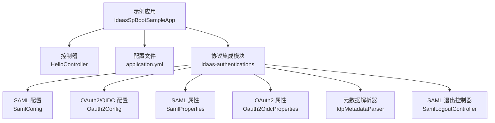
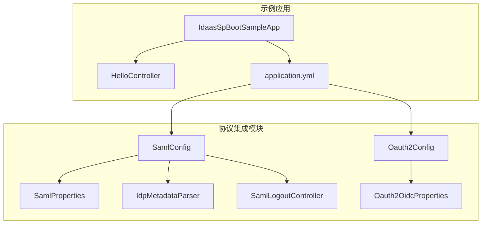
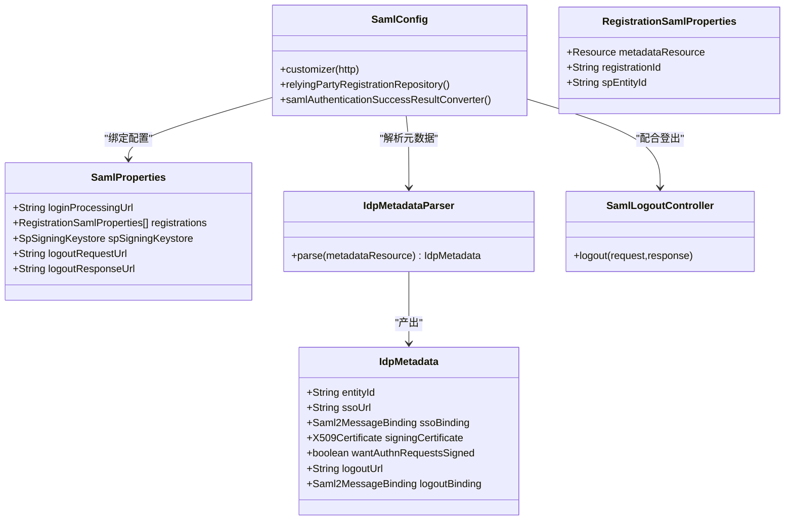
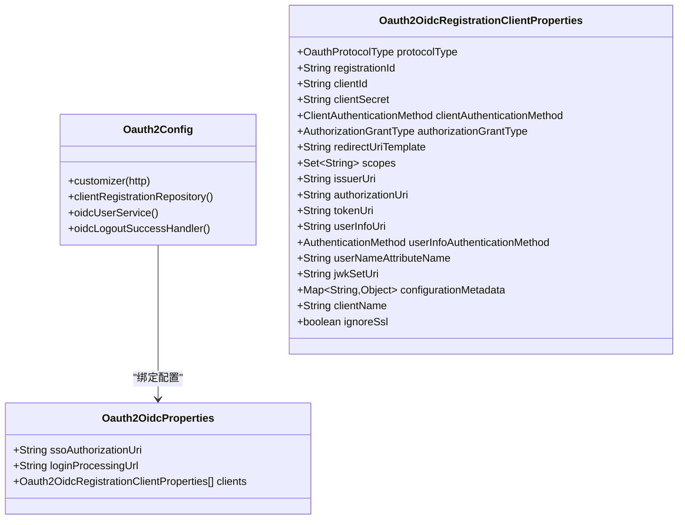
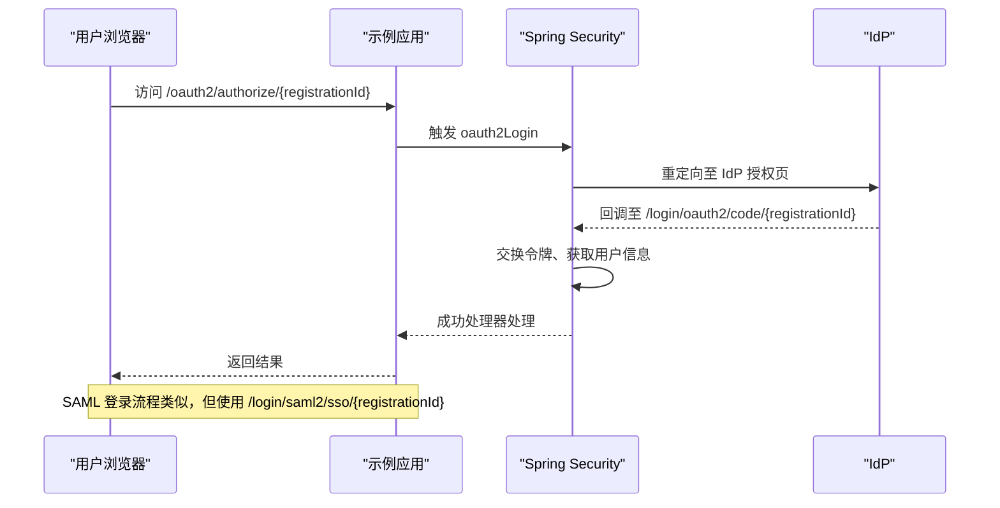
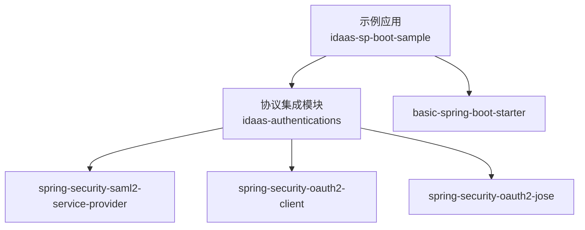

# 协议集成示例

<cite>
**本文引用的文件**
- [IdaasSpBootSampleApp.java](file://sample/idaas-sp-boot-sample/src/main/java/com/kewen/framework/sample/IdaasSpBootSampleApp.java)
- [HelloController.java](file://sample/idaas-sp-boot-sample/src/main/java/com/kewen/framework/sample/controller/HelloController.java)
- [application.yml](file://sample/idaas-sp-boot-sample/src/main/resources/application.yml)
- [SamlConfig.java](file://qy-idaas/idaas-authentications/src/main/java/com/kewen/framework/idaas/saml/SamlConfig.java)
- [IdpMetadataParser.java](file://qy-idaas/idaas-authentications/src/main/java/com/kewen/framework/idaas/saml/IdpMetadataParser.java)
- [SamlProperties.java](file://qy-idaas/idaas-authentications/src/main/java/com/kewen/framework/idaas/saml/properties/SamlProperties.java)
- [SamlLogoutController.java](file://qy-idaas/idaas-authentications/src/main/java/com/kewen/framework/idaas/saml/SamlLogoutController.java)
- [Oauth2Config.java](file://qy-idaas/idaas-authentications/src/main/java/com/kewen/framework/idaas/oauth2/Oauth2Config.java)
- [Oauth2OidcProperties.java](file://qy-idaas/idaas-authentications/src/main/java/com/kewen/framework/idaas/oauth2/Oauth2OidcProperties.java)
- [kewen-local-metadata.xml](file://sample/idaas-sp-boot-sample/src/main/resources/saml/metadata/kewen-local-metadata.xml)
- [pom.xml（示例应用）](file://sample/idaas-sp-boot-sample/pom.xml)
- [pom.xml（协议集成模块）](file://qy-idaas/idaas-authentications/pom.xml)
</cite>

## 目录
1. [简介](#简介)
2. [项目结构](#项目结构)
3. [核心组件](#核心组件)
4. [架构总览](#架构总览)
5. [详细组件分析](#详细组件分析)
6. [依赖分析](#依赖分析)
7. [性能考虑](#性能考虑)
8. [故障排除指南](#故障排除指南)
9. [结论](#结论)
10. [附录](#附录)

## 简介
本指南面向希望在示例应用中快速完成协议集成（OAuth2/OIDC 与 SAML2）的开发者。文档围绕 IdaasSpBootSampleApp 的启动配置、协议集成设置、HelloController 的基础接口、application.yml 中的协议参数配置、SAML 元数据准备与解析、协议测试方法、协议切换与配置变更、以及调试与故障排除展开，帮助您正确配置并使用各种认证协议。

## 项目结构
示例应用位于 sample/idaas-sp-boot-sample，核心入口为 IdaasSpBootSampleApp，提供基础 REST 接口 HelloController，并通过 application.yml 配置认证协议。协议能力由 qy-idaas/idaas-authentications 模块提供，内部包含 SAML 与 OAuth2/OIDC 的配置类与属性类。

图表来源
- [IdaasSpBootSampleApp.java:1-13](file://sample/idaas-sp-boot-sample/src/main/java/com/kewen/framework/sample/IdaasSpBootSampleApp.java#L1-L13)
- [HelloController.java:1-25](file://sample/idaas-sp-boot-sample/src/main/java/com/kewen/framework/sample/controller/HelloController.java#L1-L25)
- [application.yml:1-128](file://sample/idaas-sp-boot-sample/src/main/resources/application.yml#L1-L128)
- [SamlConfig.java:1-197](file://qy-idaas/idaas-authentications/src/main/java/com/kewen/framework/idaas/saml/SamlConfig.java#L1-L197)
- [Oauth2Config.java:1-225](file://qy-idaas/idaas-authentications/src/main/java/com/kewen/framework/idaas/oauth2/Oauth2Config.java#L1-L225)
- [SamlProperties.java:1-130](file://qy-idaas/idaas-authentications/src/main/java/com/kewen/framework/idaas/saml/properties/SamlProperties.java#L1-L130)
- [Oauth2OidcProperties.java:1-251](file://qy-idaas/idaas-authentications/src/main/java/com/kewen/framework/idaas/oauth2/Oauth2OidcProperties.java#L1-L251)
- [IdpMetadataParser.java:1-217](file://qy-idaas/idaas-authentications/src/main/java/com/kewen/framework/idaas/saml/IdpMetadataParser.java#L1-L217)
- [SamlLogoutController.java:1-51](file://qy-idaas/idaas-authentications/src/main/java/com/kewen/framework/idaas/saml/SamlLogoutController.java#L1-L51)

章节来源
- [IdaasSpBootSampleApp.java:1-13](file://sample/idaas-sp-boot-sample/src/main/java/com/kewen/framework/sample/IdaasSpBootSampleApp.java#L1-L13)
- [HelloController.java:1-25](file://sample/idaas-sp-boot-sample/src/main/java/com/kewen/framework/sample/controller/HelloController.java#L1-L25)
- [application.yml:1-128](file://sample/idaas-sp-boot-sample/src/main/resources/application.yml#L1-L128)

## 核心组件
- 应用入口与启动
  - IdaasSpBootSampleApp 使用 Spring Boot 启动，作为示例应用的主类。
- 基础接口
  - HelloController 提供 /hello 与 / 两个接口，返回 Result 包装的成功响应，便于验证应用可用性与鉴权链路。
- 协议配置
  - application.yml 中集中配置数据库、会话、日志、以及 kewen.auth、kewen.security、kewen.security.login.saml、kewen.security.login.oauth2 等关键节点。
- 协议实现
  - SamlConfig 与 Oauth2Config 分别实现 HttpSecurityCustomizer，将 SAML2 与 OAuth2/OIDC 登录注入到安全过滤链。
  - SamlProperties 与 Oauth2OidcProperties 对应配置项进行强类型绑定。
  - IdpMetadataParser 负责解析 IdP 元数据，提取 EntityId、SSO/Logout URL、证书等信息。
  - SamlLogoutController 提供 GET /saml2/logout，返回自动提交的表单以触发 SAML SLO。

章节来源
- [IdaasSpBootSampleApp.java:1-13](file://sample/idaas-sp-boot-sample/src/main/java/com/kewen/framework/sample/IdaasSpBootSampleApp.java#L1-L13)
- [HelloController.java:1-25](file://sample/idaas-sp-boot-sample/src/main/java/com/kewen/framework/sample/controller/HelloController.java#L1-L25)
- [application.yml:1-128](file://sample/idaas-sp-boot-sample/src/main/resources/application.yml#L1-L128)
- [SamlConfig.java:1-197](file://qy-idaas/idaas-authentications/src/main/java/com/kewen/framework/idaas/saml/SamlConfig.java#L1-L197)
- [Oauth2Config.java:1-225](file://qy-idaas/idaas-authentications/src/main/java/com/kewen/framework/idaas/oauth2/Oauth2Config.java#L1-L225)
- [SamlProperties.java:1-130](file://qy-idaas/idaas-authentications/src/main/java/com/kewen/framework/idaas/saml/properties/SamlProperties.java#L1-L130)
- [Oauth2OidcProperties.java:1-251](file://qy-idaas/idaas-authentications/src/main/java/com/kewen/framework/idaas/oauth2/Oauth2OidcProperties.java#L1-L251)
- [IdpMetadataParser.java:1-217](file://qy-idaas/idaas-authentications/src/main/java/com/kewen/framework/idaas/saml/IdpMetadataParser.java#L1-L217)
- [SamlLogoutController.java:1-51](file://qy-idaas/idaas-authentications/src/main/java/com/kewen/framework/idaas/saml/SamlLogoutController.java#L1-L51)

## 架构总览
下图展示了示例应用如何通过配置类与属性类将 SAML2 与 OAuth2/OIDC 集成到 Spring Security 过滤链中，并结合 application.yml 的参数驱动行为。

图表来源
- [IdaasSpBootSampleApp.java:1-13](file://sample/idaas-sp-boot-sample/src/main/java/com/kewen/framework/sample/IdaasSpBootSampleApp.java#L1-L13)
- [HelloController.java:1-25](file://sample/idaas-sp-boot-sample/src/main/java/com/kewen/framework/sample/controller/HelloController.java#L1-L25)
- [application.yml:1-128](file://sample/idaas-sp-boot-sample/src/main/resources/application.yml#L1-L128)
- [SamlConfig.java:1-197](file://qy-idaas/idaas-authentications/src/main/java/com/kewen/framework/idaas/saml/SamlConfig.java#L1-L197)
- [Oauth2Config.java:1-225](file://qy-idaas/idaas-authentications/src/main/java/com/kewen/framework/idaas/oauth2/Oauth2Config.java#L1-L225)
- [SamlProperties.java:1-130](file://qy-idaas/idaas-authentications/src/main/java/com/kewen/framework/idaas/saml/properties/SamlProperties.java#L1-L130)
- [Oauth2OidcProperties.java:1-251](file://qy-idaas/idaas-authentications/src/main/java/com/kewen/framework/idaas/oauth2/Oauth2OidcProperties.java#L1-L251)
- [IdpMetadataParser.java:1-217](file://qy-idaas/idaas-authentications/src/main/java/com/kewen/framework/idaas/saml/IdpMetadataParser.java#L1-L217)
- [SamlLogoutController.java:1-51](file://qy-idaas/idaas-authentications/src/main/java/com/kewen/framework/idaas/saml/SamlLogoutController.java#L1-L51)

## 详细组件分析

### 启动与基础接口
- 启动类 IdaasSpBootSampleApp 使用 @SpringBootApplication 启动应用上下文。
- HelloController 提供 /hello 与 / 接口，返回 Result.success(...)，便于快速验证服务可用与鉴权链路。

章节来源
- [IdaasSpBootSampleApp.java:1-13](file://sample/idaas-sp-boot-sample/src/main/java/com/kewen/framework/sample/IdaasSpBootSampleApp.java#L1-L13)
- [HelloController.java:1-25](file://sample/idaas-sp-boot-sample/src/main/java/com/kewen/framework/sample/controller/HelloController.java#L1-L25)

### SAML 集成
- 配置类 SamlConfig 实现 HttpSecurityCustomizer，启用 .saml2Login 并注入 OpenSamlAuthenticationProvider；同时配置 .saml2Logout 的请求与响应地址。
- 通过 SamlProperties 绑定 application.yml 中的 kewen.security.login.saml.* 配置，支持多注册（registrations）与 SP 签名凭据（keystore）。
- 元数据解析 IdpMetadataParser 从 metadataResource 解析 EntityId、SSO/Logout URL、证书与绑定方式，并据此构建 RelyingPartyRegistration。
- SamlLogoutController 提供 GET /saml2/logout，返回自动提交的表单以触发 POST 到 /logout，从而进入 SAML SLO 流程。

图表来源
- [SamlConfig.java:1-197](file://qy-idaas/idaas-authentications/src/main/java/com/kewen/framework/idaas/saml/SamlConfig.java#L1-L197)
- [SamlProperties.java:1-130](file://qy-idaas/idaas-authentications/src/main/java/com/kewen/framework/idaas/saml/properties/SamlProperties.java#L1-L130)
- [IdpMetadataParser.java:1-217](file://qy-idaas/idaas-authentications/src/main/java/com/kewen/framework/idaas/saml/IdpMetadataParser.java#L1-L217)
- [SamlLogoutController.java:1-51](file://qy-idaas/idaas-authentications/src/main/java/com/kewen/framework/idaas/saml/SamlLogoutController.java#L1-L51)

章节来源
- [SamlConfig.java:1-197](file://qy-idaas/idaas-authentications/src/main/java/com/kewen/framework/idaas/saml/SamlConfig.java#L1-L197)
- [SamlProperties.java:1-130](file://qy-idaas/idaas-authentications/src/main/java/com/kewen/framework/idaas/saml/properties/SamlProperties.java#L1-L130)
- [IdpMetadataParser.java:1-217](file://qy-idaas/idaas-authentications/src/main/java/com/kewen/framework/idaas/saml/IdpMetadataParser.java#L1-L217)
- [SamlLogoutController.java:1-51](file://qy-idaas/idaas-authentications/src/main/java/com/kewen/framework/idaas/saml/SamlLogoutController.java#L1-L51)

### OAuth2/OIDC 集成
- 配置类 Oauth2Config 实现 HttpSecurityCustomizer，启用 .oauth2Login，配置授权端点、令牌交换、用户信息获取、登录处理 URL、以及 ClientRegistrationRepository。
- 通过 Oauth2OidcProperties 绑定 application.yml 中的 kewen.security.login.oauth2.* 配置，支持多客户端注册（clients），自动发现（issuer-uri）与手动端点（authorizationUri/tokenUri/userInfoUri）两种模式。
- 支持忽略 SSL 校验（ignoreSsl）用于测试环境，OIDC 模式下自动添加 openid scope。

图表来源
- [Oauth2Config.java:1-225](file://qy-idaas/idaas-authentications/src/main/java/com/kewen/framework/idaas/oauth2/Oauth2Config.java#L1-L225)
- [Oauth2OidcProperties.java:1-251](file://qy-idaas/idaas-authentications/src/main/java/com/kewen/framework/idaas/oauth2/Oauth2OidcProperties.java#L1-L251)

章节来源
- [Oauth2Config.java:1-225](file://qy-idaas/idaas-authentications/src/main/java/com/kewen/framework/idaas/oauth2/Oauth2Config.java#L1-L225)
- [Oauth2OidcProperties.java:1-251](file://qy-idaas/idaas-authentications/src/main/java/com/kewen/framework/idaas/oauth2/Oauth2OidcProperties.java#L1-L251)

### SAML 元数据准备与配置
- application.yml 中的 kewen.security.login.saml.registrations.*.metadata-resource 指向 classpath 下的元数据文件，示例包含多个 IdP 元数据文件。
- kewen-local-metadata.xml 是一个本地示例，展示元数据的基本结构与证书位置。
- IdpMetadataParser 从元数据中提取 EntityId、SSO URL（优先 HTTP-POST，其次 HTTP-Redirect）、Logout URL 与证书，用于构建 assertingParty 与签名凭据。

章节来源
- [application.yml:62-87](file://sample/idaas-sp-boot-sample/src/main/resources/application.yml#L62-L87)
- [kewen-local-metadata.xml:1-19](file://sample/idaas-sp-boot-sample/src/main/resources/saml/metadata/kewen-local-metadata.xml#L1-L19)
- [IdpMetadataParser.java:1-217](file://qy-idaas/idaas-authentications/src/main/java/com/kewen/framework/idaas/saml/IdpMetadataParser.java#L1-L217)

### 协议测试方法
- OAuth2/OIDC 登录流程
  - 访问本地授权端点（默认 /oauth2/authorize/{registrationId}），由 OAuth2LoginAuthenticationFilter 处理回调，最终通过 successHandler 返回结果转换器的结果。
  - 可通过 application.yml 中的 clients.*.redirectUriTemplate 验证回调地址是否正确。
- SAML 登录流程
  - 访问 /login/saml2/sso/{registrationId}（由 SamlConfig 注入），触发 SAML AuthnRequest，随后在 IdP 完成认证并返回 SAML Response。
  - 断言处理由 OpenSamlAuthenticationProvider 负责，IdpMetadataParser 提供的证书用于验证签名。
- 断言与登出
  - SamlLogoutController 提供 GET /saml2/logout，自动提交 POST 到 /logout，触发 SAML SLO 流程。

图表来源
- [Oauth2Config.java:90-125](file://qy-idaas/idaas-authentications/src/main/java/com/kewen/framework/idaas/oauth2/Oauth2Config.java#L90-L125)
- [application.yml:89-128](file://sample/idaas-sp-boot-sample/src/main/resources/application.yml#L89-L128)

章节来源
- [Oauth2Config.java:1-225](file://qy-idaas/idaas-authentications/src/main/java/com/kewen/framework/idaas/oauth2/Oauth2Config.java#L1-L225)
- [application.yml:89-128](file://sample/idaas-sp-boot-sample/src/main/resources/application.yml#L89-L128)

### 协议切换与配置变更
- 切换协议
  - 通过 application.yml 中的 kewen.security.login.saml 与 kewen.security.login.oauth2 开关与注册项控制启用哪些协议与 IdP。
  - SAML 与 OAuth2/OIDC 的配置相互独立，可按需启用一种或多种。
- 配置变更
  - 修改 clients.* 或 registrations.* 项即可新增/删除/调整 IdP。
  - SAML 的 SP 签名凭据（keystore）与元数据文件路径可在相应属性中更新。
  - 忽略 SSL 校验（ignoreSsl）仅用于测试环境，生产请关闭。

章节来源
- [application.yml:62-128](file://sample/idaas-sp-boot-sample/src/main/resources/application.yml#L62-L128)
- [SamlProperties.java:1-130](file://qy-idaas/idaas-authentications/src/main/java/com/kewen/framework/idaas/saml/properties/SamlProperties.java#L1-L130)
- [Oauth2OidcProperties.java:1-251](file://qy-idaas/idaas-authentications/src/main/java/com/kewen/framework/idaas/oauth2/Oauth2OidcProperties.java#L1-L251)

## 依赖分析
示例应用依赖协议集成模块与基础启动器，协议模块进一步依赖 Spring Security 的 SAML2 与 OAuth2 客户端能力。

图表来源
- [pom.xml（示例应用）:20-35](file://sample/idaas-sp-boot-sample/pom.xml#L20-L35)
- [pom.xml（协议集成模块）:20-36](file://qy-idaas/idaas-authentications/pom.xml#L20-L36)

章节来源
- [pom.xml（示例应用）:1-57](file://sample/idaas-sp-boot-sample/pom.xml#L1-L57)
- [pom.xml（协议集成模块）:1-53](file://qy-idaas/idaas-authentications/pom.xml#L1-L53)

## 性能考虑
- 会话与连接池
  - application.yml 中配置了 Hikari 连接池参数（最大池大小、空闲超时、生命周期等），建议根据并发与数据库性能调优。
- 日志级别
  - application.yml 中开启了 Spring Security 与 Nimbus 的 TRACE 日志，便于调试，生产建议降级。
- SSL 忽略
  - OAuth2/OIDC 的 ignoreSsl 仅用于测试，生产务必关闭以避免安全风险。

章节来源
- [application.yml:9-35](file://sample/idaas-sp-boot-sample/src/main/resources/application.yml#L9-L35)
- [Oauth2OidcProperties.java:242-248](file://qy-idaas/idaas-authentications/src/main/java/com/kewen/framework/idaas/oauth2/Oauth2OidcProperties.java#L242-L248)

## 故障排除指南
- SAML 登录失败
  - 检查元数据文件路径与内容，确认 EntityId、SSO URL、证书是否正确。
  - 确认 SP 签名凭据（keystore）配置正确，且与 IdP 配置一致。
  - 若使用 SP 联动 IdP 退出，确保 singleLogoutServiceLocation/responseLocation 已设置。
- OAuth2/OIDC 登录失败
  - 核对 registrationId 与 redirectUriTemplate 是否匹配。
  - 若使用 OIDC 自动发现，确认 issuer-uri 可达且返回标准配置。
  - 若使用手动端点，确认 authorizationUri/tokenUri/userInfoUri 正确。
- 退出问题
  - 使用 GET /saml2/logout 触发 SAML SLO，确保 CSRF 令牌存在时正确传递。
- 日志定位
  - 提升日志级别至 TRACE，观察授权请求、令牌交换、用户信息获取与 SAML 断言验证过程。

章节来源
- [SamlConfig.java:62-88](file://qy-idaas/idaas-authentications/src/main/java/com/kewen/framework/idaas/saml/SamlConfig.java#L62-L88)
- [Oauth2Config.java:90-125](file://qy-idaas/idaas-authentications/src/main/java/com/kewen/framework/idaas/oauth2/Oauth2Config.java#L90-L125)
- [SamlLogoutController.java:25-49](file://qy-idaas/idaas-authentications/src/main/java/com/kewen/framework/idaas/saml/SamlLogoutController.java#L25-L49)
- [application.yml:28-35](file://sample/idaas-sp-boot-sample/src/main/resources/application.yml#L28-L35)

## 结论
通过本示例应用与协议集成模块，您可以快速完成 OAuth2/OIDC 与 SAML2 的配置与联调。建议先以本地元数据与测试端点验证流程，再逐步替换为真实 IdP 的配置。遵循本文的配置要点、测试方法与故障排除步骤，可显著提升集成效率与稳定性。

## 附录
- 关键配置项速览
  - SAML：kewen.security.login.saml.sp-signing-keystore.*、kewen.security.login.saml.registrations.*.registration-id、sp-entity-id、metadata-resource
  - OAuth2/OIDC：kewen.security.login.oauth2.sso-authorization-uri、clients.*.registration-id、client-id、client-secret、issuer-uri/authorizationUri/tokenUri/userInfoUri、ignore-ssl
- 元数据文件位置
  - 示例应用 resources/saml/metadata 下包含多个 IdP 元数据文件，可按需选择或新增

章节来源
- [application.yml:62-128](file://sample/idaas-sp-boot-sample/src/main/resources/application.yml#L62-L128)
- [kewen-local-metadata.xml:1-19](file://sample/idaas-sp-boot-sample/src/main/resources/saml/metadata/kewen-local-metadata.xml#L1-L19)