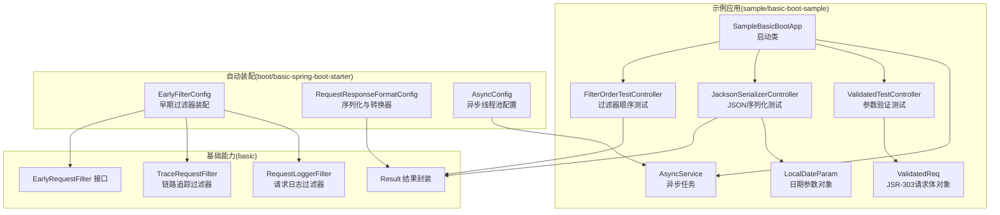
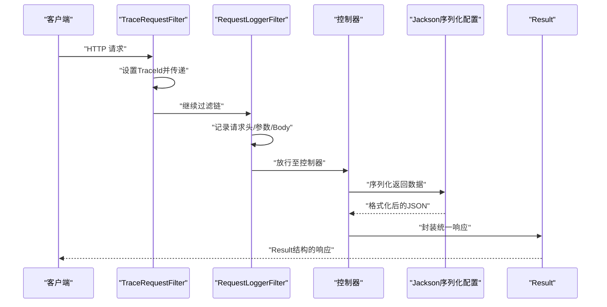
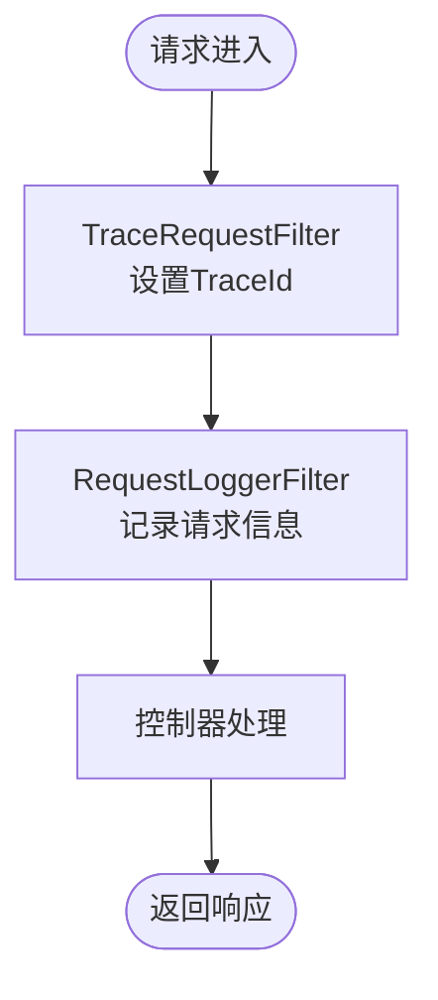
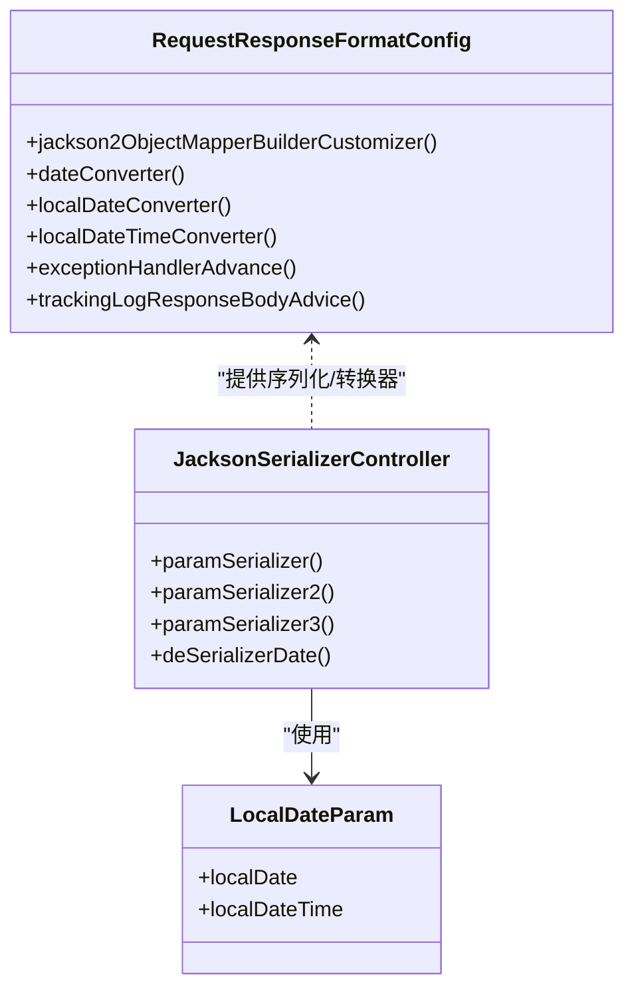
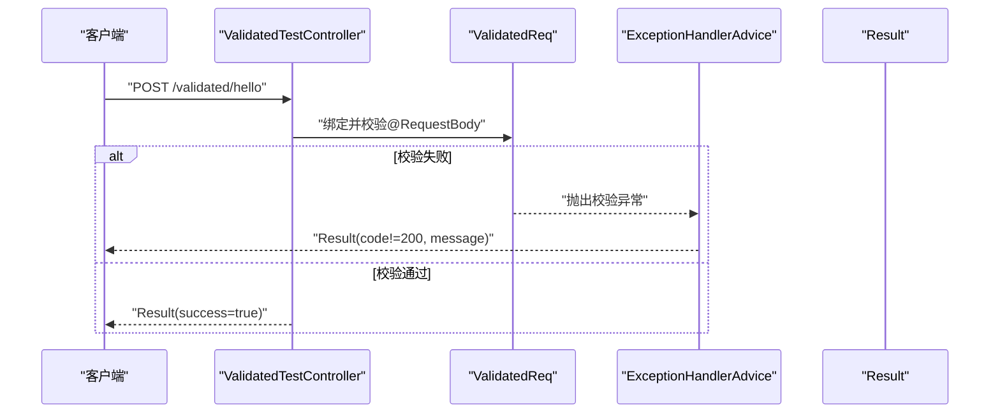
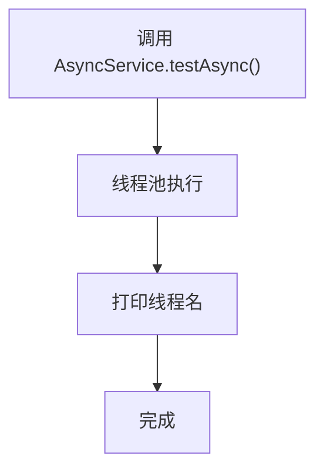
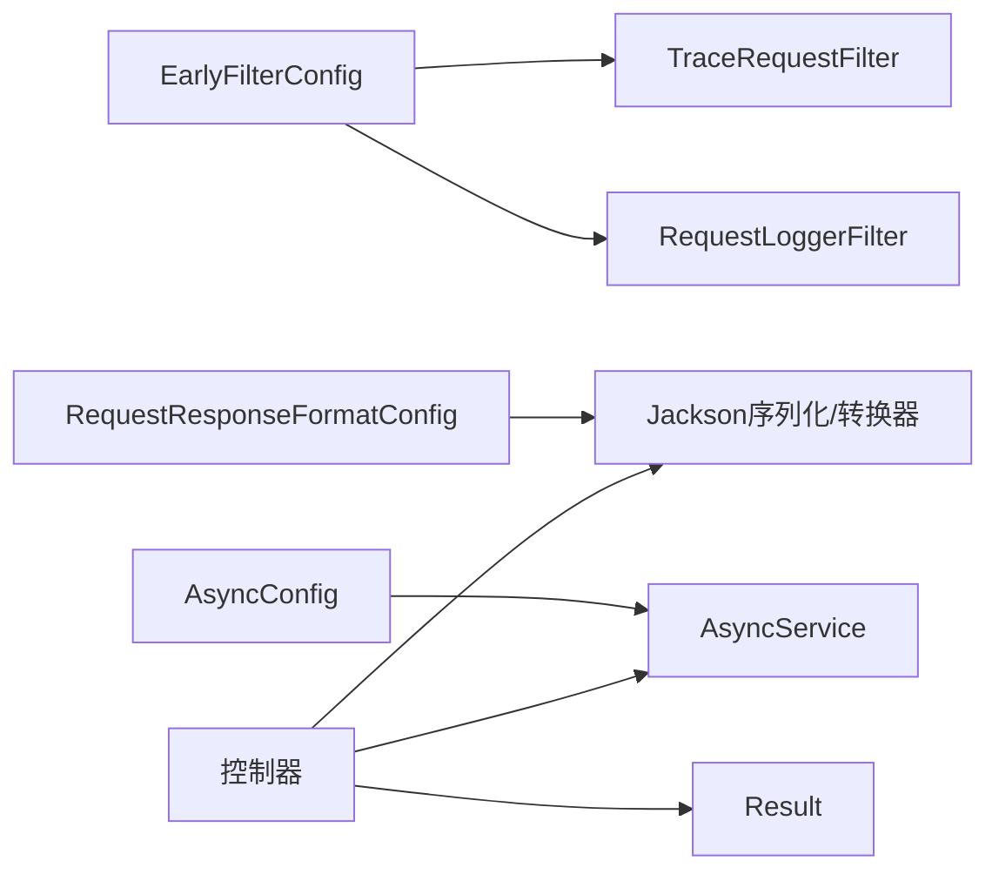

# 基础功能示例

<cite>
**本文引用的文件**   
- [SampleBasicBootApp.java](file://sample/basic-boot-sample/src/main/java/com/kewen/framework/sample/basic/SampleBasicBootApp.java)
- [FilterOrderTestController.java](file://sample/basic-boot-sample/src/main/java/com/kewen/framework/sample/basic/controller/FilterOrderTestController.java)
- [JacksonSerializerController.java](file://sample/basic-boot-sample/src/main/java/com/kewen/framework/sample/basic/controller/JacksonSerializerController.java)
- [ValidatedTestController.java](file://sample/basic-boot-sample/src/main/java/com/kewen/framework/sample/basic/controller/ValidatedTestController.java)
- [AsyncService.java](file://sample/basic-boot-sample/src/main/java/com/kewen/framework/sample/basic/service/AsyncService.java)
- [ValidatedReq.java](file://sample/basic-boot-sample/src/main/java/com/kewen/framework/sample/basic/req/ValidatedReq.java)
- [LocalDateParam.java](file://sample/basic-boot-sample/src/main/java/com/kewen/framework/sample/basic/controller/LocalDateParam.java)
- [AsyncConfig.java](file://boot/basic-spring-boot-starter/src/main/java/com/kewen/framework/boot/basic/config/AsyncConfig.java)
- [EarlyFilterConfig.java](file://boot/basic-spring-boot-starter/src/main/java/com/kewen/framework/boot/basic/config/EarlyFilterConfig.java)
- [RequestResponseFormatConfig.java](file://boot/basic-spring-boot-starter/src/main/java/com/kewen/framework/boot/basic/config/RequestResponseFormatConfig.java)
- [EarlyRequestFilter.java](file://basic/src/main/java/com/kewen/framework/basic/filter/EarlyRequestFilter.java)
- [RequestLoggerFilter.java](file://basic/src/main/java/com/kewen/framework/basic/logger/RequestLoggerFilter.java)
- [TraceRequestFilter.java](file://basic/src/main/java/com/kewen/framework/basic/logger/TraceRequestFilter.java)
- [Result.java](file://basic/src/main/java/com/kewen/framework/basic/model/Result.java)
</cite>

## 目录
1. [简介](#简介)
2. [项目结构](#项目结构)
3. [核心组件](#核心组件)
4. [架构总览](#架构总览)
5. [详细组件分析](#详细组件分析)
6. [依赖关系分析](#依赖关系分析)
7. [性能考虑](#性能考虑)
8. [故障排查指南](#故障排查指南)
9. [结论](#结论)
10. [附录](#附录)

## 简介
本指南面向开发者，围绕基础功能示例应用 SampleBasicBootApp 提供系统化的使用说明与实现解析。内容涵盖应用启动配置、基础功能集成（过滤器顺序、JSON 序列化、参数验证、异步任务）以及测试与验证步骤，帮助快速理解并正确使用框架的基础模块。

## 项目结构
示例应用位于 sample/basic-boot-sample 模块，核心入口为 Spring Boot 启动类；控制器、服务与请求对象位于 sample 子包；基础能力（过滤器、日志、结果封装等）位于 basic 模块；自动装配与配置位于 boot/basic-spring-boot-starter 模块。

图表来源
- [SampleBasicBootApp.java:1-11](file://sample/basic-boot-sample/src/main/java/com/kewen/framework/sample/basic/SampleBasicBootApp.java#L1-L11)
- [FilterOrderTestController.java:1-22](file://sample/basic-boot-sample/src/main/java/com/kewen/framework/sample/basic/controller/FilterOrderTestController.java#L1-L22)
- [JacksonSerializerController.java:1-52](file://sample/basic-boot-sample/src/main/java/com/kewen/framework/sample/basic/controller/JacksonSerializerController.java#L1-L52)
- [ValidatedTestController.java:1-23](file://sample/basic-boot-sample/src/main/java/com/kewen/framework/sample/basic/controller/ValidatedTestController.java#L1-L23)
- [AsyncService.java:1-22](file://sample/basic-boot-sample/src/main/java/com/kewen/framework/sample/basic/service/AsyncService.java#L1-L22)
- [ValidatedReq.java:1-32](file://sample/basic-boot-sample/src/main/java/com/kewen/framework/sample/basic/req/ValidatedReq.java#L1-L32)
- [LocalDateParam.java:1-19](file://sample/basic-boot-sample/src/main/java/com/kewen/framework/sample/basic/controller/LocalDateParam.java#L1-L19)
- [EarlyFilterConfig.java:1-48](file://boot/basic-spring-boot-starter/src/main/java/com/kewen/framework/boot/basic/config/EarlyFilterConfig.java#L1-L48)
- [RequestResponseFormatConfig.java:1-111](file://boot/basic-spring-boot-starter/src/main/java/com/kewen/framework/boot/basic/config/RequestResponseFormatConfig.java#L1-L111)
- [AsyncConfig.java:1-60](file://boot/basic-spring-boot-starter/src/main/java/com/kewen/framework/boot/basic/config/AsyncConfig.java#L1-L60)
- [EarlyRequestFilter.java:1-24](file://basic/src/main/java/com/kewen/framework/basic/filter/EarlyRequestFilter.java#L1-L24)
- [TraceRequestFilter.java:1-52](file://basic/src/main/java/com/kewen/framework/basic/logger/TraceRequestFilter.java#L1-L52)
- [RequestLoggerFilter.java:1-125](file://basic/src/main/java/com/kewen/framework/basic/logger/RequestLoggerFilter.java#L1-L125)
- [Result.java:1-49](file://basic/src/main/java/com/kewen/framework/basic/model/Result.java#L1-L49)

章节来源
- [SampleBasicBootApp.java:1-11](file://sample/basic-boot-sample/src/main/java/com/kewen/framework/sample/basic/SampleBasicBootApp.java#L1-L11)

## 核心组件
- 启动类：负责应用引导与组件扫描，示例入口为 SampleBasicBootApp。
- 控制器：
  - FilterOrderTestController：验证过滤器顺序与基本响应。
  - JacksonSerializerController：演示日期参数序列化/反序列化与返回值格式化。
  - ValidatedTestController：演示 JSR-303 参数校验。
- 服务：AsyncService 展示基于 @Async 的异步任务。
- 实体与参数：ValidatedReq 定义校验规则；LocalDateParam 作为日期参数载体。
- 基础模型：Result 统一响应结构。

章节来源
- [FilterOrderTestController.java:1-22](file://sample/basic-boot-sample/src/main/java/com/kewen/framework/sample/basic/controller/FilterOrderTestController.java#L1-L22)
- [JacksonSerializerController.java:1-52](file://sample/basic-boot-sample/src/main/java/com/kewen/framework/sample/basic/controller/JacksonSerializerController.java#L1-L52)
- [ValidatedTestController.java:1-23](file://sample/basic-boot-sample/src/main/java/com/kewen/framework/sample/basic/controller/ValidatedTestController.java#L1-L23)
- [AsyncService.java:1-22](file://sample/basic-boot-sample/src/main/java/com/kewen/framework/sample/basic/service/AsyncService.java#L1-L22)
- [ValidatedReq.java:1-32](file://sample/basic-boot-sample/src/main/java/com/kewen/framework/sample/basic/req/ValidatedReq.java#L1-L32)
- [LocalDateParam.java:1-19](file://sample/basic-boot-sample/src/main/java/com/kewen/framework/sample/basic/controller/LocalDateParam.java#L1-L19)
- [Result.java:1-49](file://basic/src/main/java/com/kewen/framework/basic/model/Result.java#L1-L49)

## 架构总览
下图展示从客户端到控制器的典型请求路径，以及早期过滤器、链路追踪、请求日志与 JSON 序列化配置的协作关系。

图表来源
- [TraceRequestFilter.java:1-52](file://basic/src/main/java/com/kewen/framework/basic/logger/TraceRequestFilter.java#L1-L52)
- [RequestLoggerFilter.java:1-125](file://basic/src/main/java/com/kewen/framework/basic/logger/RequestLoggerFilter.java#L1-L125)
- [RequestResponseFormatConfig.java:1-111](file://boot/basic-spring-boot-starter/src/main/java/com/kewen/framework/boot/basic/config/RequestResponseFormatConfig.java#L1-L111)
- [Result.java:1-49](file://basic/src/main/java/com/kewen/framework/basic/model/Result.java#L1-L49)

## 详细组件分析

### 启动配置与运行
- 启动类 SampleBasicBootApp 使用标准 Spring Boot 注解进行引导，运行后加载自动装配与控制器。
- 建议在本地开发环境使用 application.yml 中的 dev 配置，确保日志与数据库连接正常。

章节来源
- [SampleBasicBootApp.java:1-11](file://sample/basic-boot-sample/src/main/java/com/kewen/framework/sample/basic/SampleBasicBootApp.java#L1-L11)

### 过滤器顺序测试（FilterOrderTestController）
- 目标：验证早期过滤器的执行顺序与作用，包含链路追踪与请求日志。
- 关键点：
  - TraceRequestFilter 设置 TraceId 并写入上下文，优先级靠前。
  - RequestLoggerFilter 记录请求头、参数、Body，并发布请求日志事件，随后放行。
  - EarlyRequestFilter 为接口抽象，具体实现通过代理组合注入。

图表来源
- [TraceRequestFilter.java:1-52](file://basic/src/main/java/com/kewen/framework/basic/logger/TraceRequestFilter.java#L1-L52)
- [RequestLoggerFilter.java:1-125](file://basic/src/main/java/com/kewen/framework/basic/logger/RequestLoggerFilter.java#L1-L125)
- [EarlyRequestFilter.java:1-24](file://basic/src/main/java/com/kewen/framework/basic/filter/EarlyRequestFilter.java#L1-L24)

章节来源
- [FilterOrderTestController.java:1-22](file://sample/basic-boot-sample/src/main/java/com/kewen/framework/sample/basic/controller/FilterOrderTestController.java#L1-L22)
- [EarlyFilterConfig.java:1-48](file://boot/basic-spring-boot-starter/src/main/java/com/kewen/framework/boot/basic/config/EarlyFilterConfig.java#L1-L48)

### JSON 序列化配置与自定义序列化器（JacksonSerializerController）
- 目标：演示日期类型的序列化/反序列化与统一返回结构。
- 关键点：
  - RequestResponseFormatConfig 提供 Jackson 全局定制：日期/时间类型的序列化器与反序列化器、日期格式转换器、统一异常处理增强与响应体追踪增强。
  - JacksonSerializerController 提供多组接口验证不同场景：
    - GET /jackson/paramSerializer：@RequestParam 形式的日期参数。
    - GET /jackson/paramSerializer2：以对象 LocalDateParam 作为参数。
    - GET /jackson/paramSerializer3：@RequestBody 形式的日期参数对象。
    - GET /jackson/deSerializerDate：返回包含多种日期类型的 Map，验证序列化输出。

图表来源
- [RequestResponseFormatConfig.java:1-111](file://boot/basic-spring-boot-starter/src/main/java/com/kewen/framework/boot/basic/config/RequestResponseFormatConfig.java#L1-L111)
- [JacksonSerializerController.java:1-52](file://sample/basic-boot-sample/src/main/java/com/kewen/framework/sample/basic/controller/JacksonSerializerController.java#L1-L52)
- [LocalDateParam.java:1-19](file://sample/basic-boot-sample/src/main/java/com/kewen/framework/sample/basic/controller/LocalDateParam.java#L1-L19)

章节来源
- [JacksonSerializerController.java:1-52](file://sample/basic-boot-sample/src/main/java/com/kewen/framework/sample/basic/controller/JacksonSerializerController.java#L1-L52)
- [RequestResponseFormatConfig.java:1-111](file://boot/basic-spring-boot-starter/src/main/java/com/kewen/framework/boot/basic/config/RequestResponseFormatConfig.java#L1-L111)

### 参数验证示例（ValidatedTestController 与 ValidatedReq）
- 目标：演示 JSR-303 注解在控制器层的使用与验证规则。
- 关键点：
  - ValidatedReq 定义了非空、非负、布尔断言等规则。
  - ValidatedTestController 使用 @Validated 对请求体进行校验，失败时由统一异常处理增强返回标准结果结构。

图表来源
- [ValidatedTestController.java:1-23](file://sample/basic-boot-sample/src/main/java/com/kewen/framework/sample/basic/controller/ValidatedTestController.java#L1-L23)
- [ValidatedReq.java:1-32](file://sample/basic-boot-sample/src/main/java/com/kewen/framework/sample/basic/req/ValidatedReq.java#L1-L32)
- [RequestResponseFormatConfig.java:1-111](file://boot/basic-spring-boot-starter/src/main/java/com/kewen/framework/boot/basic/config/RequestResponseFormatConfig.java#L1-L111)
- [Result.java:1-49](file://basic/src/main/java/com/kewen/framework/basic/model/Result.java#L1-L49)

章节来源
- [ValidatedTestController.java:1-23](file://sample/basic-boot-sample/src/main/java/com/kewen/framework/sample/basic/controller/ValidatedTestController.java#L1-L23)
- [ValidatedReq.java:1-32](file://sample/basic-boot-sample/src/main/java/com/kewen/framework/sample/basic/req/ValidatedReq.java#L1-L32)

### 异步任务处理与线程池配置（AsyncService 与 AsyncConfig）
- 目标：演示基于 @Async 的异步任务与线程池配置。
- 关键点：
  - AsyncConfig 实现 AsyncConfigurer，自定义线程池大小、队列容量、拒绝策略与异常处理器。
  - AsyncService 中的 testAsync 方法被标记为异步执行，可在业务中用于耗时操作解耦。

图表来源
- [AsyncConfig.java:1-60](file://boot/basic-spring-boot-starter/src/main/java/com/kewen/framework/boot/basic/config/AsyncConfig.java#L1-L60)
- [AsyncService.java:1-22](file://sample/basic-boot-sample/src/main/java/com/kewen/framework/sample/basic/service/AsyncService.java#L1-L22)

章节来源
- [AsyncService.java:1-22](file://sample/basic-boot-sample/src/main/java/com/kewen/framework/sample/basic/service/AsyncService.java#L1-L22)
- [AsyncConfig.java:1-60](file://boot/basic-spring-boot-starter/src/main/java/com/kewen/framework/boot/basic/config/AsyncConfig.java#L1-L60)

## 依赖关系分析
- 自动装配层负责注册过滤器、序列化器与异步配置；业务层通过控制器与服务消费这些能力。
- 过滤器链通过 @Order 控制执行顺序，TraceRequestFilter 优先于 RequestLoggerFilter。
- Jackson 序列化配置对日期类型提供统一策略，避免前端精度与格式问题。
- 统一异常处理增强与响应体追踪增强提升可观测性与一致性。

图表来源
- [EarlyFilterConfig.java:1-48](file://boot/basic-spring-boot-starter/src/main/java/com/kewen/framework/boot/basic/config/EarlyFilterConfig.java#L1-L48)
- [RequestResponseFormatConfig.java:1-111](file://boot/basic-spring-boot-starter/src/main/java/com/kewen/framework/boot/basic/config/RequestResponseFormatConfig.java#L1-L111)
- [AsyncConfig.java:1-60](file://boot/basic-spring-boot-starter/src/main/java/com/kewen/framework/boot/basic/config/AsyncConfig.java#L1-L60)
- [Result.java:1-49](file://basic/src/main/java/com/kewen/framework/basic/model/Result.java#L1-L49)

## 性能考虑
- 线程池参数建议结合 CPU 核数与任务特性调整，避免过大导致上下文切换开销，或过小导致排队积压。
- 日期序列化采用固定格式与转换器，减少反射与格式推断成本。
- 过滤器链尽量保持轻量，避免阻塞与重复解析请求体。

## 故障排查指南
- 过滤器顺序异常：检查 @Order 值与 EarlyFilterConfig 中的注册顺序，确保 TraceRequestFilter 早于 RequestLoggerFilter。
- JSON 格式不一致：确认 RequestResponseFormatConfig 已生效，核对 Jackson 定制器与转换器是否被加载。
- 参数校验未触发：确认控制器方法使用了 @Validated 且参数标注了 JSR-303 注解，同时统一异常处理增强已注册。
- 异步任务未生效：确认 @EnableAsync 已启用，AsyncConfig 是否被加载，线程池是否正确初始化。

章节来源
- [EarlyFilterConfig.java:1-48](file://boot/basic-spring-boot-starter/src/main/java/com/kewen/framework/boot/basic/config/EarlyFilterConfig.java#L1-L48)
- [RequestResponseFormatConfig.java:1-111](file://boot/basic-spring-boot-starter/src/main/java/com/kewen/framework/boot/basic/config/RequestResponseFormatConfig.java#L1-L111)
- [AsyncConfig.java:1-60](file://boot/basic-spring-boot-starter/src/main/java/com/kewen/framework/boot/basic/config/AsyncConfig.java#L1-L60)

## 结论
本指南围绕 SampleBasicBootApp 演示了基础过滤器顺序、JSON 序列化、参数验证与异步任务的关键配置与使用方式。通过自动装配层与业务层的清晰分工，开发者可快速集成并验证各项基础能力，确保在实际项目中具备良好的可观测性、一致性和扩展性。

## 附录

### 快速测试与验证步骤
- 过滤器顺序测试
  - 调用 /filter/hello，观察日志中 TraceId 设置与请求记录是否按序产生。
  - 参考：[FilterOrderTestController.java:1-22](file://sample/basic-boot-sample/src/main/java/com/kewen/framework/sample/basic/controller/FilterOrderTestController.java#L1-L22)
- JSON 序列化测试
  - 调用 /jackson/paramSerializer、/jackson/paramSerializer2、/jackson/paramSerializer3，验证日期参数的传入与解析。
  - 调用 /jackson/deSerializerDate，验证返回值中日期字段的序列化格式。
  - 参考：[JacksonSerializerController.java:1-52](file://sample/basic-boot-sample/src/main/java/com/kewen/framework/sample/basic/controller/JacksonSerializerController.java#L1-L52)
- 参数验证测试
  - 发送带缺参或非法值的请求体到 /validated/hello，验证统一异常处理增强返回的错误结构。
  - 参考：[ValidatedTestController.java:1-23](file://sample/basic-boot-sample/src/main/java/com/kewen/framework/sample/basic/controller/ValidatedTestController.java#L1-L23)，[ValidatedReq.java:1-32](file://sample/basic-boot-sample/src/main/java/com/kewen/framework/sample/basic/req/ValidatedReq.java#L1-L32)
- 异步任务测试
  - 触发包含异步调用的业务逻辑，观察线程池执行与异常处理回调。
  - 参考：[AsyncService.java:1-22](file://sample/basic-boot-sample/src/main/java/com/kewen/framework/sample/basic/service/AsyncService.java#L1-L22)，[AsyncConfig.java:1-60](file://boot/basic-spring-boot-starter/src/main/java/com/kewen/framework/boot/basic/config/AsyncConfig.java#L1-L60)