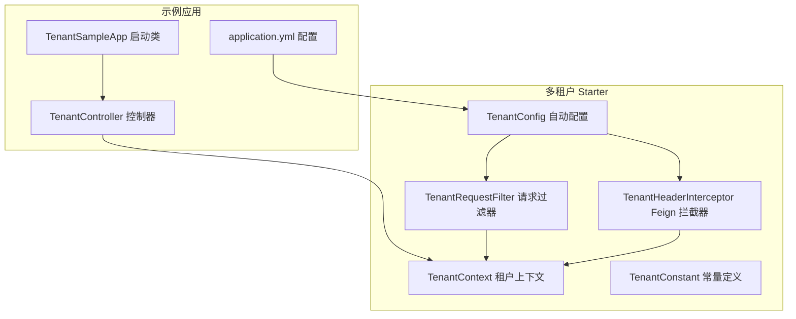
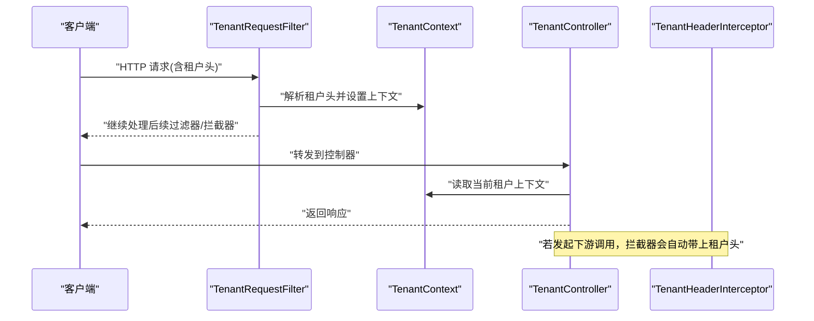
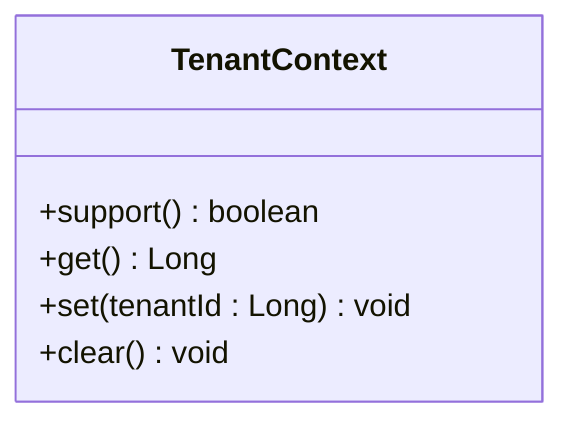
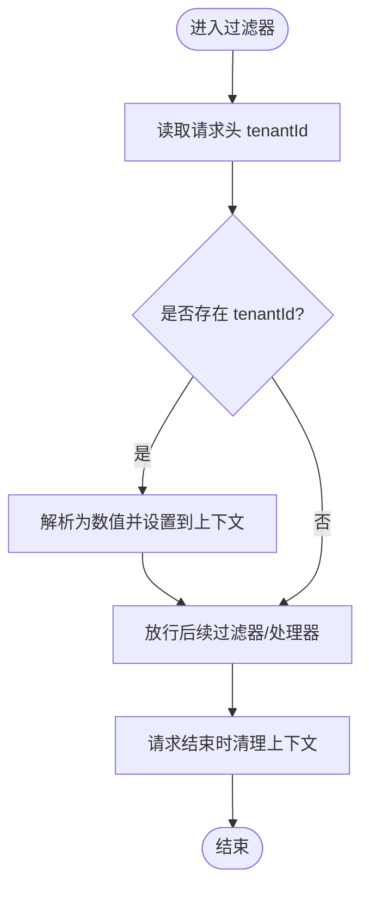
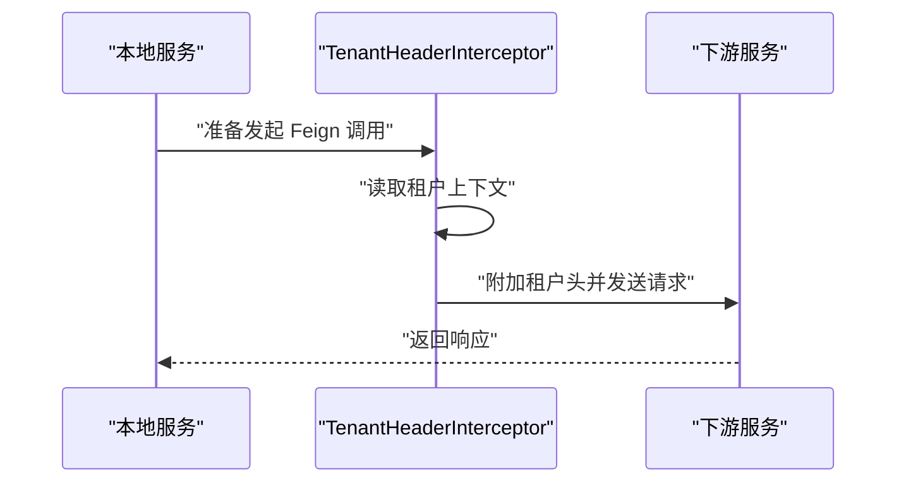
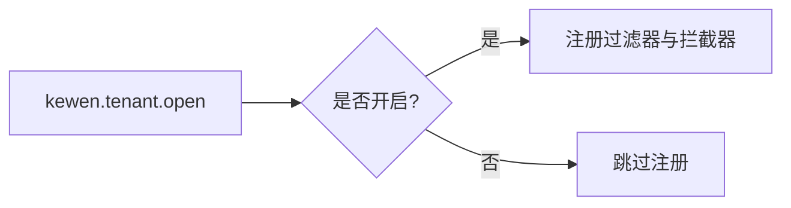
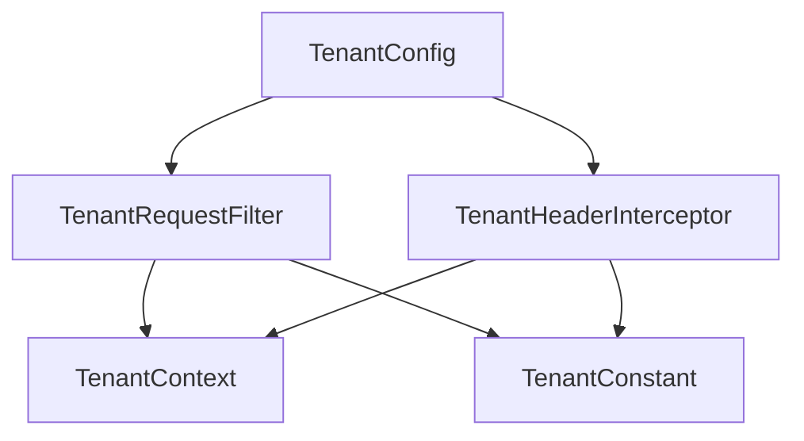

# 多租户示例

<cite>
**本文引用的文件**
- [TenantContext.java](file://boot/tenant-spring-boot-starter/src/main/java/com/kewen/framework/tenant/TenantContext.java)
- [TenantRequestFilter.java](file://boot/tenant-spring-boot-starter/src/main/java/com/kewen/framework/tenant/TenantRequestFilter.java)
- [TenantConfig.java](file://boot/tenant-spring-boot-starter/src/main/java/com/kewen/framework/tenant/config/TenantConfig.java)
- [TenantConstant.java](file://boot/tenant-spring-boot-starter/src/main/java/com/kewen/framework/tenant/TenantConstant.java)
- [TenantHeaderInterceptor.java](file://boot/tenant-spring-boot-starter/src/main/java/com/kewen/framework/tenant/feign/TenantHeaderInterceptor.java)
- [spring.factories](file://boot/tenant-spring-boot-starter/src/main/resources/META-INF/spring.factories)
- [additional-spring-configuration-metadata.json](file://boot/tenant-spring-boot-starter/src/main/resources/META-INF/additional-spring-configuration-metadata.json)
- [TenantSampleApp.java](file://sample/tenant-boot-sample/src/main/java/com/kewen/framework/sample/tenant/TenantSampleApp.java)
- [TenantController.java](file://sample/tenant-boot-sample/src/main/java/com/kewen/framework/sample/tenant/controller/TenantController.java)
- [application.yml](file://sample/tenant-boot-sample/src/main/resources/application.yml)
</cite>

## 目录
1. [简介](#简介)
2. [项目结构](#项目结构)
3. [核心组件](#核心组件)
4. [架构总览](#架构总览)
5. [组件详解](#组件详解)
6. [依赖关系分析](#依赖关系分析)
7. [性能与可扩展性](#性能与可扩展性)
8. [测试与验证](#测试与验证)
9. [故障排查](#故障排查)
10. [结论](#结论)
11. [附录](#附录)

## 简介
本指南面向希望在基于 Kewen Framework 的应用中快速落地多租户能力的开发者。本文以多租户示例应用（TenantSampleApp）为主线，系统讲解如何通过租户上下文、请求过滤器、Feign 拦截器等组件实现“租户标识透传、租户隔离与数据访问控制”的完整链路。同时提供启动配置、请求头传递、过滤器工作原理、测试方法以及最佳实践建议，帮助你在真实业务中正确实现多租户架构。

## 项目结构
示例工程位于 sample/tenant-boot-sample，包含最小可用的启动类、控制器与配置文件；多租户能力由 boot/tenant-spring-boot-starter 提供，核心包括：
- 租户上下文：线程本地存储当前请求的租户标识
- 请求过滤器：从请求头提取租户标识并写入上下文
- Feign 拦截器：将租户上下文透传到下游服务
- 自动装配配置：按开关启用多租户能力

图表来源
- [TenantSampleApp.java:1-11](file://sample/tenant-boot-sample/src/main/java/com/kewen/framework/sample/tenant/TenantSampleApp.java#L1-L11)
- [TenantController.java:1-22](file://sample/tenant-boot-sample/src/main/java/com/kewen/framework/sample/tenant/controller/TenantController.java#L1-L22)
- [application.yml:1-13](file://sample/tenant-boot-sample/src/main/resources/application.yml#L1-L13)
- [TenantContext.java:1-40](file://boot/tenant-spring-boot-starter/src/main/java/com/kewen/framework/tenant/TenantContext.java#L1-L40)
- [TenantRequestFilter.java:1-38](file://boot/tenant-spring-boot-starter/src/main/java/com/kewen/framework/tenant/TenantRequestFilter.java#L1-L38)
- [TenantHeaderInterceptor.java:1-32](file://boot/tenant-spring-boot-starter/src/main/java/com/kewen/framework/tenant/feign/TenantHeaderInterceptor.java#L1-L32)
- [TenantConfig.java:1-23](file://boot/tenant-spring-boot-starter/src/main/java/com/kewen/framework/tenant/config/TenantConfig.java#L1-L23)
- [TenantConstant.java:1-12](file://boot/tenant-spring-boot-starter/src/main/java/com/kewen/framework/tenant/TenantConstant.java#L1-L12)

章节来源
- [TenantSampleApp.java:1-11](file://sample/tenant-boot-sample/src/main/java/com/kewen/framework/sample/tenant/TenantSampleApp.java#L1-L11)
- [TenantController.java:1-22](file://sample/tenant-boot-sample/src/main/java/com/kewen/framework/sample/tenant/controller/TenantController.java#L1-L22)
- [application.yml:1-13](file://sample/tenant-boot-sample/src/main/resources/application.yml#L1-L13)

## 核心组件
- 租户上下文（TenantContext）
  - 使用线程本地存储当前请求的租户标识，支持查询、设置、清理与存在性判断
  - 在请求生命周期内贯穿各层组件，是多租户能力的“事实来源”
- 请求过滤器（TenantRequestFilter）
  - 从请求头读取租户标识，写入上下文后放行；请求结束时清理，避免线程复用导致的数据串扰
- Feign 拦截器（TenantHeaderInterceptor）
  - 在发起远程调用前，将当前租户上下文写入请求头，确保下游服务也能感知租户
- 自动配置（TenantConfig）
  - 通过开关属性启用过滤器与拦截器；仅在满足条件时注册
- 常量定义（TenantConstant）
  - 统一租户请求头键名，避免魔法字符串

章节来源
- [TenantContext.java:1-40](file://boot/tenant-spring-boot-starter/src/main/java/com/kewen/framework/tenant/TenantContext.java#L1-L40)
- [TenantRequestFilter.java:1-38](file://boot/tenant-spring-boot-starter/src/main/java/com/kewen/framework/tenant/TenantRequestFilter.java#L1-L38)
- [TenantHeaderInterceptor.java:1-32](file://boot/tenant-spring-boot-starter/src/main/java/com/kewen/framework/tenant/feign/TenantHeaderInterceptor.java#L1-L32)
- [TenantConfig.java:1-23](file://boot/tenant-spring-boot-starter/src/main/java/com/kewen/framework/tenant/config/TenantConfig.java#L1-L23)
- [TenantConstant.java:1-12](file://boot/tenant-spring-boot-starter/src/main/java/com/kewen/framework/tenant/TenantConstant.java#L1-L12)

## 架构总览
下图展示了从客户端到示例控制器的完整调用链，以及多租户上下文在各组件间的传递过程：

图表来源
- [TenantRequestFilter.java:1-38](file://boot/tenant-spring-boot-starter/src/main/java/com/kewen/framework/tenant/TenantRequestFilter.java#L1-L38)
- [TenantContext.java:1-40](file://boot/tenant-spring-boot-starter/src/main/java/com/kewen/framework/tenant/TenantContext.java#L1-L40)
- [TenantController.java:1-22](file://sample/tenant-boot-sample/src/main/java/com/kewen/framework/sample/tenant/controller/TenantController.java#L1-L22)
- [TenantHeaderInterceptor.java:1-32](file://boot/tenant-spring-boot-starter/src/main/java/com/kewen/framework/tenant/feign/TenantHeaderInterceptor.java#L1-L32)

## 组件详解

### 租户上下文（TenantContext）
- 设计要点
  - 使用线程本地存储，保证每个线程内的租户上下文独立
  - 提供存在性检查、读取、设置、清理等基础能力
- 使用位置
  - 过滤器中设置租户标识
  - 控制器中读取租户标识用于日志或业务逻辑
  - Feign 拦截器中读取并透传到下游

图表来源
- [TenantContext.java:1-40](file://boot/tenant-spring-boot-starter/src/main/java/com/kewen/framework/tenant/TenantContext.java#L1-L40)

章节来源
- [TenantContext.java:1-40](file://boot/tenant-spring-boot-starter/src/main/java/com/kewen/framework/tenant/TenantContext.java#L1-L40)

### 请求过滤器（TenantRequestFilter）
- 工作流程
  - 从请求头读取租户标识
  - 若存在则转换为数值并写入上下文，放行请求；请求结束后清理上下文
  - 若不存在则直接放行
- 关键点
  - 使用“早过滤器”基类，确保在更通用的过滤器之前执行
  - 通过注解顺序控制执行优先级

图表来源
- [TenantRequestFilter.java:1-38](file://boot/tenant-spring-boot-starter/src/main/java/com/kewen/framework/tenant/TenantRequestFilter.java#L1-L38)

章节来源
- [TenantRequestFilter.java:1-38](file://boot/tenant-spring-boot-starter/src/main/java/com/kewen/framework/tenant/TenantRequestFilter.java#L1-L38)

### Feign 拦截器（TenantHeaderInterceptor）
- 工作流程
  - 在每次发起 Feign 调用前，读取当前线程的租户上下文
  - 将租户标识作为请求头写入模板，确保下游服务可见
- 条件启用
  - 仅当 Feign 存在且开关开启时生效

图表来源
- [TenantHeaderInterceptor.java:1-32](file://boot/tenant-spring-boot-starter/src/main/java/com/kewen/framework/tenant/feign/TenantHeaderInterceptor.java#L1-L32)

章节来源
- [TenantHeaderInterceptor.java:1-32](file://boot/tenant-spring-boot-starter/src/main/java/com/kewen/framework/tenant/feign/TenantHeaderInterceptor.java#L1-L32)

### 自动配置（TenantConfig）与开关
- 开关属性
  - 通过配置项控制是否启用多租户能力
- 自动装配
  - 当开关开启时，注册请求过滤器与 Feign 拦截器

图表来源
- [TenantConfig.java:1-23](file://boot/tenant-spring-boot-starter/src/main/java/com/kewen/framework/tenant/config/TenantConfig.java#L1-L23)
- [additional-spring-configuration-metadata.json:1-10](file://boot/tenant-spring-boot-starter/src/main/resources/META-INF/additional-spring-configuration-metadata.json#L1-L10)

章节来源
- [TenantConfig.java:1-23](file://boot/tenant-spring-boot-starter/src/main/java/com/kewen/framework/tenant/config/TenantConfig.java#L1-L23)
- [additional-spring-configuration-metadata.json:1-10](file://boot/tenant-spring-boot-starter/src/main/resources/META-INF/additional-spring-configuration-metadata.json#L1-L10)

### 示例应用（TenantSampleApp 与 TenantController）
- 启动类
  - 标准 Spring Boot 启动入口
- 控制器
  - 读取租户上下文并返回结果，便于验证租户头是否正确透传

章节来源
- [TenantSampleApp.java:1-11](file://sample/tenant-boot-sample/src/main/java/com/kewen/framework/sample/tenant/TenantSampleApp.java#L1-L11)
- [TenantController.java:1-22](file://sample/tenant-boot-sample/src/main/java/com/kewen/framework/sample/tenant/controller/TenantController.java#L1-L22)

## 依赖关系分析
- 组件耦合
  - TenantRequestFilter 依赖 TenantContext 与 TenantConstant
  - TenantHeaderInterceptor 依赖 TenantContext 与 TenantConstant
  - TenantConfig 依赖 TenantRequestFilter 并受开关控制
- 自动装配
  - 通过 spring.factories 实现条件化自动装配，避免对未引入 Feign 的项目产生影响

图表来源
- [TenantConfig.java:1-23](file://boot/tenant-spring-boot-starter/src/main/java/com/kewen/framework/tenant/config/TenantConfig.java#L1-L23)
- [TenantRequestFilter.java:1-38](file://boot/tenant-spring-boot-starter/src/main/java/com/kewen/framework/tenant/TenantRequestFilter.java#L1-L38)
- [TenantHeaderInterceptor.java:1-32](file://boot/tenant-spring-boot-starter/src/main/java/com/kewen/framework/tenant/feign/TenantHeaderInterceptor.java#L1-L32)
- [TenantContext.java:1-40](file://boot/tenant-spring-boot-starter/src/main/java/com/kewen/framework/tenant/TenantContext.java#L1-L40)
- [TenantConstant.java:1-12](file://boot/tenant-spring-boot-starter/src/main/java/com/kewen/framework/tenant/TenantConstant.java#L1-L12)
- [spring.factories:1-3](file://boot/tenant-spring-boot-starter/src/main/resources/META-INF/spring.factories#L1-L3)

章节来源
- [spring.factories:1-3](file://boot/tenant-spring-boot-starter/src/main/resources/META-INF/spring.factories#L1-L3)

## 性能与可扩展性
- 线程本地存储开销
  - TenantContext 使用线程本地变量，开销极低；注意在异步场景中使用合适的传播策略（如继承式上下文）
- 过滤器顺序
  - 通过注解顺序确保租户过滤器在早期执行，减少后续处理成本
- Feign 透传
  - 仅在存在租户上下文时附加头，避免无效网络开销
- 可扩展建议
  - 若需跨线程传递租户上下文，可在异步任务中显式注入或封装执行器
  - 对于复杂隔离需求（如数据库 Schema/表前缀），可在拦截器或数据访问层统一处理

## 测试与验证
- 启动应用
  - 使用示例应用的配置文件启动，确认多租户开关已开启
- 基础验证
  - 访问示例控制器接口，观察返回值中是否包含当前租户标识
- 租户头设置与传递
  - 发起请求时在请求头中携带租户标识键名，验证控制器能否正确读取
- 数据隔离与权限控制
  - 在业务层结合数据范围与权限模块进行测试，验证不同租户的数据访问边界
- 跨服务调用
  - 在本地服务中通过 Feign 调用下游服务，验证租户头是否被自动附加

章节来源
- [application.yml:1-13](file://sample/tenant-boot-sample/src/main/resources/application.yml#L1-L13)
- [TenantController.java:1-22](file://sample/tenant-boot-sample/src/main/java/com/kewen/framework/sample/tenant/controller/TenantController.java#L1-L22)

## 故障排查
- 未设置租户头
  - 现象：控制器读取到空租户
  - 排查：确认请求头是否包含租户标识键名
- 过滤器未生效
  - 现象：租户上下文始终为空
  - 排查：确认开关已开启、过滤器已注册、请求头键名一致
- Feign 未透传
  - 现象：下游服务收不到租户头
  - 排查：确认 Feign 存在、开关开启、拦截器已注册
- 线程复用导致数据串扰
  - 现象：并发请求间租户上下文互相覆盖
  - 排查：确保请求结束时清理上下文；在异步场景中显式传播上下文

章节来源
- [TenantRequestFilter.java:1-38](file://boot/tenant-spring-boot-starter/src/main/java/com/kewen/framework/tenant/TenantRequestFilter.java#L1-L38)
- [TenantHeaderInterceptor.java:1-32](file://boot/tenant-spring-boot-starter/src/main/java/com/kewen/framework/tenant/feign/TenantHeaderInterceptor.java#L1-L32)
- [TenantConfig.java:1-23](file://boot/tenant-spring-boot-starter/src/main/java/com/kewen/framework/tenant/config/TenantConfig.java#L1-L23)

## 结论
通过租户上下文、请求过滤器与 Feign 拦截器的协同，多租户示例应用实现了“从请求到下游服务”的租户标识透传与隔离。结合示例应用与配置开关，你可以快速在现有项目中启用多租户能力，并在此基础上扩展数据隔离与权限控制策略。

## 附录

### 启动配置清单
- 开启多租户能力
  - 配置项：kewen.tenant.open
  - 默认值：false
- 数据源配置
  - 示例应用包含数据源连接信息，用于演示环境运行

章节来源
- [additional-spring-configuration-metadata.json:1-10](file://boot/tenant-spring-boot-starter/src/main/resources/META-INF/additional-spring-configuration-metadata.json#L1-L10)
- [application.yml:1-13](file://sample/tenant-boot-sample/src/main/resources/application.yml#L1-L13)