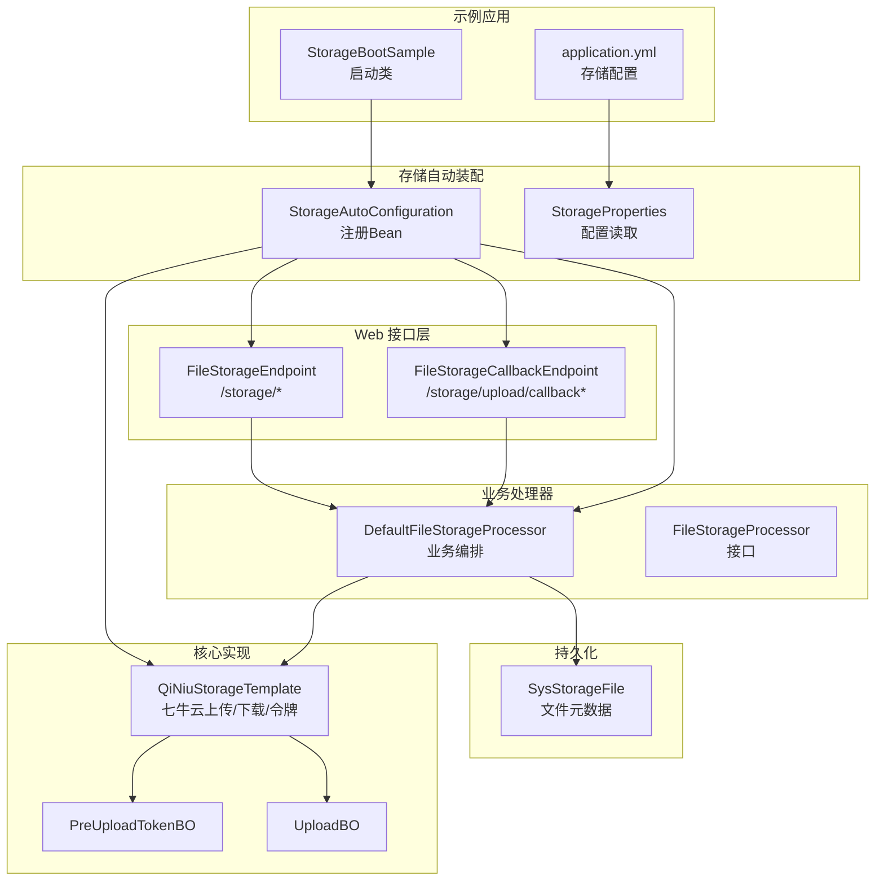
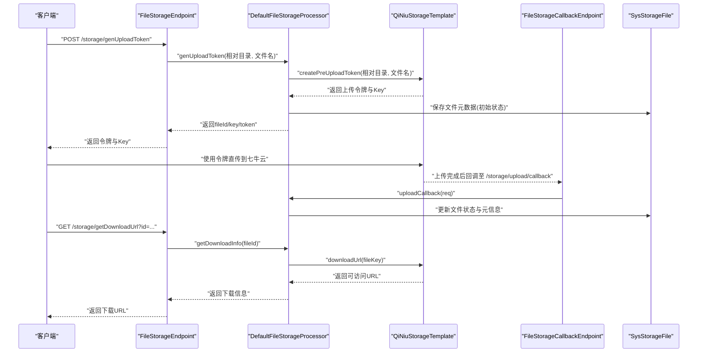
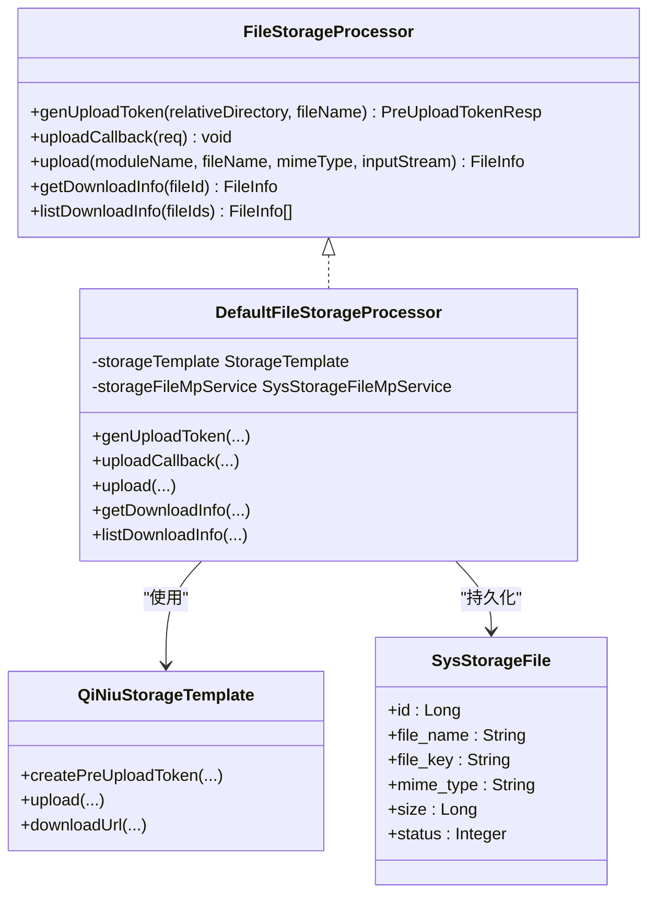
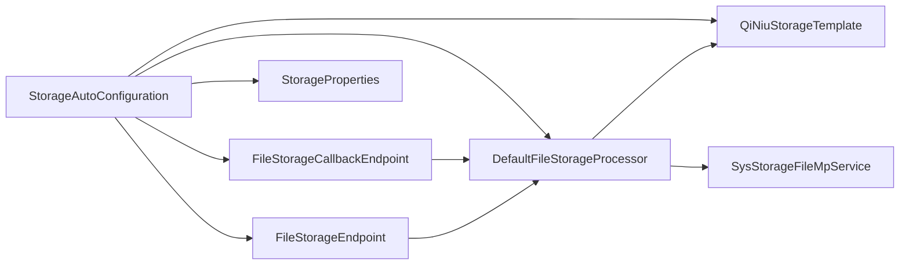

# 文件存储示例

<cite>
**本文引用的文件**
- [StorageBootSample.java](file://sample/storage-boot-sample/src/main/java/com/kewen/framework/sample/storage/StorageBootSample.java)
- [application.yml](file://sample/storage-boot-sample/src/main/resources/application.yml)
- [StorageAutoConfiguration.java](file://boot/storage-spring-boot-starter/src/main/java/com/kewen/framework/storage/boot/StorageAutoConfiguration.java)
- [StorageProperties.java](file://boot/storage-spring-boot-starter/src/main/java/com/kewen/framework/storage/boot/StorageProperties.java)
- [FileStorageEndpoint.java](file://boot/storage-spring-boot-starter/src/main/java/com/kewen/framework/storage/web/FileStorageEndpoint.java)
- [FileStorageCallbackEndpoint.java](file://boot/storage-spring-boot-starter/src/main/java/com/kewen/framework/storage/web/FileStorageCallbackEndpoint.java)
- [QiNiuStorageTemplate.java](file://boot/storage-spring-boot-starter/src/main/java/com/kewen/framework/storage/core/qiniu/QiNiuStorageTemplate.java)
- [DefaultFileStorageProcessor.java](file://boot/storage-spring-boot-starter/src/main/java/com/kewen/framework/storage/web/impl/DefaultFileStorageProcessor.java)
- [FileStorageProcessor.java](file://boot/storage-spring-boot-starter/src/main/java/com/kewen/framework/storage/web/FileStorageProcessor.java)
- [PreUploadTokenBO.java](file://boot/storage-spring-boot-starter/src/main/java/com/kewen/framework/storage/core/model/PreUploadTokenBO.java)
- [UploadBO.java](file://boot/storage-spring-boot-starter/src/main/java/com/kewen/framework/storage/core/model/UploadBO.java)
- [PreUploadTokenReq.java](file://boot/storage-spring-boot-starter/src/main/java/com/kewen/framework/storage/web/model/PreUploadTokenReq.java)
- [PreUploadTokenResp.java](file://boot/storage-spring-boot-starter/src/main/java/com/kewen/framework/storage/web/model/PreUploadTokenResp.java)
- [SysStorageFile.java](file://boot/storage-spring-boot-starter/src/main/java/com/kewen/framework/storage/web/mp/entity/SysStorageFile.java)
- [storage.sql](file://docs/sql/storage.sql)
</cite>

## 目录
1. [简介](#简介)
2. [项目结构](#项目结构)
3. [核心组件](#核心组件)
4. [架构总览](#架构总览)
5. [详细组件分析](#详细组件分析)
6. [依赖分析](#依赖分析)
7. [性能考虑](#性能考虑)
8. [故障排查指南](#故障排查指南)
9. [结论](#结论)
10. [附录](#附录)

## 简介
本指南面向使用文件存储示例应用的开发者，围绕 StorageBootSample 的启动与配置展开，系统讲解如何通过七牛云实现文件上传与下载的完整生命周期，包括预上传令牌生成、客户端直传、服务端上传、回调处理与下载链接生成。文档同时提供基于 curl 的 API 测试方法、Postman 测试用例思路以及常见问题的排查建议。

## 项目结构
该示例采用模块化设计，核心能力由存储自动装配与 Web 控制器提供，底层对接七牛云 SDK 实现具体上传逻辑。示例应用通过 Spring Boot 启动，加载存储自动配置，暴露文件上传与回调相关接口，并持久化文件元数据。

图表来源
- [StorageBootSample.java:1-12](file://sample/storage-boot-sample/src/main/java/com/kewen/framework/sample/storage/StorageBootSample.java#L1-L12)
- [application.yml:1-18](file://sample/storage-boot-sample/src/main/resources/application.yml#L1-L18)
- [StorageAutoConfiguration.java:1-71](file://boot/storage-spring-boot-starter/src/main/java/com/kewen/framework/storage/boot/StorageAutoConfiguration.java#L1-L71)
- [StorageProperties.java:1-45](file://boot/storage-spring-boot-starter/src/main/java/com/kewen/framework/storage/boot/StorageProperties.java#L1-L45)
- [FileStorageEndpoint.java:1-88](file://boot/storage-spring-boot-starter/src/main/java/com/kewen/framework/storage/web/FileStorageEndpoint.java#L1-L88)
- [FileStorageCallbackEndpoint.java:1-66](file://boot/storage-spring-boot-starter/src/main/java/com/kewen/framework/storage/web/FileStorageCallbackEndpoint.java#L1-L66)
- [DefaultFileStorageProcessor.java:1-123](file://boot/storage-spring-boot-starter/src/main/java/com/kewen/framework/storage/web/impl/DefaultFileStorageProcessor.java#L1-L123)
- [QiNiuStorageTemplate.java:1-151](file://boot/storage-spring-boot-starter/src/main/java/com/kewen/framework/storage/core/qiniu/QiNiuStorageTemplate.java#L1-L151)
- [SysStorageFile.java:1-71](file://boot/storage-spring-boot-starter/src/main/java/com/kewen/framework/storage/web/mp/entity/SysStorageFile.java#L1-L71)

章节来源
- [StorageBootSample.java:1-12](file://sample/storage-boot-sample/src/main/java/com/kewen/framework/sample/storage/StorageBootSample.java#L1-L12)
- [application.yml:1-18](file://sample/storage-boot-sample/src/main/resources/application.yml#L1-L18)
- [StorageAutoConfiguration.java:1-71](file://boot/storage-spring-boot-starter/src/main/java/com/kewen/framework/storage/boot/StorageAutoConfiguration.java#L1-L71)

## 核心组件
- 启动类：负责应用启动与上下文加载。
- 自动装配：注册存储模板、Web 控制器、业务处理器等 Bean。
- 存储配置：读取 kewen.storage.* 配置项，驱动七牛云参数。
- Web 层：提供生成上传令牌、服务端上传、下载链接查询、上传回调等接口。
- 处理器：编排上传流程，持久化文件元数据，处理回调。
- 七牛云模板：封装上传、下载、预上传令牌生成等操作。
- 数据模型：用于请求、响应与持久化的数据载体。

章节来源
- [StorageAutoConfiguration.java:23-70](file://boot/storage-spring-boot-starter/src/main/java/com/kewen/framework/storage/boot/StorageAutoConfiguration.java#L23-L70)
- [StorageProperties.java:12-44](file://boot/storage-spring-boot-starter/src/main/java/com/kewen/framework/storage/boot/StorageProperties.java#L12-L44)
- [FileStorageEndpoint.java:25-87](file://boot/storage-spring-boot-starter/src/main/java/com/kewen/framework/storage/web/FileStorageEndpoint.java#L25-L87)
- [FileStorageCallbackEndpoint.java:19-65](file://boot/storage-spring-boot-starter/src/main/java/com/kewen/framework/storage/web/FileStorageCallbackEndpoint.java#L19-L65)
- [DefaultFileStorageProcessor.java:24-122](file://boot/storage-spring-boot-starter/src/main/java/com/kewen/framework/storage/web/impl/DefaultFileStorageProcessor.java#L24-L122)
- [QiNiuStorageTemplate.java:23-150](file://boot/storage-spring-boot-starter/src/main/java/com/kewen/framework/storage/core/qiniu/QiNiuStorageTemplate.java#L23-L150)

## 架构总览
下图展示从客户端到七牛云的上传链路，以及服务端回调与下载链接生成的关键节点。

图表来源
- [FileStorageEndpoint.java:40-47](file://boot/storage-spring-boot-starter/src/main/java/com/kewen/framework/storage/web/FileStorageEndpoint.java#L40-L47)
- [DefaultFileStorageProcessor.java:34-53](file://boot/storage-spring-boot-starter/src/main/java/com/kewen/framework/storage/web/impl/DefaultFileStorageProcessor.java#L34-L53)
- [QiNiuStorageTemplate.java:124-149](file://boot/storage-spring-boot-starter/src/main/java/com/kewen/framework/storage/core/qiniu/QiNiuStorageTemplate.java#L124-L149)
- [FileStorageCallbackEndpoint.java:33-42](file://boot/storage-spring-boot-starter/src/main/java/com/kewen/framework/storage/web/FileStorageCallbackEndpoint.java#L33-L42)
- [DefaultFileStorageProcessor.java:56-67](file://boot/storage-spring-boot-starter/src/main/java/com/kewen/framework/storage/web/impl/DefaultFileStorageProcessor.java#L56-L67)
- [QiNiuStorageTemplate.java:98-122](file://boot/storage-spring-boot-starter/src/main/java/com/kewen/framework/storage/core/qiniu/QiNiuStorageTemplate.java#L98-L122)

## 详细组件分析

### 启动与配置
- 启动类：位于示例模块，标注为 Spring Boot 应用入口。
- 配置文件：示例应用通过 application.yml 提供数据库连接与存储配置，其中 kewen.storage.* 项用于驱动存储自动装配。

章节来源
- [StorageBootSample.java:7-11](file://sample/storage-boot-sample/src/main/java/com/kewen/framework/sample/storage/StorageBootSample.java#L7-L11)
- [application.yml:10-17](file://sample/storage-boot-sample/src/main/resources/application.yml#L10-L17)

### 自动装配与 Bean 注册
- 自动装配类负责：
  - 绑定配置类 StorageProperties。
  - 注册存储模板（当前实现为七牛云）。
  - 注册 Web 控制器与业务处理器。
  - 扫描持久化 Mapper 与 Service。

章节来源
- [StorageAutoConfiguration.java:24-70](file://boot/storage-spring-boot-starter/src/main/java/com/kewen/framework/storage/boot/StorageAutoConfiguration.java#L24-L70)

### 存储配置项
- 关键配置项：
  - type：存储类型（示例为 qiniu）
  - access-key / secret-key：七牛云鉴权密钥
  - bucket：存储桶
  - rootPath：文件根路径前缀
  - isPublic：是否公开空间
  - download-domain：下载域名
  - upload-callback-url：上传回调地址

章节来源
- [StorageProperties.java:14-44](file://boot/storage-spring-boot-starter/src/main/java/com/kewen/framework/storage/boot/StorageProperties.java#L14-L44)
- [application.yml:10-17](file://sample/storage-boot-sample/src/main/resources/application.yml#L10-L17)

### Web 接口层
- 生成上传令牌：POST /storage/genUploadToken
- 服务端上传：POST /storage/upload
- 下载链接查询：GET /storage/getDownloadUrl、GET /storage/listDownloadUrl
- 上传回调：POST /storage/upload/callback、GET /storage/upload/callbackAsync

章节来源
- [FileStorageEndpoint.java:40-84](file://boot/storage-spring-boot-starter/src/main/java/com/kewen/framework/storage/web/FileStorageEndpoint.java#L40-L84)
- [FileStorageCallbackEndpoint.java:33-63](file://boot/storage-spring-boot-starter/src/main/java/com/kewen/framework/storage/web/FileStorageCallbackEndpoint.java#L33-L63)

### 业务处理器
- 负责：
  - 生成预上传令牌并持久化文件元数据。
  - 处理上传回调，更新文件状态与元信息。
  - 直接上传文件并返回下载信息。
  - 查询单个或批量下载信息。

图表来源
- [FileStorageProcessor.java:15-54](file://boot/storage-spring-boot-starter/src/main/java/com/kewen/framework/storage/web/FileStorageProcessor.java#L15-L54)
- [DefaultFileStorageProcessor.java:24-122](file://boot/storage-spring-boot-starter/src/main/java/com/kewen/framework/storage/web/impl/DefaultFileStorageProcessor.java#L24-L122)
- [QiNiuStorageTemplate.java:23-150](file://boot/storage-spring-boot-starter/src/main/java/com/kewen/framework/storage/core/qiniu/QiNiuStorageTemplate.java#L23-L150)
- [SysStorageFile.java:26-70](file://boot/storage-spring-boot-starter/src/main/java/com/kewen/framework/storage/web/mp/entity/SysStorageFile.java#L26-L70)

章节来源
- [DefaultFileStorageProcessor.java:34-98](file://boot/storage-spring-boot-starter/src/main/java/com/kewen/framework/storage/web/impl/DefaultFileStorageProcessor.java#L34-L98)

### 七牛云存储模板
- 功能：
  - 生成上传策略与令牌。
  - 使用 UploadManager 执行上传。
  - 生成下载 URL（公开空间直链或带有效期私有链接）。
- 令牌策略包含回调地址、回调体、异步通知等，确保上传完成后服务端能正确落库。

章节来源
- [QiNiuStorageTemplate.java:51-95](file://boot/storage-spring-boot-starter/src/main/java/com/kewen/framework/storage/core/qiniu/QiNiuStorageTemplate.java#L51-L95)
- [QiNiuStorageTemplate.java:98-122](file://boot/storage-spring-boot-starter/src/main/java/com/kewen/framework/storage/core/qiniu/QiNiuStorageTemplate.java#L98-L122)
- [QiNiuStorageTemplate.java:124-149](file://boot/storage-spring-boot-starter/src/main/java/com/kewen/framework/storage/core/qiniu/QiNiuStorageTemplate.java#L124-L149)

### 数据模型与持久化
- 请求/响应模型：
  - PreUploadTokenReq：包含文件名
  - PreUploadTokenResp：包含 fileId、key、uploadToken
- 上传返回模型：
  - PreUploadTokenBO：包含 key 与 uploadToken
  - UploadBO：包含 key、hash、size
- 文件元数据实体：
  - SysStorageFile：包含文件名、key、MIME、大小、状态等字段

章节来源
- [PreUploadTokenReq.java:13-19](file://boot/storage-spring-boot-starter/src/main/java/com/kewen/framework/storage/web/model/PreUploadTokenReq.java#L13-L19)
- [PreUploadTokenResp.java:14-19](file://boot/storage-spring-boot-starter/src/main/java/com/kewen/framework/storage/web/model/PreUploadTokenResp.java#L14-L19)
- [PreUploadTokenBO.java:14-17](file://boot/storage-spring-boot-starter/src/main/java/com/kewen/framework/storage/core/model/PreUploadTokenBO.java#L14-L17)
- [UploadBO.java:11-16](file://boot/storage-spring-boot-starter/src/main/java/com/kewen/framework/storage/core/model/UploadBO.java#L11-L16)
- [SysStorageFile.java:26-70](file://boot/storage-spring-boot-starter/src/main/java/com/kewen/framework/storage/web/mp/entity/SysStorageFile.java#L26-L70)

## 依赖分析
- 组件耦合：
  - Web 层依赖 FileStorageProcessor 接口，具体实现为 DefaultFileStorageProcessor。
  - DefaultFileStorageProcessor 依赖 StorageTemplate（QiNiuStorageTemplate）与持久化服务。
  - StorageAutoConfiguration 负责装配各组件并注入配置。
- 外部依赖：
  - 七牛云 SDK（Auth、UploadManager、DownloadUrl 等）。
  - MyBatis-Plus Mapper/Service 用于持久化。

图表来源
- [StorageAutoConfiguration.java:37-69](file://boot/storage-spring-boot-starter/src/main/java/com/kewen/framework/storage/boot/StorageAutoConfiguration.java#L37-L69)
- [DefaultFileStorageProcessor.java:27-31](file://boot/storage-spring-boot-starter/src/main/java/com/kewen/framework/storage/web/impl/DefaultFileStorageProcessor.java#L27-L31)
- [FileStorageEndpoint.java:31-32](file://boot/storage-spring-boot-starter/src/main/java/com/kewen/framework/storage/web/FileStorageEndpoint.java#L31-L32)
- [FileStorageCallbackEndpoint.java:24-25](file://boot/storage-spring-boot-starter/src/main/java/com/kewen/framework/storage/web/FileStorageCallbackEndpoint.java#L24-L25)

章节来源
- [StorageAutoConfiguration.java:24-70](file://boot/storage-spring-boot-starter/src/main/java/com/kewen/framework/storage/boot/StorageAutoConfiguration.java#L24-L70)

## 性能考虑
- 分片上传：七牛云模板已启用 v2 分片上传版本，适合大文件稳定传输。
- 私有空间签名：私有空间下载 URL 默认带有效期，建议根据业务场景调整过期时间。
- 异步回调：上传完成后支持异步通知，可降低同步阻塞风险。
- 并发与线程池：如需并发上传，建议结合业务线程池与限流策略，避免对存储后端造成压力。
- 缓存与CDN：下载域名应配置 CDN 加速，提升全球访问速度。

## 故障排查指南
- 上传令牌无效
  - 检查 access-key/secret-key 与 bucket 是否正确。
  - 确认回调地址与异步通知地址可达。
- 上传成功但未入库
  - 核对回调接口是否被正确调用，检查回调处理器逻辑。
  - 确认 fileId 对应记录存在且状态更新。
- 下载链接为空
  - 检查 fileKey 是否与存储一致。
  - 私有空间需确认签名有效期内。
- 数据库异常
  - 确认持久化表结构与字段映射正确，参考初始化脚本。

章节来源
- [DefaultFileStorageProcessor.java:56-67](file://boot/storage-spring-boot-starter/src/main/java/com/kewen/framework/storage/web/impl/DefaultFileStorageProcessor.java#L56-L67)
- [QiNiuStorageTemplate.java:124-149](file://boot/storage-spring-boot-starter/src/main/java/com/kewen/framework/storage/core/qiniu/QiNiuStorageTemplate.java#L124-L149)
- [storage.sql:2-32](file://docs/sql/storage.sql#L2-L32)

## 结论
该示例通过自动装配与 Web 接口，提供了从“预上传令牌生成”到“上传完成回调”再到“下载链接生成”的完整文件存储能力。结合七牛云 SDK 的稳定实现与本地持久化，开发者可快速集成并扩展到实际业务场景中。

## 附录

### 七牛云配置方法与参数说明
- 在示例应用的配置文件中设置以下参数：
  - kewen.storage.type：存储类型（示例为 qiniu）
  - kewen.storage.access-key / kewen.storage.secret-key：七牛云密钥
  - kewen.storage.bucket：存储桶
  - kewen.storage.root-path：文件根路径前缀（可选）
  - kewen.storage.is-public：是否公开空间（布尔）
  - kewen.storage.download-domain：下载域名
  - kewen.storage.upload-callback-url：上传回调地址

章节来源
- [application.yml:10-17](file://sample/storage-boot-sample/src/main/resources/application.yml#L10-L17)
- [StorageProperties.java:14-44](file://boot/storage-spring-boot-starter/src/main/java/com/kewen/framework/storage/boot/StorageProperties.java#L14-L44)

### 文件存储生命周期（从预上传到最终存储）
- 预上传阶段
  - 客户端请求生成上传令牌与 Key。
  - 服务端持久化文件元数据（初始状态），返回 token 与 key。
- 上传阶段
  - 客户端使用 token 直传至七牛云。
  - 上传完成后，七牛云回调至服务端回调地址。
- 回调阶段
  - 服务端解析回调参数，更新文件状态与元信息。
- 下载阶段
  - 客户端请求下载链接，服务端生成并返回可访问 URL。

章节来源
- [FileStorageEndpoint.java:40-47](file://boot/storage-spring-boot-starter/src/main/java/com/kewen/framework/storage/web/FileStorageEndpoint.java#L40-L47)
- [DefaultFileStorageProcessor.java:34-53](file://boot/storage-spring-boot-starter/src/main/java/com/kewen/framework/storage/web/impl/DefaultFileStorageProcessor.java#L34-L53)
- [QiNiuStorageTemplate.java:124-149](file://boot/storage-spring-boot-starter/src/main/java/com/kewen/framework/storage/core/qiniu/QiNiuStorageTemplate.java#L124-L149)
- [FileStorageCallbackEndpoint.java:33-42](file://boot/storage-spring-boot-starter/src/main/java/com/kewen/framework/storage/web/FileStorageCallbackEndpoint.java#L33-L42)
- [DefaultFileStorageProcessor.java:56-67](file://boot/storage-spring-boot-starter/src/main/java/com/kewen/framework/storage/web/impl/DefaultFileStorageProcessor.java#L56-L67)
- [QiNiuStorageTemplate.java:98-122](file://boot/storage-spring-boot-starter/src/main/java/com/kewen/framework/storage/core/qiniu/QiNiuStorageTemplate.java#L98-L122)

### API 测试方法（curl 与 Postman）

- 生成上传令牌
  - 方法：POST
  - 地址：/storage/genUploadToken
  - 请求体：包含文件名
  - 返回：fileId、key、uploadToken
  - 示例 curl
    - curl -X POST http://localhost:8080/storage/genUploadToken -H "Content-Type: application/json" -d '{"fileName":"test.txt"}'

- 服务端上传
  - 方法：POST
  - 地址：/storage/upload
  - 参数：relativeDirectory（相对目录）、multipartFile（文件）
  - 返回：文件下载信息（含 fileId、名称、URL、大小）

- 获取下载链接
  - 方法：GET
  - 地址：/storage/getDownloadUrl?fileId=...
  - 返回：文件下载信息

- 列表下载链接
  - 方法：GET
  - 地址：/storage/listDownloadUrl?fileIds=1&fileIds=2
  - 返回：多个文件下载信息列表

- 上传回调（服务端）
  - 方法：POST
  - 地址：/storage/upload/callback
  - 请求体：回调参数（包含 fileId、key、hash、bucket、size、mimeType 等）
  - 返回：成功响应

- 上传回调（异步通知）
  - 方法：POST
  - 地址：/storage/upload/callbackAsync
  - 请求体：回调参数（JSON）
  - 返回：成功响应

章节来源
- [FileStorageEndpoint.java:40-84](file://boot/storage-spring-boot-starter/src/main/java/com/kewen/framework/storage/web/FileStorageEndpoint.java#L40-L84)
- [FileStorageCallbackEndpoint.java:33-63](file://boot/storage-spring-boot-starter/src/main/java/com/kewen/framework/storage/web/FileStorageCallbackEndpoint.java#L33-L63)

### Postman 测试用例思路
- 新建集合：文件存储
- 导入环境：配置 host、port、fileId
- 创建请求：
  - 生成上传令牌：选择 POST，Body 为 raw JSON，填入文件名
  - 服务端上传：选择 POST，Body 为 form-data，包含 relativeDirectory 与 file
  - 获取下载链接：GET，填入 fileId
  - 上传回调：POST，Body 为 raw JSON，模拟回调参数
- 设置前置脚本：可自动从“生成上传令牌”响应中提取 fileId、key、uploadToken，供后续请求复用
- 设置断言：校验返回状态码与关键字段（如 fileId、URL、size）

### 错误处理与异常情况
- 上传令牌生成失败：检查配置项与网络连通性
- 上传回调缺失：确认回调地址可达、防火墙放行、回调处理器逻辑正确
- 下载链接失效：确认私有空间签名未过期、fileKey 正确
- 数据库异常：核对表结构与字段映射，确保持久化服务可用

章节来源
- [DefaultFileStorageProcessor.java:56-67](file://boot/storage-spring-boot-starter/src/main/java/com/kewen/framework/storage/web/impl/DefaultFileStorageProcessor.java#L56-L67)
- [QiNiuStorageTemplate.java:124-149](file://boot/storage-spring-boot-starter/src/main/java/com/kewen/framework/storage/core/qiniu/QiNiuStorageTemplate.java#L124-L149)

### 数据库初始化脚本
- 初始化脚本包含文件明细与分片明细表结构，便于理解文件存储的数据模型与扩展点。

章节来源
- [storage.sql:2-45](file://docs/sql/storage.sql#L2-L45)