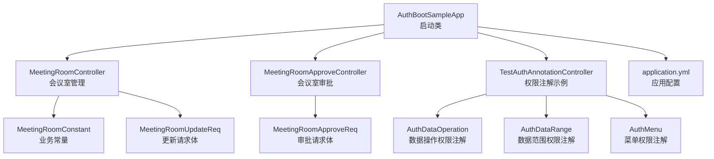
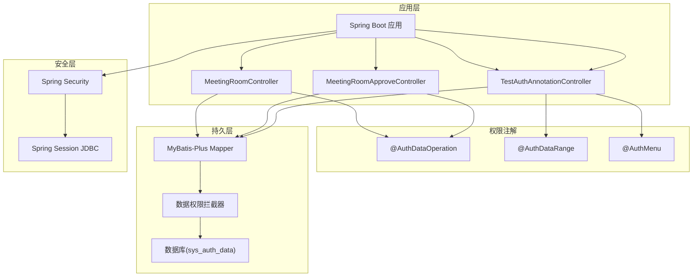
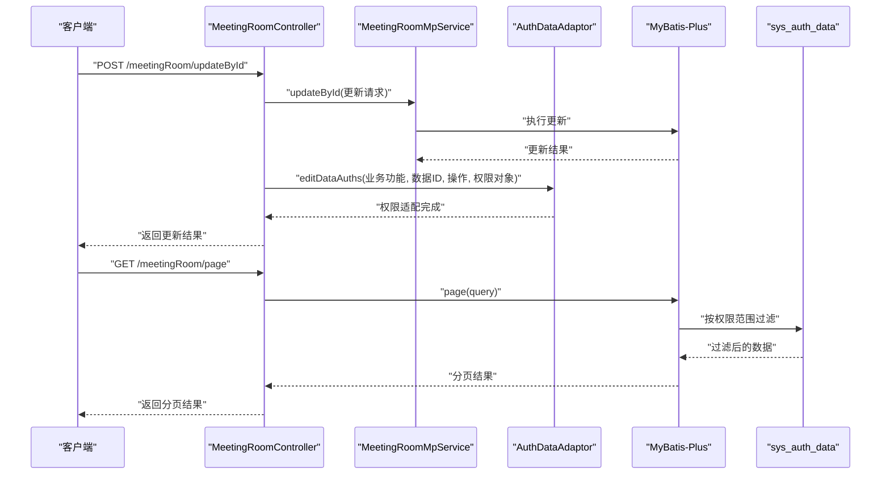
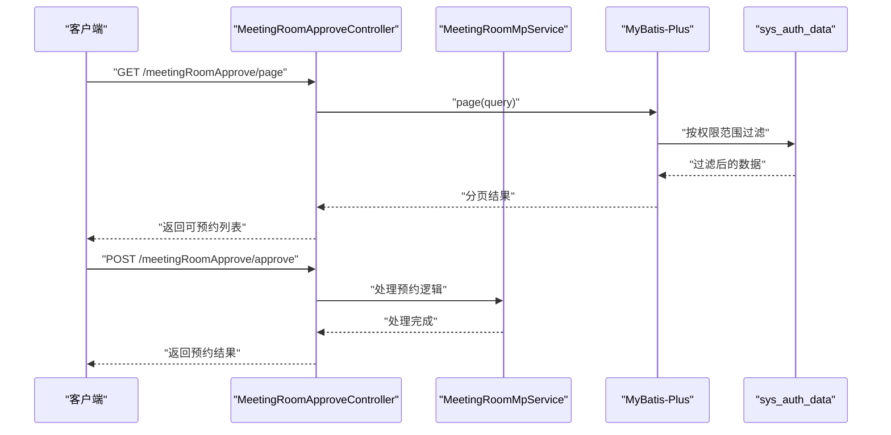
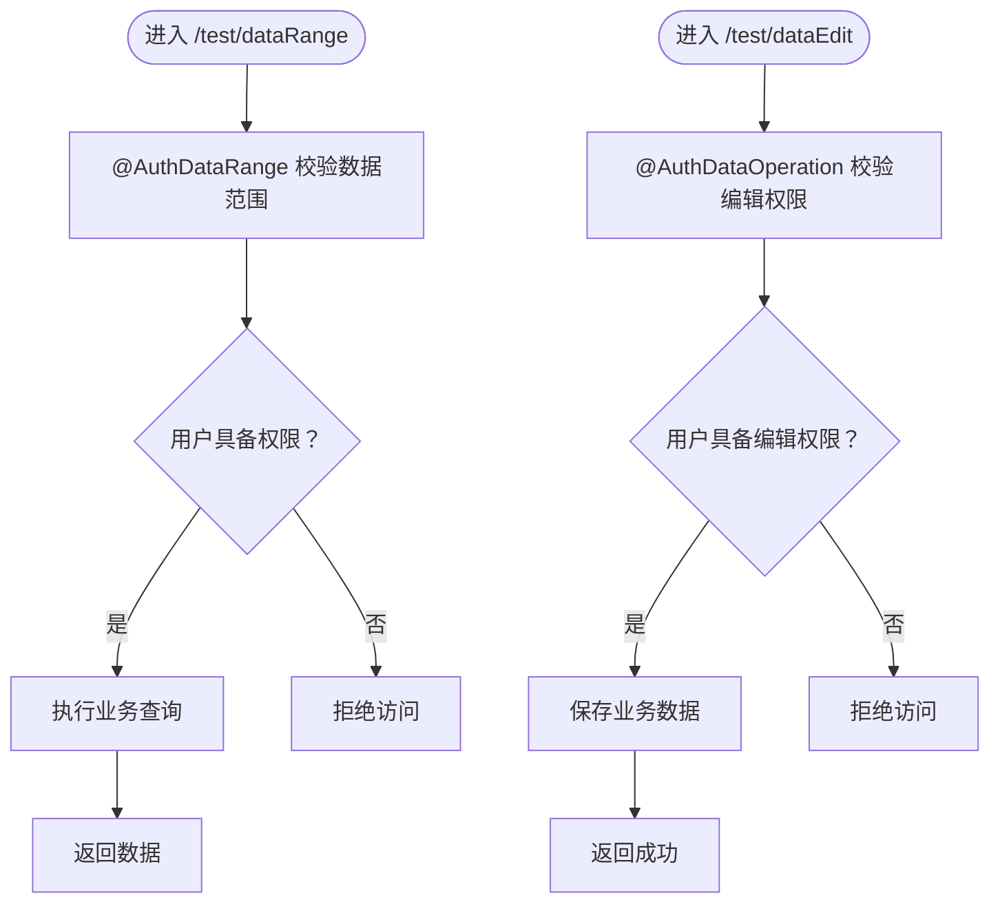
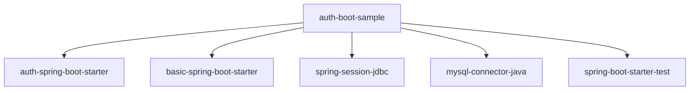

# 权限管理示例

<cite>
**本文引用的文件**
- [AuthBootSampleApp.java](file://sample/auth-boot-sample/src/main/java/com/kewen/framework/auth/sample/AuthBootSampleApp.java)
- [MeetingRoomController.java](file://sample/auth-boot-sample/src/main/java/com/kewen/framework/auth/sample/controller/MeetingRoomController.java)
- [MeetingRoomApproveController.java](file://sample/auth-boot-sample/src/main/java/com/kewen/framework/auth/sample/controller/MeetingRoomApproveController.java)
- [TestAuthAnnotationController.java](file://sample/auth-boot-sample/src/main/java/com/kewen/framework/auth/sample/controller/TestAuthAnnotationController.java)
- [MeetingRoomConstant.java](file://sample/auth-boot-sample/src/main/java/com/kewen/framework/auth/sample/controller/MeetingRoomConstant.java)
- [MeetingRoomAddReq.java](file://sample/auth-boot-sample/src/main/java/com/kewen/framework/auth/sample/model/MeetingRoomAddReq.java)
- [MeetingRoomUpdateReq.java](file://sample/auth-boot-sample/src/main/java/com/kewen/framework/auth/sample/model/MeetingRoomUpdateReq.java)
- [MeetingRoomApproveReq.java](file://sample/auth-boot-sample/src/main/java/com/kewen/framework/auth/sample/model/MeetingRoomApproveReq.java)
- [application.yml](file://sample/auth-boot-sample/src/main/resources/application.yml)
- [AuthDataOperation.java](file://qy-auth/auth-core/src/main/java/com/kewen/framework/auth/core/AuthDataOperation.java)
- [AuthDataRange.java](file://qy-auth/auth-core/src/main/java/com/kewen/framework/auth/core/AuthDataRange.java)
- [AuthMenu.java](file://qy-auth/auth-core/src/main/java/com/kewen/framework/auth/core/AuthMenu.java)
- [TestAuthAnnotationControllerTest.java](file://sample/auth-boot-sample/src/test/java/controller/TestAuthAnnotationControllerTest.java)
- [TestAuthMenuController.java](file://sample/auth-boot-sample/src/test/java/controller/authmenu/TestAuthMenuController.java)
- [TestSecurityController.java](file://sample/auth-boot-sample/src/test/java/controller/security/TestSecurityController.java)
- [pom.xml](file://sample/auth-boot-sample/pom.xml)
</cite>

## 目录
1. [简介](#简介)
2. [项目结构](#项目结构)
3. [核心组件](#核心组件)
4. [架构总览](#架构总览)
5. [详细组件分析](#详细组件分析)
6. [依赖分析](#依赖分析)
7. [性能考虑](#性能考虑)
8. [故障排查指南](#故障排查指南)
9. [结论](#结论)
10. [附录](#附录)

## 简介
本指南面向开发者，围绕权限管理示例应用“AuthBootSampleApp”展开，系统讲解启动配置与权限系统集成、会议室管理功能（含CRUD与权限注解）、权限注解示例（@Auth、@DataRange等）、会议室审批流程、以及测试用例中的权限验证实现。文档提供完整的运行步骤、API测试方法与权限验证流程，帮助快速掌握RBAC权限系统的实际应用。

## 项目结构
示例应用位于 sample/auth-boot-sample 模块，核心由以下部分组成：
- 启动类：负责应用引导与上下文启动
- 控制器层：会议室管理、会议室审批、权限注解示例、菜单与安全测试
- 模型层：请求体与业务对象封装
- 配置文件：数据库连接、日志、认证与会话配置
- 权限注解：@AuthDataOperation、@AuthDataRange、@AuthMenu
- 测试：菜单权限与安全注解测试

图表来源
- [AuthBootSampleApp.java:1-13](file://sample/auth-boot-sample/src/main/java/com/kewen/framework/auth/sample/AuthBootSampleApp.java#L1-L13)
- [MeetingRoomController.java:1-101](file://sample/auth-boot-sample/src/main/java/com/kewen/framework/auth/sample/controller/MeetingRoomController.java#L1-L101)
- [MeetingRoomApproveController.java:1-78](file://sample/auth-boot-sample/src/main/java/com/kewen/framework/auth/sample/controller/MeetingRoomApproveController.java#L1-L78)
- [TestAuthAnnotationController.java:1-109](file://sample/auth-boot-sample/src/main/java/com/kewen/framework/auth/sample/controller/TestAuthAnnotationController.java#L1-L109)
- [MeetingRoomConstant.java:1-26](file://sample/auth-boot-sample/src/main/java/com/kewen/framework/auth/sample/controller/MeetingRoomConstant.java#L1-L26)
- [MeetingRoomUpdateReq.java:1-30](file://sample/auth-boot-sample/src/main/java/com/kewen/framework/auth/sample/model/MeetingRoomUpdateReq.java#L1-L30)
- [MeetingRoomApproveReq.java:1-20](file://sample/auth-boot-sample/src/main/java/com/kewen/framework/auth/sample/model/MeetingRoomApproveReq.java#L1-L20)
- [application.yml:1-55](file://sample/auth-boot-sample/src/main/resources/application.yml#L1-L55)

章节来源
- [AuthBootSampleApp.java:1-13](file://sample/auth-boot-sample/src/main/java/com/kewen/framework/auth/sample/AuthBootSampleApp.java#L1-L13)
- [application.yml:1-55](file://sample/auth-boot-sample/src/main/resources/application.yml#L1-L55)

## 核心组件
- 启动类：应用入口，负责加载Spring Boot上下文
- 会议室控制器：提供分页查询、更新、权限适配填充等能力
- 审批控制器：提供可预约列表查询与预约提交
- 权限注解控制器：演示数据范围、数据编辑、菜单权限注解
- 权限注解定义：@AuthDataOperation、@AuthDataRange、@AuthMenu
- 配置文件：数据库、日志、认证与会话参数
- 测试控制器：菜单权限与Spring Security注解示例

章节来源
- [AuthBootSampleApp.java:1-13](file://sample/auth-boot-sample/src/main/java/com/kewen/framework/auth/sample/AuthBootSampleApp.java#L1-L13)
- [MeetingRoomController.java:1-101](file://sample/auth-boot-sample/src/main/java/com/kewen/framework/auth/sample/controller/MeetingRoomController.java#L1-L101)
- [MeetingRoomApproveController.java:1-78](file://sample/auth-boot-sample/src/main/java/com/kewen/framework/auth/sample/controller/MeetingRoomApproveController.java#L1-L78)
- [TestAuthAnnotationController.java:1-109](file://sample/auth-boot-sample/src/main/java/com/kewen/framework/auth/sample/controller/TestAuthAnnotationController.java#L1-L109)
- [AuthDataOperation.java:1-41](file://qy-auth/auth-core/src/main/java/com/kewen/framework/auth/core/AuthDataOperation.java#L1-L41)
- [AuthDataRange.java:1-72](file://qy-auth/auth-core/src/main/java/com/kewen/framework/auth/core/AuthDataRange.java#L1-L72)
- [AuthMenu.java:1-21](file://qy-auth/auth-core/src/main/java/com/kewen/framework/auth/core/AuthMenu.java#L1-L21)
- [application.yml:1-55](file://sample/auth-boot-sample/src/main/resources/application.yml#L1-L55)

## 架构总览
示例应用基于Spring Boot，集成权限核心模块与RBAC能力，通过注解驱动实现：
- 方法级权限：@AuthDataOperation（操作权限）、@AuthDataRange（数据范围）
- 菜单级权限：@AuthMenu（菜单路由）
- 安全框架：Spring Security与会话管理
- 数据访问：MyBatis-Plus与拦截器注入数据权限条件

图表来源
- [MeetingRoomController.java:1-101](file://sample/auth-boot-sample/src/main/java/com/kewen/framework/auth/sample/controller/MeetingRoomController.java#L1-L101)
- [MeetingRoomApproveController.java:1-78](file://sample/auth-boot-sample/src/main/java/com/kewen/framework/auth/sample/controller/MeetingRoomApproveController.java#L1-L78)
- [TestAuthAnnotationController.java:1-109](file://sample/auth-boot-sample/src/main/java/com/kewen/framework/auth/sample/controller/TestAuthAnnotationController.java#L1-L109)
- [AuthDataOperation.java:1-41](file://qy-auth/auth-core/src/main/java/com/kewen/framework/auth/core/AuthDataOperation.java#L1-L41)
- [AuthDataRange.java:1-72](file://qy-auth/auth-core/src/main/java/com/kewen/framework/auth/core/AuthDataRange.java#L1-L72)
- [AuthMenu.java:1-21](file://qy-auth/auth-core/src/main/java/com/kewen/framework/auth/core/AuthMenu.java#L1-L21)

## 详细组件分析

### 启动配置与运行步骤
- 启动类：应用入口，加载Spring Boot上下文
- 配置文件：设置端口、数据源、日志级别、认证与会话参数
- 运行方式：通过Maven插件或IDE直接运行启动类

运行步骤
1) 准备数据库与权限基础数据（参考模块内SQL脚本）
2) 修改配置文件中的数据源参数
3) 执行启动类或使用Maven命令打包后运行
4) 访问应用端口进行API测试

章节来源
- [AuthBootSampleApp.java:1-13](file://sample/auth-boot-sample/src/main/java/com/kewen/framework/auth/sample/AuthBootSampleApp.java#L1-L13)
- [application.yml:1-55](file://sample/auth-boot-sample/src/main/resources/application.yml#L1-L55)
- [pom.xml:1-99](file://sample/auth-boot-sample/pom.xml#L1-L99)

### 会议室管理功能（MeetingRoomController）
职责与特性
- 提供分页查询，结合数据范围注解限制可见数据
- 支持更新接口，动态适配数据权限对象
- 通过权限适配器填充权限对象，便于前端展示

关键点
- 分页查询使用数据范围注解，拦截器自动注入权限过滤条件
- 更新接口使用操作权限注解，校验用户是否具备对应操作权限
- 权限适配器用于填充数据级权限状态

图表来源
- [MeetingRoomController.java:1-101](file://sample/auth-boot-sample/src/main/java/com/kewen/framework/auth/sample/controller/MeetingRoomController.java#L1-L101)
- [MeetingRoomUpdateReq.java:1-30](file://sample/auth-boot-sample/src/main/java/com/kewen/framework/auth/sample/model/MeetingRoomUpdateReq.java#L1-L30)

章节来源
- [MeetingRoomController.java:1-101](file://sample/auth-boot-sample/src/main/java/com/kewen/framework/auth/sample/controller/MeetingRoomController.java#L1-L101)
- [MeetingRoomConstant.java:1-26](file://sample/auth-boot-sample/src/main/java/com/kewen/framework/auth/sample/controller/MeetingRoomConstant.java#L1-L26)
- [MeetingRoomUpdateReq.java:1-30](file://sample/auth-boot-sample/src/main/java/com/kewen/framework/auth/sample/model/MeetingRoomUpdateReq.java#L1-L30)

### 会议室审批流程（MeetingRoomApproveController）
职责与特性
- 提供可预约列表查询，使用数据范围注解限制可见范围
- 提交预约申请，使用操作权限注解校验用户是否具备预约权限

图表来源
- [MeetingRoomApproveController.java:1-78](file://sample/auth-boot-sample/src/main/java/com/kewen/framework/auth/sample/controller/MeetingRoomApproveController.java#L1-L78)
- [MeetingRoomApproveReq.java:1-20](file://sample/auth-boot-sample/src/main/java/com/kewen/framework/auth/sample/model/MeetingRoomApproveReq.java#L1-L20)

章节来源
- [MeetingRoomApproveController.java:1-78](file://sample/auth-boot-sample/src/main/java/com/kewen/framework/auth/sample/controller/MeetingRoomApproveController.java#L1-L78)
- [MeetingRoomConstant.java:1-26](file://sample/auth-boot-sample/src/main/java/com/kewen/framework/auth/sample/controller/MeetingRoomConstant.java#L1-L26)
- [MeetingRoomApproveReq.java:1-20](file://sample/auth-boot-sample/src/main/java/com/kewen/framework/auth/sample/model/MeetingRoomApproveReq.java#L1-L20)

### 权限注解示例（TestAuthAnnotationController）
职责与特性
- 展示数据范围注解：仅返回当前用户具备权限的数据
- 展示数据编辑注解：校验用户是否具备单条数据编辑权限
- 展示菜单注解：声明菜单名称，用于菜单路由与权限控制

图表来源
- [TestAuthAnnotationController.java:1-109](file://sample/auth-boot-sample/src/main/java/com/kewen/framework/auth/sample/controller/TestAuthAnnotationController.java#L1-L109)
- [AuthDataOperation.java:1-41](file://qy-auth/auth-core/src/main/java/com/kewen/framework/auth/core/AuthDataOperation.java#L1-L41)
- [AuthDataRange.java:1-72](file://qy-auth/auth-core/src/main/java/com/kewen/framework/auth/core/AuthDataRange.java#L1-L72)
- [AuthMenu.java:1-21](file://qy-auth/auth-core/src/main/java/com/kewen/framework/auth/core/AuthMenu.java#L1-L21)

章节来源
- [TestAuthAnnotationController.java:1-109](file://sample/auth-boot-sample/src/main/java/com/kewen/framework/auth/sample/controller/TestAuthAnnotationController.java#L1-L109)
- [AuthDataOperation.java:1-41](file://qy-auth/auth-core/src/main/java/com/kewen/framework/auth/core/AuthDataOperation.java#L1-L41)
- [AuthDataRange.java:1-72](file://qy-auth/auth-core/src/main/java/com/kewen/framework/auth/core/AuthDataRange.java#L1-L72)
- [AuthMenu.java:1-21](file://qy-auth/auth-core/src/main/java/com/kewen/framework/auth/core/AuthMenu.java#L1-L21)

### 菜单权限与安全测试
- 菜单权限测试：演示类与方法上的菜单注解组合使用
- 安全注解测试：演示Spring Security的授权表达式

章节来源
- [TestAuthMenuController.java:1-32](file://sample/auth-boot-sample/src/test/java/controller/authmenu/TestAuthMenuController.java#L1-L32)
- [TestSecurityController.java:1-20](file://sample/auth-boot-sample/src/test/java/controller/security/TestSecurityController.java#L1-L20)

## 依赖分析
示例应用依赖权限核心与基础模块，并引入Spring Session JDBC用于会话存储。

图表来源
- [pom.xml:1-99](file://sample/auth-boot-sample/pom.xml#L1-L99)

章节来源
- [pom.xml:1-99](file://sample/auth-boot-sample/pom.xml#L1-L99)

## 性能考虑
- 数据范围注解默认使用IN方式匹配，当权限集合较大时建议评估EXISTS策略
- 分页查询配合数据范围注解，避免一次性加载大量数据
- 合理设置会话存储与超时，平衡并发与资源占用

## 故障排查指南
- 登录与会话
  - 确认登录URL与参数配置正确
  - 检查会话存储类型与超时设置
- 权限校验
  - 确认业务功能标识与操作标识一致
  - 检查sys_auth_data中是否存在对应权限记录
- 日志与调试
  - 开启安全日志级别以便定位问题

章节来源
- [application.yml:1-55](file://sample/auth-boot-sample/src/main/resources/application.yml#L1-L55)

## 结论
本示例应用通过注解化方式将权限控制与业务解耦，覆盖数据范围、操作权限与菜单权限三大维度，配合Spring Security与会话管理，形成完整的RBAC实践。开发者可据此快速搭建具备细粒度权限控制的业务系统。

## 附录

### API测试清单
- 登录接口：用于获取会话与令牌
- 会议室管理
  - GET /meetingRoom/page：分页查询（需具备编辑数据范围权限）
  - POST /meetingRoom/updateById：更新会议室（需具备编辑操作权限）
- 会议室审批
  - GET /meetingRoomApprove/page：可预约列表（需具备预约数据范围权限）
  - POST /meetingRoomApprove/approve：提交预约（需具备预约操作权限）
- 权限注解示例
  - GET /test/dataRange：数据范围查询
  - GET /test/pageDataRange：分页数据范围查询
  - POST /test/dataEdit：数据编辑
  - GET /test/checkMenu：菜单权限校验
- 菜单与安全测试
  - GET /testAuthMenuClassMethodController/hello：菜单注解测试
  - GET /security/admin：Spring Security授权测试

章节来源
- [MeetingRoomController.java:1-101](file://sample/auth-boot-sample/src/main/java/com/kewen/framework/auth/sample/controller/MeetingRoomController.java#L1-L101)
- [MeetingRoomApproveController.java:1-78](file://sample/auth-boot-sample/src/main/java/com/kewen/framework/auth/sample/controller/MeetingRoomApproveController.java#L1-L78)
- [TestAuthAnnotationController.java:1-109](file://sample/auth-boot-sample/src/main/java/com/kewen/framework/auth/sample/controller/TestAuthAnnotationController.java#L1-L109)
- [TestAuthMenuController.java:1-32](file://sample/auth-boot-sample/src/test/java/controller/authmenu/TestAuthMenuController.java#L1-L32)
- [TestSecurityController.java:1-20](file://sample/auth-boot-sample/src/test/java/controller/security/TestSecurityController.java#L1-L20)