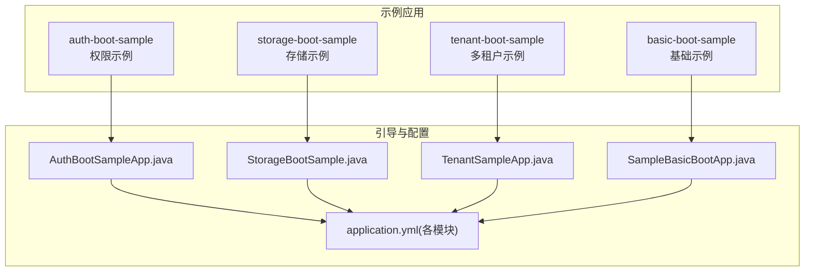
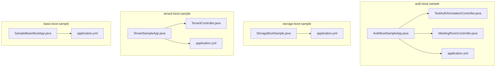
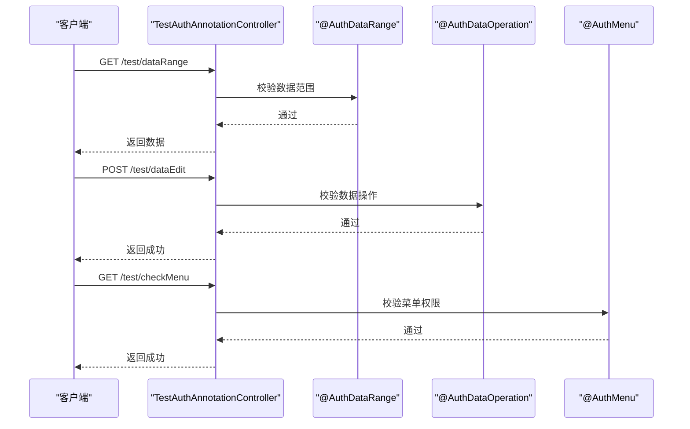
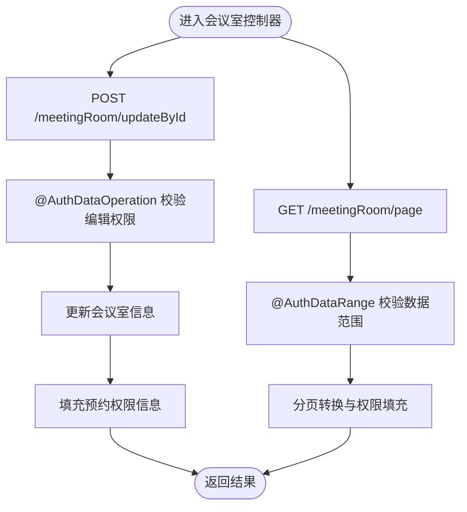
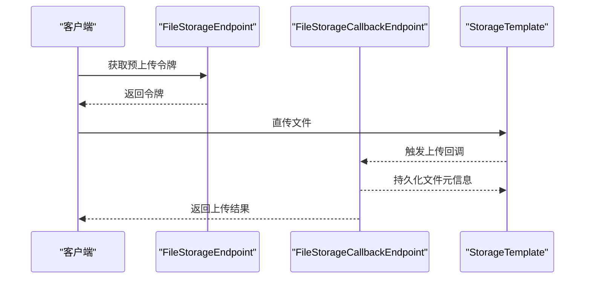
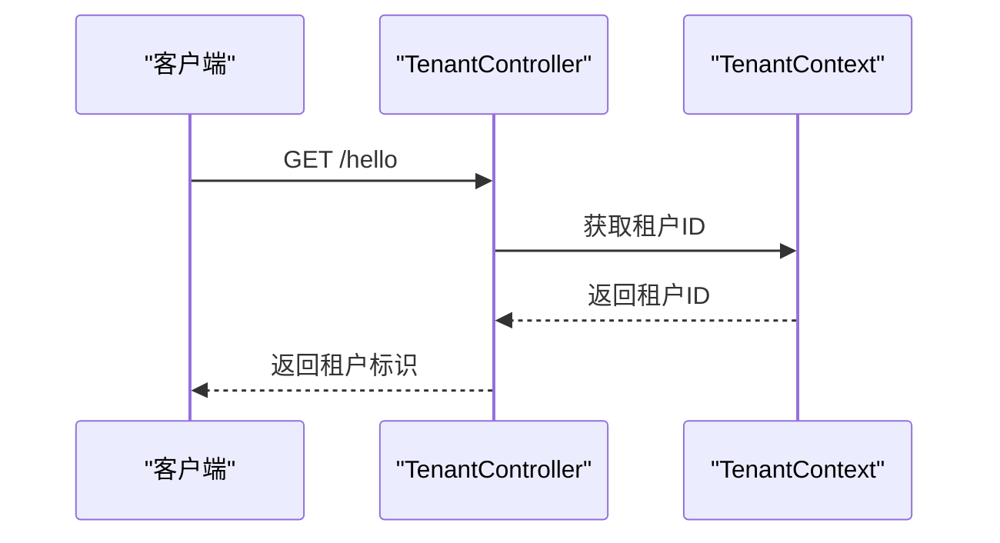
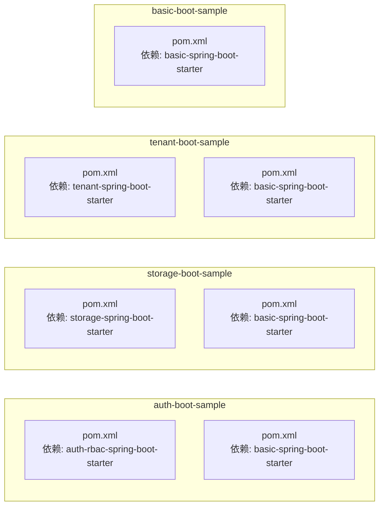

# 示例应用

<cite>
**本文引用的文件**
- [README.md](file://sample/auth-boot-sample/README.md)
- [AuthBootSampleApp.java](file://sample/auth-boot-sample/src/main/java/com/kewen/framework/auth/sample/AuthBootSampleApp.java)
- [TestAuthAnnotationController.java](file://sample/auth-boot-sample/src/main/java/com/kewen/framework/auth/sample/controller/TestAuthAnnotationController.java)
- [MeetingRoomController.java](file://sample/auth-boot-sample/src/main/java/com/kewen/framework/auth/sample/controller/MeetingRoomController.java)
- [application.yml](file://sample/auth-boot-sample/src/main/resources/application.yml)
- [SampleBasicBootApp.java](file://sample/basic-boot-sample/src/main/java/com/kewen/framework/sample/basic/SampleBasicBootApp.java)
- [application.yml](file://sample/basic-boot-sample/src/main/resources/application.yml)
- [StorageBootSample.java](file://sample/storage-boot-sample/src/main/java/com/kewen/framework/sample/storage/StorageBootSample.java)
- [application.yml](file://sample/storage-boot-sample/src/main/resources/application.yml)
- [TenantSampleApp.java](file://sample/tenant-boot-sample/src/main/java/com/kewen/framework/sample/tenant/TenantSampleApp.java)
- [TenantController.java](file://sample/tenant-boot-sample/src/main/java/com/kewen/framework/sample/tenant/controller/TenantController.java)
- [application.yml](file://sample/tenant-boot-sample/src/main/resources/application.yml)
- [pom.xml](file://sample/auth-boot-sample/pom.xml)
- [pom.xml](file://sample/basic-boot-sample/pom.xml)
- [pom.xml](file://sample/storage-boot-sample/pom.xml)
- [pom.xml](file://sample/tenant-boot-sample/pom.xml)
</cite>

## 目录
1. [简介](#简介)
2. [项目结构](#项目结构)
3. [核心组件](#核心组件)
4. [架构总览](#架构总览)
5. [详细组件分析](#详细组件分析)
6. [依赖分析](#依赖分析)
7. [性能考虑](#性能考虑)
8. [故障排查指南](#故障排查指南)
9. [结论](#结论)
10. [附录](#附录)

## 简介
本指南聚焦于四个示例应用模块，帮助开发者快速理解并实践框架在真实业务中的使用方式：
- auth-boot-sample：权限管理示例，涵盖权限注解、RBAC 控制器与测试用例。
- storage-boot-sample：文件存储示例，涵盖上传流程、回调处理与预上传令牌。
- tenant-boot-sample：多租户示例，涵盖租户上下文使用与配置方法。
- basic-boot-sample：基础功能示例，展示通用能力与配置。

## 项目结构
示例应用采用按功能划分的模块化组织方式，每个示例模块包含独立的启动类、配置文件与最小可运行示例，便于对照学习与快速验证。

图表来源
- [AuthBootSampleApp.java:1-13](file://sample/auth-boot-sample/src/main/java/com/kewen/framework/auth/sample/AuthBootSampleApp.java#L1-L13)
- [StorageBootSample.java:1-12](file://sample/storage-boot-sample/src/main/java/com/kewen/framework/sample/storage/StorageBootSample.java#L1-L12)
- [TenantSampleApp.java:1-11](file://sample/tenant-boot-sample/src/main/java/com/kewen/framework/sample/tenant/TenantSampleApp.java#L1-L11)
- [SampleBasicBootApp.java:1-11](file://sample/basic-boot-sample/src/main/java/com/kewen/framework/sample/basic/SampleBasicBootApp.java#L1-L11)

章节来源
- [pom.xml:1-27](file://sample/auth-boot-sample/pom.xml#L1-L27)
- [pom.xml:1-31](file://sample/storage-boot-sample/pom.xml#L1-L31)
- [pom.xml:1-33](file://sample/tenant-boot-sample/pom.xml#L1-L33)
- [pom.xml:1-27](file://sample/basic-boot-sample/pom.xml#L1-L27)

## 核心组件
- 权限注解与 RBAC 控制器：通过注解驱动的权限校验与数据范围适配，结合分页转换器实现细粒度权限控制。
- 文件存储服务：提供上传、回调与预上传令牌能力，支持多种存储后端（示例中配置为七牛云）。
- 多租户上下文：通过上下文持有租户标识，贯穿请求链路，实现租户隔离。
- 基础能力：统一响应、日志、异常处理、序列化与异步任务等通用能力。

章节来源
- [TestAuthAnnotationController.java:1-109](file://sample/auth-boot-sample/src/main/java/com/kewen/framework/auth/sample/controller/TestAuthAnnotationController.java#L1-L109)
- [MeetingRoomController.java:1-101](file://sample/auth-boot-sample/src/main/java/com/kewen/framework/auth/sample/controller/MeetingRoomController.java#L1-L101)
- [TenantController.java:1-22](file://sample/tenant-boot-sample/src/main/java/com/kewen/framework/sample/tenant/controller/TenantController.java#L1-L22)
- [application.yml:1-18](file://sample/storage-boot-sample/src/main/resources/application.yml#L1-L18)

## 架构总览
示例应用遵循“启动类 + 配置 + 控制器 + 服务”的典型 Spring Boot 结构，通过 Starter 自动装配启用相应能力，并在控制器中以注解方式声明权限与数据范围。

图表来源
- [AuthBootSampleApp.java:1-13](file://sample/auth-boot-sample/src/main/java/com/kewen/framework/auth/sample/AuthBootSampleApp.java#L1-L13)
- [TestAuthAnnotationController.java:1-109](file://sample/auth-boot-sample/src/main/java/com/kewen/framework/auth/sample/controller/TestAuthAnnotationController.java#L1-L109)
- [MeetingRoomController.java:1-101](file://sample/auth-boot-sample/src/main/java/com/kewen/framework/auth/sample/controller/MeetingRoomController.java#L1-L101)
- [application.yml:1-55](file://sample/auth-boot-sample/src/main/resources/application.yml#L1-L55)
- [StorageBootSample.java:1-12](file://sample/storage-boot-sample/src/main/java/com/kewen/framework/sample/storage/StorageBootSample.java#L1-L12)
- [application.yml:1-18](file://sample/storage-boot-sample/src/main/resources/application.yml#L1-L18)
- [TenantSampleApp.java:1-11](file://sample/tenant-boot-sample/src/main/java/com/kewen/framework/sample/tenant/TenantSampleApp.java#L1-L11)
- [TenantController.java:1-22](file://sample/tenant-boot-sample/src/main/java/com/kewen/framework/sample/tenant/controller/TenantController.java#L1-L22)
- [application.yml:1-13](file://sample/tenant-boot-sample/src/main/resources/application.yml#L1-L13)
- [SampleBasicBootApp.java:1-11](file://sample/basic-boot-sample/src/main/java/com/kewen/framework/sample/basic/SampleBasicBootApp.java#L1-L11)
- [application.yml:1-30](file://sample/basic-boot-sample/src/main/resources/application.yml#L1-L30)

## 详细组件分析

### 权限管理示例（auth-boot-sample）
- 功能特点
  - 注解驱动的权限控制：支持菜单权限与数据操作权限，结合数据范围注解限制可见数据集。
  - RBAC 控制器：通过常量定义业务功能与操作类型，结合分页转换器与数据适配器实现权限填充与校验。
  - 测试用例：提供注解使用与权限范围的最小可运行示例，便于验证权限生效。

- 关键注解与控制器
  - 数据范围注解：用于限定查询结果的数据范围。
  - 数据操作注解：用于校验对具体数据的操作权限。
  - 菜单注解：用于校验接口级菜单权限。
  - RBAC 控制器：集中处理会议室信息的编辑、分页查询与权限填充。

- 使用场景
  - 会议室管理：创建、删除、编辑、预约等操作，分别绑定不同业务功能与操作类型。
  - 数据权限分离：通过菜单权限控制增删改，通过数据权限控制编辑与预约。

- 运行指南
  - 初始化数据库：参考示例工程说明，执行初始化 SQL。
  - 配置数据库连接与安全参数：在 application.yml 中配置数据源与认证相关属性。
  - 启动应用：运行启动类，访问示例接口验证权限效果。

图表来源
- [TestAuthAnnotationController.java:37-94](file://sample/auth-boot-sample/src/main/java/com/kewen/framework/auth/sample/controller/TestAuthAnnotationController.java#L37-L94)

图表来源
- [MeetingRoomController.java:69-98](file://sample/auth-boot-sample/src/main/java/com/kewen/framework/auth/sample/controller/MeetingRoomController.java#L69-L98)

章节来源
- [README.md:1-289](file://sample/auth-boot-sample/README.md#L1-L289)
- [application.yml:1-55](file://sample/auth-boot-sample/src/main/resources/application.yml#L1-L55)
- [TestAuthAnnotationController.java:1-109](file://sample/auth-boot-sample/src/main/java/com/kewen/framework/auth/sample/controller/TestAuthAnnotationController.java#L1-L109)
- [MeetingRoomController.java:1-101](file://sample/auth-boot-sample/src/main/java/com/kewen/framework/auth/sample/controller/MeetingRoomController.java#L1-L101)

### 文件存储示例（storage-boot-sample）
- 功能特点
  - 上传流程：提供上传端点与回调端点，支持上传后回调通知。
  - 预上传令牌：生成预上传令牌，用于客户端直传场景。
  - 存储配置：示例中配置为七牛云，包含访问密钥、桶名、域名与回调地址。

- 使用场景
  - 客户端直传：通过预上传令牌实现前端直传，后端接收回调并持久化文件元信息。
  - 回调处理：在回调中完成文件入库与状态更新。

- 运行指南
  - 配置存储参数：在 application.yml 中配置存储类型与凭证。
  - 启动应用：运行启动类，访问上传与回调端点进行验证。

图表来源
- [application.yml:1-18](file://sample/storage-boot-sample/src/main/resources/application.yml#L1-L18)

章节来源
- [application.yml:1-18](file://sample/storage-boot-sample/src/main/resources/application.yml#L1-L18)

### 多租户示例（tenant-boot-sample）
- 功能特点
  - 租户上下文：通过上下文获取当前请求所属租户 ID，贯穿请求链路。
  - 配置开关：通过配置开启多租户能力，拦截器自动注入租户头信息。

- 使用场景
  - 多租户隔离：在查询与写入时根据租户 ID 进行数据隔离。
  - 租户路由：在微服务间传递租户上下文，确保跨服务一致性。

- 运行指南
  - 开启租户开关：在 application.yml 中启用租户功能。
  - 访问示例接口：通过控制器读取租户上下文，验证多租户生效。

图表来源
- [TenantController.java:16-20](file://sample/tenant-boot-sample/src/main/java/com/kewen/framework/sample/tenant/controller/TenantController.java#L16-L20)

章节来源
- [application.yml:1-13](file://sample/tenant-boot-sample/src/main/resources/application.yml#L1-L13)
- [TenantController.java:1-22](file://sample/tenant-boot-sample/src/main/java/com/kewen/framework/sample/tenant/controller/TenantController.java#L1-L22)

### 基础功能示例（basic-boot-sample）
- 功能特点
  - 统一响应与异常处理：提供标准响应模型与全局异常处理。
  - 日志与追踪：内置请求日志与链路追踪能力。
  - 异步任务与序列化：提供异步任务与序列化配置示例。

- 使用场景
  - 快速搭建：作为其他模块的基础设施，提供通用能力。
  - 配置参考：作为 Starter 的使用范例，便于迁移与扩展。

- 运行指南
  - 配置数据源与日志：在 application.yml 中配置数据源与日志输出。
  - 启动应用：运行启动类，观察日志与响应格式。

章节来源
- [application.yml:1-30](file://sample/basic-boot-sample/src/main/resources/application.yml#L1-L30)

## 依赖分析
示例模块均通过 Maven 引入相应的 Starter，实现自动装配与能力启用。

图表来源
- [pom.xml:20-25](file://sample/auth-boot-sample/pom.xml#L20-L25)
- [pom.xml:20-29](file://sample/storage-boot-sample/pom.xml#L20-L29)
- [pom.xml:20-30](file://sample/tenant-boot-sample/pom.xml#L20-L30)
- [pom.xml:20-25](file://sample/basic-boot-sample/pom.xml#L20-L25)

章节来源
- [pom.xml:1-27](file://sample/auth-boot-sample/pom.xml#L1-L27)
- [pom.xml:1-31](file://sample/storage-boot-sample/pom.xml#L1-L31)
- [pom.xml:1-33](file://sample/tenant-boot-sample/pom.xml#L1-L33)
- [pom.xml:1-27](file://sample/basic-boot-sample/pom.xml#L1-L27)

## 性能考虑
- 数据库连接池：合理配置连接池大小与超时时间，避免高并发下的连接争用。
- 缓存策略：对于频繁访问的权限数据，可考虑启用缓存以降低查询开销。
- 日志级别：生产环境建议调整日志级别，避免过多调试日志影响性能。
- 异步处理：对于耗时操作（如文件上传回调），建议采用异步处理提升吞吐。

## 故障排查指南
- 权限未生效
  - 检查注解使用是否正确，确认业务功能与操作类型匹配。
  - 核对菜单权限与数据权限映射是否完整。
- 上传失败
  - 检查存储凭证与回调地址配置是否正确。
  - 关注回调端点是否可达，日志是否记录异常。
- 多租户隔离异常
  - 确认租户开关已开启，请求头是否携带租户信息。
  - 检查上下文读取逻辑，确保租户 ID 正确传递。

章节来源
- [application.yml:31-55](file://sample/auth-boot-sample/src/main/resources/application.yml#L31-L55)
- [application.yml:9-18](file://sample/storage-boot-sample/src/main/resources/application.yml#L9-L18)
- [application.yml:9-13](file://sample/tenant-boot-sample/src/main/resources/application.yml#L9-L13)

## 结论
通过四个示例应用，开发者可以系统地掌握框架在权限管理、文件存储、多租户与基础能力方面的实际应用。建议从 basic-boot-sample 入手，逐步过渡到 auth-boot-sample、storage-boot-sample 与 tenant-boot-sample，结合注释与配置文件完成本地验证与二次开发。

## 附录
- 快速启动步骤
  - auth-boot-sample：初始化数据库 → 配置 application.yml → 启动 AuthBootSampleApp.java → 访问示例接口。
  - storage-boot-sample：配置存储参数 → 启动 StorageBootSample.java → 调用上传与回调端点。
  - tenant-boot-sample：开启租户开关 → 启动 TenantSampleApp.java → 访问 /hello 验证租户上下文。
  - basic-boot-sample：配置数据源与日志 → 启动 SampleBasicBootApp.java → 观察日志与响应。