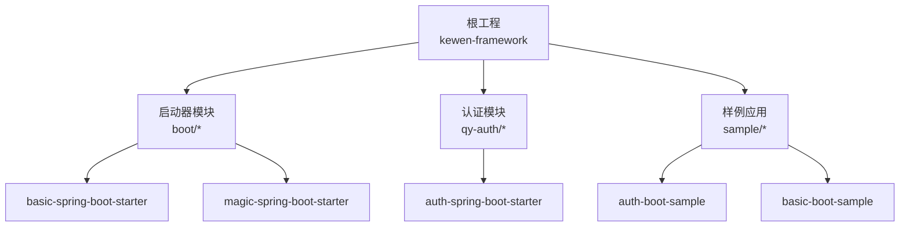
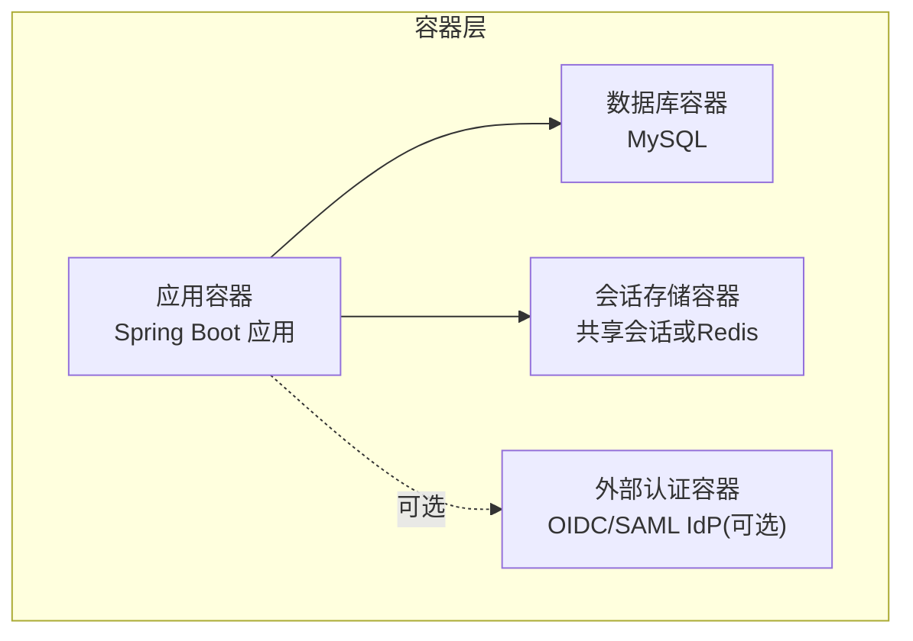
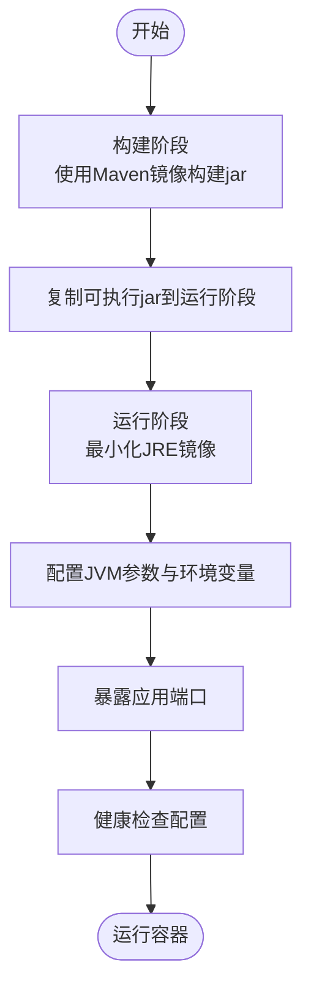
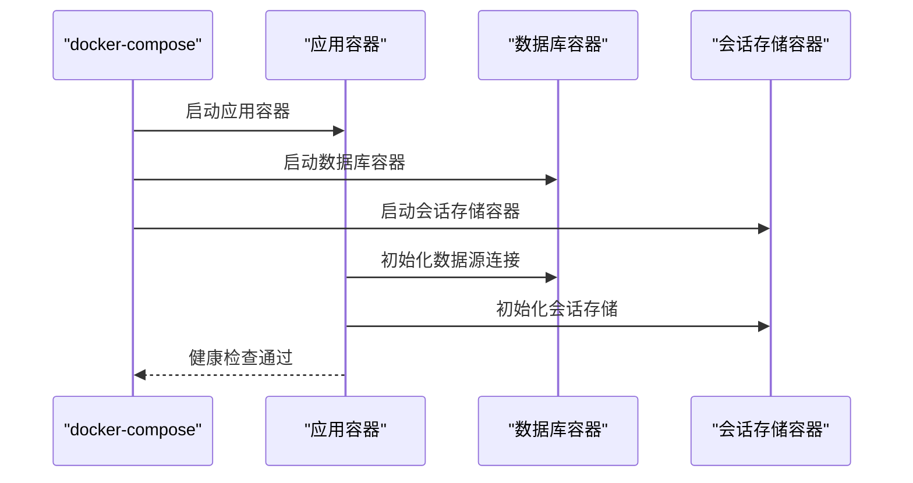
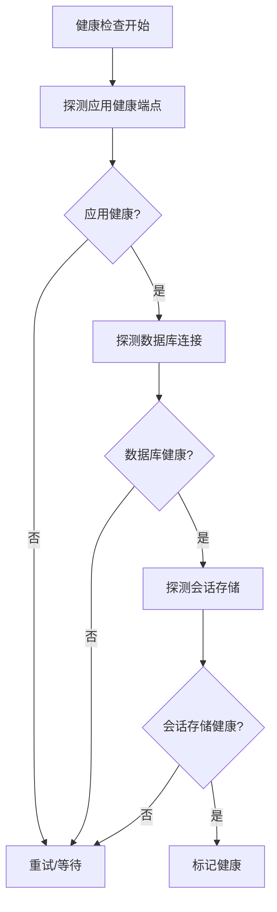
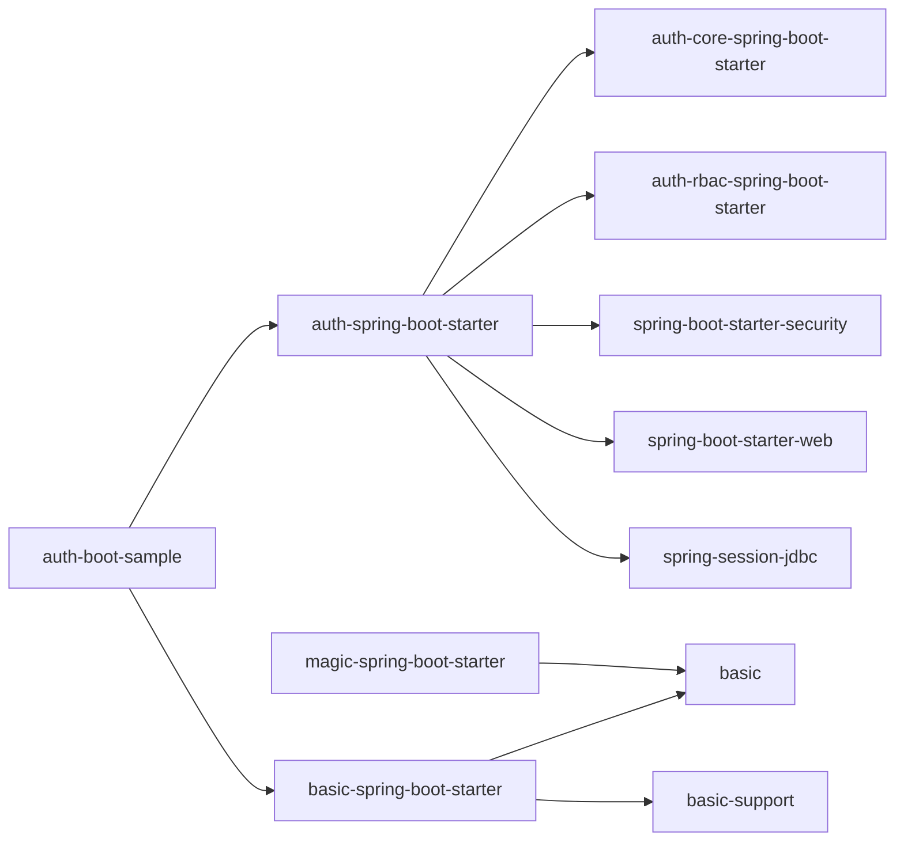

# Docker容器化部署

<cite>
**本文引用的文件**
- [pom.xml](file://pom.xml)
- [application.yml](file://application.yml)
- [sample/auth-boot-sample/pom.xml](file://sample/auth-boot-sample/pom.xml)
- [sample/auth-boot-sample/src/main/resources/application.yml](file://sample/auth-boot-sample/src/main/resources/application.yml)
- [sample/auth-boot-sample/src/main/java/com/kewen/framework/auth/sample/AuthBootSampleApp.java](file://sample/auth-boot-sample/src/main/java/com/kewen/framework/auth/sample/AuthBootSampleApp.java)
- [boot/magic-spring-boot-starter/pom.xml](file://boot/magic-spring-boot-starter/pom.xml)
- [boot/magic-spring-boot-starter/src/main/java/com/kewen/framework/boot/magic/SampleMagicApiApp.java](file://boot/magic-spring-boot-starter/src/main/java/com/kewen/framework/boot/magic/SampleMagicApiApp.java)
- [boot/basic-spring-boot-starter/pom.xml](file://boot/basic-spring-boot-starter/pom.xml)
- [qy-auth/auth-spring-boot-starter/pom.xml](file://qy-auth/auth-spring-boot-starter/pom.xml)
- [qy-idaas/README.md](file://qy-idaas/README.md)
</cite>

## 目录
1. [简介](#简介)
2. [项目结构](#项目结构)
3. [核心组件](#核心组件)
4. [架构总览](#架构总览)
5. [详细组件分析](#详细组件分析)
6. [依赖关系分析](#依赖关系分析)
7. [性能与构建优化](#性能与构建优化)
8. [故障排查指南](#故障排查指南)
9. [结论](#结论)
10. [附录](#附录)

## 简介
本指南面向kewen-framework项目，提供完整的Docker容器化部署方案，涵盖以下要点：
- 基于Maven构建的Spring Boot应用打包与运行时配置
- 多阶段构建策略，降低镜像体积并提升构建效率
- docker-compose服务编排、网络与卷挂载、环境变量设置
- 健康检查、监控与日志采集建议
- 容器扩容与负载均衡部署策略
- 安全加固最佳实践

## 项目结构
kewen-framework采用多模块Maven聚合工程，核心业务与样例应用位于sample目录，启动器模块位于boot与qy-auth等模块。Spring Boot应用通过spring-boot-maven-plugin插件生成可执行的fat jar，并在容器内以Java进程方式运行。

图表来源
- [pom.xml:1-279](file://pom.xml#L1-L279)
- [boot/basic-spring-boot-starter/pom.xml:1-62](file://boot/basic-spring-boot-starter/pom.xml#L1-L62)
- [boot/magic-spring-boot-starter/pom.xml:1-44](file://boot/magic-spring-boot-starter/pom.xml#L1-L44)
- [qy-auth/auth-spring-boot-starter/pom.xml:1-68](file://qy-auth/auth-spring-boot-starter/pom.xml#L1-L68)
- [sample/auth-boot-sample/pom.xml:1-99](file://sample/auth-boot-sample/pom.xml#L1-L99)

章节来源
- [pom.xml:1-279](file://pom.xml#L1-L279)

## 核心组件
- 应用打包与运行
  - 使用spring-boot-maven-plugin生成可执行jar，主类在各sample模块中定义，例如AuthBootSampleApp。
  - 运行时端口在sample模块的application.yml中配置，默认为8081；生产环境可通过环境变量覆盖。
- 数据源与会话
  - 示例应用使用Hikari连接池与JDBC存储会话；生产环境建议使用外部数据库与共享会话存储。
- 安全与认证
  - 认证模块提供基于Spring Security的安全配置与会话管理；支持OAuth2/OIDC与SAML集成示例。

章节来源
- [sample/auth-boot-sample/pom.xml:76-99](file://sample/auth-boot-sample/pom.xml#L76-L99)
- [sample/auth-boot-sample/src/main/resources/application.yml:1-55](file://sample/auth-boot-sample/src/main/resources/application.yml#L1-L55)
- [sample/auth-boot-sample/src/main/java/com/kewen/framework/auth/sample/AuthBootSampleApp.java:1-13](file://sample/auth-boot-sample/src/main/java/com/kewen/framework/auth/sample/AuthBootSampleApp.java#L1-L13)
- [qy-auth/auth-spring-boot-starter/pom.xml:1-68](file://qy-auth/auth-spring-boot-starter/pom.xml#L1-L68)
- [application.yml:1-32](file://application.yml#L1-L32)

## 架构总览
下图展示容器化部署的整体架构：应用容器、数据库容器、会话存储容器以及外部认证系统（可选）之间的交互。

## 详细组件分析

### 应用镜像构建与运行
- 基础镜像选择
  - 建议使用官方OpenJDK镜像作为基础镜像，确保JDK版本与项目一致（当前项目源码编译级别为Java 8）。
- 多阶段构建策略
  - 第一阶段：使用Maven镜像构建可执行jar。
  - 第二阶段：将jar复制到最小化运行时镜像（如Alpine或Debian Slim），仅保留运行所需的JRE。
- 运行时配置
  - 主类与打包布局在spring-boot-maven-plugin中配置，确保容器内能直接以java -jar方式启动。
  - 端口映射与环境变量在docker-compose中配置，避免硬编码在应用内。

章节来源
- [sample/auth-boot-sample/pom.xml:76-99](file://sample/auth-boot-sample/pom.xml#L76-L99)
- [boot/magic-spring-boot-starter/pom.xml:1-44](file://boot/magic-spring-boot-starter/pom.xml#L1-L44)

### docker-compose服务编排
- 服务编排
  - 定义应用服务、数据库服务、会话存储服务（如Redis/JDBC）。
- 网络配置
  - 使用自定义桥接网络隔离服务间通信。
- 卷挂载
  - 日志目录挂载到宿主机，便于采集与持久化。
- 环境变量
  - 通过环境变量传递数据库连接信息、会话存储配置、应用端口与安全参数。

### 健康检查配置
- 健康检查策略
  - 使用HTTP GET请求访问应用的健康端点（如/actuator/health），检测应用就绪状态。
  - 对数据库与会话存储进行探针检查，确保依赖可用后再标记应用健康。
- 建议
  - 将健康检查路径与端口通过环境变量配置，避免硬编码。

### 监控与日志采集
- 监控
  - 在应用中启用Actuator端点，暴露指标与健康信息。
  - 结合Prometheus与Grafana进行指标采集与可视化。
- 日志
  - 将日志输出到标准输出与文件，结合Fluent Bit/Fluentd/Logstash进行集中采集。
  - 建议将日志目录挂载到宿主机，便于备份与审计。

### 扩容与负载均衡
- 扩容策略
  - 使用副本数扩展应用实例，配合会话存储实现无状态扩展。
- 负载均衡
  - 使用反向代理（如Nginx/K8s Ingress）分发流量至多个应用实例。
  - 健康检查失败的实例自动摘除，保障用户体验。

### 安全加固
- 最小权限原则
  - 运行容器使用非root用户，限制文件系统权限。
- 依赖与镜像安全
  - 定期更新基础镜像与依赖库，扫描漏洞。
- 网络与访问控制
  - 仅开放必要端口，使用防火墙与网络策略限制访问。
- 敏感信息
  - 使用环境变量或密钥管理服务注入数据库密码、认证密钥等敏感信息。

## 依赖关系分析
kewen-framework的依赖关系主要体现在启动器模块对基础能力的封装，以及样例应用对启动器的依赖。下图展示了关键模块间的依赖关系。

图表来源
- [boot/basic-spring-boot-starter/pom.xml:1-62](file://boot/basic-spring-boot-starter/pom.xml#L1-L62)
- [qy-auth/auth-spring-boot-starter/pom.xml:1-68](file://qy-auth/auth-spring-boot-starter/pom.xml#L1-L68)
- [boot/magic-spring-boot-starter/pom.xml:1-44](file://boot/magic-spring-boot-starter/pom.xml#L1-L44)
- [sample/auth-boot-sample/pom.xml:1-99](file://sample/auth-boot-sample/pom.xml#L1-L99)

章节来源
- [pom.xml:1-279](file://pom.xml#L1-L279)

## 性能与构建优化
- 多阶段构建
  - 显著减小最终镜像体积，缩短拉取时间，提升部署效率。
- 缓存优化
  - Maven构建阶段利用镜像层缓存，优先下载依赖，再复制构建产物。
- JVM参数
  - 在容器内设置合理的堆大小与GC参数，避免内存不足导致频繁Full GC。
- 并发与资源
  - 合理设置容器CPU与内存限制，避免资源争用影响吞吐量。

## 故障排查指南
- 健康检查失败
  - 检查应用健康端点是否可达，确认数据库与会话存储连接正常。
- 启动异常
  - 查看容器日志，定位依赖缺失或配置错误；确认JDK版本与应用兼容。
- 性能问题
  - 关注GC日志与线程池状态，评估JVM参数与并发配置是否合理。

## 结论
通过多阶段构建与合理的容器编排，kewen-framework可在Docker环境中实现高效、稳定、安全的部署。结合健康检查、监控与日志采集，可进一步提升运维效率与可观测性。按需进行水平扩展与负载均衡，可满足高可用与弹性需求。

## 附录
- 端口与环境变量建议
  - 应用端口：通过环境变量PORT或在Dockerfile EXPOSE中声明。
  - 数据库连接：DB_URL、DB_USER、DB_PASSWORD。
  - 会话存储：REDIS_URL或JDBC会话配置。
- 认证集成参考
  - OIDC/OAuth2与SAML配置可参考qy-idaas模块中的配置说明与示例。

章节来源
- [application.yml:1-32](file://application.yml#L1-L32)
- [qy-idaas/README.md:37-99](file://qy-idaas/README.md#L37-L99)