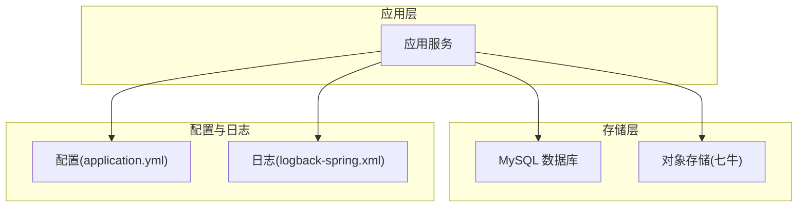
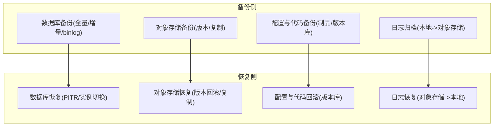
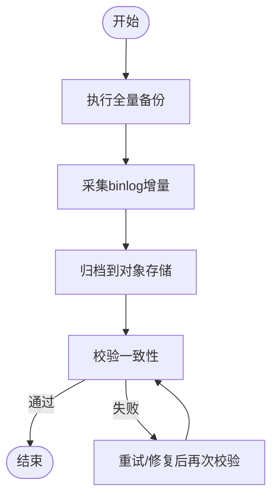
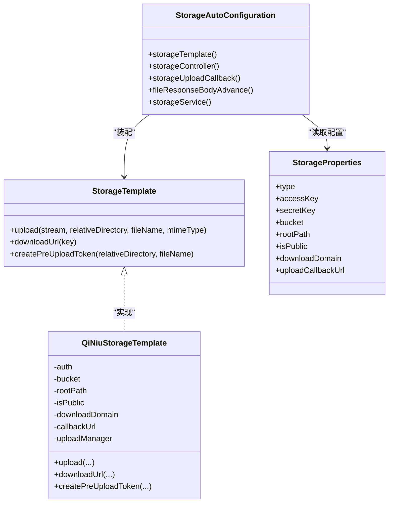
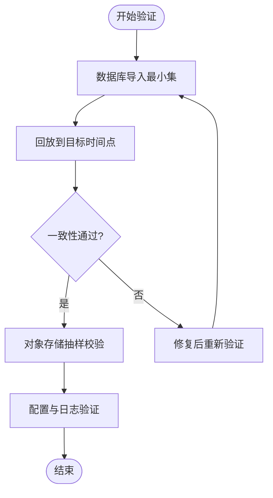
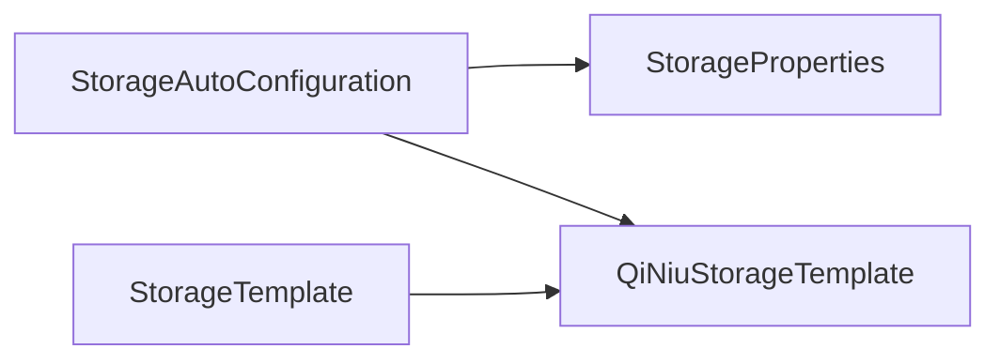

# 备份与恢复

<cite>
**本文引用的文件**
- [application.yml](file://application.yml)
- [StorageAutoConfiguration.java](file://boot/storage-spring-boot-starter/src/main/java/com/kewen/framework/storage/boot/StorageAutoConfiguration.java)
- [StorageProperties.java](file://boot/storage-spring-boot-starter/src/main/java/com/kewen/framework/storage/boot/StorageProperties.java)
- [QiNiuStorageTemplate.java](file://boot/storage-spring-boot-starter/src/main/java/com/kewen/framework/storage/core/qiniu/QiNiuStorageTemplate.java)
- [StorageTemplate.java](file://boot/storage-spring-boot-starter/src/main/java/com/kewen/framework/storage/core/StorageTemplate.java)
- [storage.sql](file://docs/sql/storage.sql)
- [auth_full.sql](file://qy-auth/relation/sql/auth_full.sql)
- [application-dev.yml](file://sample/auth-boot-sample/src/main/resources/application-dev.yml)
- [logback-spring.xml](file://sample/auth-boot-sample/src/main/resources/logback-spring.xml)
- [application.yml（文档示例）](file://docs/application.yml)
</cite>

## 目录
1. [简介](#简介)
2. [项目结构](#项目结构)
3. [核心组件](#核心组件)
4. [架构总览](#架构总览)
5. [详细组件分析](#详细组件分析)
6. [依赖分析](#依赖分析)
7. [性能考量](#性能考量)
8. [故障排查指南](#故障排查指南)
9. [结论](#结论)
10. [附录](#附录)

## 简介
本指南面向 kewen-framework 的运维与开发团队，提供一套可落地的“备份与恢复”策略，覆盖数据库、对象存储、配置与日志、以及灾难恢复目标（RTO/RPO）。内容结合仓库中已有的数据库结构、对象存储实现与配置样例，给出可执行的策略步骤、验证方法、自动化脚本思路与安全加固建议。

## 项目结构
围绕备份与恢复的关键位置如下：
- 数据库：权限与用户相关表结构位于 auth_full.sql；文件元数据与分片信息位于 storage.sql。
- 对象存储：通过 StorageAutoConfiguration 与 QiNiuStorageTemplate 实现，配置项由 StorageProperties 提供。
- 配置与日志：application.yml 与 docs/application.yml 展示了框架级配置；日志配置位于 logback-spring.xml。
- 示例环境：sample/auth-boot-sample 提供数据库连接与日志落盘示例。

**章节来源**
- [application.yml:1-32](file://application.yml#L1-L32)
- [storage.sql:1-45](file://docs/sql/storage.sql#L1-L45)
- [auth_full.sql:1-190](file://qy-auth/relation/sql/auth_full.sql#L1-L190)
- [StorageAutoConfiguration.java:1-71](file://boot/storage-spring-boot-starter/src/main/java/com/kewen/framework/storage/boot/StorageAutoConfiguration.java#L1-L71)
- [QiNiuStorageTemplate.java:1-151](file://boot/storage-spring-boot-starter/src/main/java/com/kewen/framework/storage/core/qiniu/QiNiuStorageTemplate.java#L1-L151)
- [logback-spring.xml:1-36](file://sample/auth-boot-sample/src/main/resources/logback-spring.xml#L1-L36)

## 核心组件
- 数据库备份
  - 全量备份：基于 mysqldump 的定时任务，按天生成压缩包并保留多代。
  - 增量备份：基于 binlog 的增量采集与回放，配合时间点恢复（PITR）。
  - 实时备份：结合数据库高可用（主从/集群）与自动切换，确保 RTO 最小化。
- 对象存储备份
  - 七牛对象存储作为主存储，结合版本控制与跨区域复制（若供应商支持）。
  - 本地缓存与 CDN 缓存需纳入恢复验证范围。
- 配置与代码备份
  - 配置文件与应用代码纳入版本库与制品库管理，定期快照与差异对比。
- 日志备份
  - 本地滚动日志按天切割并保留30天，建议异地归档至对象存储。
- 灾难恢复目标
  - RPO：全量+增量+binlog，目标小于15分钟；实时备份目标为秒级RTO。
  - RTO：结合高可用与自动化切换，目标小于10分钟。

**章节来源**
- [application.yml:1-32](file://application.yml#L1-L32)
- [storage.sql:1-45](file://docs/sql/storage.sql#L1-L45)
- [auth_full.sql:1-190](file://qy-auth/relation/sql/auth_full.sql#L1-L190)
- [StorageAutoConfiguration.java:1-71](file://boot/storage-spring-boot-starter/src/main/java/com/kewen/framework/storage/boot/StorageAutoConfiguration.java#L1-L71)
- [QiNiuStorageTemplate.java:1-151](file://boot/storage-spring-boot-starter/src/main/java/com/kewen/framework/storage/core/qiniu/QiNiuStorageTemplate.java#L1-L151)
- [logback-spring.xml:1-36](file://sample/auth-boot-sample/src/main/resources/logback-spring.xml#L1-L36)

## 架构总览
下图展示备份与恢复涉及的组件交互与数据流向：

## 详细组件分析

### 数据库备份策略
- 全量备份
  - 工具：mysqldump（建议启用 --single-transaction --routines --triggers）。
  - 规则：每日23:00执行，压缩并命名含日期，保留最近14天。
  - 存储：本地保留短期，远端对象存储长期归档。
- 增量备份
  - 工具：binlog 增量采集（mysqlbinlog），按小时/分钟切分。
  - 规则：每15分钟生成一次增量文件，保留7天。
- 实时备份
  - 方案：主从复制+自动切换（半同步/GTID），结合逻辑备份作为兜底。
  - 验证：定期校验 binlog 与全量一致性。
- 时间点恢复（PITR）
  - 步骤：定位目标时间点对应的全量与binlog，顺序回放到目标时间。
  - 风险：避免在高峰期执行，预留回放窗口与回滚预案。

**章节来源**
- [auth_full.sql:1-190](file://qy-auth/relation/sql/auth_full.sql#L1-L190)
- [storage.sql:1-45](file://docs/sql/storage.sql#L1-L45)
- [application-dev.yml:1-6](file://sample/auth-boot-sample/src/main/resources/application-dev.yml#L1-L6)

### 对象存储备份与版本控制
- 存储实现
  - 通过 StorageAutoConfiguration 注入 StorageTemplate，使用 QiNiuStorageTemplate 完成上传、下载与预签名。
  - 配置项由 StorageProperties 提供，包括 accessKey、secretKey、bucket、downloadDomain、uploadCallbackUrl 等。
- 版本控制与安全
  - 建议启用对象存储版本控制，保留历史版本以便回滚。
  - 下载链接支持公开/私有模式，私有链接带有效期，防止泄露。
- 回调与一致性
  - 上传回调用于记录对象元信息，需纳入备份与一致性校验流程。

**图表来源**
- [StorageTemplate.java:1-23](file://boot/storage-spring-boot-starter/src/main/java/com/kewen/framework/storage/core/StorageTemplate.java#L1-L23)
- [QiNiuStorageTemplate.java:1-151](file://boot/storage-spring-boot-starter/src/main/java/com/kewen/framework/storage/core/qiniu/QiNiuStorageTemplate.java#L1-L151)
- [StorageAutoConfiguration.java:1-71](file://boot/storage-spring-boot-starter/src/main/java/com/kewen/framework/storage/boot/StorageAutoConfiguration.java#L1-L71)
- [StorageProperties.java:1-45](file://boot/storage-spring-boot-starter/src/main/java/com/kewen/framework/storage/boot/StorageProperties.java#L1-L45)

**章节来源**
- [StorageAutoConfiguration.java:1-71](file://boot/storage-spring-boot-starter/src/main/java/com/kewen/framework/storage/boot/StorageAutoConfiguration.java#L1-L71)
- [StorageProperties.java:1-45](file://boot/storage-spring-boot-starter/src/main/java/com/kewen/framework/storage/boot/StorageProperties.java#L1-L45)
- [QiNiuStorageTemplate.java:1-151](file://boot/storage-spring-boot-starter/src/main/java/com/kewen/framework/storage/core/qiniu/QiNiuStorageTemplate.java#L1-L151)

### 配置文件与应用代码备份
- 配置文件
  - application.yml 与 docs/application.yml 展示了框架级开关与参数，建议纳入版本库并建立分支保护。
  - 建议对敏感字段（如 accessKey/secretKey）使用密钥管理服务（KMS）或环境变量注入。
- 应用代码
  - 代码版本库作为基线备份，配合制品库（Artifactory/Nexus）保存构建产物。
  - 建立发布分支与热修复分支策略，确保可回滚。

**章节来源**
- [application.yml:1-32](file://application.yml#L1-L32)
- [application.yml（文档示例）:1-21](file://docs/application.yml#L1-L21)

### 日志备份与恢复
- 日志滚动
  - logback-spring.xml 定义了按天切割与大小限制的滚动策略，建议同时将日志归档到对象存储。
- 恢复验证
  - 归档后进行抽样比对与检索验证，确保完整性与可读性。

**章节来源**
- [logback-spring.xml:1-36](file://sample/auth-boot-sample/src/main/resources/logback-spring.xml#L1-L36)

### 灾难恢复计划（RTO/RPO）
- RPO 目标
  - 全量+binlog 增量，目标小于15分钟；关键业务可引入实时备份（主从/集群）。
- RTO 目标
  - 通过高可用与自动化切换，目标小于10分钟；演练季度一次。
- 演练与文档
  - 制定演练脚本与回放清单，记录每次演练结果与改进项。

**章节来源**
- [auth_full.sql:1-190](file://qy-auth/relation/sql/auth_full.sql#L1-L190)
- [storage.sql:1-45](file://docs/sql/storage.sql#L1-L45)

### 备份数据验证与测试
- 数据库
  - 校验：导入最小化测试库，核对表结构与关键数据条数。
  - PITR：在隔离环境回放至目标时间点，验证一致性。
- 对象存储
  - 校验：随机抽取对象下载并校验哈希，验证版本回滚。
- 配置与日志
  - 校验：拉起最小化实例，验证配置生效与日志输出。

**章节来源**
- [auth_full.sql:1-190](file://qy-auth/relation/sql/auth_full.sql#L1-L190)
- [QiNiuStorageTemplate.java:1-151](file://boot/storage-spring-boot-starter/src/main/java/com/kewen/framework/storage/core/qiniu/QiNiuStorageTemplate.java#L1-L151)
- [logback-spring.xml:1-36](file://sample/auth-boot-sample/src/main/resources/logback-spring.xml#L1-L36)

### 自动化备份脚本与调度
- 数据库
  - 全量：cron 每晚执行 mysqldump，压缩并上传对象存储。
  - 增量：每15分钟扫描 binlog，生成增量文件并上传。
- 对象存储
  - 上传脚本封装 StorageTemplate 的上传能力，统一鉴权与回调。
- 配置与日志
  - 配置文件与日志归档脚本纳入 CI/CD 流水线，触发条件为发布或定时。

**章节来源**
- [StorageTemplate.java:1-23](file://boot/storage-spring-boot-starter/src/main/java/com/kewen/framework/storage/core/StorageTemplate.java#L1-L23)
- [QiNiuStorageTemplate.java:1-151](file://boot/storage-spring-boot-starter/src/main/java/com/kewen/framework/storage/core/qiniu/QiNiuStorageTemplate.java#L1-L151)

### 数据迁移与升级的备份策略
- 升级前
  - 执行一次全量备份与一次 binlog 增量，冻结写入窗口。
- 升级中
  - 采用蓝绿/灰度发布，保留回滚分支。
- 升级后
  - 快速验证与回归测试，确认无数据丢失与权限一致。

**章节来源**
- [auth_full.sql:1-190](file://qy-auth/relation/sql/auth_full.sql#L1-L190)
- [storage.sql:1-45](file://docs/sql/storage.sql#L1-L45)

### 备份数据的安全存储与访问控制
- 访问控制
  - 对象存储：私有桶+预签名链接，限制有效期；对配置文件与日志进行最小权限访问。
- 加密
  - 传输加密：TLS；静态加密：对象存储端加密或客户端加密。
- 审计
  - 记录备份与恢复操作日志，定期审计访问与变更。

**章节来源**
- [QiNiuStorageTemplate.java:1-151](file://boot/storage-spring-boot-starter/src/main/java/com/kewen/framework/storage/core/qiniu/QiNiuStorageTemplate.java#L1-L151)
- [StorageProperties.java:1-45](file://boot/storage-spring-boot-starter/src/main/java/com/kewen/framework/storage/boot/StorageProperties.java#L1-L45)

## 依赖分析
- 组件耦合
  - StorageAutoConfiguration 依赖 StorageProperties 与 QiNiuStorageTemplate，形成清晰的装配链。
  - StorageTemplate 为抽象接口，便于替换不同存储实现。
- 外部依赖
  - 数据库：MySQL（示例配置见 application-dev.yml）。
  - 对象存储：七牛（通过 QiNiuStorageTemplate 集成）。

**图表来源**
- [StorageAutoConfiguration.java:1-71](file://boot/storage-spring-boot-starter/src/main/java/com/kewen/framework/storage/boot/StorageAutoConfiguration.java#L1-L71)
- [StorageProperties.java:1-45](file://boot/storage-spring-boot-starter/src/main/java/com/kewen/framework/storage/boot/StorageProperties.java#L1-L45)
- [QiNiuStorageTemplate.java:1-151](file://boot/storage-spring-boot-starter/src/main/java/com/kewen/framework/storage/core/qiniu/QiNiuStorageTemplate.java#L1-L151)
- [StorageTemplate.java:1-23](file://boot/storage-spring-boot-starter/src/main/java/com/kewen/framework/storage/core/StorageTemplate.java#L1-L23)

**章节来源**
- [StorageAutoConfiguration.java:1-71](file://boot/storage-spring-boot-starter/src/main/java/com/kewen/framework/storage/boot/StorageAutoConfiguration.java#L1-L71)
- [StorageProperties.java:1-45](file://boot/storage-spring-boot-starter/src/main/java/com/kewen/framework/storage/boot/StorageProperties.java#L1-L45)
- [QiNiuStorageTemplate.java:1-151](file://boot/storage-spring-boot-starter/src/main/java/com/kewen/framework/storage/core/qiniu/QiNiuStorageTemplate.java#L1-L151)
- [StorageTemplate.java:1-23](file://boot/storage-spring-boot-starter/src/main/java/com/kewen/framework/storage/core/StorageTemplate.java#L1-L23)
- [application-dev.yml:1-6](file://sample/auth-boot-sample/src/main/resources/application-dev.yml#L1-L6)

## 性能考量
- 备份窗口
  - 全量与增量尽量避开业务高峰；binlog 增量采用异步归档。
- IO 与网络
  - 对象存储上传采用分片与并发，结合 CDN 缓存热点文件。
- 恢复效率
  - 高可用实例快速接管，减少切换时间；PITR 回放在隔离环境执行。

## 故障排查指南
- 数据库
  - 症状：恢复失败或数据不一致。排查要点：binlog 是否完整、时间戳是否正确、回放顺序是否一致。
- 对象存储
  - 症状：下载链接失效或版本缺失。排查要点：私有链接有效期、版本控制开关、回调记录一致性。
- 配置与日志
  - 症状：配置未生效或日志缺失。排查要点：配置文件层级、环境变量注入、日志滚动策略。

**章节来源**
- [auth_full.sql:1-190](file://qy-auth/relation/sql/auth_full.sql#L1-L190)
- [storage.sql:1-45](file://docs/sql/storage.sql#L1-L45)
- [QiNiuStorageTemplate.java:1-151](file://boot/storage-spring-boot-starter/src/main/java/com/kewen/framework/storage/core/qiniu/QiNiuStorageTemplate.java#L1-L151)
- [logback-spring.xml:1-36](file://sample/auth-boot-sample/src/main/resources/logback-spring.xml#L1-L36)

## 结论
通过“全量+增量+binlog”的数据库备份体系、“版本控制+私有桶+预签名”的对象存储策略、以及配置与日志的统一归档与校验，kewen-framework 可实现低 RPO 与低 RTO 的可靠备份与恢复。建议将上述流程纳入 CI/CD 与值班规范，定期演练并持续优化。

## 附录
- 关键配置项参考
  - 数据库连接：见 application-dev.yml 中的 spring.datasource.*。
  - 对象存储：见 StorageProperties 字段与 StorageAutoConfiguration 装配。
  - 日志：见 logback-spring.xml 的 rollingPolicy 与 encoder。
- 参考 SQL
  - 权限与用户表结构：auth_full.sql。
  - 文件与分片表结构：storage.sql。

**章节来源**
- [application-dev.yml:1-6](file://sample/auth-boot-sample/src/main/resources/application-dev.yml#L1-L6)
- [StorageProperties.java:1-45](file://boot/storage-spring-boot-starter/src/main/java/com/kewen/framework/storage/boot/StorageProperties.java#L1-L45)
- [StorageAutoConfiguration.java:1-71](file://boot/storage-spring-boot-starter/src/main/java/com/kewen/framework/storage/boot/StorageAutoConfiguration.java#L1-L71)
- [logback-spring.xml:1-36](file://sample/auth-boot-sample/src/main/resources/logback-spring.xml#L1-L36)
- [auth_full.sql:1-190](file://qy-auth/relation/sql/auth_full.sql#L1-L190)
- [storage.sql:1-45](file://docs/sql/storage.sql#L1-L45)