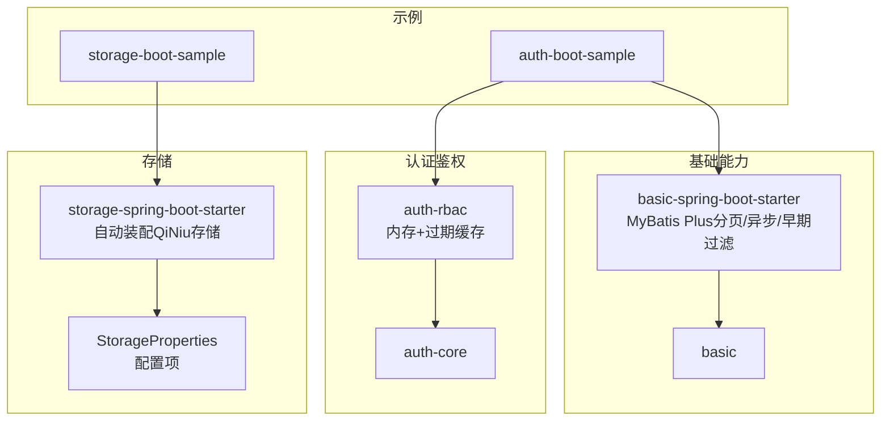
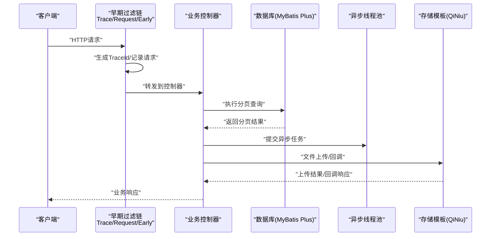
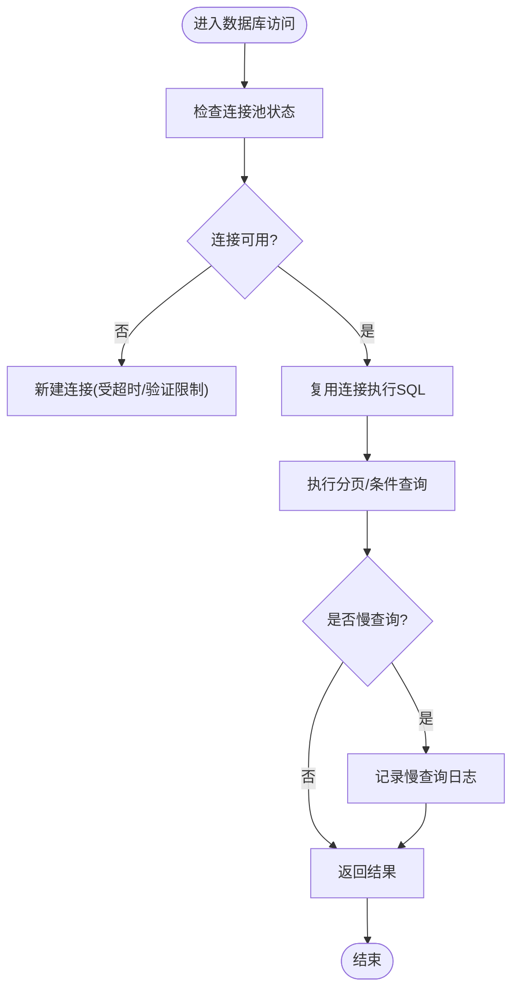
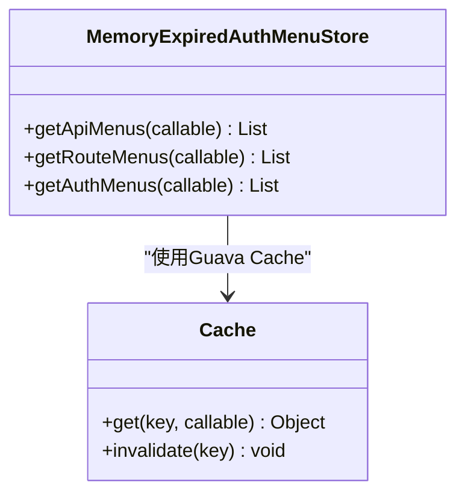
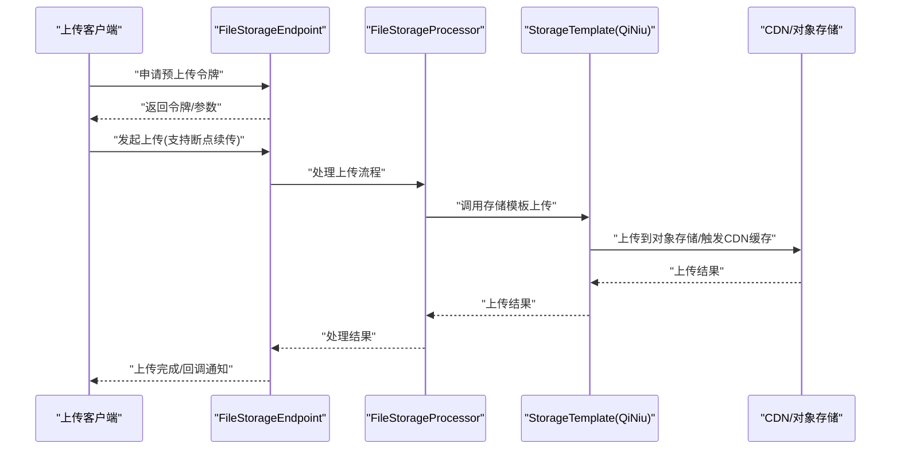
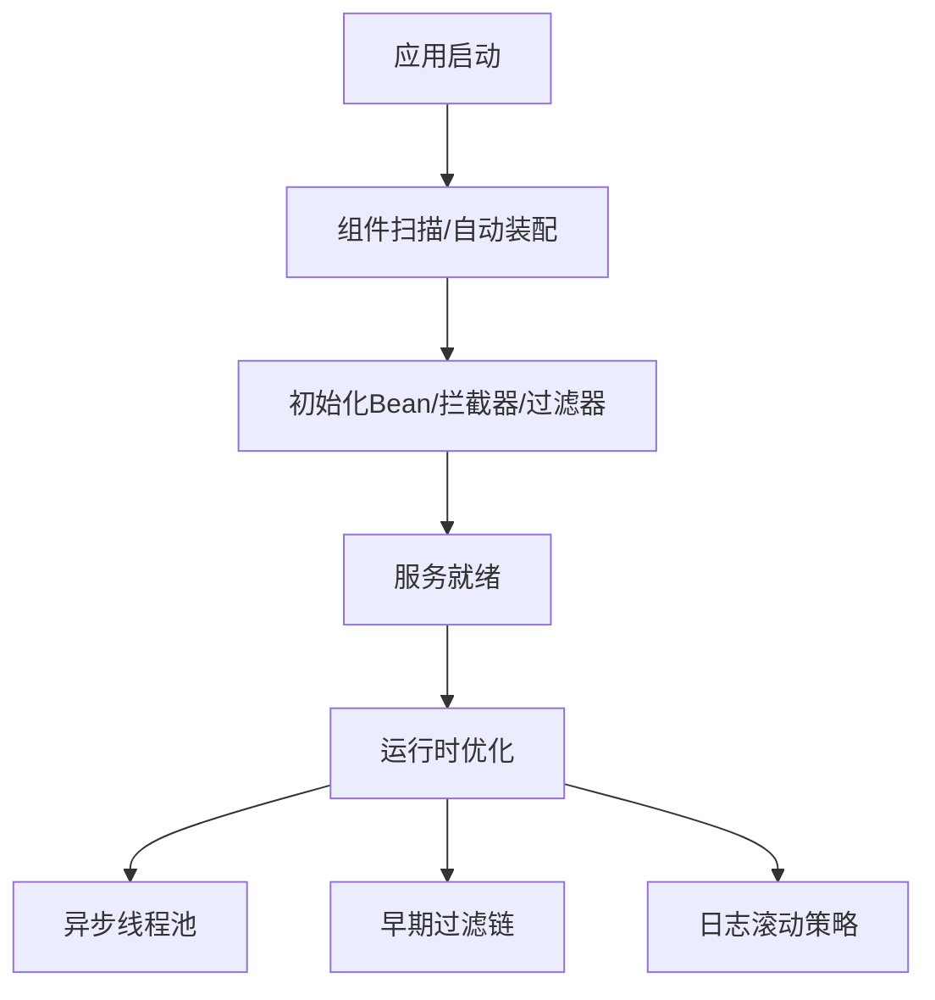
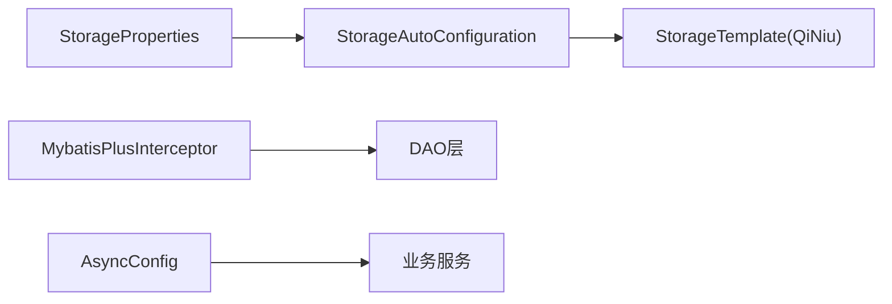

# 性能优化

<cite>
**本文引用的文件**
- [application.yml](file://application.yml)
- [StorageProperties.java](file://boot/storage-spring-boot-starter/src/main/java/com/kewen/framework/storage/boot/StorageProperties.java)
- [StorageAutoConfiguration.java](file://boot/storage-spring-boot-starter/src/main/java/com/kewen/framework/storage/boot/StorageAutoConfiguration.java)
- [MybatisPlusConfig.java](file://boot/basic-spring-boot-starter/src/main/java/com/kewen/framework/boot/basic/config/MybatisPlusConfig.java)
- [AsyncConfig.java](file://boot/basic-spring-boot-starter/src/main/java/com/kewen/framework/boot/basic/config/AsyncConfig.java)
- [EarlyFilterConfig.java](file://boot/basic-spring-boot-starter/src/main/java/com/kewen/framework/boot/basic/config/EarlyFilterConfig.java)
- [MemoryExpiredAuthMenuStore.java](file://qy-auth/auth-rbac/src/main/java/com/kewen/framework/auth/rabc/composite/impl/MemoryExpiredAuthMenuStore.java)
- [application.yml（认证示例）](file://sample/auth-boot-sample/src/main/resources/application.yml)
- [application.yml（存储示例）](file://sample/storage-boot-sample/src/main/resources/application.yml)
- [KP6SpyDriver.java（基础starter）](file://boot/basic-spring-boot-starter/src/main/java/com/kewen/framework/boot/basic/p6spy/KP6SpyDriver.java)
- [logback-spring.xml（认证示例）](file://sample/auth-boot-sample/src/main/resources/logback-spring.xml)
- [logback-spring.xml（IDAAS示例）](file://sample/idaas-sp-boot-sample/src/main/resources/logback-spring.xml)
</cite>

## 目录
1. [简介](#简介)
2. [项目结构](#项目结构)
3. [核心组件](#核心组件)
4. [架构总览](#架构总览)
5. [详细组件分析](#详细组件分析)
6. [依赖分析](#依赖分析)
7. [性能考虑与调优要点](#性能考虑与调优要点)
8. [故障排查指南](#故障排查指南)
9. [结论](#结论)
10. [附录](#附录)

## 简介
本指南面向kewen-framework在生产环境中的性能优化实践，围绕JVM参数调优、数据库连接池与SQL优化、缓存策略、文件存储与CDN、Spring Boot启动与运行时优化、压力与基准测试方法以及性能监控与瓶颈分析等方面，结合仓库中现有配置与组件给出可落地的建议与最佳实践。

## 项目结构
kewen-framework采用多模块聚合结构，核心模块包括：
- 基础能力与通用配置：basic、basic-spring-boot-starter
- 认证鉴权体系：auth-* 系列
- 存储模块：storage-spring-boot-starter 及其示例
- 示例工程：auth-boot-sample、storage-boot-sample 等

图表来源
- [MybatisPlusConfig.java:10-23](file://boot/basic-spring-boot-starter/src/main/java/com/kewen/framework/boot/basic/config/MybatisPlusConfig.java#L10-L23)
- [AsyncConfig.java:19-59](file://boot/basic-spring-boot-starter/src/main/java/com/kewen/framework/boot/basic/config/AsyncConfig.java#L19-L59)
- [EarlyFilterConfig.java:20-47](file://boot/basic-spring-boot-starter/src/main/java/com/kewen/framework/boot/basic/config/EarlyFilterConfig.java#L20-L47)
- [MemoryExpiredAuthMenuStore.java:16-54](file://qy-auth/auth-rbac/src/main/java/com/kewen/framework/auth/rabc/composite/impl/MemoryExpiredAuthMenuStore.java#L16-L54)
- [StorageAutoConfiguration.java:23-70](file://boot/storage-spring-boot-starter/src/main/java/com/kewen/framework/storage/boot/StorageAutoConfiguration.java#L23-L70)
- [StorageProperties.java:12-44](file://boot/storage-spring-boot-starter/src/main/java/com/kewen/framework/storage/boot/StorageProperties.java#L12-L44)
- [application.yml（认证示例）:9-22](file://sample/auth-boot-sample/src/main/resources/application.yml#L9-L22)
- [application.yml（存储示例）:4-17](file://sample/storage-boot-sample/src/main/resources/application.yml#L4-L17)

章节来源
- [application.yml:1-32](file://application.yml#L1-L32)
- [application.yml（认证示例）:1-55](file://sample/auth-boot-sample/src/main/resources/application.yml#L1-L55)
- [application.yml（存储示例）:1-18](file://sample/storage-boot-sample/src/main/resources/application.yml#L1-L18)

## 核心组件
- 数据库与分页：通过MyBatis Plus拦截器实现分页插件，避免全量扫描与内存溢出风险。
- 异步线程池：统一的异步执行器，减少频繁创建线程带来的开销。
- 早期过滤链：请求追踪、请求日志、早期过滤代理，降低后续处理成本。
- 缓存策略：基于Guava Cache的内存+过期缓存，降低鉴权菜单读取压力。
- 文件存储：基于七牛云的自动装配与端点控制器，支持预上传令牌、回调与响应增强。

章节来源
- [MybatisPlusConfig.java:10-23](file://boot/basic-spring-boot-starter/src/main/java/com/kewen/framework/boot/basic/config/MybatisPlusConfig.java#L10-L23)
- [AsyncConfig.java:19-59](file://boot/basic-spring-boot-starter/src/main/java/com/kewen/framework/boot/basic/config/AsyncConfig.java#L19-L59)
- [EarlyFilterConfig.java:20-47](file://boot/basic-spring-boot-starter/src/main/java/com/kewen/framework/boot/basic/config/EarlyFilterConfig.java#L20-L47)
- [MemoryExpiredAuthMenuStore.java:16-54](file://qy-auth/auth-rbac/src/main/java/com/kewen/framework/auth/rabc/composite/impl/MemoryExpiredAuthMenuStore.java#L16-L54)
- [StorageAutoConfiguration.java:23-70](file://boot/storage-spring-boot-starter/src/main/java/com/kewen/framework/storage/boot/StorageAutoConfiguration.java#L23-L70)

## 架构总览
kewen-framework在运行时的关键路径包括：请求进入早期过滤链，生成追踪ID与请求日志；随后进入业务层（如鉴权、存储等），数据库访问通过MyBatis Plus分页插件控制；异步任务由统一线程池调度；文件存储通过自动装配的QiNiu模板与端点控制器完成。

图表来源
- [EarlyFilterConfig.java:27-45](file://boot/basic-spring-boot-starter/src/main/java/com/kewen/framework/boot/basic/config/EarlyFilterConfig.java#L27-L45)
- [MybatisPlusConfig.java:16-22](file://boot/basic-spring-boot-starter/src/main/java/com/kewen/framework/boot/basic/config/MybatisPlusConfig.java#L16-L22)
- [AsyncConfig.java:32-48](file://boot/basic-spring-boot-starter/src/main/java/com/kewen/framework/boot/basic/config/AsyncConfig.java#L32-L48)
- [StorageAutoConfiguration.java:37-69](file://boot/storage-spring-boot-starter/src/main/java/com/kewen/framework/storage/boot/StorageAutoConfiguration.java#L37-L69)

## 详细组件分析

### 数据库连接池与SQL优化
- 连接池配置要点
  - 连接超时、空闲超时、最大生命周期、最小空闲、最大池大小、验证超时、池名称等参数直接影响连接复用与抖动。
  - 建议根据QPS与事务持续时间调整池大小与超时阈值，避免连接不足或泄漏。
- SQL优化与分页
  - 使用MyBatis Plus分页插件，确保只查询必要字段与条件，避免SELECT *。
  - 对高频查询建立合适索引，结合慢查询日志定位热点SQL。

图表来源
- [application.yml（认证示例）:9-19](file://sample/auth-boot-sample/src/main/resources/application.yml#L9-L19)
- [MybatisPlusConfig.java:16-22](file://boot/basic-spring-boot-starter/src/main/java/com/kewen/framework/boot/basic/config/MybatisPlusConfig.java#L16-L22)

章节来源
- [application.yml（认证示例）:9-19](file://sample/auth-boot-sample/src/main/resources/application.yml#L9-L19)
- [MybatisPlusConfig.java:10-23](file://boot/basic-spring-boot-starter/src/main/java/com/kewen/framework/boot/basic/config/MybatisPlusConfig.java#L10-L23)

### 缓存策略优化
- 内存+过期缓存
  - 使用Guava Cache对菜单、权限等读多写少的数据进行短期缓存，降低数据库压力。
  - 建议结合LRU淘汰与合理过期时间，避免缓存击穿与雪崩。
- 缓存失效策略
  - 采用事件驱动或定时刷新，保证缓存与数据库一致性。
  - 对热点键增加本地互斥或防穿透保护。

图表来源
- [MemoryExpiredAuthMenuStore.java:21-54](file://qy-auth/auth-rbac/src/main/java/com/kewen/framework/auth/rabc/composite/impl/MemoryExpiredAuthMenuStore.java#L21-L54)

章节来源
- [MemoryExpiredAuthMenuStore.java:16-54](file://qy-auth/auth-rbac/src/main/java/com/kewen/framework/auth/rabc/composite/impl/MemoryExpiredAuthMenuStore.java#L16-L54)

### 文件存储与CDN优化
- 存储配置
  - 通过StorageProperties定义存储类型、密钥、桶、根路径、是否公开、下载域名与回调地址。
  - StorageAutoConfiguration自动装配QiNiu存储模板与相关端点。
- 上传与回调
  - 支持预上传令牌生成、分片/断点续传（取决于对象存储能力）、上传回调与响应增强。
- CDN加速
  - 通过downloadDomain配置CDN域名，结合对象存储的回源策略与缓存头优化静态资源访问。

图表来源
- [StorageProperties.java:12-44](file://boot/storage-spring-boot-starter/src/main/java/com/kewen/framework/storage/boot/StorageProperties.java#L12-L44)
- [StorageAutoConfiguration.java:37-69](file://boot/storage-spring-boot-starter/src/main/java/com/kewen/framework/storage/boot/StorageAutoConfiguration.java#L37-L69)

章节来源
- [StorageProperties.java:12-44](file://boot/storage-spring-boot-starter/src/main/java/com/kewen/framework/storage/boot/StorageProperties.java#L12-L44)
- [StorageAutoConfiguration.java:23-70](file://boot/storage-spring-boot-starter/src/main/java/com/kewen/framework/storage/boot/StorageAutoConfiguration.java#L23-L70)
- [application.yml（存储示例）:9-17](file://sample/storage-boot-sample/src/main/resources/application.yml#L9-L17)

### Spring Boot启动与运行时优化
- 启动优化
  - 减少不必要的自动装配与组件扫描范围，按需启用starter。
  - 合理拆分profile，避免启动时加载过多配置。
- 运行时优化
  - 统一异步线程池，避免频繁创建线程与上下文切换。
  - 早期过滤链仅保留必要逻辑，避免阻塞主请求路径。
  - 合理设置日志滚动策略与级别，降低IO与GC压力。

图表来源
- [AsyncConfig.java:32-48](file://boot/basic-spring-boot-starter/src/main/java/com/kewen/framework/boot/basic/config/AsyncConfig.java#L32-L48)
- [EarlyFilterConfig.java:27-45](file://boot/basic-spring-boot-starter/src/main/java/com/kewen/framework/boot/basic/config/EarlyFilterConfig.java#L27-L45)
- [logback-spring.xml（认证示例）:19-36](file://sample/auth-boot-sample/src/main/resources/logback-spring.xml#L19-L36)
- [logback-spring.xml（IDAAS示例）:19-36](file://sample/idaas-sp-boot-sample/src/main/resources/logback-spring.xml#L19-L36)

章节来源
- [AsyncConfig.java:19-59](file://boot/basic-spring-boot-starter/src/main/java/com/kewen/framework/boot/basic/config/AsyncConfig.java#L19-L59)
- [EarlyFilterConfig.java:20-47](file://boot/basic-spring-boot-starter/src/main/java/com/kewen/framework/boot/basic/config/EarlyFilterConfig.java#L20-L47)
- [logback-spring.xml（认证示例）:19-36](file://sample/auth-boot-sample/src/main/resources/logback-spring.xml#L19-L36)
- [logback-spring.xml（IDAAS示例）:19-36](file://sample/idaas-sp-boot-sample/src/main/resources/logback-spring.xml#L19-L36)

## 依赖分析
- 组件耦合
  - StorageAutoConfiguration依赖StorageProperties与QiNiu模板，形成清晰的配置-实现分离。
  - MyBatis Plus分页插件与业务DAO解耦，通过拦截器实现横切。
  - 异步线程池与业务方法解耦，通过@EnableAsync统一管理。
- 外部依赖
  - 存储依赖七牛云SDK与对应Region配置。
  - 日志滚动依赖Logback RollingFileAppender。

图表来源
- [StorageProperties.java:12-44](file://boot/storage-spring-boot-starter/src/main/java/com/kewen/framework/storage/boot/StorageProperties.java#L12-L44)
- [StorageAutoConfiguration.java:37-69](file://boot/storage-spring-boot-starter/src/main/java/com/kewen/framework/storage/boot/StorageAutoConfiguration.java#L37-L69)
- [MybatisPlusConfig.java:16-22](file://boot/basic-spring-boot-starter/src/main/java/com/kewen/framework/boot/basic/config/MybatisPlusConfig.java#L16-L22)
- [AsyncConfig.java:32-48](file://boot/basic-spring-boot-starter/src/main/java/com/kewen/framework/boot/basic/config/AsyncConfig.java#L32-L48)

章节来源
- [StorageAutoConfiguration.java:23-70](file://boot/storage-spring-boot-starter/src/main/java/com/kewen/framework/storage/boot/StorageAutoConfiguration.java#L23-L70)
- [MybatisPlusConfig.java:10-23](file://boot/basic-spring-boot-starter/src/main/java/com/kewen/framework/boot/basic/config/MybatisPlusConfig.java#L10-L23)
- [AsyncConfig.java:19-59](file://boot/basic-spring-boot-starter/src/main/java/com/kewen/framework/boot/basic/config/AsyncConfig.java#L19-L59)

## 性能考虑与调优要点

### JVM参数调优
- 堆内存配置
  - 新生代/老年代比例应结合对象存活率与停顿目标设定；对高吞吐场景可适当增大老年代。
  - 启动阶段预留足够元空间，避免类加载失败。
- 垃圾回收器选择
  - 低延迟场景优先考虑G1或ZGC；高吞吐场景可考虑Parallel GC。
  - GC日志开启以便分析停顿与回收效率。
- GC参数优化
  - 控制晋升年龄、大对象阈值、Mixed GC比例，避免Full GC。
  - 结合应用特征设置并发标记线程与停顿目标。

### 数据库连接池性能调优
- 连接数配置
  - 最大池大小与CPU核心数、QPS、平均事务时长成正比；最小空闲用于快速响应突发流量。
- 查询超时与慢查询
  - 为每个请求设置合理超时，避免连接长时间占用。
  - 使用慢查询日志与索引优化，减少全表扫描。
- 事务与隔离级别
  - 读多写少场景可适度降低隔离级别，减少锁竞争。

### 缓存策略优化
- Redis配置
  - 主从复制、哨兵/集群模式提升可用性；合理设置过期时间与内存淘汰策略。
- 缓存命中率提升
  - 预热热点数据、合并小key、使用布隆过滤器减少穿透。
- 缓存失效策略
  - 采用多级缓存（本地+分布式），结合事件驱动与后台刷新。

### 文件存储与CDN优化
- 并发上传
  - 客户端分片并发上传，服务端配合断点续传与去重校验。
- 断点续传
  - 服务端维护分片元数据，客户端断点续传时校验分片完整性。
- CDN加速
  - 静态资源走CDN，合理设置缓存头与刷新策略，降低源站压力。

### Spring Boot启动与运行时优化
- 启动优化
  - 按需引入starter，减少自动装配与Bean初始化数量。
  - profile隔离不同环境配置，避免启动时加载冗余配置。
- 运行时优化
  - 统一异步线程池，合理设置队列容量与拒绝策略。
  - 早期过滤链仅保留必要逻辑，避免阻塞主请求路径。
  - 日志滚动策略与级别控制，减少IO与GC压力。

### 压力测试与基准测试
- 方法
  - 使用JMeter/Locust/Gatling构造并发场景，覆盖登录、查询、上传等关键路径。
  - 基准测试对比不同JVM参数、GC策略、连接池大小下的吞吐与延迟。
- 指标
  - QPS、P99延迟、错误率、GC停顿时间、连接池利用率。

### 性能监控与瓶颈分析
- 工具
  - JVM：JFR/JMC、GC日志、Micrometer指标。
  - 应用：Prometheus+Grafana、APM（如SkyWalking）。
  - 数据库：慢查询日志、EXPLAIN分析、连接数统计。
- 技巧
  - 以TraceId串联请求链路，定位慢调用与阻塞点。
  - 结合日志滚动策略与级别，避免磁盘与GC压力过大。

## 故障排查指南
- 数据库连接问题
  - 检查连接池超时与最大池大小配置，观察连接泄漏与验证失败日志。
- 慢查询定位
  - 开启慢查询日志与SQL审计，结合索引设计优化。
- 缓存异常
  - 观察缓存命中率与过期策略，排查缓存穿透与击穿。
- 文件上传失败
  - 检查预上传令牌有效期、回调地址可达性与对象存储配额。
- 日志问题
  - 检查Logback滚动策略与文件大小上限，避免日志写入成为瓶颈。

章节来源
- [application.yml（认证示例）:9-22](file://sample/auth-boot-sample/src/main/resources/application.yml#L9-L22)
- [logback-spring.xml（认证示例）:19-36](file://sample/auth-boot-sample/src/main/resources/logback-spring.xml#L19-L36)
- [logback-spring.xml（IDAAS示例）:19-36](file://sample/idaas-sp-boot-sample/src/main/resources/logback-spring.xml#L19-L36)

## 结论
kewen-framework在基础能力、鉴权与存储方面提供了可扩展的组件化方案。结合合理的JVM参数、连接池与SQL优化、缓存策略、文件存储与CDN、以及统一的异步线程池与早期过滤链，可在生产环境中获得稳定且高性能的表现。建议在灰度环境中逐步验证各项调优措施，并通过持续的压力与基准测试完善参数配置。

## 附录
- 相关配置参考
  - 认证示例数据库连接池与会话配置
  - 存储示例对象存储与回调配置
  - 基础starter中的P6Spy驱动与日志配置

章节来源
- [application.yml（认证示例）:9-22](file://sample/auth-boot-sample/src/main/resources/application.yml#L9-L22)
- [application.yml（存储示例）:9-17](file://sample/storage-boot-sample/src/main/resources/application.yml#L9-L17)
- [KP6SpyDriver.java（基础starter）:60-98](file://boot/basic-spring-boot-starter/src/main/java/com/kewen/framework/boot/basic/p6spy/KP6SpyDriver.java#L60-L98)