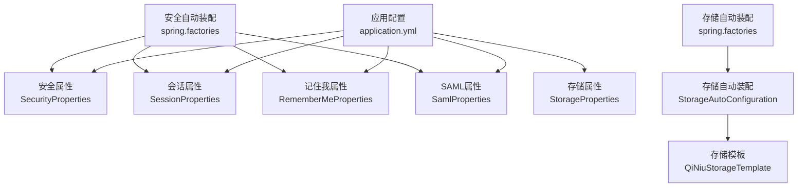
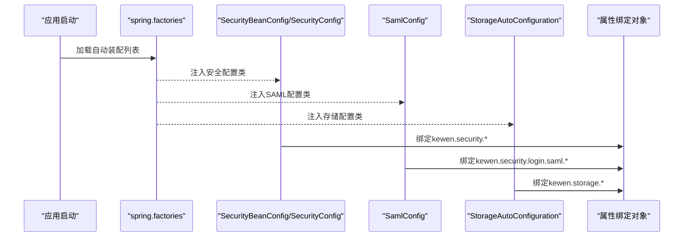
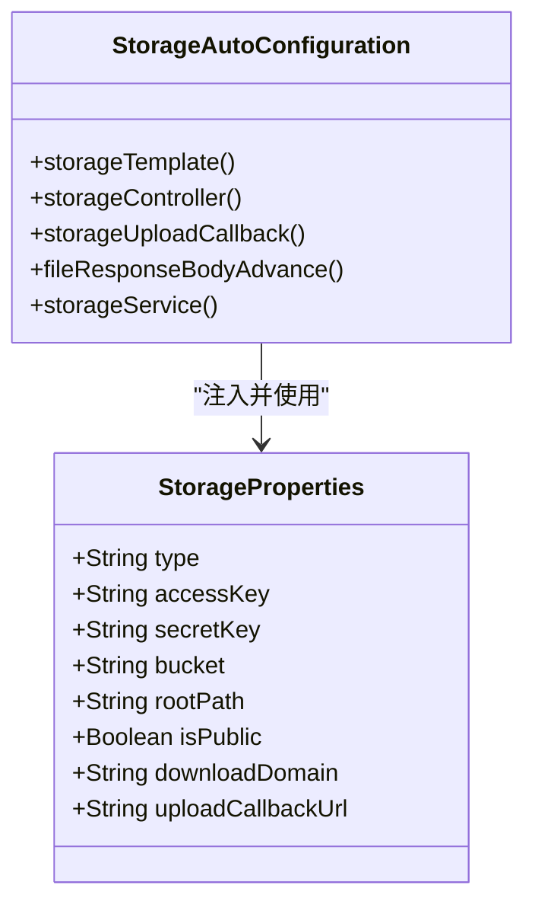
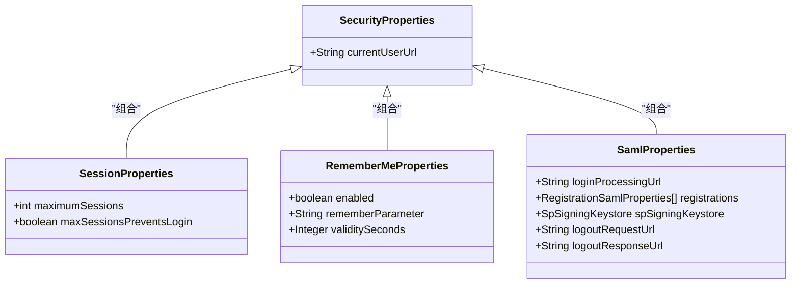
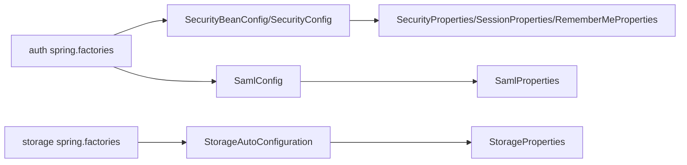

# 环境配置

<cite>
**本文引用的文件**
- [application.yml](file://application.yml)
- [application.yml](file://sample/auth-boot-sample/src/main/resources/application.yml)
- [application-dev.yml](file://sample/auth-boot-sample/src/main/resources/application-dev.yml)
- [application.yml](file://sample/idaas-sp-boot-sample/src/main/resources/application.yml)
- [application.yml](file://sample/storage-boot-sample/src/main/resources/application.yml)
- [application.yml](file://docs/application.yml)
- [SecurityProperties.java](file://qy-auth/auth-spring-boot-starter/src/main/java/com/kewen/framework/auth/security/properties/SecurityProperties.java)
- [SessionProperties.java](file://qy-auth/auth-spring-boot-starter/src/main/java/com/kewen/framework/auth/security/properties/SessionProperties.java)
- [RememberMeProperties.java](file://qy-auth/auth-spring-boot-starter/src/main/java/com/kewen/framework/auth/security/properties/RememberMeProperties.java)
- [SamlProperties.java](file://qy-idaas/idaas-authentications/src/main/java/com/kewen/framework/idaas/saml/properties/SamlProperties.java)
- [StorageProperties.java](file://boot/storage-spring-boot-starter/src/main/java/com/kewen/framework/storage/boot/StorageProperties.java)
- [StorageAutoConfiguration.java](file://boot/storage-spring-boot-starter/src/main/java/com/kewen/framework/storage/boot/StorageAutoConfiguration.java)
- [spring.factories](file://boot/storage-spring-boot-starter/src/main/resources/META-INF/spring.factories)
- [spring.factories](file://qy-auth/auth-spring-boot-starter/src/main/resources/META-INF/spring.factories)
- [KP6SpyDriver.java](file://boot/basic-spring-boot-starter/src/main/java/com/kewen/framework/boot/basic/p6spy/KP6SpyDriver.java)
</cite>

## 目录
1. [简介](#简介)
2. [项目结构](#项目结构)
3. [核心组件](#核心组件)
4. [架构总览](#架构总览)
5. [详细组件分析](#详细组件分析)
6. [依赖关系分析](#依赖关系分析)
7. [性能考虑](#性能考虑)
8. [故障排查指南](#故障排查指南)
9. [结论](#结论)
10. [附录](#附录)

## 简介
本指南面向kewen-framework在生产环境中的配置落地，重点覆盖以下方面：
- 生产环境数据库连接配置：MySQL连接池参数、连接超时与生命周期、连接池优化建议
- 文件存储配置：七牛云存储的密钥、空间、下载域名、回调地址等
- 安全配置：会话管理、记住我、登录URL、SAML协议配置要点
- 不同环境（开发、测试、生产）的配置差异与最佳实践
- 配置验证与故障排查方法

## 项目结构
围绕“配置”主题，本仓库中与之直接相关的配置集中在如下位置：
- 应用层配置样例：根目录与各示例模块的application.yml与profile配置
- 自动装配与属性绑定：安全、SAML、存储等starter中的Properties类与AutoConfiguration
- 数据库驱动与日志：P6Spy驱动与日志配置

图表来源
- [application.yml:1-32](file://application.yml#L1-L32)
- [SecurityProperties.java:1-23](file://qy-auth/auth-spring-boot-starter/src/main/java/com/kewen/framework/auth/security/properties/SecurityProperties.java#L1-L23)
- [SessionProperties.java:1-23](file://qy-auth/auth-spring-boot-starter/src/main/java/com/kewen/framework/auth/security/properties/SessionProperties.java#L1-L23)
- [RememberMeProperties.java:1-27](file://qy-auth/auth-spring-boot-starter/src/main/java/com/kewen/framework/auth/security/properties/RememberMeProperties.java#L1-L27)
- [SamlProperties.java:1-130](file://qy-idaas/idaas-authentications/src/main/java/com/kewen/framework/idaas/saml/properties/SamlProperties.java#L1-L130)
- [StorageProperties.java:1-45](file://boot/storage-spring-boot-starter/src/main/java/com/kewen/framework/storage/boot/StorageProperties.java#L1-L45)
- [StorageAutoConfiguration.java:1-71](file://boot/storage-spring-boot-starter/src/main/java/com/kewen/framework/storage/boot/StorageAutoConfiguration.java#L1-L71)
- [spring.factories:1-6](file://qy-auth/auth-spring-boot-starter/src/main/resources/META-INF/spring.factories#L1-L6)
- [spring.factories:1-2](file://boot/storage-spring-boot-starter/src/main/resources/META-INF/spring.factories#L1-L2)

章节来源
- [application.yml:1-32](file://application.yml#L1-L32)
- [application.yml:1-55](file://sample/auth-boot-sample/src/main/resources/application.yml#L1-L55)
- [application-dev.yml:1-6](file://sample/auth-boot-sample/src/main/resources/application-dev.yml#L1-L6)
- [application.yml:1-128](file://sample/idaas-sp-boot-sample/src/main/resources/application.yml#L1-L128)
- [application.yml:1-18](file://sample/storage-boot-sample/src/main/resources/application.yml#L1-L18)
- [spring.factories:1-6](file://qy-auth/auth-spring-boot-starter/src/main/resources/META-INF/spring.factories#L1-L6)
- [spring.factories:1-2](file://boot/storage-spring-boot-starter/src/main/resources/META-INF/spring.factories#L1-L2)

## 核心组件
- 安全配置（kewen.security.*）
  - 当前用户接口地址、登录URL、用户名/密码参数、记住我开关与有效期、会话并发策略
- SAML配置（kewen.security.login.saml.*）
  - 登录处理URL、SP签名密钥库、注册项（registrationId、SP Entity ID、metadata资源）、登出URL等
- 存储配置（kewen.storage.*）
  - 类型、accessKey、secretKey、bucket、rootPath、是否公开、downloadDomain、uploadCallbackUrl

章节来源
- [SecurityProperties.java:1-23](file://qy-auth/auth-spring-boot-starter/src/main/java/com/kewen/framework/auth/security/properties/SecurityProperties.java#L1-L23)
- [SessionProperties.java:1-23](file://qy-auth/auth-spring-boot-starter/src/main/java/com/kewen/framework/auth/security/properties/SessionProperties.java#L1-L23)
- [RememberMeProperties.java:1-27](file://qy-auth/auth-spring-boot-starter/src/main/java/com/kewen/framework/auth/security/properties/RememberMeProperties.java#L1-L27)
- [SamlProperties.java:1-130](file://qy-idaas/idaas-authentications/src/main/java/com/kewen/framework/idaas/saml/properties/SamlProperties.java#L1-L130)
- [StorageProperties.java:1-45](file://boot/storage-spring-boot-starter/src/main/java/com/kewen/framework/storage/boot/StorageProperties.java#L1-L45)

## 架构总览
下图展示配置在运行时的装配与使用关系：应用配置通过spring.factories自动装配到容器，随后由对应Properties类绑定到Java对象；业务组件按需注入并使用。

图表来源
- [spring.factories:1-6](file://qy-auth/auth-spring-boot-starter/src/main/resources/META-INF/spring.factories#L1-L6)
- [spring.factories:1-2](file://boot/storage-spring-boot-starter/src/main/resources/META-INF/spring.factories#L1-L2)
- [SecurityProperties.java:1-23](file://qy-auth/auth-spring-boot-starter/src/main/java/com/kewen/framework/auth/security/properties/SecurityProperties.java#L1-L23)
- [SessionProperties.java:1-23](file://qy-auth/auth-spring-boot-starter/src/main/java/com/kewen/framework/auth/security/properties/SessionProperties.java#L1-L23)
- [RememberMeProperties.java:1-27](file://qy-auth/auth-spring-boot-starter/src/main/java/com/kewen/framework/auth/security/properties/RememberMeProperties.java#L1-L27)
- [SamlProperties.java:1-130](file://qy-idaas/idaas-authentications/src/main/java/com/kewen/framework/idaas/saml/properties/SamlProperties.java#L1-L130)
- [StorageProperties.java:1-45](file://boot/storage-spring-boot-starter/src/main/java/com/kewen/framework/storage/boot/StorageProperties.java#L1-L45)

## 详细组件分析

### 数据库连接配置（生产环境）
- MySQL连接池（HikariCP）
  - 建议在生产环境显式配置连接池参数，确保连接超时、空闲超时、最大生命周期、最小空闲、最大连接数等参数合理
  - 示例配置可参考示例模块中的application.yml与application-dev.yml
- 连接超时与生命周期
  - connection-timeout：连接获取超时
  - idle-timeout：连接空闲超时
  - max-lifetime：连接最大存活时间
  - validation-timeout：连接校验超时
- 日志与诊断
  - 可通过P6Spy驱动输出SQL与连接耗时，便于定位慢查询与连接问题
- 生产建议
  - 根据QPS与事务持续时间调整maximum-pool-size与minimum-idle
  - 开启连接测试语句（如select 1），确保连接可用性
  - 使用独立的只读副本或连接池隔离读写流量

章节来源
- [application.yml:9-23](file://sample/auth-boot-sample/src/main/resources/application.yml#L9-L23)
- [application-dev.yml:1-6](file://sample/auth-boot-sample/src/main/resources/application-dev.yml#L1-L6)
- [KP6SpyDriver.java:1-106](file://boot/basic-spring-boot-starter/src/main/java/com/kewen/framework/boot/basic/p6spy/KP6SpyDriver.java#L1-L106)

### 文件存储配置（七牛云）
- 必填项
  - type：存储类型（示例为qiniu）
  - accessKey、secretKey：七牛云鉴权密钥
  - bucket：存储空间名称
  - downloadDomain：下载域名
  - uploadCallbackUrl：上传成功回调地址
- 其他
  - rootPath：存储根目录（默认空）
  - isPublic：是否公开访问（默认true）

图表来源
- [StorageProperties.java:1-45](file://boot/storage-spring-boot-starter/src/main/java/com/kewen/framework/storage/boot/StorageProperties.java#L1-L45)
- [StorageAutoConfiguration.java:1-71](file://boot/storage-spring-boot-starter/src/main/java/com/kewen/framework/storage/boot/StorageAutoConfiguration.java#L1-L71)

章节来源
- [StorageProperties.java:1-45](file://boot/storage-spring-boot-starter/src/main/java/com/kewen/framework/storage/boot/StorageProperties.java#L1-L45)
- [StorageAutoConfiguration.java:1-71](file://boot/storage-spring-boot-starter/src/main/java/com/kewen/framework/storage/boot/StorageAutoConfiguration.java#L1-L71)
- [application.yml:1-18](file://sample/storage-boot-sample/src/main/resources/application.yml#L1-L18)

### 安全配置
- 会话管理
  - maximum-sessions：最大会话数
  - max-sessions-prevents-login：达到上限时是否阻止新登录
- 记住我
  - enabled：是否启用
  - remember-parameter：参数名
  - validity-seconds：有效期（秒）
- 登录URL与参数
  - login-url：登录地址
  - username-parameter、password-parameter：用户名与密码参数名
- SAML协议
  - registration-id：注册ID
  - entity-id：SP实体ID
  - use-metadata：是否使用metadata自动解析
  - web-sso-url：IdP单点登录地址
  - idp-certificate-resource：IdP证书资源路径
  - metadata-resource：IdP元数据资源路径

图表来源
- [SecurityProperties.java:1-23](file://qy-auth/auth-spring-boot-starter/src/main/java/com/kewen/framework/auth/security/properties/SecurityProperties.java#L1-L23)
- [SessionProperties.java:1-23](file://qy-auth/auth-spring-boot-starter/src/main/java/com/kewen/framework/auth/security/properties/SessionProperties.java#L1-L23)
- [RememberMeProperties.java:1-27](file://qy-auth/auth-spring-boot-starter/src/main/java/com/kewen/framework/auth/security/properties/RememberMeProperties.java#L1-L27)
- [SamlProperties.java:1-130](file://qy-idaas/idaas-authentications/src/main/java/com/kewen/framework/idaas/saml/properties/SamlProperties.java#L1-L130)

章节来源
- [SecurityProperties.java:1-23](file://qy-auth/auth-spring-boot-starter/src/main/java/com/kewen/framework/auth/security/properties/SecurityProperties.java#L1-L23)
- [SessionProperties.java:1-23](file://qy-auth/auth-spring-boot-starter/src/main/java/com/kewen/framework/auth/security/properties/SessionProperties.java#L1-L23)
- [RememberMeProperties.java:1-27](file://qy-auth/auth-spring-boot-starter/src/main/java/com/kewen/framework/auth/security/properties/RememberMeProperties.java#L1-L27)
- [SamlProperties.java:1-130](file://qy-idaas/idaas-authentications/src/main/java/com/kewen/framework/idaas/saml/properties/SamlProperties.java#L1-L130)
- [application.yml:12-32](file://application.yml#L12-L32)
- [application.yml:62-88](file://sample/idaas-sp-boot-sample/src/main/resources/application.yml#L62-L88)

### 不同环境配置差异（开发/测试/生产）
- 开发环境
  - 激活dev profile，使用本地MySQL数据库与较小连接池
  - 示例：端口、日志级别、HikariCP参数、会话存储类型等
- 测试环境
  - 与开发类似，但可能使用独立数据库实例与更严格的连接池限制
- 生产环境
  - 使用外部化配置（如环境变量或配置中心），严格控制连接池大小、超时与生命周期
  - 使用P6Spy或数据库监控工具进行SQL与连接诊断
  - SAML与存储配置使用受控资源与域名

章节来源
- [application.yml:1-55](file://sample/auth-boot-sample/src/main/resources/application.yml#L1-L55)
- [application-dev.yml:1-6](file://sample/auth-boot-sample/src/main/resources/application-dev.yml#L1-L6)
- [application.yml:1-128](file://sample/idaas-sp-boot-sample/src/main/resources/application.yml#L1-L128)
- [application.yml:1-18](file://sample/storage-boot-sample/src/main/resources/application.yml#L1-L18)

### 配置模板与最佳实践
- 数据库连接池模板（HikariCP）
  - 建议字段：connection-timeout、idle-timeout、max-lifetime、maximum-pool-size、minimum-idle、validation-timeout、pool-name、auto-commit、connection-test-query
  - 参考示例：见示例模块application.yml与application-dev.yml
- SAML模板
  - 建议字段：login-processing-url、registrations[].registration-id、registrations[].sp-entity-id、registrations[].metadata-resource、sp-signing-keystore.*
  - 参考示例：见idaas示例模块application.yml
- 存储模板（七牛云）
  - 建议字段：type、access-key、secret-key、bucket、download-domain、upload-callback-url、is-public、root-path
  - 参考示例：见storage示例模块application.yml
- 最佳实践
  - 将敏感信息置于环境变量或配置中心，避免硬编码
  - 生产环境开启连接测试与健康检查
  - 对SAML与存储配置进行灰度与回滚预案

章节来源
- [application.yml:9-23](file://sample/auth-boot-sample/src/main/resources/application.yml#L9-L23)
- [application-dev.yml:1-6](file://sample/auth-boot-sample/src/main/resources/application-dev.yml#L1-L6)
- [application.yml:62-88](file://sample/idaas-sp-boot-sample/src/main/resources/application.yml#L62-L88)
- [application.yml:10-17](file://sample/storage-boot-sample/src/main/resources/application.yml#L10-L17)

## 依赖关系分析
- 自动装配加载顺序
  - spring.factories中声明的自动装配类在应用启动时被加载
  - 安全与存储的AutoConfiguration分别负责注入对应属性与组件
- 属性绑定
  - 各Properties类通过@ConfigurationProperties绑定命名空间下的配置键
- 组件交互
  - StorageAutoConfiguration根据StorageProperties构造QiNiuStorageTemplate并暴露相关端点与处理器

图表来源
- [spring.factories:1-6](file://qy-auth/auth-spring-boot-starter/src/main/resources/META-INF/spring.factories#L1-L6)
- [spring.factories:1-2](file://boot/storage-spring-boot-starter/src/main/resources/META-INF/spring.factories#L1-L2)
- [StorageAutoConfiguration.java:1-71](file://boot/storage-spring-boot-starter/src/main/java/com/kewen/framework/storage/boot/StorageAutoConfiguration.java#L1-L71)
- [StorageProperties.java:1-45](file://boot/storage-spring-boot-starter/src/main/java/com/kewen/framework/storage/boot/StorageProperties.java#L1-L45)
- [SecurityProperties.java:1-23](file://qy-auth/auth-spring-boot-starter/src/main/java/com/kewen/framework/auth/security/properties/SecurityProperties.java#L1-L23)
- [SessionProperties.java:1-23](file://qy-auth/auth-spring-boot-starter/src/main/java/com/kewen/framework/auth/security/properties/SessionProperties.java#L1-L23)
- [RememberMeProperties.java:1-27](file://qy-auth/auth-spring-boot-starter/src/main/java/com/kewen/framework/auth/security/properties/RememberMeProperties.java#L1-L27)
- [SamlProperties.java:1-130](file://qy-idaas/idaas-authentications/src/main/java/com/kewen/framework/idaas/saml/properties/SamlProperties.java#L1-L130)

## 性能考虑
- 连接池参数
  - maximum-pool-size：根据峰值并发与数据库承载能力设定
  - minimum-idle：维持一定空闲连接以降低突发压力
  - connection-timeout与validation-timeout：避免过长阻塞与频繁校验
- SQL与连接诊断
  - 使用P6Spy驱动输出SQL执行与连接耗时，结合数据库慢查询日志定位瓶颈
- SAML与存储
  - SAML元数据与证书缓存，减少每次解析开销
  - 存储回调与CDN加速，缩短上传完成链路

章节来源
- [application.yml:9-23](file://sample/auth-boot-sample/src/main/resources/application.yml#L9-L23)
- [KP6SpyDriver.java:1-106](file://boot/basic-spring-boot-starter/src/main/java/com/kewen/framework/boot/basic/p6spy/KP6SpyDriver.java#L1-L106)

## 故障排查指南
- 数据库连接问题
  - 检查连接池参数与数据库实例状态
  - 使用connection-test-query验证连接有效性
  - 查看P6Spy日志确认连接耗时与异常
- SAML认证问题
  - 核对SP Entity ID与IdP Audience一致性
  - 确认metadata资源路径与证书可用性
  - 检查登录处理URL与注册ID匹配
- 存储上传问题
  - 校验accessKey/secretKey与bucket权限
  - 确认downloadDomain与uploadCallbackUrl可达
  - 检查回调端点是否正确接收并处理上传结果

章节来源
- [application.yml:9-23](file://sample/auth-boot-sample/src/main/resources/application.yml#L9-L23)
- [application.yml:62-88](file://sample/idaas-sp-boot-sample/src/main/resources/application.yml#L62-L88)
- [application.yml:10-17](file://sample/storage-boot-sample/src/main/resources/application.yml#L10-L17)
- [SamlProperties.java:1-130](file://qy-idaas/idaas-authentications/src/main/java/com/kewen/framework/idaas/saml/properties/SamlProperties.java#L1-L130)
- [StorageProperties.java:1-45](file://boot/storage-spring-boot-starter/src/main/java/com/kewen/framework/storage/boot/StorageProperties.java#L1-L45)

## 结论
- 生产环境应明确数据库连接池参数与生命周期，结合P6Spy进行诊断
- SAML与存储配置需严格遵循元数据与证书规范，并做好域名与回调的可用性保障
- 通过示例模块的配置模板与最佳实践，快速落地不同环境的差异化配置

## 附录
- 配置键汇总
  - kewen.security.session.maximum-sessions
  - kewen.security.session.max-sessions-prevents-login
  - kewen.security.remember-me.enabled
  - kewen.security.remember-me.remember-parameter
  - kewen.security.remember-me.validity-seconds
  - kewen.security.login.password.login-url
  - kewen.security.login.password.username-parameter
  - kewen.security.login.password.password-parameter
  - kewen.security.login.saml.registrations[].registration-id
  - kewen.security.login.saml.registrations[].sp-entity-id
  - kewen.security.login.saml.registrations[].metadata-resource
  - kewen.security.login.saml.sp-signing-keystore.*
  - kewen.storage.type
  - kewen.storage.access-key
  - kewen.storage.secret-key
  - kewen.storage.bucket
  - kewen.storage.root-path
  - kewen.storage.is-public
  - kewen.storage.download-domain
  - kewen.storage.upload-callback-url

章节来源
- [application.yml:12-32](file://application.yml#L12-L32)
- [application.yml:62-88](file://sample/idaas-sp-boot-sample/src/main/resources/application.yml#L62-L88)
- [application.yml:10-17](file://sample/storage-boot-sample/src/main/resources/application.yml#L10-L17)
- [docs/application.yml:1-21](file://docs/application.yml#L1-L21)