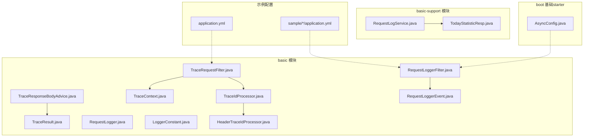
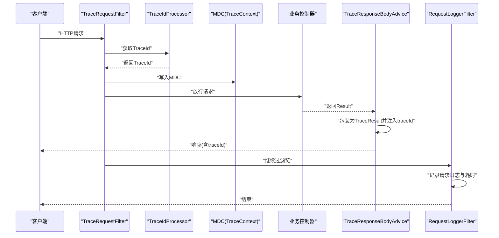
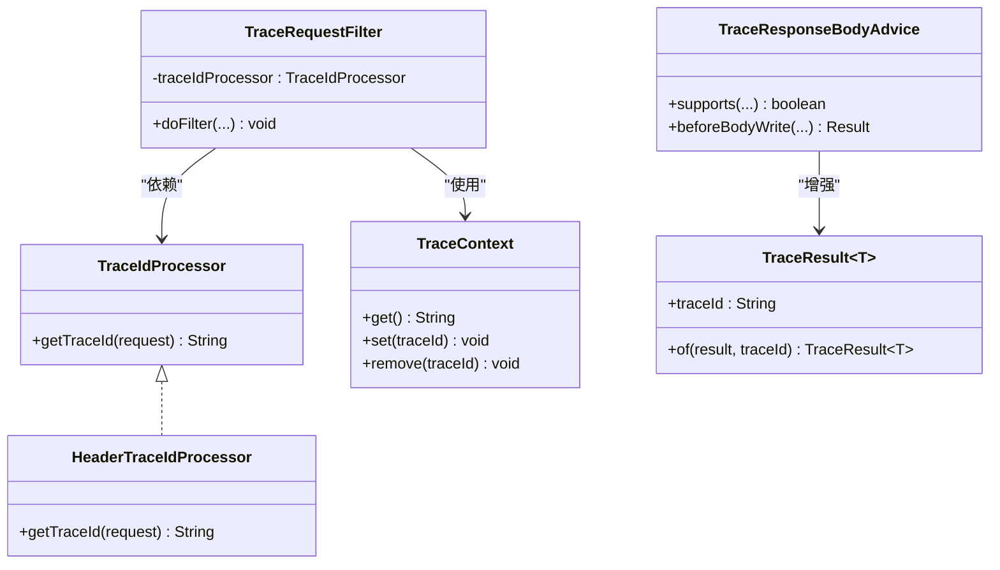
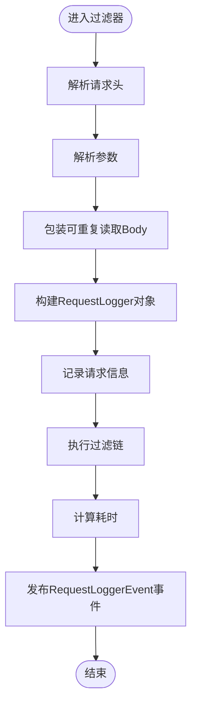
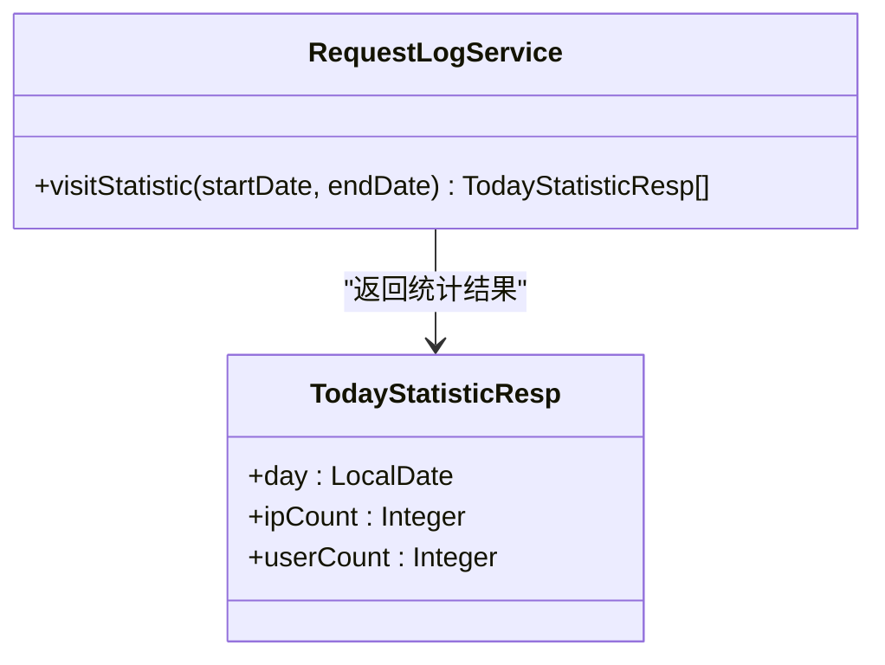
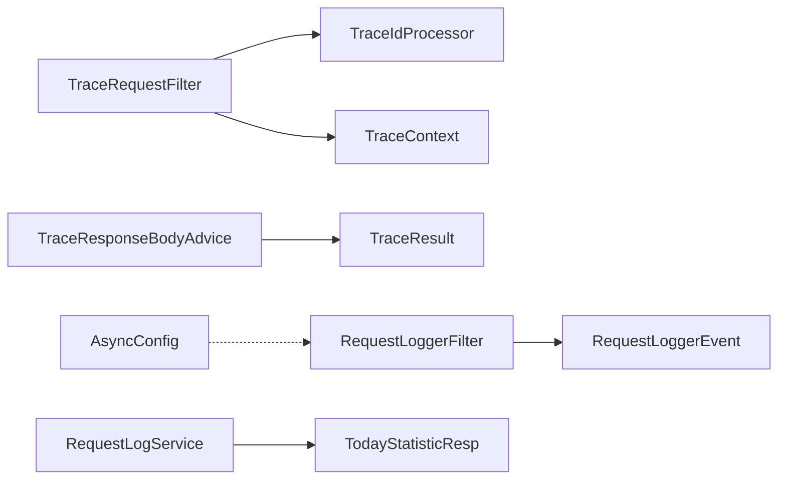

# 监控与日志

<cite>
**本文引用的文件**
- [basic/src/main/java/com/kewen/framework/basic/logger/trace/TraceIdProcessor.java](file://basic/src/main/java/com/kewen/framework/basic/logger/trace/TraceIdProcessor.java)
- [basic/src/main/java/com/kewen/framework/basic/logger/trace/HeaderTraceIdProcessor.java](file://basic/src/main/java/com/kewen/framework/basic/logger/trace/HeaderTraceIdProcessor.java)
- [basic/src/main/java/com/kewen/framework/basic/logger/trace/TraceContext.java](file://basic/src/main/java/com/kewen/framework/basic/logger/trace/TraceContext.java)
- [basic/src/main/java/com/kewen/framework/basic/logger/trace/TraceResult.java](file://basic/src/main/java/com/kewen/framework/basic/logger/trace/TraceResult.java)
- [basic/src/main/java/com/kewen/framework/basic/logger/TraceRequestFilter.java](file://basic/src/main/java/com/kewen/framework/basic/logger/TraceRequestFilter.java)
- [basic/src/main/java/com/kewen/framework/basic/logger/request/RequestLogger.java](file://basic/src/main/java/com/kewen/framework/basic/logger/request/RequestLogger.java)
- [basic/src/main/java/com/kewen/framework/basic/logger/request/RequestLoggerEvent.java](file://basic/src/main/java/com/kewen/framework/basic/logger/request/RequestLoggerEvent.java)
- [basic/src/main/java/com/kewen/framework/basic/logger/RequestLoggerFilter.java](file://basic/src/main/java/com/kewen/framework/basic/logger/RequestLoggerFilter.java)
- [basic/src/main/java/com/kewen/framework/basic/logger/LoggerConstant.java](file://basic/src/main/java/com/kewen/framework/basic/logger/LoggerConstant.java)
- [basic/src/main/java/com/kewen/framework/basic/logger/trace/TraceResponseBodyAdvice.java](file://basic/src/main/java/com/kewen/framework/basic/logger/trace/TraceResponseBodyAdvice.java)
- [basic-support/src/main/java/com/kewen/framework/basic/support/log/persistent/RequestLogService.java](file://basic-support/src/main/java/com/kewen/framework/basic/support/log/persistent/RequestLogService.java)
- [basic-support/src/main/java/com/kewen/framework/basic/support/log/persistent/TodayStatisticResp.java](file://basic-support/src/main/java/com/kewen/framework/basic/support/log/persistent/TodayStatisticResp.java)
- [boot/basic-spring-boot-starter/src/main/java/com/kewen/framework/boot/basic/config/AsyncConfig.java](file://boot/basic-spring-boot-starter/src/main/java/com/kewen/framework/boot/basic/config/AsyncConfig.java)
- [application.yml](file://application.yml)
- [sample/auth-boot-sample/src/main/resources/application.yml](file://sample/auth-boot-sample/src/main/resources/application.yml)
- [sample/basic-boot-sample/src/main/resources/application.yml](file://sample/basic-boot-sample/src/main/resources/application.yml)
</cite>

## 目录
1. [简介](#简介)
2. [项目结构](#项目结构)
3. [核心组件](#核心组件)
4. [架构总览](#架构总览)
5. [详细组件分析](#详细组件分析)
6. [依赖分析](#依赖分析)
7. [性能考虑](#性能考虑)
8. [故障排查指南](#故障排查指南)
9. [结论](#结论)
10. [附录](#附录)

## 简介
本指南面向kewen-framework的监控与日志配置，围绕以下目标展开：
- 应用监控指标：业务指标、系统指标、性能指标的采集与展示思路
- 分布式链路追踪：TraceId的生成、传播与结果增强
- 日志系统：日志级别、输出格式、文件轮转、持久化与聚合
- 告警规则与通知：基于日志与指标的告警配置建议
- 性能监控与APM：与Prometheus/Grafana、SkyWalking等工具的集成思路
- 监控数据可视化：Grafana仪表盘与日志聚合平台的对接方案

## 项目结构
本项目的监控与日志能力主要集中在basic模块（链路追踪与请求日志）与basic-support模块（请求日志持久化统计），并通过starter中的异步线程池配置支撑异步日志与任务处理。

图表来源
- [basic/src/main/java/com/kewen/framework/basic/logger/TraceRequestFilter.java:1-52](file://basic/src/main/java/com/kewen/framework/basic/logger/TraceRequestFilter.java#L1-L52)
- [basic/src/main/java/com/kewen/framework/basic/logger/trace/TraceResponseBodyAdvice.java:1-32](file://basic/src/main/java/com/kewen/framework/basic/logger/trace/TraceResponseBodyAdvice.java#L1-L32)
- [basic/src/main/java/com/kewen/framework/basic/logger/trace/TraceIdProcessor.java:1-19](file://basic/src/main/java/com/kewen/framework/basic/logger/trace/TraceIdProcessor.java#L1-L19)
- [basic/src/main/java/com/kewen/framework/basic/logger/trace/HeaderTraceIdProcessor.java:1-28](file://basic/src/main/java/com/kewen/framework/basic/logger/trace/HeaderTraceIdProcessor.java#L1-L28)
- [basic/src/main/java/com/kewen/framework/basic/logger/trace/TraceContext.java:1-23](file://basic/src/main/java/com/kewen/framework/basic/logger/trace/TraceContext.java#L1-L23)
- [basic/src/main/java/com/kewen/framework/basic/logger/RequestLoggerFilter.java:1-125](file://basic/src/main/java/com/kewen/framework/basic/logger/RequestLoggerFilter.java#L1-L125)
- [basic/src/main/java/com/kewen/framework/basic/logger/request/RequestLoggerEvent.java:1-24](file://basic/src/main/java/com/kewen/framework/basic/logger/request/RequestLoggerEvent.java#L1-L24)
- [basic/src/main/java/com/kewen/framework/basic/logger/request/RequestLogger.java:1-26](file://basic/src/main/java/com/kewen/framework/basic/logger/request/RequestLogger.java#L1-L26)
- [basic/src/main/java/com/kewen/framework/basic/logger/LoggerConstant.java:1-11](file://basic/src/main/java/com/kewen/framework/basic/logger/LoggerConstant.java#L1-L11)
- [basic/src/main/java/com/kewen/framework/basic/logger/trace/TraceResult.java:1-32](file://basic/src/main/java/com/kewen/framework/basic/logger/trace/TraceResult.java#L1-L32)
- [basic-support/src/main/java/com/kewen/framework/basic/support/log/persistent/RequestLogService.java:1-53](file://basic-support/src/main/java/com/kewen/framework/basic/support/log/persistent/RequestLogService.java#L1-L53)
- [basic-support/src/main/java/com/kewen/framework/basic/support/log/persistent/TodayStatisticResp.java:1-21](file://basic-support/src/main/java/com/kewen/framework/basic/support/log/persistent/TodayStatisticResp.java#L1-L21)
- [boot/basic-spring-boot-starter/src/main/java/com/kewen/framework/boot/basic/config/AsyncConfig.java:1-60](file://boot/basic-spring-boot-starter/src/main/java/com/kewen/framework/boot/basic/config/AsyncConfig.java#L1-L60)
- [application.yml:1-32](file://application.yml#L1-L32)
- [sample/auth-boot-sample/src/main/resources/application.yml:1-55](file://sample/auth-boot-sample/src/main/resources/application.yml#L1-L55)
- [sample/basic-boot-sample/src/main/resources/application.yml:1-30](file://sample/basic-boot-sample/src/main/resources/application.yml#L1-L30)

章节来源
- [basic/src/main/java/com/kewen/framework/basic/logger/TraceRequestFilter.java:1-52](file://basic/src/main/java/com/kewen/framework/basic/logger/TraceRequestFilter.java#L1-L52)
- [basic/src/main/java/com/kewen/framework/basic/logger/RequestLoggerFilter.java:1-125](file://basic/src/main/java/com/kewen/framework/basic/logger/RequestLoggerFilter.java#L1-L125)
- [basic/src/main/java/com/kewen/framework/basic/logger/trace/TraceResponseBodyAdvice.java:1-32](file://basic/src/main/java/com/kewen/framework/basic/logger/trace/TraceResponseBodyAdvice.java#L1-L32)
- [basic-support/src/main/java/com/kewen/framework/basic/support/log/persistent/RequestLogService.java:1-53](file://basic-support/src/main/java/com/kewen/framework/basic/support/log/persistent/RequestLogService.java#L1-L53)
- [boot/basic-spring-boot-starter/src/main/java/com/kewen/framework/boot/basic/config/AsyncConfig.java:1-60](file://boot/basic-spring-boot-starter/src/main/java/com/kewen/framework/boot/basic/config/AsyncConfig.java#L1-L60)

## 核心组件
- 链路追踪
  - TraceId生成与传播：通过过滤器在请求入口生成或提取TraceId，并写入MDC；响应体增强器将TraceId注入统一返回结构；TraceId处理器可自定义实现。
  - 关键类：TraceRequestFilter、TraceIdProcessor、HeaderTraceIdProcessor、TraceContext、TraceResponseBodyAdvice、TraceResult。
- 请求日志
  - 请求拦截与日志：在过滤器中收集URL、方法、参数、Body、Headers、IP、耗时，并发布请求日志事件；支持异步持久化。
  - 关键类：RequestLoggerFilter、RequestLogger、RequestLoggerEvent。
- 日志持久化与统计
  - 请求日志持久化服务：按日期范围统计访问情况（去重IP、用户数）。
  - 关键类：RequestLogService、TodayStatisticResp。
- 异步线程池
  - 统一异步执行器配置，避免Spring默认策略导致的线程池选择歧义与拒绝策略问题。
  - 关键类：AsyncConfig。

章节来源
- [basic/src/main/java/com/kewen/framework/basic/logger/trace/TraceIdProcessor.java:1-19](file://basic/src/main/java/com/kewen/framework/basic/logger/trace/TraceIdProcessor.java#L1-L19)
- [basic/src/main/java/com/kewen/framework/basic/logger/trace/HeaderTraceIdProcessor.java:1-28](file://basic/src/main/java/com/kewen/framework/basic/logger/trace/HeaderTraceIdProcessor.java#L1-L28)
- [basic/src/main/java/com/kewen/framework/basic/logger/trace/TraceContext.java:1-23](file://basic/src/main/java/com/kewen/framework/basic/logger/trace/TraceContext.java#L1-L23)
- [basic/src/main/java/com/kewen/framework/basic/logger/trace/TraceResult.java:1-32](file://basic/src/main/java/com/kewen/framework/basic/logger/trace/TraceResult.java#L1-L32)
- [basic/src/main/java/com/kewen/framework/basic/logger/TraceRequestFilter.java:1-52](file://basic/src/main/java/com/kewen/framework/basic/logger/TraceRequestFilter.java#L1-L52)
- [basic/src/main/java/com/kewen/framework/basic/logger/request/RequestLogger.java:1-26](file://basic/src/main/java/com/kewen/framework/basic/logger/request/RequestLogger.java#L1-L26)
- [basic/src/main/java/com/kewen/framework/basic/logger/request/RequestLoggerEvent.java:1-24](file://basic/src/main/java/com/kewen/framework/basic/logger/request/RequestLoggerEvent.java#L1-L24)
- [basic/src/main/java/com/kewen/framework/basic/logger/RequestLoggerFilter.java:1-125](file://basic/src/main/java/com/kewen/framework/basic/logger/RequestLoggerFilter.java#L1-L125)
- [basic/src/main/java/com/kewen/framework/basic/logger/LoggerConstant.java:1-11](file://basic/src/main/java/com/kewen/framework/basic/logger/LoggerConstant.java#L1-L11)
- [basic/src/main/java/com/kewen/framework/basic/logger/trace/TraceResponseBodyAdvice.java:1-32](file://basic/src/main/java/com/kewen/framework/basic/logger/trace/TraceResponseBodyAdvice.java#L1-L32)
- [basic-support/src/main/java/com/kewen/framework/basic/support/log/persistent/RequestLogService.java:1-53](file://basic-support/src/main/java/com/kewen/framework/basic/support/log/persistent/RequestLogService.java#L1-L53)
- [basic-support/src/main/java/com/kewen/framework/basic/support/log/persistent/TodayStatisticResp.java:1-21](file://basic-support/src/main/java/com/kewen/framework/basic/support/log/persistent/TodayStatisticResp.java#L1-L21)
- [boot/basic-spring-boot-starter/src/main/java/com/kewen/framework/boot/basic/config/AsyncConfig.java:1-60](file://boot/basic-spring-boot-starter/src/main/java/com/kewen/framework/boot/basic/config/AsyncConfig.java#L1-L60)

## 架构总览
下图展示了请求从进入系统到响应返回的关键链路，以及TraceId在各组件间的传递与增强过程。

图表来源
- [basic/src/main/java/com/kewen/framework/basic/logger/TraceRequestFilter.java:1-52](file://basic/src/main/java/com/kewen/framework/basic/logger/TraceRequestFilter.java#L1-L52)
- [basic/src/main/java/com/kewen/framework/basic/logger/trace/TraceIdProcessor.java:1-19](file://basic/src/main/java/com/kewen/framework/basic/logger/trace/TraceIdProcessor.java#L1-L19)
- [basic/src/main/java/com/kewen/framework/basic/logger/trace/HeaderTraceIdProcessor.java:1-28](file://basic/src/main/java/com/kewen/framework/basic/logger/trace/HeaderTraceIdProcessor.java#L1-L28)
- [basic/src/main/java/com/kewen/framework/basic/logger/trace/TraceContext.java:1-23](file://basic/src/main/java/com/kewen/framework/basic/logger/trace/TraceContext.java#L1-L23)
- [basic/src/main/java/com/kewen/framework/basic/logger/trace/TraceResponseBodyAdvice.java:1-32](file://basic/src/main/java/com/kewen/framework/basic/logger/trace/TraceResponseBodyAdvice.java#L1-L32)
- [basic/src/main/java/com/kewen/framework/basic/logger/RequestLoggerFilter.java:1-125](file://basic/src/main/java/com/kewen/framework/basic/logger/RequestLoggerFilter.java#L1-L125)

## 详细组件分析

### 链路追踪组件
- 接口与实现
  - TraceIdProcessor：定义TraceId获取策略，支持自定义实现。
  - HeaderTraceIdProcessor：从请求头读取TraceId，不存在则生成UUID并去除横杠。
  - TraceContext：基于MDC封装TraceId的存取与清理。
  - TraceRequestFilter：在请求进入时设置TraceId到MDC，在finally中移除，保证线程安全。
  - TraceResponseBodyAdvice：对统一返回结构Result进行包装，注入当前TraceId。
  - TraceResult：扩展Result，新增traceId字段。

图表来源
- [basic/src/main/java/com/kewen/framework/basic/logger/trace/TraceIdProcessor.java:1-19](file://basic/src/main/java/com/kewen/framework/basic/logger/trace/TraceIdProcessor.java#L1-L19)
- [basic/src/main/java/com/kewen/framework/basic/logger/trace/HeaderTraceIdProcessor.java:1-28](file://basic/src/main/java/com/kewen/framework/basic/logger/trace/HeaderTraceIdProcessor.java#L1-L28)
- [basic/src/main/java/com/kewen/framework/basic/logger/trace/TraceContext.java:1-23](file://basic/src/main/java/com/kewen/framework/basic/logger/trace/TraceContext.java#L1-L23)
- [basic/src/main/java/com/kewen/framework/basic/logger/TraceRequestFilter.java:1-52](file://basic/src/main/java/com/kewen/framework/basic/logger/TraceRequestFilter.java#L1-L52)
- [basic/src/main/java/com/kewen/framework/basic/logger/trace/TraceResponseBodyAdvice.java:1-32](file://basic/src/main/java/com/kewen/framework/basic/logger/trace/TraceResponseBodyAdvice.java#L1-L32)
- [basic/src/main/java/com/kewen/framework/basic/logger/trace/TraceResult.java:1-32](file://basic/src/main/java/com/kewen/framework/basic/logger/trace/TraceResult.java#L1-L32)

章节来源
- [basic/src/main/java/com/kewen/framework/basic/logger/trace/TraceIdProcessor.java:1-19](file://basic/src/main/java/com/kewen/framework/basic/logger/trace/TraceIdProcessor.java#L1-L19)
- [basic/src/main/java/com/kewen/framework/basic/logger/trace/HeaderTraceIdProcessor.java:1-28](file://basic/src/main/java/com/kewen/framework/basic/logger/trace/HeaderTraceIdProcessor.java#L1-L28)
- [basic/src/main/java/com/kewen/framework/basic/logger/trace/TraceContext.java:1-23](file://basic/src/main/java/com/kewen/framework/basic/logger/trace/TraceContext.java#L1-L23)
- [basic/src/main/java/com/kewen/framework/basic/logger/TraceRequestFilter.java:1-52](file://basic/src/main/java/com/kewen/framework/basic/logger/TraceRequestFilter.java#L1-L52)
- [basic/src/main/java/com/kewen/framework/basic/logger/trace/TraceResponseBodyAdvice.java:1-32](file://basic/src/main/java/com/kewen/framework/basic/logger/trace/TraceResponseBodyAdvice.java#L1-L32)
- [basic/src/main/java/com/kewen/framework/basic/logger/trace/TraceResult.java:1-32](file://basic/src/main/java/com/kewen/framework/basic/logger/trace/TraceResult.java#L1-L32)

### 请求日志组件
- RequestLoggerFilter：解析请求头、参数、Body，记录执行耗时，发布RequestLoggerEvent事件，便于异步持久化。
- RequestLogger：承载一次请求的完整信息（URL、方法、参数、Body、Headers、IP、耗时）。
- RequestLoggerEvent：事件载体，用于解耦日志记录与业务逻辑。

图表来源
- [basic/src/main/java/com/kewen/framework/basic/logger/RequestLoggerFilter.java:1-125](file://basic/src/main/java/com/kewen/framework/basic/logger/RequestLoggerFilter.java#L1-L125)
- [basic/src/main/java/com/kewen/framework/basic/logger/request/RequestLogger.java:1-26](file://basic/src/main/java/com/kewen/framework/basic/logger/request/RequestLogger.java#L1-L26)
- [basic/src/main/java/com/kewen/framework/basic/logger/request/RequestLoggerEvent.java:1-24](file://basic/src/main/java/com/kewen/framework/basic/logger/request/RequestLoggerEvent.java#L1-L24)

章节来源
- [basic/src/main/java/com/kewen/framework/basic/logger/RequestLoggerFilter.java:1-125](file://basic/src/main/java/com/kewen/framework/basic/logger/RequestLoggerFilter.java#L1-L125)
- [basic/src/main/java/com/kewen/framework/basic/logger/request/RequestLogger.java:1-26](file://basic/src/main/java/com/kewen/framework/basic/logger/request/RequestLogger.java#L1-L26)
- [basic/src/main/java/com/kewen/framework/basic/logger/request/RequestLoggerEvent.java:1-24](file://basic/src/main/java/com/kewen/framework/basic/logger/request/RequestLoggerEvent.java#L1-L24)

### 日志持久化与统计
- RequestLogService：按日期范围查询请求日志，按天分组统计独立IP数与独立用户数。
- TodayStatisticResp：统计结果模型。

图表来源
- [basic-support/src/main/java/com/kewen/framework/basic/support/log/persistent/RequestLogService.java:1-53](file://basic-support/src/main/java/com/kewen/framework/basic/support/log/persistent/RequestLogService.java#L1-L53)
- [basic-support/src/main/java/com/kewen/framework/basic/support/log/persistent/TodayStatisticResp.java:1-21](file://basic-support/src/main/java/com/kewen/framework/basic/support/log/persistent/TodayStatisticResp.java#L1-L21)

章节来源
- [basic-support/src/main/java/com/kewen/framework/basic/support/log/persistent/RequestLogService.java:1-53](file://basic-support/src/main/java/com/kewen/framework/basic/support/log/persistent/RequestLogService.java#L1-L53)
- [basic-support/src/main/java/com/kewen/framework/basic/support/log/persistent/TodayStatisticResp.java:1-21](file://basic-support/src/main/java/com/kewen/framework/basic/support/log/persistent/TodayStatisticResp.java#L1-L21)

### 异步线程池配置
- AsyncConfig：统一配置异步执行器，设置核心/最大线程、队列容量、拒绝策略与线程命名前缀，避免@Async多线程池场景下的歧义与异常。

章节来源
- [boot/basic-spring-boot-starter/src/main/java/com/kewen/framework/boot/basic/config/AsyncConfig.java:1-60](file://boot/basic-spring-boot-starter/src/main/java/com/kewen/framework/boot/basic/config/AsyncConfig.java#L1-L60)

## 依赖分析
- 组件内聚与耦合
  - TraceRequestFilter与TraceIdProcessor、TraceContext耦合度低，可通过SPI替换实现，利于扩展。
  - RequestLoggerFilter与事件发布解耦，便于异步持久化与日志聚合。
  - RequestLogService依赖MyBatis-Plus查询条件构造器，统计逻辑清晰。
- 外部依赖
  - 日志框架：SLF4J + MDC，用于TraceId传播。
  - JSON解析：FastJSON2，用于请求Body与参数解析。
  - 数据库：MyBatis-Plus，用于请求日志持久化与统计。

图表来源
- [basic/src/main/java/com/kewen/framework/basic/logger/TraceRequestFilter.java:1-52](file://basic/src/main/java/com/kewen/framework/basic/logger/TraceRequestFilter.java#L1-L52)
- [basic/src/main/java/com/kewen/framework/basic/logger/trace/TraceIdProcessor.java:1-19](file://basic/src/main/java/com/kewen/framework/basic/logger/trace/TraceIdProcessor.java#L1-L19)
- [basic/src/main/java/com/kewen/framework/basic/logger/trace/TraceContext.java:1-23](file://basic/src/main/java/com/kewen/framework/basic/logger/trace/TraceContext.java#L1-L23)
- [basic/src/main/java/com/kewen/framework/basic/logger/trace/TraceResponseBodyAdvice.java:1-32](file://basic/src/main/java/com/kewen/framework/basic/logger/trace/TraceResponseBodyAdvice.java#L1-L32)
- [basic/src/main/java/com/kewen/framework/basic/logger/trace/TraceResult.java:1-32](file://basic/src/main/java/com/kewen/framework/basic/logger/trace/TraceResult.java#L1-L32)
- [basic/src/main/java/com/kewen/framework/basic/logger/RequestLoggerFilter.java:1-125](file://basic/src/main/java/com/kewen/framework/basic/logger/RequestLoggerFilter.java#L1-L125)
- [basic/src/main/java/com/kewen/framework/basic/logger/request/RequestLoggerEvent.java:1-24](file://basic/src/main/java/com/kewen/framework/basic/logger/request/RequestLoggerEvent.java#L1-L24)
- [basic-support/src/main/java/com/kewen/framework/basic/support/log/persistent/RequestLogService.java:1-53](file://basic-support/src/main/java/com/kewen/framework/basic/support/log/persistent/RequestLogService.java#L1-L53)
- [basic-support/src/main/java/com/kewen/framework/basic/support/log/persistent/TodayStatisticResp.java:1-21](file://basic-support/src/main/java/com/kewen/framework/basic/support/log/persistent/TodayStatisticResp.java#L1-L21)
- [boot/basic-spring-boot-starter/src/main/java/com/kewen/framework/boot/basic/config/AsyncConfig.java:1-60](file://boot/basic-spring-boot-starter/src/main/java/com/kewen/framework/boot/basic/config/AsyncConfig.java#L1-L60)

## 性能考虑
- TraceId生成与传播
  - 使用HeaderTraceIdProcessor时，若请求未携带TraceId，采用UUID生成，确保全局唯一性；建议在网关层统一生成并透传，减少后端生成开销。
- 请求日志
  - RequestLoggerFilter对Body进行解析与序列化，建议仅在必要时开启，或在生产环境通过开关控制采样率。
  - 耗时统计精确到毫秒，适合短链路性能观测。
- 异步持久化
  - 建议将RequestLoggerEvent交由异步监听器持久化至数据库或消息队列，避免阻塞主线程。
- 线程池
  - AsyncConfig已提供合理的核心/最大线程与拒绝策略，建议结合业务QPS与IO特性调整队列容量与线程命名以便定位。

章节来源
- [basic/src/main/java/com/kewen/framework/basic/logger/trace/HeaderTraceIdProcessor.java:1-28](file://basic/src/main/java/com/kewen/framework/basic/logger/trace/HeaderTraceIdProcessor.java#L1-L28)
- [basic/src/main/java/com/kewen/framework/basic/logger/RequestLoggerFilter.java:1-125](file://basic/src/main/java/com/kewen/framework/basic/logger/RequestLoggerFilter.java#L1-L125)
- [boot/basic-spring-boot-starter/src/main/java/com/kewen/framework/boot/basic/config/AsyncConfig.java:1-60](file://boot/basic-spring-boot-starter/src/main/java/com/kewen/framework/boot/basic/config/AsyncConfig.java#L1-L60)

## 故障排查指南
- TraceId缺失
  - 检查TraceRequestFilter是否生效（过滤器顺序与自动装配）；确认HeaderTraceIdProcessor是否正确读取请求头；核对LoggerConstant中的键名一致。
- TraceId未注入响应
  - 检查TraceResponseBodyAdvice是否对Result类型生效；确认返回结构符合约定。
- 请求日志未落库
  - 检查RequestLoggerFilter是否发布RequestLoggerEvent；确认事件监听器已注册且异步执行器正常；核对数据库连接与表结构。
- 性能抖动
  - 关注异步线程池拒绝策略触发频率；检查请求日志解析是否过度；评估采样率与日志级别。

章节来源
- [basic/src/main/java/com/kewen/framework/basic/logger/trace/TraceRequestFilter.java:1-52](file://basic/src/main/java/com/kewen/framework/basic/logger/TraceRequestFilter.java#L1-L52)
- [basic/src/main/java/com/kewen/framework/basic/logger/trace/TraceResponseBodyAdvice.java:1-32](file://basic/src/main/java/com/kewen/framework/basic/logger/trace/TraceResponseBodyAdvice.java#L1-L32)
- [basic/src/main/java/com/kewen/framework/basic/logger/RequestLoggerFilter.java:1-125](file://basic/src/main/java/com/kewen/framework/basic/logger/RequestLoggerFilter.java#L1-L125)
- [boot/basic-spring-boot-starter/src/main/java/com/kewen/framework/boot/basic/config/AsyncConfig.java:1-60](file://boot/basic-spring-boot-starter/src/main/java/com/kewen/framework/boot/basic/config/AsyncConfig.java#L1-L60)

## 结论
kewen-framework提供了完善的链路追踪与请求日志能力：通过TraceRequestFilter与TraceResponseBodyAdvice实现TraceId的生成、传播与响应增强；通过RequestLoggerFilter与事件机制实现请求日志采集与异步持久化；通过RequestLogService完成基础访问统计。结合AsyncConfig的统一线程池配置，可在保证性能的同时满足可观测性需求。后续可在此基础上对接Prometheus/Grafana、ELK或APM工具，实现更丰富的监控与告警。

## 附录

### 监控指标配置建议
- 业务指标
  - 访问量：基于RequestLogService的visitStatistic按天统计独立IP与用户数。
  - 接口成功率/失败率：结合统一返回结构与异常捕获统计。
- 系统指标
  - JVM内存、GC、线程池状态：通过JMX暴露给Prometheus。
  - 数据库连接池指标：HikariCP自带指标，Prometheus可直接抓取。
- 性能指标
  - 接口P95/P99耗时：基于RequestLoggerFilter的execMillisecond统计。
  - 并发与拒绝：AsyncConfig线程池拒绝次数与队列长度。

### 分布式链路追踪配置
- TraceId生成与传播
  - 在网关层统一生成TraceId并写入请求头；后端使用HeaderTraceIdProcessor读取；通过MDC贯穿全链路。
- 查询与关联
  - 以traceId为关键字在日志平台检索同一事务内的所有日志条目；结合数据库请求日志进行SQL级关联。

### 日志系统配置
- 日志级别与输出
  - 生产环境建议INFO及以上；调试阶段可临时提升至DEBUG。
  - 输出格式：建议统一为JSON格式，便于日志平台解析。
- 文件轮转与持久化
  - 使用logback-spring.xml配置RollingFileAppender；按大小与时间滚动。
  - 异步落盘：通过AsyncAppender降低I/O阻塞。
- 日志聚合
  - ELK/EFK：Filebeat采集日志，Logstash/Kibana展示；或使用Fluent Bit+OpenSearch。
  - Loki+Grafana：轻量方案，适合云原生环境。

### 告警规则与通知
- 规则建议
  - 错误率阈值、P95/P99延迟、线程池拒绝率、数据库连接池空闲率。
- 通知
  - 集成钉钉/企业微信/飞书机器人，或通过AlertManager对接多种渠道。

### APM与可视化
- APM工具
  - SkyWalking：探针自动采集Trace与Metrics；与Kubernetes集成部署。
  - Prometheus+Grafana：自建指标体系，结合日志平台实现端到端观测。
- 可视化
  - Grafana仪表盘：接入Prometheus数据源，展示系统、业务与APM指标。