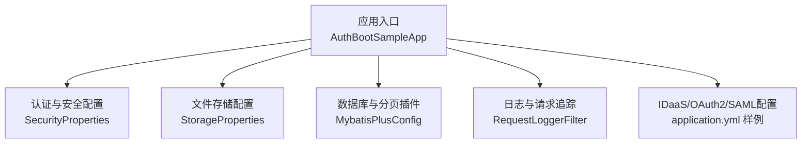
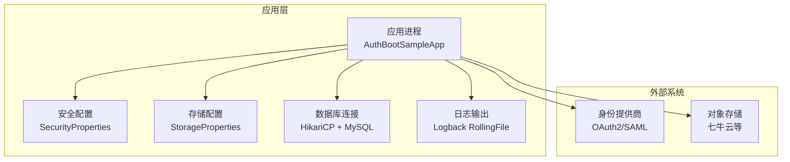
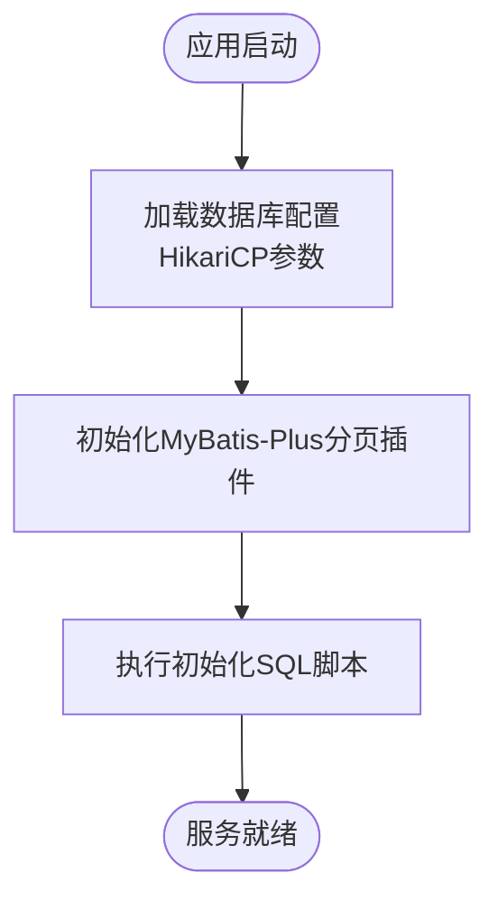
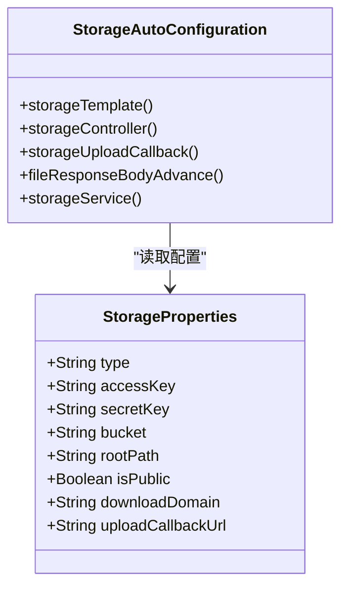
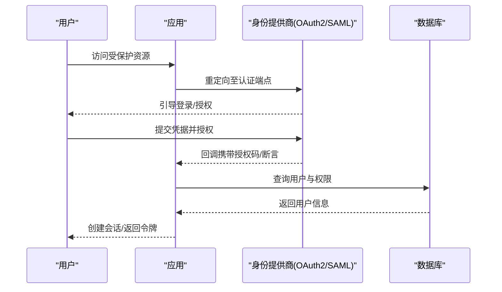
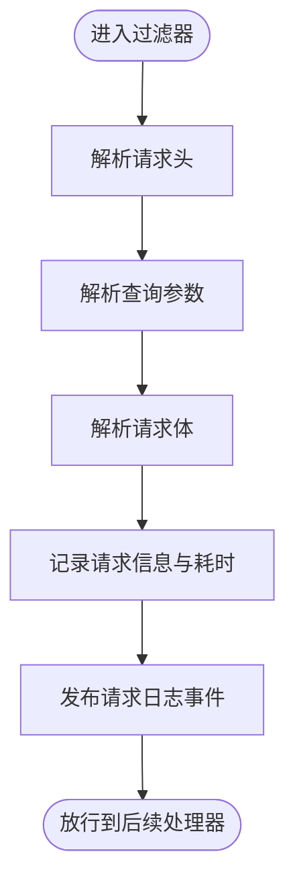
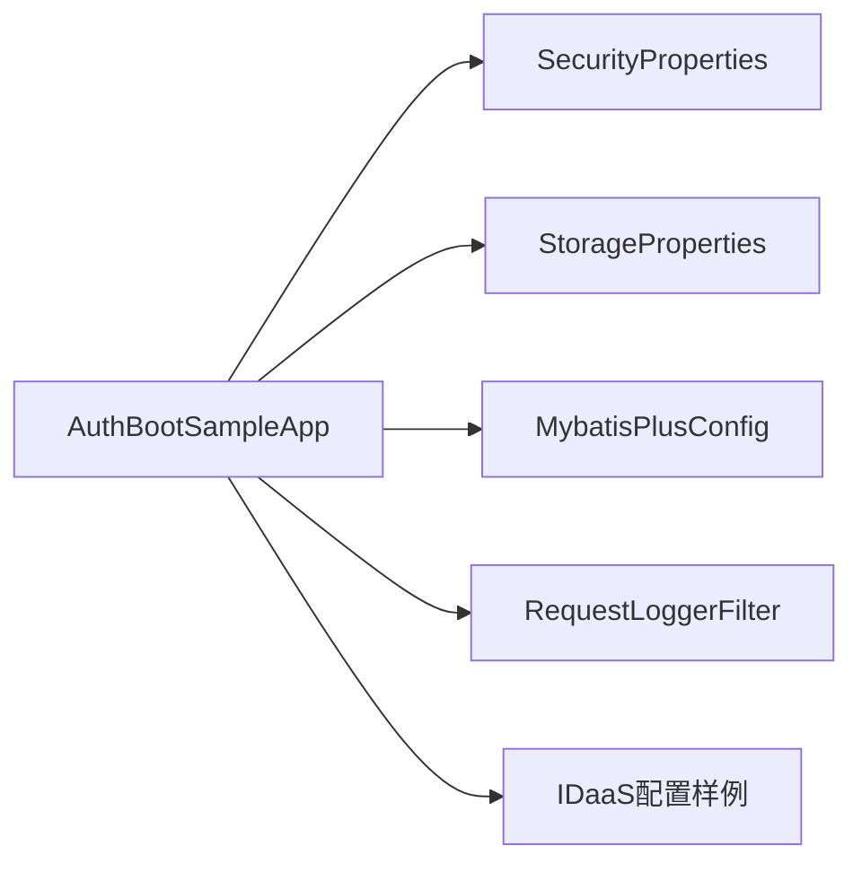

# 部署指南

<cite>
**本文引用的文件**
- [application.yml](file://application.yml)
- [docs/application.yml](file://docs/application.yml)
- [sample/auth-boot-sample/src/main/resources/application.yml](file://sample/auth-boot-sample/src/main/resources/application.yml)
- [sample/auth-boot-sample/src/main/resources/application-dev.yml](file://sample/auth-boot-sample/src/main/resources/application-dev.yml)
- [boot/storage-spring-boot-starter/src/main/java/com/kewen/framework/storage/boot/StorageProperties.java](file://boot/storage-spring-boot-starter/src/main/java/com/kewen/framework/storage/boot/StorageProperties.java)
- [boot/storage-spring-boot-starter/src/main/java/com/kewen/framework/storage/boot/StorageAutoConfiguration.java](file://boot/storage-spring-boot-starter/src/main/java/com/kewen/framework/storage/boot/StorageAutoConfiguration.java)
- [boot/basic-spring-boot-starter/src/main/java/com/kewen/framework/boot/basic/config/MybatisPlusConfig.java](file://boot/basic-spring-boot-starter/src/main/java/com/kewen/framework/boot/basic/config/MybatisPlusConfig.java)
- [qy-auth/auth-spring-boot-starter/src/main/java/com/kewen/framework/auth/security/properties/SecurityProperties.java](file://qy-auth/auth-spring-boot-starter/src/main/java/com/kewen/framework/auth/security/properties/SecurityProperties.java)
- [sample/auth-boot-sample/src/main/java/com/kewen/framework/auth/sample/AuthBootSampleApp.java](file://sample/auth-boot-sample/src/main/java/com/kewen/framework/auth/sample/AuthBootSampleApp.java)
- [sample/idaas-sp-boot-sample/src/main/resources/application.yml](file://sample/idaas-sp-boot-sample/src/main/resources/application.yml)
- [qy-idaas/README.md](file://qy-idaas/README.md)
- [sample/auth-boot-sample/src/main/resources/logback-spring.xml](file://sample/auth-boot-sample/src/main/resources/logback-spring.xml)
- [sample/basic-boot-sample/src/main/resources/logback-spring.xml](file://sample/basic-boot-sample/src/main/resources/logback-spring.xml)
- [sample/idaas-sp-boot-sample/src/main/resources/logback-spring.xml](file://sample/idaas-sp-boot-sample/src/main/resources/logback-spring.xml)
- [basic/src/main/java/com/kewen/framework/basic/logger/RequestLoggerFilter.java](file://basic/src/main/java/com/kewen/framework/basic/logger/RequestLoggerFilter.java)
- [boot/basic-spring-boot-starter/src/main/resources/META-INF/additional-spring-configuration-metadata.json](file://boot/basic-spring-boot-starter/src/main/resources/META-INF/additional-spring-configuration-metadata.json)
- [qy-auth/auth-spring-boot-starter/src/main/java/com/kewen/framework/auth/security/config/SecurityBeanConfig.java](file://qy-auth/auth-spring-boot-starter/src/main/java/com/kewen/framework/auth/security/config/SecurityBeanConfig.java)
- [docs/sql/storage.sql](file://docs/sql/storage.sql)
- [docs/sql/sys_request_log.sql](file://docs/sql/sys_request_log.sql)
- [sample/auth-boot-sample/relation/init.sql](file://sample/auth-boot-sample/relation/init.sql)
- [qy-auth/relation/properties/application-sample.yml](file://qy-auth/relation/properties/application-sample.yml)
</cite>

## 目录
1. [简介](#简介)
2. [项目结构](#项目结构)
3. [核心组件](#核心组件)
4. [架构总览](#架构总览)
5. [详细组件分析](#详细组件分析)
6. [依赖关系分析](#依赖关系分析)
7. [性能与资源优化](#性能与资源优化)
8. [监控与日志最佳实践](#监控与日志最佳实践)
9. [数据库与文件存储配置](#数据库与文件存储配置)
10. [安全配置](#安全配置)
11. [容器化与高可用部署](#容器化与高可用部署)
12. [备份与恢复策略](#备份与恢复策略)
13. [常见问题排查](#常见问题排查)
14. [自动化部署与CI/CD建议](#自动化部署与cicd建议)
15. [结论](#结论)

## 简介
本指南面向运维工程师与平台工程团队，提供kewen-framework在生产环境的完整部署方案，涵盖数据库连接、文件存储、安全配置、容器化与高可用、监控与日志、性能调优、备份与恢复、故障排查以及自动化部署与CI/CD建议。文档基于仓库内现有配置与样例进行说明，并给出可落地的实施步骤。

## 项目结构
kewen-framework采用多模块Maven工程组织，核心模块包括基础能力、认证鉴权、文件存储、租户等。生产部署通常以“认证样例应用”作为参考，结合各starter模块按需启用。

图表来源
- [sample/auth-boot-sample/src/main/java/com/kewen/framework/auth/sample/AuthBootSampleApp.java:1-13](file://sample/auth-boot-sample/src/main/java/com/kewen/framework/auth/sample/AuthBootSampleApp.java#L1-L13)
- [qy-auth/auth-spring-boot-starter/src/main/java/com/kewen/framework/auth/security/properties/SecurityProperties.java:1-23](file://qy-auth/auth-spring-boot-starter/src/main/java/com/kewen/framework/auth/security/properties/SecurityProperties.java#L1-L23)
- [boot/storage-spring-boot-starter/src/main/java/com/kewen/framework/storage/boot/StorageProperties.java:1-45](file://boot/storage-spring-boot-starter/src/main/java/com/kewen/framework/storage/boot/StorageProperties.java#L1-L45)
- [boot/basic-spring-boot-starter/src/main/java/com/kewen/framework/boot/basic/config/MybatisPlusConfig.java:1-24](file://boot/basic-spring-boot-starter/src/main/java/com/kewen/framework/boot/basic/config/MybatisPlusConfig.java#L1-L24)
- [basic/src/main/java/com/kewen/framework/basic/logger/RequestLoggerFilter.java:1-125](file://basic/src/main/java/com/kewen/framework/basic/logger/RequestLoggerFilter.java#L1-L125)
- [sample/idaas-sp-boot-sample/src/main/resources/application.yml:79-106](file://sample/idaas-sp-boot-sample/src/main/resources/application.yml#L79-L106)

章节来源
- [sample/auth-boot-sample/src/main/java/com/kewen/framework/auth/sample/AuthBootSampleApp.java:1-13](file://sample/auth-boot-sample/src/main/java/com/kewen/framework/auth/sample/AuthBootSampleApp.java#L1-L13)

## 核心组件
- 应用入口与运行：通过Spring Boot主类启动，监听HTTP端口并加载各自动配置。
- 数据库与分页：MyBatis-Plus分页插件已内置，生产需配合连接池与数据库实例。
- 文件存储：支持对象存储（如七牛云），可通过配置启用并暴露文件上传/回调接口。
- 安全与会话：提供记住我、最大会话数、登录URL等配置；支持OAuth2/SAML等外部身份提供商。
- 日志与请求追踪：统一请求日志过滤器，支持持久化与消息推送开关。

章节来源
- [boot/basic-spring-boot-starter/src/main/java/com/kewen/framework/boot/basic/config/MybatisPlusConfig.java:1-24](file://boot/basic-spring-boot-starter/src/main/java/com/kewen/framework/boot/basic/config/MybatisPlusConfig.java#L1-L24)
- [boot/storage-spring-boot-starter/src/main/java/com/kewen/framework/storage/boot/StorageAutoConfiguration.java:1-71](file://boot/storage-spring-boot-starter/src/main/java/com/kewen/framework/storage/boot/StorageAutoConfiguration.java#L1-L71)
- [qy-auth/auth-spring-boot-starter/src/main/java/com/kewen/framework/auth/security/properties/SecurityProperties.java:1-23](file://qy-auth/auth-spring-boot-starter/src/main/java/com/kewen/framework/auth/security/properties/SecurityProperties.java#L1-L23)
- [basic/src/main/java/com/kewen/framework/basic/logger/RequestLoggerFilter.java:1-125](file://basic/src/main/java/com/kewen/framework/basic/logger/RequestLoggerFilter.java#L1-L125)

## 架构总览
下图展示生产部署的关键交互：应用通过配置中心/环境变量读取数据库、存储与安全参数；对外提供HTTP接口；内部通过MyBatis访问数据库；文件上传经由存储模板对接对象存储；日志通过Logback滚动写入磁盘或远端。

图表来源
- [sample/auth-boot-sample/src/main/java/com/kewen/framework/auth/sample/AuthBootSampleApp.java:1-13](file://sample/auth-boot-sample/src/main/java/com/kewen/framework/auth/sample/AuthBootSampleApp.java#L1-L13)
- [qy-auth/auth-spring-boot-starter/src/main/java/com/kewen/framework/auth/security/properties/SecurityProperties.java:1-23](file://qy-auth/auth-spring-boot-starter/src/main/java/com/kewen/framework/auth/security/properties/SecurityProperties.java#L1-L23)
- [boot/storage-spring-boot-starter/src/main/java/com/kewen/framework/storage/boot/StorageProperties.java:1-45](file://boot/storage-spring-boot-starter/src/main/java/com/kewen/framework/storage/boot/StorageProperties.java#L1-L45)
- [sample/auth-boot-sample/src/main/resources/application.yml:9-22](file://sample/auth-boot-sample/src/main/resources/application.yml#L9-L22)
- [sample/auth-boot-sample/src/main/resources/logback-spring.xml:1-36](file://sample/auth-boot-sample/src/main/resources/logback-spring.xml#L1-L36)

## 详细组件分析

### 数据库连接与分页
- 连接池：HikariCP在样例中配置了连接超时、空闲超时、最大池大小等参数，生产应结合QPS与事务复杂度调整。
- 分页插件：MyBatis-Plus分页插件已启用，MySQL类型已配置，多数据源场景建议明确DbType。
- 初始化SQL：样例提供了初始化脚本位置，生产需确保首次部署执行建表与基础数据导入。

图表来源
- [sample/auth-boot-sample/src/main/resources/application.yml:9-22](file://sample/auth-boot-sample/src/main/resources/application.yml#L9-L22)
- [boot/basic-spring-boot-starter/src/main/java/com/kewen/framework/boot/basic/config/MybatisPlusConfig.java:1-24](file://boot/basic-spring-boot-starter/src/main/java/com/kewen/framework/boot/basic/config/MybatisPlusConfig.java#L1-L24)
- [sample/auth-boot-sample/relation/init.sql](file://sample/auth-boot-sample/relation/init.sql)

章节来源
- [sample/auth-boot-sample/src/main/resources/application.yml:9-22](file://sample/auth-boot-sample/src/main/resources/application.yml#L9-L22)
- [boot/basic-spring-boot-starter/src/main/java/com/kewen/framework/boot/basic/config/MybatisPlusConfig.java:1-24](file://boot/basic-spring-boot-starter/src/main/java/com/kewen/framework/boot/basic/config/MybatisPlusConfig.java#L1-L24)
- [sample/auth-boot-sample/relation/init.sql](file://sample/auth-boot-sample/relation/init.sql)

### 文件存储（对象存储）
- 配置项：类型、AK/SK、桶、根目录、是否公开、下载域名、上传回调地址等。
- 自动装配：根据配置创建存储模板与文件上传/回调端点。
- 使用建议：生产需设置稳定的下载域名与HTTPS；回调地址需公网可达且具备幂等性。

图表来源
- [boot/storage-spring-boot-starter/src/main/java/com/kewen/framework/storage/boot/StorageProperties.java:1-45](file://boot/storage-spring-boot-starter/src/main/java/com/kewen/framework/storage/boot/StorageProperties.java#L1-L45)
- [boot/storage-spring-boot-starter/src/main/java/com/kewen/framework/storage/boot/StorageAutoConfiguration.java:1-71](file://boot/storage-spring-boot-starter/src/main/java/com/kewen/framework/storage/boot/StorageAutoConfiguration.java#L1-L71)

章节来源
- [boot/storage-spring-boot-starter/src/main/java/com/kewen/framework/storage/boot/StorageProperties.java:1-45](file://boot/storage-spring-boot-starter/src/main/java/com/kewen/framework/storage/boot/StorageProperties.java#L1-L45)
- [boot/storage-spring-boot-starter/src/main/java/com/kewen/framework/storage/boot/StorageAutoConfiguration.java:1-71](file://boot/storage-spring-boot-starter/src/main/java/com/kewen/framework/storage/boot/StorageAutoConfiguration.java#L1-L71)

### 安全与会话
- 当前用户接口、登录URL、记住我有效期、最大会话数等。
- 支持OAuth2与SAML配置，样例展示了多客户端与元数据配置。
- 密码编码器默认使用系统工厂创建的委托编码器。

图表来源
- [qy-auth/auth-spring-boot-starter/src/main/java/com/kewen/framework/auth/security/properties/SecurityProperties.java:1-23](file://qy-auth/auth-spring-boot-starter/src/main/java/com/kewen/framework/auth/security/properties/SecurityProperties.java#L1-L23)
- [sample/idaas-sp-boot-sample/src/main/resources/application.yml:79-106](file://sample/idaas-sp-boot-sample/src/main/resources/application.yml#L79-L106)
- [qy-idaas/README.md:37-191](file://qy-idaas/README.md#L37-L191)
- [qy-auth/auth-spring-boot-starter/src/main/java/com/kewen/framework/auth/security/config/SecurityBeanConfig.java:19-50](file://qy-auth/auth-spring-boot-starter/src/main/java/com/kewen/framework/auth/security/config/SecurityBeanConfig.java#L19-L50)

章节来源
- [qy-auth/auth-spring-boot-starter/src/main/java/com/kewen/framework/auth/security/properties/SecurityProperties.java:1-23](file://qy-auth/auth-spring-boot-starter/src/main/java/com/kewen/framework/auth/security/properties/SecurityProperties.java#L1-L23)
- [sample/idaas-sp-boot-sample/src/main/resources/application.yml:79-106](file://sample/idaas-sp-boot-sample/src/main/resources/application.yml#L79-L106)
- [qy-idaas/README.md:37-191](file://qy-idaas/README.md#L37-L191)
- [qy-auth/auth-spring-boot-starter/src/main/java/com/kewen/framework/auth/security/config/SecurityBeanConfig.java:19-50](file://qy-auth/auth-spring-boot-starter/src/main/java/com/kewen/framework/auth/security/config/SecurityBeanConfig.java#L19-L50)

### 请求日志与追踪
- 请求日志过滤器会记录请求头、参数、Body、耗时，并发布事件以便持久化或消息推送。
- 配置项：可控制请求日志是否持久化到数据库、是否发送到方糖消息。

图表来源
- [basic/src/main/java/com/kewen/framework/basic/logger/RequestLoggerFilter.java:1-125](file://basic/src/main/java/com/kewen/framework/basic/logger/RequestLoggerFilter.java#L1-L125)
- [boot/basic-spring-boot-starter/src/main/resources/META-INF/additional-spring-configuration-metadata.json:1-16](file://boot/basic-spring-boot-starter/src/main/resources/META-INF/additional-spring-configuration-metadata.json#L1-L16)
- [docs/application.yml:6-10](file://docs/application.yml#L6-L10)

章节来源
- [basic/src/main/java/com/kewen/framework/basic/logger/RequestLoggerFilter.java:1-125](file://basic/src/main/java/com/kewen/framework/basic/logger/RequestLoggerFilter.java#L1-L125)
- [boot/basic-spring-boot-starter/src/main/resources/META-INF/additional-spring-configuration-metadata.json:1-16](file://boot/basic-spring-boot-starter/src/main/resources/META-INF/additional-spring-configuration-metadata.json#L1-L16)
- [docs/application.yml:6-10](file://docs/application.yml#L6-L10)

## 依赖关系分析
- 应用启动类依赖各starter自动装配，最终形成完整的Web+安全+存储+日志能力。
- 存储模块与数据库模块相互独立，按需启用。
- 安全模块与认证样例联动，IDaaS模块提供OAuth2/SAML扩展。

图表来源
- [sample/auth-boot-sample/src/main/java/com/kewen/framework/auth/sample/AuthBootSampleApp.java:1-13](file://sample/auth-boot-sample/src/main/java/com/kewen/framework/auth/sample/AuthBootSampleApp.java#L1-L13)
- [qy-auth/auth-spring-boot-starter/src/main/java/com/kewen/framework/auth/security/properties/SecurityProperties.java:1-23](file://qy-auth/auth-spring-boot-starter/src/main/java/com/kewen/framework/auth/security/properties/SecurityProperties.java#L1-L23)
- [boot/storage-spring-boot-starter/src/main/java/com/kewen/framework/storage/boot/StorageProperties.java:1-45](file://boot/storage-spring-boot-starter/src/main/java/com/kewen/framework/storage/boot/StorageProperties.java#L1-L45)
- [boot/basic-spring-boot-starter/src/main/java/com/kewen/framework/boot/basic/config/MybatisPlusConfig.java:1-24](file://boot/basic-spring-boot-starter/src/main/java/com/kewen/framework/boot/basic/config/MybatisPlusConfig.java#L1-L24)
- [basic/src/main/java/com/kewen/framework/basic/logger/RequestLoggerFilter.java:1-125](file://basic/src/main/java/com/kewen/framework/basic/logger/RequestLoggerFilter.java#L1-L125)
- [sample/idaas-sp-boot-sample/src/main/resources/application.yml:79-106](file://sample/idaas-sp-boot-sample/src/main/resources/application.yml#L79-L106)

## 性能与资源优化
- 连接池参数：根据峰值QPS与慢查询情况调整最大池大小、连接超时、空闲超时。
- 分页与查询：对高频查询建立合适索引，避免N+1；分页查询限制最大页大小。
- 缓存策略：结合业务热点数据引入Redis缓存；注意缓存失效与一致性。
- GC与JVM：生产建议固定堆大小、开启逃逸分析与ZGC（JDK17+），并设置合理的Metaspace与线程栈大小。
- 并发与限流：在网关或应用层配置限流与熔断，防止雪崩。

## 监控与日志最佳实践
- 日志落盘：使用Logback RollingFile按天切割，控制单文件大小与总容量。
- 日志采集：建议将日志输出到标准输出并由容器编排收集；同时保留本地文件便于排查。
- 链路追踪：结合TraceId在请求过滤器中透传，统一输出到日志或APM。
- 健康检查：暴露健康端点，结合探针实现自动扩缩容与故障摘除。
- 指标采集：暴露Prometheus指标端点，采集CPU、内存、连接池状态、请求耗时等。

章节来源
- [sample/auth-boot-sample/src/main/resources/logback-spring.xml:1-36](file://sample/auth-boot-sample/src/main/resources/logback-spring.xml#L1-L36)
- [sample/basic-boot-sample/src/main/resources/logback-spring.xml:1-30](file://sample/basic-boot-sample/src/main/resources/logback-spring.xml#L1-L30)
- [sample/idaas-sp-boot-sample/src/main/resources/logback-spring.xml:1-36](file://sample/idaas-sp-boot-sample/src/main/resources/logback-spring.xml#L1-L36)
- [basic/src/main/java/com/kewen/framework/basic/logger/RequestLoggerFilter.java:1-125](file://basic/src/main/java/com/kewen/framework/basic/logger/RequestLoggerFilter.java#L1-L125)

## 数据库与文件存储配置
- 数据库连接
  - 开发样例使用MySQL驱动与HikariCP参数，生产需替换为生产库地址、账号与SSL。
  - 建议开启只读副本与主从切换；连接池最大池大小与最小空闲应结合业务峰值与慢查询分析。
- 文件存储
  - 对象存储类型、AK/SK、桶、根目录、是否公开、下载域名、上传回调地址均通过配置项控制。
  - 生产务必使用私有存储或带鉴权下载域名；回调地址需幂等并校验签名。

章节来源
- [sample/auth-boot-sample/src/main/resources/application-dev.yml:1-6](file://sample/auth-boot-sample/src/main/resources/application-dev.yml#L1-L6)
- [boot/storage-spring-boot-starter/src/main/java/com/kewen/framework/storage/boot/StorageProperties.java:1-45](file://boot/storage-spring-boot-starter/src/main/java/com/kewen/framework/storage/boot/StorageProperties.java#L1-L45)

## 安全配置
- 登录与会话
  - 登录URL、用户名/密码参数、当前用户接口、记住我开关与有效期、最大会话数与互斥策略。
- OAuth2/SAML
  - 支持多客户端配置，样例展示了多个IdP注册ID与元数据配置。
  - 建议为不同环境准备独立的client-id/client-secret与JWK集合。
- 密码编码
  - 默认使用委托编码器，生产需确保密钥轮换与兼容策略。

章节来源
- [application.yml:12-32](file://application.yml#L12-L32)
- [docs/application.yml:13-21](file://docs/application.yml#L13-L21)
- [sample/idaas-sp-boot-sample/src/main/resources/application.yml:79-106](file://sample/idaas-sp-boot-sample/src/main/resources/application.yml#L79-L106)
- [qy-idaas/README.md:37-191](file://qy-idaas/README.md#L37-L191)
- [qy-auth/auth-spring-boot-starter/src/main/java/com/kewen/framework/auth/security/config/SecurityBeanConfig.java:19-50](file://qy-auth/auth-spring-boot-starter/src/main/java/com/kewen/framework/auth/security/config/SecurityBeanConfig.java#L19-L50)

## 容器化与高可用部署
- 容器镜像
  - 使用官方JRE镜像作为基础镜像，打包产物为可执行jar；挂载日志目录与配置文件。
  - 建议使用多阶段构建减小镜像体积。
- 环境变量
  - 通过环境变量覆盖数据库URL/用户名/密码、存储AK/SK、安全登录参数等敏感配置。
- 集群与副本
  - 副本数≥2，结合负载均衡实现高可用；会话建议使用共享存储（如Redis）或粘性会话策略。
- 负载均衡
  - Nginx/Ingress前置，开启健康检查与超时重试；后端节点按权重与可用区分布。
- 配置管理
  - 使用ConfigMap/Secret管理非敏感与敏感配置；版本化变更并灰度发布。

## 备份与恢复策略
- 数据库
  - 使用逻辑备份（如mysqldump）与物理备份（如Percona XtraBackup）相结合；定期校验恢复流程。
  - 主从复制与快照策略，确保RPO/RTO达标。
- 文件存储
  - 对象存储具备多副本与跨区域冗余，仍需制定版本控制与合规保留策略。
- 配置与日志
  - 配置文件纳入版本管理；日志保留周期与归档策略明确。

## 常见问题排查
- 启动失败
  - 检查数据库连通性与驱动类名；确认HikariCP参数合理。
  - 查看应用日志定位异常堆栈。
- 登录失败
  - 校验登录URL、用户名/密码参数与用户是否存在；检查密码编码器配置。
  - 若使用OAuth2/SAML，核对客户端配置、元数据与JWK集合。
- 文件上传异常
  - 校验AK/SK、桶名、下载域名与回调地址；确认网络可达与签名验证。
- 日志未落盘
  - 检查logging.file.path与文件权限；确认Logback配置生效。
- 会话冲突
  - 校验最大会话数与互斥策略；若使用分布式会话，检查Redis连通性。

## 自动化部署与CI/CD建议
- 构建
  - Maven打包，跳过测试或仅运行单元测试；生成可执行jar。
- 扫描
  - 镜像扫描与依赖漏洞扫描；静态代码分析。
- 部署
  - Helm/Kubernetes或Docker Compose编排；蓝绿/金丝雀发布。
- 监控
  - 健康检查、指标与告警；日志聚合与检索。
- 回滚
  - 版本回退与快速恢复预案；数据库备份与回滚演练。

## 结论
本指南基于kewen-framework现有模块与样例，给出了生产部署的完整路径：从数据库与存储配置、安全策略、容器化与高可用，到监控日志、性能优化、备份恢复与自动化流水线。建议在上线前完成压测与演练，确保各环节稳定可靠。