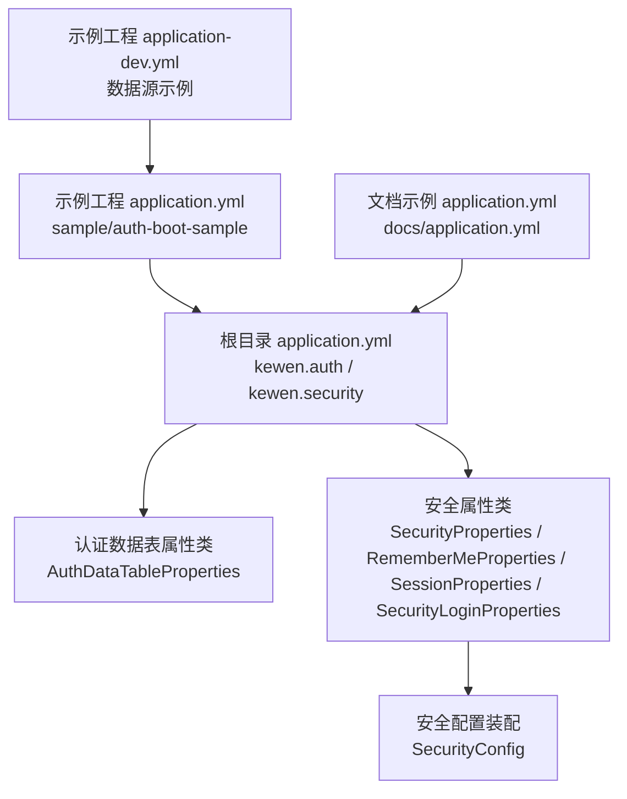
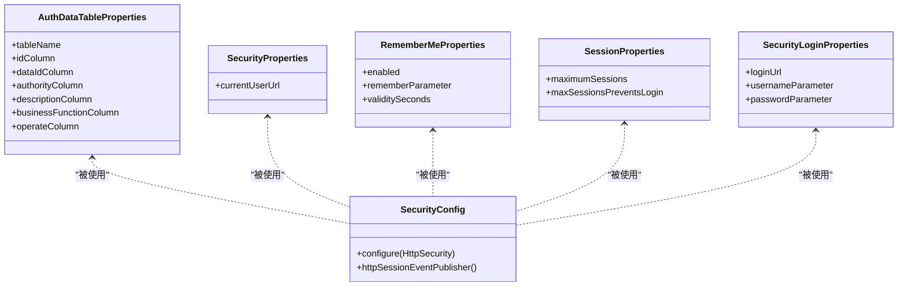
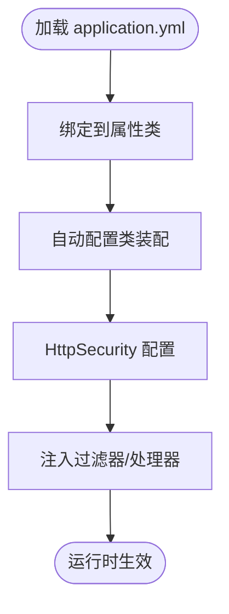

# 全局配置

<cite>
**本文引用的文件**
- [application.yml](file://application.yml)
- [docs/application.yml](file://docs/application.yml)
- [qy-auth/auth-core-spring-boot-starter/src/main/java/com/kewen/framework/boot/auth/core/properties/AuthDataTableProperties.java](file://qy-auth/auth-core-spring-boot-starter/src/main/java/com/kewen/framework/boot/auth/core/properties/AuthDataTableProperties.java)
- [qy-auth/auth-spring-boot-starter/src/main/java/com/kewen/framework/auth/security/properties/SecurityProperties.java](file://qy-auth/auth-spring-boot-starter/src/main/java/com/kewen/framework/auth/security/properties/SecurityProperties.java)
- [qy-auth/auth-spring-boot-starter/src/main/java/com/kewen/framework/auth/security/properties/RememberMeProperties.java](file://qy-auth/auth-spring-boot-starter/src/main/java/com/kewen/framework/auth/security/properties/RememberMeProperties.java)
- [qy-auth/auth-spring-boot-starter/src/main/java/com/kewen/framework/auth/security/properties/SessionProperties.java](file://qy-auth/auth-spring-boot-starter/src/main/java/com/kewen/framework/auth/security/properties/SessionProperties.java)
- [qy-auth/auth-spring-boot-starter/src/main/java/com/kewen/framework/auth/security/password/properties/SecurityLoginProperties.java](file://qy-auth/auth-spring-boot-starter/src/main/java/com/kewen/framework/auth/security/password/properties/SecurityLoginProperties.java)
- [qy-auth/auth-spring-boot-starter/src/main/java/com/kewen/framework/auth/security/config/SecurityConfig.java](file://qy-auth/auth-spring-boot-starter/src/main/java/com/kewen/framework/auth/security/config/SecurityConfig.java)
- [qy-auth/auth-core-spring-boot-starter/src/main/resources/META-INF/additional-spring-configuration-metadata.json](file://qy-auth/auth-core-spring-boot-starter/src/main/resources/META-INF/additional-spring-configuration-metadata.json)
- [sample/auth-boot-sample/src/main/resources/application.yml](file://sample/auth-boot-sample/src/main/resources/application.yml)
- [sample/auth-boot-sample/src/main/resources/application-dev.yml](file://sample/auth-boot-sample/src/main/resources/application-dev.yml)
- [qy-auth/relation/properties/application-sample.yml](file://qy-auth/relation/properties/application-sample.yml)
</cite>

## 目录
1. [简介](#简介)
2. [项目结构与配置入口](#项目结构与配置入口)
3. [核心配置总览](#核心配置总览)
4. [架构概览与配置映射](#架构概览与配置映射)
5. [详细配置项解析](#详细配置项解析)
6. [依赖关系与默认值](#依赖关系与默认值)
7. [环境配置示例](#环境配置示例)
8. [性能与安全考量](#性能与安全考量)
9. [故障排查与常见问题](#故障排查与常见问题)
10. [结论](#结论)

## 简介
本指南聚焦于全局配置，系统性解读 application.yml 中的关键配置项，涵盖认证数据表、记住我、会话管理、登录参数等，并结合自动配置类与属性类说明其在运行时的行为与影响。同时提供开发、测试、生产三类环境的最佳实践建议与排障指引。

## 项目结构与配置入口
- 全局配置入口位于仓库根目录的 application.yml，用于集中声明 kewen.auth 与 kewen.security 下的各项参数。
- 示例工程 sample/auth-boot-sample 提供了更完整的示例配置，便于对照理解。
- 文档目录 docs/application.yml 展示了部分通用配置（如消息、租户、安全会话与记住我）的参考写法。

**图表来源**
- [application.yml:1-32](file://application.yml#L1-L32)
- [sample/auth-boot-sample/src/main/resources/application.yml:1-55](file://sample/auth-boot-sample/src/main/resources/application.yml#L1-L55)
- [sample/auth-boot-sample/src/main/resources/application-dev.yml:1-6](file://sample/auth-boot-sample/src/main/resources/application-dev.yml#L1-L6)
- [docs/application.yml:1-21](file://docs/application.yml#L1-L21)

**章节来源**
- [application.yml:1-32](file://application.yml#L1-L32)
- [sample/auth-boot-sample/src/main/resources/application.yml:1-55](file://sample/auth-boot-sample/src/main/resources/application.yml#L1-L55)
- [sample/auth-boot-sample/src/main/resources/application-dev.yml:1-6](file://sample/auth-boot-sample/src/main/resources/application-dev.yml#L1-L6)
- [docs/application.yml:1-21](file://docs/application.yml#L1-L21)

## 核心配置总览
- kewen.auth.auth-data-table：定义认证数据表的表名与各列字段映射，用于权限数据持久化与查询。
- kewen.auth.cache-auth：是否启用菜单权限缓存（来自配置元数据）。
- kewen.security.remember-me：记住我功能开关、参数名与有效期。
- kewen.security.session：最大会话数与“达到上限时”的策略。
- kewen.security.current-user-url：当前用户信息接口路径。
- kewen.security.login.password：基于密码的登录参数（登录URL、用户名/密码参数名）。
- kewen.security.login.saml：SAML 登录相关参数（注册ID、实体ID、元数据/证书资源、SSO 地址等）。

以上配置项均通过对应的属性类进行绑定，并由自动配置类在运行时生效。

**章节来源**
- [application.yml:1-32](file://application.yml#L1-L32)
- [qy-auth/auth-core-spring-boot-starter/src/main/java/com/kewen/framework/boot/auth/core/properties/AuthDataTableProperties.java:14-109](file://qy-auth/auth-core-spring-boot-starter/src/main/java/com/kewen/framework/boot/auth/core/properties/AuthDataTableProperties.java#L14-L109)
- [qy-auth/auth-spring-boot-starter/src/main/java/com/kewen/framework/auth/security/properties/RememberMeProperties.java:11-26](file://qy-auth/auth-spring-boot-starter/src/main/java/com/kewen/framework/auth/security/properties/RememberMeProperties.java#L11-L26)
- [qy-auth/auth-spring-boot-starter/src/main/java/com/kewen/framework/auth/security/properties/SessionProperties.java:11-22](file://qy-auth/auth-spring-boot-starter/src/main/java/com/kewen/framework/auth/security/properties/SessionProperties.java#L11-L22)
- [qy-auth/auth-spring-boot-starter/src/main/java/com/kewen/framework/auth/security/properties/SecurityProperties.java:13-19](file://qy-auth/auth-spring-boot-starter/src/main/java/com/kewen/framework/auth/security/properties/SecurityProperties.java#L13-L19)
- [qy-auth/auth-spring-boot-starter/src/main/java/com/kewen/framework/auth/security/password/properties/SecurityLoginProperties.java:13-28](file://qy-auth/auth-spring-boot-starter/src/main/java/com/kewen/framework/auth/security/password/properties/SecurityLoginProperties.java#L13-L28)

## 架构概览与配置映射
全局配置通过 Spring Boot 的 @ConfigurationProperties 绑定到属性类，再由自动配置类注入到安全过滤链与服务中，形成“配置 -> 属性类 -> 自动配置 -> 安全组件”的闭环。

**图表来源**
- [qy-auth/auth-core-spring-boot-starter/src/main/java/com/kewen/framework/boot/auth/core/properties/AuthDataTableProperties.java:14-109](file://qy-auth/auth-core-spring-boot-starter/src/main/java/com/kewen/framework/boot/auth/core/properties/AuthDataTableProperties.java#L14-L109)
- [qy-auth/auth-spring-boot-starter/src/main/java/com/kewen/framework/auth/security/properties/SecurityProperties.java:13-19](file://qy-auth/auth-spring-boot-starter/src/main/java/com/kewen/framework/auth/security/properties/SecurityProperties.java#L13-L19)
- [qy-auth/auth-spring-boot-starter/src/main/java/com/kewen/framework/auth/security/properties/RememberMeProperties.java:11-26](file://qy-auth/auth-spring-boot-starter/src/main/java/com/kewen/framework/auth/security/properties/RememberMeProperties.java#L11-L26)
- [qy-auth/auth-spring-boot-starter/src/main/java/com/kewen/framework/auth/security/properties/SessionProperties.java:11-22](file://qy-auth/auth-spring-boot-starter/src/main/java/com/kewen/framework/auth/security/properties/SessionProperties.java#L11-L22)
- [qy-auth/auth-spring-boot-starter/src/main/java/com/kewen/framework/auth/security/password/properties/SecurityLoginProperties.java:13-28](file://qy-auth/auth-spring-boot-starter/src/main/java/com/kewen/framework/auth/security/password/properties/SecurityLoginProperties.java#L13-L28)
- [qy-auth/auth-spring-boot-starter/src/main/java/com/kewen/framework/auth/security/config/SecurityConfig.java:34-134](file://qy-auth/auth-spring-boot-starter/src/main/java/com/kewen/framework/auth/security/config/SecurityConfig.java#L34-L134)

## 详细配置项解析

### kewen.auth.auth-data-table：认证数据表配置
- 作用：定义权限数据表的表名与各列字段映射，用于权限数据的持久化与查询。
- 关键字段：
  - 表名：用于定位权限主表
  - 主键列：用于唯一标识
  - 业务ID列：用于绑定具体业务对象
  - 权限标识列：用于存储权限编码或规则
  - 描述列：用于存储权限描述
  - 业务功能列：用于区分不同业务域
  - 操作列：用于标识授权操作类型
- 影响范围：权限数据处理器、数据范围拦截器、菜单与API鉴权等模块。

**章节来源**
- [application.yml:3-11](file://application.yml#L3-L11)
- [qy-auth/auth-core-spring-boot-starter/src/main/java/com/kewen/framework/boot/auth/core/properties/AuthDataTableProperties.java:14-109](file://qy-auth/auth-core-spring-boot-starter/src/main/java/com/kewen/framework/boot/auth/core/properties/AuthDataTableProperties.java#L14-L109)

### kewen.auth.cache-auth：菜单权限缓存
- 作用：是否启用菜单权限缓存以降低查询开销。
- 类型：布尔值
- 默认值：来自配置元数据的默认值
- 注意：该配置项在示例中可见，但需确认实际实现是否消费该开关。

**章节来源**
- [application.yml:11](file://application.yml#L11)
- [qy-auth/auth-core-spring-boot-starter/src/main/resources/META-INF/additional-spring-configuration-metadata.json:1-11](file://qy-auth/auth-core-spring-boot-starter/src/main/resources/META-INF/additional-spring-configuration-metadata.json#L1-L11)

### kewen.security.remember-me：记住我功能
- enabled：是否启用记住我
- remember-parameter：客户端携带的记住我参数名
- validity-seconds：记住我有效期（秒）
- 默认值：enabled=true、remember-parameter="remember-me"、validitySeconds=2592000（30天）

**章节来源**
- [application.yml:13-16](file://application.yml#L13-L16)
- [qy-auth/auth-spring-boot-starter/src/main/java/com/kewen/framework/auth/security/properties/RememberMeProperties.java:11-26](file://qy-auth/auth-spring-boot-starter/src/main/java/com/kewen/framework/auth/security/properties/RememberMeProperties.java#L11-L26)

### kewen.security.session：会话管理
- maximum-sessions：最大会话数量
- max-sessions-prevents-login：达到上限时是否阻止新登录（true为不允许，false为踢掉最早会话）
- 默认值：maximumSessions=10、maxSessionsPreventsLogin=false

**章节来源**
- [application.yml:17-19](file://application.yml#L17-L19)
- [qy-auth/auth-spring-boot-starter/src/main/java/com/kewen/framework/auth/security/properties/SessionProperties.java:11-22](file://qy-auth/auth-spring-boot-starter/src/main/java/com/kewen/framework/auth/security/properties/SessionProperties.java#L11-L22)

### kewen.security.current-user-url：当前用户接口地址
- 作用：设置获取当前用户信息的接口路径，用于上下文过滤器读取当前用户。
- 默认值："/currentUser"

**章节来源**
- [application.yml:20](file://application.yml#L20)
- [qy-auth/auth-spring-boot-starter/src/main/java/com/kewen/framework/auth/security/properties/SecurityProperties.java:13-19](file://qy-auth/auth-spring-boot-starter/src/main/java/com/kewen/framework/auth/security/properties/SecurityProperties.java#L13-L19)

### kewen.security.login.password：密码登录参数
- login-url：登录请求地址
- username-parameter：用户名参数名
- password-parameter：密码参数名
- 默认值：loginUrl="/login"、usernameParameter="username"、passwordParameter="password"

**章节来源**
- [application.yml:21-25](file://application.yml#L21-L25)
- [qy-auth/auth-spring-boot-starter/src/main/java/com/kewen/framework/auth/security/password/properties/SecurityLoginProperties.java:13-28](file://qy-auth/auth-spring-boot-starter/src/main/java/com/kewen/framework/auth/security/password/properties/SecurityLoginProperties.java#L13-L28)

### kewen.security.login.saml：SAML 登录参数
- registration-id：依赖方注册ID
- entity-id：本应用实体ID
- use-metadata：是否使用元数据
- web-sso-url：IDP 单点登录地址
- idp-certificate-resource：IDP 证书资源路径
- metadata-resource：IDP 元数据资源路径
- 用途：启用 SAML 协议的登录流程与断言处理。

**章节来源**
- [application.yml:26-32](file://application.yml#L26-L32)

## 依赖关系与默认值
- 配置到属性类的绑定：
  - kewen.auth.auth-data-table -> AuthDataTableProperties
  - kewen.auth.cache-auth -> 配置元数据（布尔）
  - kewen.security.remember-me -> RememberMeProperties
  - kewen.security.session -> SessionProperties
  - kewen.security.current-user-url -> SecurityProperties
  - kewen.security.login.password -> SecurityLoginProperties
- 自动配置装配：
  - SecurityConfig 通过 @EnableConfigurationProperties 启用上述属性类，并在 configure(HttpSecurity) 中应用配置。
- 默认值来源：
  - 属性类中显式给出默认值
  - 配置元数据提供布尔类型的默认值提示

**图表来源**
- [qy-auth/auth-spring-boot-starter/src/main/java/com/kewen/framework/auth/security/config/SecurityConfig.java:34-134](file://qy-auth/auth-spring-boot-starter/src/main/java/com/kewen/framework/auth/security/config/SecurityConfig.java#L34-L134)
- [qy-auth/auth-core-spring-boot-starter/src/main/java/com/kewen/framework/boot/auth/core/properties/AuthDataTableProperties.java:14-109](file://qy-auth/auth-core-spring-boot-starter/src/main/java/com/kewen/framework/boot/auth/core/properties/AuthDataTableProperties.java#L14-L109)
- [qy-auth/auth-spring-boot-starter/src/main/java/com/kewen/framework/auth/security/properties/RememberMeProperties.java:11-26](file://qy-auth/auth-spring-boot-starter/src/main/java/com/kewen/framework/auth/security/properties/RememberMeProperties.java#L11-L26)
- [qy-auth/auth-spring-boot-starter/src/main/java/com/kewen/framework/auth/security/properties/SessionProperties.java:11-22](file://qy-auth/auth-spring-boot-starter/src/main/java/com/kewen/framework/auth/security/properties/SessionProperties.java#L11-L22)
- [qy-auth/auth-spring-boot-starter/src/main/java/com/kewen/framework/auth/security/properties/SecurityProperties.java:13-19](file://qy-auth/auth-spring-boot-starter/src/main/java/com/kewen/framework/auth/security/properties/SecurityProperties.java#L13-L19)
- [qy-auth/auth-spring-boot-starter/src/main/java/com/kewen/framework/auth/security/password/properties/SecurityLoginProperties.java:13-28](file://qy-auth/auth-spring-boot-starter/src/main/java/com/kewen/framework/auth/security/password/properties/SecurityLoginProperties.java#L13-L28)

**章节来源**
- [qy-auth/auth-spring-boot-starter/src/main/java/com/kewen/framework/auth/security/config/SecurityConfig.java:34-134](file://qy-auth/auth-spring-boot-starter/src/main/java/com/kewen/framework/auth/security/config/SecurityConfig.java#L34-L134)

## 环境配置示例
- 开发环境（dev）
  - 数据源示例：MySQL 连接参数
  - 参考路径：sample/auth-boot-sample/src/main/resources/application-dev.yml
- 示例工程（sample）
  - 包含完整 kewen.auth 与 kewen.security 配置片段
  - 参考路径：sample/auth-boot-sample/src/main/resources/application.yml
- 文档示例（docs）
  - 展示了安全会话与记住我的典型写法
  - 参考路径：docs/application.yml

最佳实践建议
- 开发环境
  - 使用本地 MySQL 或内存数据库
  - 将 remember-me 有效期设为较短（如 7 天），便于调试
  - maximum-sessions 设为 1，避免多端并发导致的会话冲突
- 测试环境
  - 与开发一致，但可开启更严格的会话策略（如 max-sessions-prevents-login=true）
- 生产环境
  - remember-me 有效期按业务需求设定（如 30 天）
  - maximum-sessions 根据业务并发量合理设置
  - 登录URL与参数名建议统一命名规范，便于前端对接

**章节来源**
- [sample/auth-boot-sample/src/main/resources/application-dev.yml:1-6](file://sample/auth-boot-sample/src/main/resources/application-dev.yml#L1-L6)
- [sample/auth-boot-sample/src/main/resources/application.yml:31-55](file://sample/auth-boot-sample/src/main/resources/application.yml#L31-L55)
- [docs/application.yml:13-20](file://docs/application.yml#L13-L20)

## 性能与安全考量
- 认证数据表字段映射
  - 建议为业务ID、权限标识、业务功能等字段建立索引，提升查询效率
- 会话管理
  - maximum-sessions 过小可能导致频繁登录失败；过大可能占用服务器资源
  - max-sessions-prevents-login=true 适合高安全场景，false 更利于用户体验
- 记住我
  - 有效期越长风险越高，建议结合 HTTPS 与安全存储策略
- 登录参数
  - 登录URL与参数名应保持稳定，避免前端频繁变更
- SAML
  - 元数据与证书资源路径需确保可访问且权限正确

[本节为通用指导，无需特定文件引用]

## 故障排查与常见问题
- 配置未生效
  - 确认 application.yml 路径与激活的 profile 正确
  - 检查属性类上的 @ConfigurationProperties 前缀是否匹配
  - 确认自动配置类已启用相应属性类（@EnableConfigurationProperties）
- 记住我无效
  - 检查 remember-me.enabled 与 validity-seconds 是否合理
  - 确认客户端提交的参数名与配置一致
- 会话冲突
  - 若 max-sessions-prevents-login=true，新登录会被拒绝
  - 若为 false，早期会话将被强制失效
- 登录失败
  - 检查 login.password.login-url、username-parameter、password-parameter 是否与前端一致
- SAML 登录异常
  - 核对 registration-id、entity-id、web-sso-url、证书与元数据资源路径

**章节来源**
- [qy-auth/auth-spring-boot-starter/src/main/java/com/kewen/framework/auth/security/config/SecurityConfig.java:34-134](file://qy-auth/auth-spring-boot-starter/src/main/java/com/kewen/framework/auth/security/config/SecurityConfig.java#L34-L134)
- [qy-auth/auth-spring-boot-starter/src/main/java/com/kewen/framework/auth/security/properties/RememberMeProperties.java:11-26](file://qy-auth/auth-spring-boot-starter/src/main/java/com/kewen/framework/auth/security/properties/RememberMeProperties.java#L11-L26)
- [qy-auth/auth-spring-boot-starter/src/main/java/com/kewen/framework/auth/security/properties/SessionProperties.java:11-22](file://qy-auth/auth-spring-boot-starter/src/main/java/com/kewen/framework/auth/security/properties/SessionProperties.java#L11-L22)
- [qy-auth/auth-spring-boot-starter/src/main/java/com/kewen/framework/auth/security/password/properties/SecurityLoginProperties.java:13-28](file://qy-auth/auth-spring-boot-starter/src/main/java/com/kewen/framework/auth/security/password/properties/SecurityLoginProperties.java#L13-L28)

## 结论
通过将 application.yml 中的 kewen.auth 与 kewen.security 配置项与对应属性类、自动配置类关联，可以实现认证数据表、记住我、会话管理、登录参数与 SAML 登录的统一管理。建议在不同环境中遵循本文提供的默认值与最佳实践，并结合故障排查清单快速定位问题。