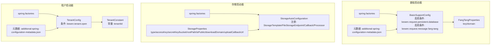
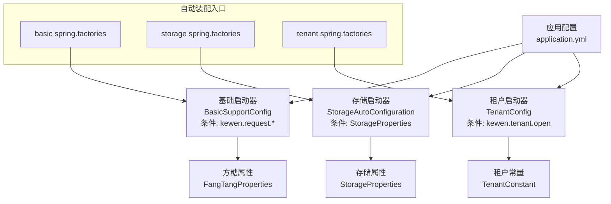
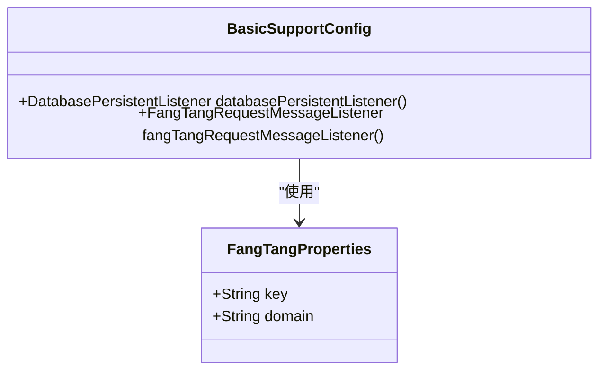
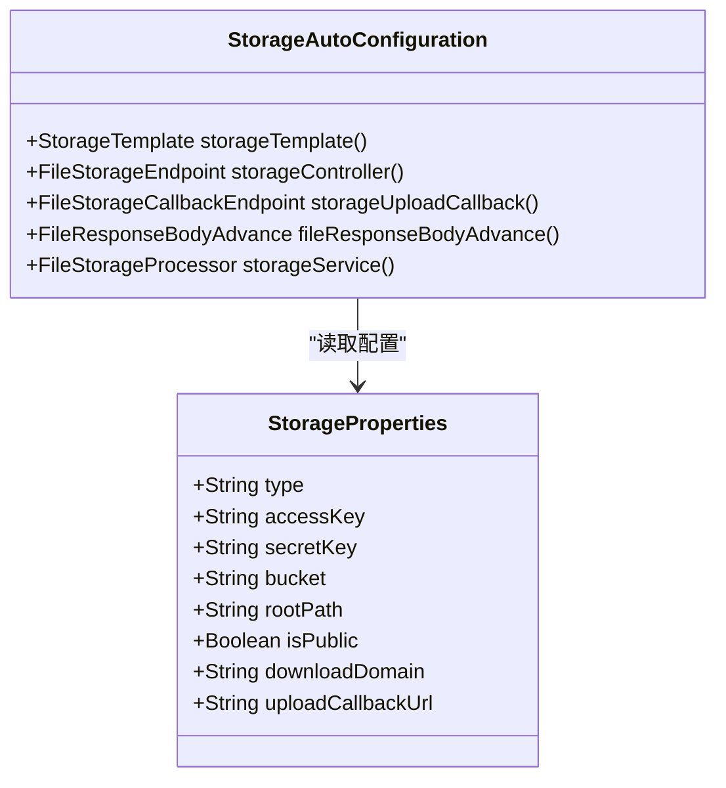
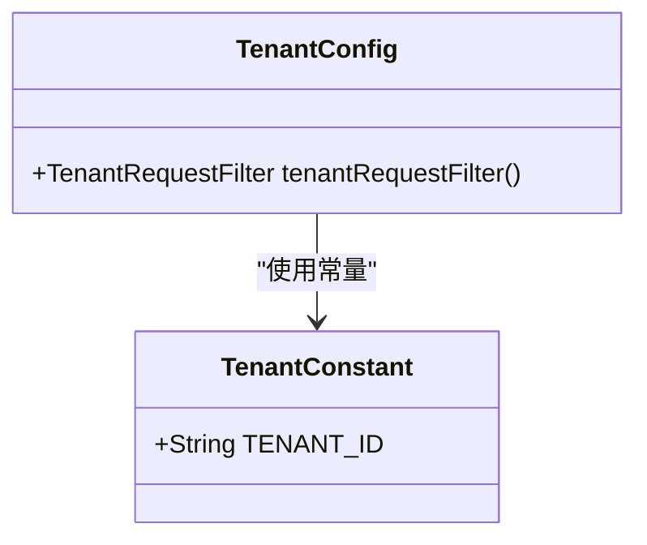
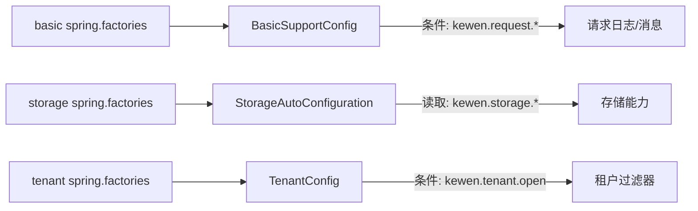

# 模块配置

<cite>
**本文引用的文件**
- [FangTangProperties.java](file://boot/basic-spring-boot-starter/src/main/java/com/kewen/framework/boot/basic/properties/FangTangProperties.java)
- [additional-spring-configuration-metadata.json（基础）](file://boot/basic-spring-boot-starter/src/main/resources/META-INF/additional-spring-configuration-metadata.json)
- [spring.factories（基础）](file://boot/basic-spring-boot-starter/src/main/resources/META-INF/spring.factories)
- [BasicSupportConfig.java](file://boot/basic-spring-boot-starter/src/main/java/com/kewen/framework/boot/basic/config/BasicSupportConfig.java)
- [StorageProperties.java](file://boot/storage-spring-boot-starter/src/main/java/com/kewen/framework/storage/boot/StorageProperties.java)
- [StorageAutoConfiguration.java](file://boot/storage-spring-boot-starter/src/main/java/com/kewen/framework/storage/boot/StorageAutoConfiguration.java)
- [spring.factories（存储）](file://boot/storage-spring-boot-starter/src/main/resources/META-INF/spring.factories)
- [TenantConfig.java](file://boot/tenant-spring-boot-starter/src/main/java/com/kewen/framework/tenant/config/TenantConfig.java)
- [TenantConstant.java](file://boot/tenant-spring-boot-starter/src/main/java/com/kewen/framework/tenant/TenantConstant.java)
- [additional-spring-configuration-metadata.json（租户）](file://boot/tenant-spring-boot-starter/src/main/resources/META-INF/additional-spring-configuration-metadata.json)
- [spring.factories（租户）](file://boot/tenant-spring-boot-starter/src/main/resources/META-INF/spring.factories)
- [application.yml（存储样例）](file://sample/storage-boot-sample/src/main/resources/application.yml)
- [application.yml（租户样例）](file://sample/tenant-boot-sample/src/main/resources/application.yml)
</cite>

## 目录
1. [简介](#简介)
2. [项目结构](#项目结构)
3. [核心组件](#核心组件)
4. [架构总览](#架构总览)
5. [详细组件分析](#详细组件分析)
6. [依赖关系分析](#依赖关系分析)
7. [性能与行为影响](#性能与行为影响)
8. [配置优先级与覆盖机制](#配置优先级与覆盖机制)
9. [配置示例](#配置示例)
10. [故障排除指南](#故障排除指南)
11. [结论](#结论)

## 简介
本指南聚焦于本仓库中各 Spring Boot Starter 的模块配置，涵盖以下启动器：
- 基础启动器：提供请求日志持久化、方糖消息通知、异步、MyBatis-Plus、早期过滤器等能力，并通过属性对象暴露可配置项。
- 存储启动器：提供文件存储能力（默认对接七牛云），通过属性对象统一配置密钥、桶、域名等。
- 租户启动器：提供租户开关与请求过滤器注入，便于在多租户场景下传递租户标识。

文档将逐项说明配置项、默认值、使用场景、行为影响、最佳实践、模块间协调与依赖关系，并给出配置优先级与覆盖机制、示例与故障排除建议。

## 项目结构
围绕模块配置相关的关键文件组织如下：
- 基础启动器
  - 属性类：FangTangProperties
  - 自动配置：BasicSupportConfig
  - 元数据：additional-spring-configuration-metadata.json
  - 自动装配入口：spring.factories
- 存储启动器
  - 属性类：StorageProperties
  - 自动配置：StorageAutoConfiguration
  - 自动装配入口：spring.factories
- 租户启动器
  - 配置类：TenantConfig
  - 常量：TenantConstant
  - 元数据：additional-spring-configuration-metadata.json
  - 自动装配入口：spring.factories

图表来源
- [spring.factories（基础）:1-7](file://boot/basic-spring-boot-starter/src/main/resources/META-INF/spring.factories#L1-L7)
- [BasicSupportConfig.java:1-45](file://boot/basic-spring-boot-starter/src/main/java/com/kewen/framework/boot/basic/config/BasicSupportConfig.java#L1-L45)
- [FangTangProperties.java:1-40](file://boot/basic-spring-boot-starter/src/main/java/com/kewen/framework/boot/basic/properties/FangTangProperties.java#L1-L40)
- [additional-spring-configuration-metadata.json（基础）:1-16](file://boot/basic-spring-boot-starter/src/main/resources/META-INF/additional-spring-configuration-metadata.json#L1-L16)
- [spring.factories（存储）:1-2](file://boot/storage-spring-boot-starter/src/main/resources/META-INF/spring.factories#L1-L2)
- [StorageProperties.java:1-45](file://boot/storage-spring-boot-starter/src/main/java/com/kewen/framework/storage/boot/StorageProperties.java#L1-L45)
- [StorageAutoConfiguration.java:1-71](file://boot/storage-spring-boot-starter/src/main/java/com/kewen/framework/storage/boot/StorageAutoConfiguration.java#L1-L71)
- [spring.factories（租户）:1-3](file://boot/tenant-spring-boot-starter/src/main/resources/META-INF/spring.factories#L1-L3)
- [TenantConfig.java:1-23](file://boot/tenant-spring-boot-starter/src/main/java/com/kewen/framework/tenant/config/TenantConfig.java#L1-L23)
- [TenantConstant.java:1-12](file://boot/tenant-spring-boot-starter/src/main/java/com/kewen/framework/tenant/TenantConstant.java#L1-L12)
- [additional-spring-configuration-metadata.json（租户）:1-10](file://boot/tenant-spring-boot-starter/src/main/resources/META-INF/additional-spring-configuration-metadata.json#L1-L10)

章节来源
- [spring.factories（基础）:1-7](file://boot/basic-spring-boot-starter/src/main/resources/META-INF/spring.factories#L1-L7)
- [spring.factories（存储）:1-2](file://boot/storage-spring-boot-starter/src/main/resources/META-INF/spring.factories#L1-L2)
- [spring.factories（租户）:1-3](file://boot/tenant-spring-boot-starter/src/main/resources/META-INF/spring.factories#L1-L3)

## 核心组件
- 基础启动器（fangtang/消息通知与请求日志）
  - FangTangProperties：定义方糖推送所需的密钥与域名，默认值与字段含义见下节。
  - BasicSupportConfig：按条件启用数据库请求日志持久化监听器与方糖消息监听器。
  - 元数据：声明了 kewen.request.persistent.database 与 kewen.request.message.fang-tang 两个开关属性及其默认值。
- 存储启动器（文件存储）
  - StorageProperties：定义存储类型、密钥、桶、根路径、是否公开、下载域名、上传回调地址等。
  - StorageAutoConfiguration：基于 StorageProperties 注册存储模板与相关端点/处理器。
- 租户启动器（多租户）
  - TenantConfig：当 kewen.tenant.open=true 时，注册租户请求过滤器。
  - TenantConstant：提供租户标识键名常量。

章节来源
- [FangTangProperties.java:1-40](file://boot/basic-spring-boot-starter/src/main/java/com/kewen/framework/boot/basic/properties/FangTangProperties.java#L1-L40)
- [BasicSupportConfig.java:1-45](file://boot/basic-spring-boot-starter/src/main/java/com/kewen/framework/boot/basic/config/BasicSupportConfig.java#L1-L45)
- [additional-spring-configuration-metadata.json（基础）:1-16](file://boot/basic-spring-boot-starter/src/main/resources/META-INF/additional-spring-configuration-metadata.json#L1-L16)
- [StorageProperties.java:1-45](file://boot/storage-spring-boot-starter/src/main/java/com/kewen/framework/storage/boot/StorageProperties.java#L1-L45)
- [StorageAutoConfiguration.java:1-71](file://boot/storage-spring-boot-starter/src/main/java/com/kewen/framework/storage/boot/StorageAutoConfiguration.java#L1-L71)
- [TenantConfig.java:1-23](file://boot/tenant-spring-boot-starter/src/main/java/com/kewen/framework/tenant/config/TenantConfig.java#L1-L23)
- [TenantConstant.java:1-12](file://boot/tenant-spring-boot-starter/src/main/java/com/kewen/framework/tenant/TenantConstant.java#L1-L12)

## 架构总览
下图展示三个启动器的配置与装配关系，以及属性如何驱动行为：

图表来源
- [spring.factories（基础）:1-7](file://boot/basic-spring-boot-starter/src/main/resources/META-INF/spring.factories#L1-L7)
- [spring.factories（存储）:1-2](file://boot/storage-spring-boot-starter/src/main/resources/META-INF/spring.factories#L1-L2)
- [spring.factories（租户）:1-3](file://boot/tenant-spring-boot-starter/src/main/resources/META-INF/spring.factories#L1-L3)
- [BasicSupportConfig.java:1-45](file://boot/basic-spring-boot-starter/src/main/java/com/kewen/framework/boot/basic/config/BasicSupportConfig.java#L1-L45)
- [StorageAutoConfiguration.java:1-71](file://boot/storage-spring-boot-starter/src/main/java/com/kewen/framework/storage/boot/StorageAutoConfiguration.java#L1-L71)
- [TenantConfig.java:1-23](file://boot/tenant-spring-boot-starter/src/main/java/com/kewen/framework/tenant/config/TenantConfig.java#L1-L23)
- [FangTangProperties.java:1-40](file://boot/basic-spring-boot-starter/src/main/java/com/kewen/framework/boot/basic/properties/FangTangProperties.java#L1-L40)
- [StorageProperties.java:1-45](file://boot/storage-spring-boot-starter/src/main/java/com/kewen/framework/storage/boot/StorageProperties.java#L1-L45)
- [TenantConstant.java:1-12](file://boot/tenant-spring-boot-starter/src/main/java/com/kewen/framework/tenant/TenantConstant.java#L1-L12)

## 详细组件分析

### 基础启动器（fangtang/消息通知与请求日志）
- 配置属性与默认值
  - FangTangProperties
    - key：方糖推送密钥，默认值见属性类。
    - domain：方糖服务域名，默认值见属性类。
  - 元数据声明的开关
    - kewen.request.persistent.database：是否开启请求日志持久化到数据库，默认 false。
    - kewen.request.message.fang-tang：是否开启请求IP发送到方糖消息，默认 false。
- 行为影响
  - 当 kewen.request.persistent.database=true 时，启用数据库持久化监听器，将请求日志写入数据库。
  - 当 kewen.request.message.fang-tang=true 时，启用方糖消息监听器，将请求相关信息推送到方糖渠道。
- 最佳实践
  - 在开发环境可开启方糖消息监听器用于快速告警；生产环境谨慎开启，避免敏感信息泄露。
  - 数据库持久化监听器仅在需要审计或问题排查时开启，避免对性能造成额外压力。
- 依赖关系
  - BasicSupportConfig 通过条件注解控制 Bean 注册，依赖于上述两个开关属性。
  - FangTangProperties 提供方糖所需的认证凭据。

图表来源
- [FangTangProperties.java:1-40](file://boot/basic-spring-boot-starter/src/main/java/com/kewen/framework/boot/basic/properties/FangTangProperties.java#L1-L40)
- [BasicSupportConfig.java:1-45](file://boot/basic-spring-boot-starter/src/main/java/com/kewen/framework/boot/basic/config/BasicSupportConfig.java#L1-L45)

章节来源
- [FangTangProperties.java:1-40](file://boot/basic-spring-boot-starter/src/main/java/com/kewen/framework/boot/basic/properties/FangTangProperties.java#L1-L40)
- [BasicSupportConfig.java:1-45](file://boot/basic-spring-boot-starter/src/main/java/com/kewen/framework/boot/basic/config/BasicSupportConfig.java#L1-L45)
- [additional-spring-configuration-metadata.json（基础）:1-16](file://boot/basic-spring-boot-starter/src/main/resources/META-INF/additional-spring-configuration-metadata.json#L1-L16)

### 存储启动器（文件存储）
- 配置属性与默认值
  - type：存储类型（如 qiniu），未设置时默认不启用具体实现。
  - accessKey/secretKey：云存储访问凭据。
  - bucket：存储桶名称。
  - rootPath：存储根目录，默认空字符串。
  - isPublic：是否公开访问，默认 true。
  - downloadDomain：下载域名，用于生成可访问链接。
  - uploadCallbackUrl：上传成功后的回调地址。
- 行为影响
  - StorageAutoConfiguration 基于 StorageProperties 注册存储模板与相关端点/处理器，使应用具备文件上传、回调处理等能力。
  - 若未配置 type 或凭据，存储模板不会生效；需确保与实际云厂商一致。
- 最佳实践
  - 生产环境务必配置 downloadDomain 与 uploadCallbackUrl，保证外链可用与回调安全。
  - isPublic=false 时注意签名策略与鉴权方式，避免误放暴露。
- 依赖关系
  - StorageAutoConfiguration 启用 StorageProperties 并注册 Bean。
  - 默认实现对接七牛云（Region 与构造参数由自动配置指定）。

图表来源
- [StorageProperties.java:1-45](file://boot/storage-spring-boot-starter/src/main/java/com/kewen/framework/storage/boot/StorageProperties.java#L1-L45)
- [StorageAutoConfiguration.java:1-71](file://boot/storage-spring-boot-starter/src/main/java/com/kewen/framework/storage/boot/StorageAutoConfiguration.java#L1-L71)

章节来源
- [StorageProperties.java:1-45](file://boot/storage-spring-boot-starter/src/main/java/com/kewen/framework/storage/boot/StorageProperties.java#L1-L45)
- [StorageAutoConfiguration.java:1-71](file://boot/storage-spring-boot-starter/src/main/java/com/kewen/framework/storage/boot/StorageAutoConfiguration.java#L1-L71)

### 租户启动器（多租户）
- 配置属性与默认值
  - kewen.tenant.open：是否开启租户，默认 false。
- 行为影响
  - 当 kewen.tenant.open=true 时，注册租户请求过滤器，拦截请求以注入/透传租户标识。
  - 租户标识键名常量为 tenantId。
- 最佳实践
  - 在网关或统一过滤层设置租户标识，避免在每个业务接口重复处理。
  - 与数据库分库/分表策略配合，确保查询范围可控。
- 依赖关系
  - TenantConfig 通过条件注解仅在开启时注册过滤器。
  - TenantConstant 提供统一的租户键名常量。

图表来源
- [TenantConfig.java:1-23](file://boot/tenant-spring-boot-starter/src/main/java/com/kewen/framework/tenant/config/TenantConfig.java#L1-L23)
- [TenantConstant.java:1-12](file://boot/tenant-spring-boot-starter/src/main/java/com/kewen/framework/tenant/TenantConstant.java#L1-L12)

章节来源
- [TenantConfig.java:1-23](file://boot/tenant-spring-boot-starter/src/main/java/com/kewen/framework/tenant/config/TenantConfig.java#L1-L23)
- [TenantConstant.java:1-12](file://boot/tenant-spring-boot-starter/src/main/java/com/kewen/framework/tenant/TenantConstant.java#L1-L12)
- [additional-spring-configuration-metadata.json（租户）:1-10](file://boot/tenant-spring-boot-starter/src/main/resources/META-INF/additional-spring-configuration-metadata.json#L1-L10)

## 依赖关系分析
- 自动装配入口
  - 基础启动器：spring.factories 指定多个自动配置类，覆盖异步、支持、早期过滤器、消息、MyBatis-Plus、请求响应格式化等。
  - 存储启动器：spring.factories 指定 StorageAutoConfiguration。
  - 租户启动器：spring.factories 指定 TenantConfig 与 Feign 拦截器。
- 条件装配
  - 基础启动器：通过 BasicSupportConfig 对数据库持久化与方糖消息监听器进行条件装配。
  - 存储启动器：通过 StorageAutoConfiguration 注册 Bean。
  - 租户启动器：通过 TenantConfig 对租户过滤器进行条件装配。
- 模块间协调
  - 存储与租户：二者独立，但均可在业务层被其他模块复用；若业务涉及多租户存储隔离，可在存储模板或回调中结合租户标识进行命名空间划分。
  - 基础与存储/租户：基础启动器提供通用能力（日志、消息），存储与租户启动器在此基础上扩展各自功能。

图表来源
- [spring.factories（基础）:1-7](file://boot/basic-spring-boot-starter/src/main/resources/META-INF/spring.factories#L1-L7)
- [spring.factories（存储）:1-2](file://boot/storage-spring-boot-starter/src/main/resources/META-INF/spring.factories#L1-L2)
- [spring.factories（租户）:1-3](file://boot/tenant-spring-boot-starter/src/main/resources/META-INF/spring.factories#L1-L3)
- [BasicSupportConfig.java:1-45](file://boot/basic-spring-boot-starter/src/main/java/com/kewen/framework/boot/basic/config/BasicSupportConfig.java#L1-L45)
- [StorageAutoConfiguration.java:1-71](file://boot/storage-spring-boot-starter/src/main/java/com/kewen/framework/storage/boot/StorageAutoConfiguration.java#L1-L71)
- [TenantConfig.java:1-23](file://boot/tenant-spring-boot-starter/src/main/java/com/kewen/framework/tenant/config/TenantConfig.java#L1-L23)

## 性能与行为影响
- 请求日志持久化
  - 开启后会增加数据库写入开销，建议仅在调试或问题定位阶段开启。
- 方糖消息通知
  - 外部网络调用可能带来延迟与失败风险，建议在生产环境谨慎开启并做好降级。
- 文件存储
  - 上传回调与签名策略直接影响访问性能与安全性，应结合 CDN 与鉴权策略优化。
- 租户过滤器
  - 在高并发场景下，过滤器链路应尽量轻量，避免成为瓶颈。

## 配置优先级与覆盖机制
- 属性来源顺序（从高到低）
  1) 命令行参数
  2) SPRING_APPLICATION_JSON
  3) 系统环境变量
  4) application-{profile}.yml
  5) application.yml
  6) @PropertySource
  7) Spring Boot 默认值
- 覆盖规则
  - 同一属性在不同层级出现时，以上述顺序后者覆盖前者。
  - 对于布尔型开关（如 kewen.request.persistent.database、kewen.request.message.fang-tang、kewen.tenant.open），建议显式设置以避免默认值导致的行为差异。
- 条件属性
  - 基础与租户启动器均采用条件注解，仅在对应开关为期望值时才装配 Bean，不存在“覆盖”，而是“是否装配”。

章节来源
- [BasicSupportConfig.java:1-45](file://boot/basic-spring-boot-starter/src/main/java/com/kewen/framework/boot/basic/config/BasicSupportConfig.java#L1-L45)
- [TenantConfig.java:1-23](file://boot/tenant-spring-boot-starter/src/main/java/com/kewen/framework/tenant/config/TenantConfig.java#L1-L23)

## 配置示例
- 存储启动器（示例）
  - 参考：[application.yml（存储样例）:1-18](file://sample/storage-boot-sample/src/main/resources/application.yml#L1-L18)
  - 关键点：设置 kewen.storage.type 为 qiniu，并提供 access-key、secret-key、bucket、download-domain、upload-callback-url 等。
- 租户启动器（示例）
  - 参考：[application.yml（租户样例）:1-13](file://sample/tenant-boot-sample/src/main/resources/application.yml#L1-L13)
  - 关键点：设置 kewen.tenant.open=true，以便注册租户过滤器。
- 基础启动器（示例）
  - 参考：[application.yml（存储样例）:1-18](file://sample/storage-boot-sample/src/main/resources/application.yml#L1-L18)
  - 说明：基础启动器的开关属性在基础启动器的元数据中声明，可在 application.yml 中按需开启数据库持久化或方糖消息通知。

章节来源
- [application.yml（存储样例）:1-18](file://sample/storage-boot-sample/src/main/resources/application.yml#L1-L18)
- [application.yml（租户样例）:1-13](file://sample/tenant-boot-sample/src/main/resources/application.yml#L1-L13)

## 故障排除指南
- 无法发送方糖消息
  - 检查 kewen.request.message.fang-tang 是否开启，确认 FangTangProperties 的 key 与 domain 是否正确。
  - 排查网络连通性与外部服务状态。
- 请求日志未落库
  - 检查 kewen.request.persistent.database 是否开启，确认数据库连接与表结构存在。
- 上传文件失败或回调异常
  - 检查 kewen.storage.type、accessKey、secretKey、bucket、downloadDomain、uploadCallbackUrl 是否完整且正确。
  - 确认回调地址可达且与云存储平台配置一致。
- 租户过滤器未生效
  - 检查 kewen.tenant.open 是否为 true，确认过滤器已注册。
  - 检查上游网关或过滤器顺序，确保租户标识在业务层可见。

## 结论
- 三个启动器分别提供基础能力、文件存储与多租户支持，通过属性与条件装配实现按需启用。
- 建议在开发与测试环境适度开启日志与消息通知，在生产环境严格控制开关与凭据管理。
- 存储与租户配置需与业务场景匹配，结合 CDN、鉴权与回调策略提升性能与安全性。
- 通过明确的配置优先级与覆盖机制，可确保在不同环境与部署形态下获得一致的行为表现。