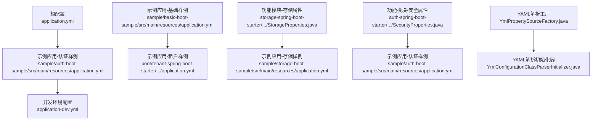
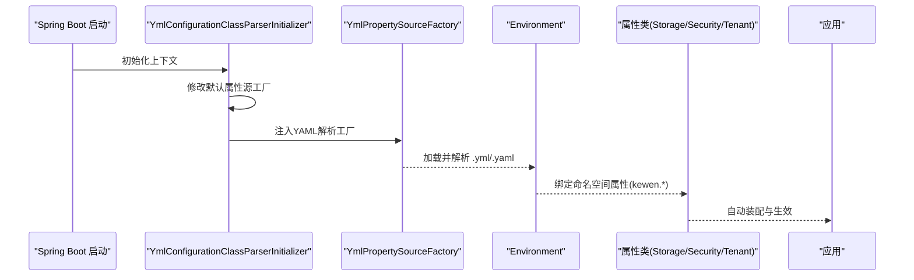
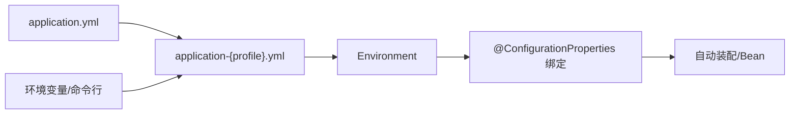

# 环境配置

<cite>
**本文引用的文件**
- [application.yml](file://application.yml)
- [application.yml](file://sample/auth-boot-sample/src/main/resources/application.yml)
- [application-dev.yml](file://sample/auth-boot-sample/src/main/resources/application-dev.yml)
- [application.yml](file://sample/basic-boot-sample/src/main/resources/application.yml)
- [application-sample.yml](file://qy-auth/relation/properties/application-sample.yml)
- [application.yml](file://docs/application.yml)
- [YmlPropertySourceFactory.java](file://boot/basic-spring-boot-starter/src/main/java/com/kewen/framework/boot/basic/context/YmlPropertySourceFactory.java)
- [YmlConfigurationClassParserInitializer.java](file://boot/basic-spring-boot-starter/src/main/java/com/kewen/framework/boot/basic/context/YmlConfigurationClassParserInitializer.java)
- [SpringConstant.java](file://boot/basic-spring-boot-starter/src/main/java/com/kewen/framework/boot/basic/context/SpringConstant.java)
- [StorageProperties.java](file://boot/storage-spring-boot-starter/src/main/java/com/kewen/framework/storage/boot/StorageProperties.java)
- [TenantConfig.java](file://boot/tenant-spring-boot-starter/src/main/java/com/kewen/framework/tenant/config/TenantConfig.java)
- [SecurityProperties.java](file://qy-auth/auth-spring-boot-starter/src/main/java/com/kewen/framework/auth/security/properties/SecurityProperties.java)
- [SecurityLoginProperties.java](file://qy-auth/auth-spring-boot-starter/src/main/java/com/kewen/framework/auth/security/password/properties/SecurityLoginProperties.java)
- [PasswordSecurityConfig.java](file://qy-auth/auth-spring-boot-starter/src/main/java/com/kewen/framework/auth/security/password/config/PasswordSecurityConfig.java)
</cite>

## 目录
1. [简介](#简介)
2. [项目结构](#项目结构)
3. [核心组件](#核心组件)
4. [架构总览](#架构总览)
5. [详细组件分析](#详细组件分析)
6. [依赖分析](#依赖分析)
7. [性能考量](#性能考量)
8. [故障排查指南](#故障排查指南)
9. [结论](#结论)
10. [附录](#附录)

## 简介
本指南围绕“环境配置”主题，系统阐述本仓库中不同运行环境（开发、测试、生产）的配置差异与最佳实践，涵盖数据库连接、文件存储、安全配置等关键领域，并提供配置文件组织方式、环境切换方法、配置继承与覆盖机制、敏感信息保护策略，以及可直接套用的配置模板与快速搭建步骤。读者无需深入源码即可按图索骥完成多环境配置。

## 项目结构
本仓库采用“主工程 + 示例模块 + 各功能子模块”的组织方式。配置文件主要分布在：
- 根级默认配置：application.yml
- 示例应用配置：各 sample 模块中的 application.yml 及 application-{profile}.yml
- 功能模块配置：各 starter 中的属性类与自动装配配置
- 文档与示例：docs 与 relation/properties 提供参考样例

图表来源
- [application.yml:1-32](file://application.yml#L1-L32)
- [application.yml:1-55](file://sample/auth-boot-sample/src/main/resources/application.yml#L1-L55)
- [application-dev.yml:1-6](file://sample/auth-boot-sample/src/main/resources/application-dev.yml#L1-L6)
- [application.yml:1-30](file://sample/basic-boot-sample/src/main/resources/application.yml#L1-L30)
- [StorageProperties.java:1-45](file://boot/storage-spring-boot-starter/src/main/java/com/kewen/framework/storage/boot/StorageProperties.java#L1-L45)
- [SecurityProperties.java:1-22](file://qy-auth/auth-spring-boot-starter/src/main/java/com/kewen/framework/auth/security/properties/SecurityProperties.java#L1-L22)
- [YmlPropertySourceFactory.java:1-34](file://boot/basic-spring-boot-starter/src/main/java/com/kewen/framework/boot/basic/context/YmlPropertySourceFactory.java#L1-L34)
- [YmlConfigurationClassParserInitializer.java:1-46](file://boot/basic-spring-boot-starter/src/main/java/com/kewen/framework/boot/basic/context/YmlConfigurationClassParserInitializer.java#L1-L46)

章节来源
- [application.yml:1-32](file://application.yml#L1-L32)
- [application.yml:1-55](file://sample/auth-boot-sample/src/main/resources/application.yml#L1-L55)
- [application-dev.yml:1-6](file://sample/auth-boot-sample/src/main/resources/application-dev.yml#L1-L6)
- [application.yml:1-30](file://sample/basic-boot-sample/src/main/resources/application.yml#L1-L30)
- [YmlPropertySourceFactory.java:1-34](file://boot/basic-spring-boot-starter/src/main/java/com/kewen/framework/boot/basic/context/YmlPropertySourceFactory.java#L1-L34)
- [YmlConfigurationClassParserInitializer.java:1-46](file://boot/basic-spring-boot-starter/src/main/java/com/kewen/framework/boot/basic/context/YmlConfigurationClassParserInitializer.java#L1-L46)

## 核心组件
- 配置文件组织与激活
  - 主工程默认配置位于根目录 application.yml，示例应用在各自 resources 下维护 application.yml 与 application-{profile}.yml。
  - 示例应用通过 spring.profiles.active 指定当前激活的 profile（如 dev），实现环境隔离与差异化配置。
- YAML 解析支持
  - 通过自定义 YmlPropertySourceFactory 与 YmlConfigurationClassParserInitializer，确保 Spring Boot 在启动阶段正确解析 .yml/.yaml 文件。
- 环境特定配置项
  - 数据库连接：示例应用提供 datasource 配置，含连接池参数与驱动设置；开发环境提供 MySQL 连接示例。
  - 安全配置：kewen.security.* 族配置项，包含登录路径、参数名、会话与记住我策略等。
  - 文件存储：kewen.storage.* 族配置项，支持类型、密钥、桶、根路径、下载域与回调地址等。
  - 请求日志与消息通知：kewen.request.* 与 kewen.message.* 用于请求持久化与消息推送开关及参数。
- 配置继承与覆盖
  - Spring Boot 的配置优先级遵循官方约定：命令行 > 环境变量 > application-{profile}.yml > application.yml。示例应用以 application.yml 定义通用配置，application-{profile}.yml 覆盖或新增环境特有项。
- 环境切换方法
  - 通过 spring.profiles.active 指定 dev/test/prod 等环境；也可通过 JVM 参数或外部化配置覆盖该值。

章节来源
- [application.yml:6-7](file://sample/auth-boot-sample/src/main/resources/application.yml#L6-L7)
- [application-dev.yml:1-6](file://sample/auth-boot-sample/src/main/resources/application-dev.yml#L1-L6)
- [SecurityProperties.java:1-22](file://qy-auth/auth-spring-boot-starter/src/main/java/com/kewen/framework/auth/security/properties/SecurityProperties.java#L1-L22)
- [SecurityLoginProperties.java:1-29](file://qy-auth/auth-spring-boot-starter/src/main/java/com/kewen/framework/auth/security/password/properties/SecurityLoginProperties.java#L1-L29)
- [StorageProperties.java:1-45](file://boot/storage-spring-boot-starter/src/main/java/com/kewen/framework/storage/boot/StorageProperties.java#L1-L45)
- [YmlPropertySourceFactory.java:17-34](file://boot/basic-spring-boot-starter/src/main/java/com/kewen/framework/boot/basic/context/YmlPropertySourceFactory.java#L17-L34)
- [YmlConfigurationClassParserInitializer.java:20-46](file://boot/basic-spring-boot-starter/src/main/java/com/kewen/framework/boot/basic/context/YmlConfigurationClassParserInitializer.java#L20-L46)

## 架构总览
下图展示从配置文件到运行时属性的关键流转过程，体现 YAML 解析、属性绑定与自动装配的关系。

图表来源
- [YmlConfigurationClassParserInitializer.java:20-46](file://boot/basic-spring-boot-starter/src/main/java/com/kewen/framework/boot/basic/context/YmlConfigurationClassParserInitializer.java#L20-L46)
- [YmlPropertySourceFactory.java:17-34](file://boot/basic-spring-boot-starter/src/main/java/com/kewen/framework/boot/basic/context/YmlPropertySourceFactory.java#L17-L34)
- [StorageProperties.java:12-13](file://boot/storage-spring-boot-starter/src/main/java/com/kewen/framework/storage/boot/StorageProperties.java#L12-L13)
- [SecurityProperties.java:13-14](file://qy-auth/auth-spring-boot-starter/src/main/java/com/kewen/framework/auth/security/properties/SecurityProperties.java#L13-L14)

## 详细组件分析

### 开发环境（dev）
- 典型特征
  - 激活 profile：dev
  - 数据库：本地 MySQL，提供连接串、用户名、密码与驱动
  - 日志：示例应用配置了日志级别与输出路径
- 关键配置要点
  - 使用 application-dev.yml 覆盖数据源与连接池参数，避免在主配置中暴露敏感信息
  - 可结合 spring.datasource.hikari.* 优化开发阶段的连接池行为
- 最佳实践
  - 将数据库凭据放入外部化配置或环境变量，避免提交到版本控制
  - 使用本地化日志路径便于调试与问题定位

章节来源
- [application.yml:6-7](file://sample/auth-boot-sample/src/main/resources/application.yml#L6-L7)
- [application-dev.yml:1-6](file://sample/auth-boot-sample/src/main/resources/application-dev.yml#L1-L6)
- [application.yml:24-29](file://sample/auth-boot-sample/src/main/resources/application.yml#L24-L29)

### 测试环境（test）
- 典型特征
  - 激活 profile：test
  - 数据库：独立的测试库，连接参数与开发库分离
  - 安全策略：可启用更严格的会话与登录限制
- 关键配置要点
  - 在 application-test.yml 中设置测试专用的数据源与连接池
  - 可调整 kewen.security.* 以满足测试场景的登录与会话需求
- 最佳实践
  - 使用只读或临时表结构，避免污染测试数据
  - 通过环境变量注入敏感参数，保证 CI/CD 管道中的安全性

章节来源
- [application.yml:6-7](file://sample/auth-boot-sample/src/main/resources/application.yml#L6-L7)
- [application.yml:1-21](file://docs/application.yml#L1-L21)

### 生产环境（prod）
- 典型特征
  - 激活 profile：prod
  - 数据库：高可用、只读副本或读写分离配置
  - 安全策略：启用 HTTPS、严格会话管理、最小权限登录
- 关键配置要点
  - 在 application-prod.yml 中设置生产专用的数据源与连接池
  - 强化 kewen.security.* 与 kewen.request.*、kewen.message.* 的生产级参数
- 最佳实践
  - 所有敏感信息通过环境变量或密钥管理服务注入
  - 使用只读配置与最小权限原则部署应用

章节来源
- [application.yml:6-7](file://sample/auth-boot-sample/src/main/resources/application.yml#L6-L7)
- [application.yml:1-21](file://docs/application.yml#L1-L21)

### 数据库连接配置
- 通用项
  - spring.datasource.*：连接串、用户名、密码、驱动类名、连接池参数
- 开发示例
  - application-dev.yml 提供 MySQL 连接示例，包含驱动与凭据
- 最佳实践
  - 将敏感凭据放入环境变量或外部化配置
  - 根据业务并发调整连接池大小与超时参数

章节来源
- [application-dev.yml:1-6](file://sample/auth-boot-sample/src/main/resources/application-dev.yml#L1-L6)
- [application.yml:6-20](file://sample/basic-boot-sample/src/main/resources/application.yml#L6-L20)

### 文件存储配置
- 适用场景
  - 对象存储（如七牛云）或本地存储
- 关键项
  - kewen.storage.type/accessKey/secretKey/bucket/rootPath/isPublic/downloadDomain/uploadCallbackUrl
- 最佳实践
  - 不同环境使用不同 bucket 与下载域
  - 回调地址仅在需要时启用，避免泄露

章节来源
- [StorageProperties.java:1-45](file://boot/storage-spring-boot-starter/src/main/java/com/kewen/framework/storage/boot/StorageProperties.java#L1-L45)
- [application.yml](file://sample/storage-boot-sample/src/main/resources/application.yml)

### 安全配置
- 通用项
  - kewen.security.currentUserUrl：当前用户接口地址
  - kewen.security.login.password.*：登录 URL、用户名/密码参数名
  - kewen.security.session.*：最大会话数、是否阻止登录
  - kewen.security.remember-me.*：是否启用、参数名、有效期
- 最佳实践
  - 登录参数名与 URL 应与前端一致，避免 CSRF 与混淆
  - 会话与记住我策略应随环境强度调整

章节来源
- [application.yml:12-32](file://application.yml#L12-L32)
- [application.yml:42-55](file://sample/auth-boot-sample/src/main/resources/application.yml#L42-L55)
- [SecurityProperties.java:1-22](file://qy-auth/auth-spring-boot-starter/src/main/java/com/kewen/framework/auth/security/properties/SecurityProperties.java#L1-L22)
- [SecurityLoginProperties.java:1-29](file://qy-auth/auth-spring-boot-starter/src/main/java/com/kewen/framework/auth/security/password/properties/SecurityLoginProperties.java#L1-L29)
- [PasswordSecurityConfig.java:1-35](file://qy-auth/auth-spring-boot-starter/src/main/java/com/kewen/framework/auth/security/password/config/PasswordSecurityConfig.java#L1-L35)

### 请求日志与消息通知
- 通用项
  - kewen.request.persistent.database：是否持久化请求日志
  - kewen.request.message.fangtang：是否启用消息通知
  - kewen.message.fang-tang.key/domain：消息推送密钥与域名
- 最佳实践
  - 生产环境谨慎开启消息通知，避免噪声与成本
  - 日志持久化建议配合异步处理与归档策略

章节来源
- [application.yml:1-21](file://docs/application.yml#L1-L21)
- [application.yml:21-30](file://sample/basic-boot-sample/src/main/resources/application.yml#L21-L30)

### 租户配置（按需启用）
- 条件启用
  - 通过 kewen.tenant.open 控制租户过滤器的装配
- 最佳实践
  - 仅在需要多租户隔离时开启，避免不必要的拦截开销

章节来源
- [TenantConfig.java:14-22](file://boot/tenant-spring-boot-starter/src/main/java/com/kewen/framework/tenant/config/TenantConfig.java#L14-L22)

## 依赖分析
- 配置解析链路
  - 启动时由 YmlConfigurationClassParserInitializer 修改默认属性源工厂
  - YmlPropertySourceFactory 将 .yml/.yaml 转换为 Properties，供 Environment 使用
  - 属性类（如 StorageProperties、SecurityProperties）通过 @ConfigurationProperties 绑定命名空间
- 配置覆盖关系
  - 命令行 > 环境变量 > application-{profile}.yml > application.yml

图表来源
- [YmlPropertySourceFactory.java:17-34](file://boot/basic-spring-boot-starter/src/main/java/com/kewen/framework/boot/basic/context/YmlPropertySourceFactory.java#L17-L34)
- [YmlConfigurationClassParserInitializer.java:20-46](file://boot/basic-spring-boot-starter/src/main/java/com/kewen/framework/boot/basic/context/YmlConfigurationClassParserInitializer.java#L20-L46)
- [StorageProperties.java:12-13](file://boot/storage-spring-boot-starter/src/main/java/com/kewen/framework/storage/boot/StorageProperties.java#L12-L13)
- [SecurityProperties.java:13-14](file://qy-auth/auth-spring-boot-starter/src/main/java/com/kewen/framework/auth/security/properties/SecurityProperties.java#L13-L14)

章节来源
- [YmlPropertySourceFactory.java:17-34](file://boot/basic-spring-boot-starter/src/main/java/com/kewen/framework/boot/basic/context/YmlPropertySourceFactory.java#L17-L34)
- [YmlConfigurationClassParserInitializer.java:20-46](file://boot/basic-spring-boot-starter/src/main/java/com/kewen/framework/boot/basic/context/YmlConfigurationClassParserInitializer.java#L20-L46)

## 性能考量
- 连接池参数
  - 合理设置 maximum-pool-size、minimum-idle、connection-timeout、validation-timeout，避免连接争用与超时
- 日志与消息
  - 生产环境建议降低消息通知频率，启用异步与限流
- 会话与安全
  - 适当降低会话有效期与最大会话数，平衡用户体验与资源占用

## 故障排查指南
- YAML 解析失败
  - 确认配置文件扩展名为 .yml 或 .yaml，且编码正确
  - 检查 YmlPropertySourceFactory 是否被正确加载
- 属性未生效
  - 确认命名空间与 @ConfigurationProperties 前缀一致
  - 检查 spring.profiles.active 是否指向正确的 profile
- 数据源无法连接
  - 校验 application-{profile}.yml 中的连接串、用户名、密码与驱动
  - 确认网络连通性与防火墙策略

章节来源
- [YmlPropertySourceFactory.java:17-34](file://boot/basic-spring-boot-starter/src/main/java/com/kewen/framework/boot/basic/context/YmlPropertySourceFactory.java#L17-L34)
- [YmlConfigurationClassParserInitializer.java:20-46](file://boot/basic-spring-boot-starter/src/main/java/com/kewen/framework/boot/basic/context/YmlConfigurationClassParserInitializer.java#L20-L46)
- [application-dev.yml:1-6](file://sample/auth-boot-sample/src/main/resources/application-dev.yml#L1-L6)

## 结论
通过规范化的配置文件组织、清晰的环境划分与严格的覆盖机制，本仓库实现了开发、测试、生产三类环境的可运维与可扩展。建议在团队内统一配置模板与命名规范，配合环境变量与密钥管理，持续提升安全性与稳定性。

## 附录

### 环境配置模板与快速搭建
- 快速模板
  - application.yml（通用项）
    - server.port、spring.application.name、spring.profiles.active
    - spring.datasource.*（通用连接池参数）
    - kewen.security.*（登录、会话、记住我）
    - kewen.request.* 与 kewen.message.*（日志与消息）
  - application-dev.yml（开发）
    - spring.datasource.url/username/password/driver-class-name
    - logging.level.* 与 logging.file.*
  - application-test.yml（测试）
    - 独立数据源与连接池
    - 可选的消息与日志策略
  - application-prod.yml（生产）
    - 高可用数据源与连接池
    - 严格的安全与日志策略
- 快速步骤
  - 在示例应用中复制 application.yml 并新建 application-{profile}.yml
  - 在 application.yml 中设置 spring.profiles.active=dev/test/prod
  - 在 application-{profile}.yml 中填写数据库与连接池参数
  - 通过环境变量注入敏感信息（如数据库密码）
  - 启动后验证日志与数据库连接状态

章节来源
- [application.yml:1-55](file://sample/auth-boot-sample/src/main/resources/application.yml#L1-L55)
- [application-dev.yml:1-6](file://sample/auth-boot-sample/src/main/resources/application-dev.yml#L1-L6)
- [application.yml:1-21](file://docs/application.yml#L1-L21)
- [application.yml:1-30](file://sample/basic-boot-sample/src/main/resources/application.yml#L1-L30)