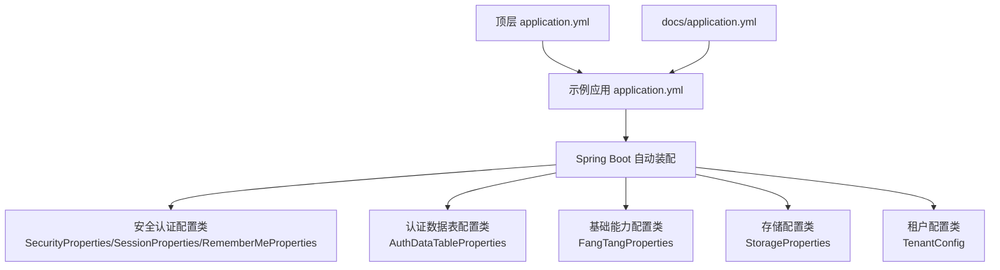
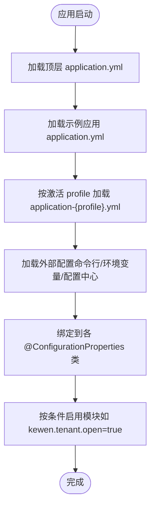
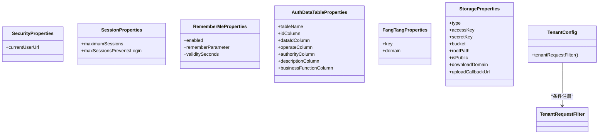

# 配置指南

<cite>
**本文引用的文件**
- [application.yml](file://application.yml)
- [docs/application.yml](file://docs/application.yml)
- [sample/auth-boot-sample/src/main/resources/application.yml](file://sample/auth-boot-sample/src/main/resources/application.yml)
- [sample/auth-boot-sample/src/main/resources/application-dev.yml](file://sample/auth-boot-sample/src/main/resources/application-dev.yml)
- [sample/basic-boot-sample/src/main/resources/application.yml](file://sample/basic-boot-sample/src/main/resources/application.yml)
- [sample/storage-boot-sample/src/main/resources/application.yml](file://sample/storage-boot-sample/src/main/resources/application.yml)
- [sample/tenant-boot-sample/src/main/resources/application.yml](file://sample/tenant-boot-sample/src/main/resources/application.yml)
- [boot/basic-spring-boot-starter/src/main/java/com/kewen/framework/boot/basic/properties/FangTangProperties.java](file://boot/basic-spring-boot-starter/src/main/java/com/kewen/framework/boot/basic/properties/FangTangProperties.java)
- [boot/storage-spring-boot-starter/src/main/java/com/kewen/framework/storage/boot/StorageProperties.java](file://boot/storage-spring-boot-starter/src/main/java/com/kewen/framework/storage/boot/StorageProperties.java)
- [boot/tenant-spring-boot-starter/src/main/java/com/kewen/framework/tenant/config/TenantConfig.java](file://boot/tenant-spring-boot-starter/src/main/java/com/kewen/framework/tenant/config/TenantConfig.java)
- [qy-auth/auth-core-spring-boot-starter/src/main/java/com/kewen/framework/boot/auth/core/properties/AuthDataTableProperties.java](file://qy-auth/auth-core-spring-boot-starter/src/main/java/com/kewen/framework/boot/auth/core/properties/AuthDataTableProperties.java)
- [qy-auth/auth-spring-boot-starter/src/main/java/com/kewen/framework/auth/security/properties/SecurityProperties.java](file://qy-auth/auth-spring-boot-starter/src/main/java/com/kewen/framework/auth/security/properties/SecurityProperties.java)
- [qy-auth/auth-spring-boot-starter/src/main/java/com/kewen/framework/auth/security/properties/RememberMeProperties.java](file://qy-auth/auth-spring-boot-starter/src/main/java/com/kewen/framework/auth/security/properties/RememberMeProperties.java)
- [qy-auth/auth-spring-boot-starter/src/main/java/com/kewen/framework/auth/security/properties/SessionProperties.java](file://qy-auth/auth-spring-boot-starter/src/main/java/com/kewen/framework/auth/security/properties/SessionProperties.java)
</cite>

## 目录
1. [简介](#简介)
2. [项目结构与配置入口](#项目结构与配置入口)
3. [核心配置总览](#核心配置总览)
4. [架构概览：配置加载与优先级](#架构概览配置加载与优先级)
5. [详细组件与模块配置](#详细组件与模块配置)
6. [依赖关系与覆盖机制](#依赖关系与覆盖机制)
7. [性能与稳定性建议](#性能与稳定性建议)
8. [故障排除指南](#故障排除指南)
9. [结论](#结论)
10. [附录：环境示例与最佳实践](#附录环境示例与最佳实践)

## 简介
本指南面向开发者与运维人员，系统讲解如何在本框架中进行配置管理。内容涵盖：
- application.yml 中的全局配置与模块配置项含义
- 全局配置与模块配置的优先级与覆盖规则
- 各启动器（基础、安全认证、存储、租户）的配置属性与使用方式
- 不同环境（开发、测试、生产）的配置示例与建议
- 配置验证方法与常见问题排查
- 性能优化与最佳实践

## 项目结构与配置入口
- 根配置入口
  - 顶层 application.yml 提供全局默认配置（如消息通知、请求日志持久化、租户开关、安全会话与记住我等）
  - docs/application.yml 提供文档样例配置，便于对照参考
- 示例应用配置
  - auth-boot-sample：演示 Spring Security、数据源、日志、kewen 安全与认证相关配置
  - basic-boot-sample：演示基础能力（消息通知、请求日志持久化）配置
  - storage-boot-sample：演示对象存储（七牛云）配置
  - tenant-boot-sample：演示多租户开关配置
- 启动器配置类
  - 通过 @ConfigurationProperties 将 YAML 配置绑定到 Java 对象，实现类型安全与自动补全

图表来源
- [application.yml:1-32](file://application.yml#L1-L32)
- [docs/application.yml:1-21](file://docs/application.yml#L1-L21)
- [sample/auth-boot-sample/src/main/resources/application.yml:1-55](file://sample/auth-boot-sample/src/main/resources/application.yml#L1-L55)
- [boot/basic-spring-boot-starter/src/main/java/com/kewen/framework/boot/basic/properties/FangTangProperties.java:12-39](file://boot/basic-spring-boot-starter/src/main/java/com/kewen/framework/boot/basic/properties/FangTangProperties.java#L12-L39)
- [boot/storage-spring-boot-starter/src/main/java/com/kewen/framework/storage/boot/StorageProperties.java:13-44](file://boot/storage-spring-boot-starter/src/main/java/com/kewen/framework/storage/boot/StorageProperties.java#L13-L44)
- [boot/tenant-spring-boot-starter/src/main/java/com/kewen/framework/tenant/config/TenantConfig.java:15-22](file://boot/tenant-spring-boot-starter/src/main/java/com/kewen/framework/tenant/config/TenantConfig.java#L15-L22)
- [qy-auth/auth-core-spring-boot-starter/src/main/java/com/kewen/framework/boot/auth/core/properties/AuthDataTableProperties.java:14-109](file://qy-auth/auth-core-spring-boot-starter/src/main/java/com/kewen/framework/boot/auth/core/properties/AuthDataTableProperties.java#L14-L109)
- [qy-auth/auth-spring-boot-starter/src/main/java/com/kewen/framework/auth/security/properties/SecurityProperties.java:13-22](file://qy-auth/auth-spring-boot-starter/src/main/java/com/kewen/framework/auth/security/properties/SecurityProperties.java#L13-L22)
- [qy-auth/auth-spring-boot-starter/src/main/java/com/kewen/framework/auth/security/properties/SessionProperties.java:11-22](file://qy-auth/auth-spring-boot-starter/src/main/java/com/kewen/framework/auth/security/properties/SessionProperties.java#L11-L22)
- [qy-auth/auth-spring-boot-starter/src/main/java/com/kewen/framework/auth/security/properties/RememberMeProperties.java:11-26](file://qy-auth/auth-spring-boot-starter/src/main/java/com/kewen/framework/auth/security/properties/RememberMeProperties.java#L11-L26)

章节来源
- [application.yml:1-32](file://application.yml#L1-L32)
- [docs/application.yml:1-21](file://docs/application.yml#L1-L21)
- [sample/auth-boot-sample/src/main/resources/application.yml:1-55](file://sample/auth-boot-sample/src/main/resources/application.yml#L1-L55)
- [sample/basic-boot-sample/src/main/resources/application.yml:1-30](file://sample/basic-boot-sample/src/main/resources/application.yml#L1-L30)
- [sample/storage-boot-sample/src/main/resources/application.yml:1-18](file://sample/storage-boot-sample/src/main/resources/application.yml#L1-L18)
- [sample/tenant-boot-sample/src/main/resources/application.yml:1-13](file://sample/tenant-boot-sample/src/main/resources/application.yml#L1-L13)

## 核心配置总览
- 全局配置（顶层 application.yml）
  - kewen.auth.auth-data-table.*：认证数据表字段映射（表名、主键、业务ID、操作、权限、描述等）
  - kewen.auth.cache-auth：是否缓存菜单权限
  - kewen.security.remember-me.*：记住我开关、参数名、有效期
  - kewen.security.session.*：最大会话数、达到上限时的行为
  - kewen.security.current-user-url：当前用户接口地址
  - kewen.security.login.password.*：密码登录相关参数
  - kewen.security.login.saml.*：SAML 登录相关参数
  - kewen.message.fang-tang.*：方糖消息推送配置
  - kewen.request.persistent.*：请求日志持久化开关
  - kewen.request.message.fang-tang：是否启用方糖消息推送
  - kewen.tenant.open：租户开关
- 示例应用配置（示例工程 application.yml）
  - server.port：服务端口
  - spring.application.name：应用名称
  - spring.profiles.active：激活的 profile
  - spring.datasource.hikari.*：HikariCP 连接池参数
  - spring.session.store-type、timeout：会话存储与超时
  - logging.level.*：日志级别
  - kewen.auth.* 与 kewen.security.*：与顶层一致的覆盖项
  - kewen.message.fang-tang.*、kewen.request.*：基础能力相关配置

章节来源
- [application.yml:1-32](file://application.yml#L1-L32)
- [docs/application.yml:1-21](file://docs/application.yml#L1-L21)
- [sample/auth-boot-sample/src/main/resources/application.yml:1-55](file://sample/auth-boot-sample/src/main/resources/application.yml#L1-L55)
- [sample/auth-boot-sample/src/main/resources/application-dev.yml:1-6](file://sample/auth-boot-sample/src/main/resources/application-dev.yml#L1-L6)
- [sample/basic-boot-sample/src/main/resources/application.yml:1-30](file://sample/basic-boot-sample/src/main/resources/application.yml#L1-L30)

## 架构概览：配置加载与优先级
- 配置加载顺序（从低到高，后加载的覆盖前面的值）
  1) 顶层 application.yml（默认值）
  2) 示例应用 application.yml（示例工程覆盖默认值）
  3) 示例应用 application-{profile}.yml（按激活的 profile 覆盖）
  4) 外部配置（命令行、环境变量、外部配置中心等，通常最高优先级）
- 模块配置与全局配置的关系
  - 模块配置以 kewen.{module} 命名空间组织，可与全局配置并存
  - 模块配置仅在对应启动器启用时生效（如 kewen.tenant.open=true 时租户过滤器生效）

图表来源
- [application.yml:1-32](file://application.yml#L1-L32)
- [sample/auth-boot-sample/src/main/resources/application.yml:1-55](file://sample/auth-boot-sample/src/main/resources/application.yml#L1-L55)
- [sample/auth-boot-sample/src/main/resources/application-dev.yml:1-6](file://sample/auth-boot-sample/src/main/resources/application-dev.yml#L1-L6)

章节来源
- [application.yml:1-32](file://application.yml#L1-L32)
- [sample/auth-boot-sample/src/main/resources/application.yml:1-55](file://sample/auth-boot-sample/src/main/resources/application.yml#L1-L55)
- [sample/auth-boot-sample/src/main/resources/application-dev.yml:1-6](file://sample/auth-boot-sample/src/main/resources/application-dev.yml#L1-L6)

## 详细组件与模块配置
### 安全与认证模块
- 配置属性类
  - SecurityProperties：kewen.security.current-user-url 默认值
  - SessionProperties：kewen.security.session.maximum-sessions、maxSessions-prevents-login
  - RememberMeProperties：kewen.security.remember-me.enabled、remember-parameter、validity-seconds
- 顶层配置项
  - kewen.security.current-user-url
  - kewen.security.session.*
  - kewen.security.remember-me.*
  - kewen.security.login.password.*（登录地址、用户名/密码参数）
  - kewen.security.login.saml.*（SAML 注册ID、Entity ID、元数据、SSO 地址、证书、元数据资源）
- 示例应用配置
  - 示例工程覆盖了上述大部分项，并补充了 server.port、spring.datasource.hikari.*、spring.session.*、logging.level.* 等

章节来源
- [qy-auth/auth-spring-boot-starter/src/main/java/com/kewen/framework/auth/security/properties/SecurityProperties.java:13-22](file://qy-auth/auth-spring-boot-starter/src/main/java/com/kewen/framework/auth/security/properties/SecurityProperties.java#L13-L22)
- [qy-auth/auth-spring-boot-starter/src/main/java/com/kewen/framework/auth/security/properties/SessionProperties.java:11-22](file://qy-auth/auth-spring-boot-starter/src/main/java/com/kewen/framework/auth/security/properties/SessionProperties.java#L11-L22)
- [qy-auth/auth-spring-boot-starter/src/main/java/com/kewen/framework/auth/security/properties/RememberMeProperties.java:11-26](file://qy-auth/auth-spring-boot-starter/src/main/java/com/kewen/framework/auth/security/properties/RememberMeProperties.java#L11-L26)
- [application.yml:12-31](file://application.yml#L12-L31)
- [sample/auth-boot-sample/src/main/resources/application.yml:31-55](file://sample/auth-boot-sample/src/main/resources/application.yml#L31-L55)

### 认证数据表配置（认证核心）
- 配置属性类
  - AuthDataTableProperties：kewen.auth.auth-data-table.table-name、id-column、data-id-column、authority-column、description-column、business-function-column、operate-column
- 作用
  - 定义权限数据表的字段映射，用于权限范围与数据范围校验
- 顶层配置项
  - kewen.auth.auth-data-table.*

章节来源
- [qy-auth/auth-core-spring-boot-starter/src/main/java/com/kewen/framework/boot/auth/core/properties/AuthDataTableProperties.java:14-109](file://qy-auth/auth-core-spring-boot-starter/src/main/java/com/kewen/framework/boot/auth/core/properties/AuthDataTableProperties.java#L14-L109)
- [application.yml:2-11](file://application.yml#L2-L11)

### 基础能力（消息与请求日志）
- 配置属性类
  - FangTangProperties：kewen.message.fang-tang.key、domain
- 顶层配置项
  - kewen.message.fang-tang.*：方糖消息推送密钥与域名
  - kewen.request.persistent.database：是否持久化请求日志
  - kewen.request.message.fang-tang：是否启用方糖消息推送
- 示例应用配置
  - 示例工程覆盖了 kewen.message.fang-tang.* 与 kewen.request.* 开关

章节来源
- [boot/basic-spring-boot-starter/src/main/java/com/kewen/framework/boot/basic/properties/FangTangProperties.java:12-39](file://boot/basic-spring-boot-starter/src/main/java/com/kewen/framework/boot/basic/properties/FangTangProperties.java#L12-L39)
- [application.yml:1-11](file://application.yml#L1-L11)
- [docs/application.yml:2-10](file://docs/application.yml#L2-L10)
- [sample/basic-boot-sample/src/main/resources/application.yml:22-29](file://sample/basic-boot-sample/src/main/resources/application.yml#L22-L29)

### 存储模块（对象存储）
- 配置属性类
  - StorageProperties：kewen.storage.type、access-key、secret-key、bucket、root-path、is-public、download-domain、upload-callback-url
- 顶层配置项
  - kewen.storage.*
- 示例应用配置
  - 示例工程演示了七牛云（type=qiniu）的完整配置

章节来源
- [boot/storage-spring-boot-starter/src/main/java/com/kewen/framework/storage/boot/StorageProperties.java:13-44](file://boot/storage-spring-boot-starter/src/main/java/com/kewen/framework/storage/boot/StorageProperties.java#L13-L44)
- [application.yml:9-18](file://application.yml#L9-L18)
- [sample/storage-boot-sample/src/main/resources/application.yml:1-18](file://sample/storage-boot-sample/src/main/resources/application.yml#L1-L18)

### 租户模块
- 配置类
  - TenantConfig：基于 kewen.tenant.open=true 条件启用租户过滤器
- 顶层配置项
  - kewen.tenant.open
- 示例应用配置
  - 示例工程演示了开启租户模式

章节来源
- [boot/tenant-spring-boot-starter/src/main/java/com/kewen/framework/tenant/config/TenantConfig.java:15-22](file://boot/tenant-spring-boot-starter/src/main/java/com/kewen/framework/tenant/config/TenantConfig.java#L15-L22)
- [application.yml:11-12](file://application.yml#L11-L12)
- [sample/tenant-boot-sample/src/main/resources/application.yml:10-12](file://sample/tenant-boot-sample/src/main/resources/application.yml#L10-L12)

## 依赖关系与覆盖机制
- 组件耦合与条件装配
  - 租户模块通过 @ConditionalOnProperty(kewen.tenant.open=true) 控制过滤器 Bean 的注册
  - 安全模块的属性类分别绑定到 kewen.security.*、kewen.security.session.*、kewen.security.remember-me.* 命名空间
  - 认证数据表配置类绑定到 kewen.auth.auth-data-table.*
  - 基础能力与存储模块分别绑定到 kewen.message.fang-tang.* 与 kewen.storage.*
- 覆盖与继承
  - 示例应用 application.yml 可覆盖顶层 application.yml 的默认值
  - application-{profile}.yml 可进一步细化覆盖
  - 外部配置（命令行、环境变量、配置中心）通常具有最高优先级

图表来源
- [qy-auth/auth-spring-boot-starter/src/main/java/com/kewen/framework/auth/security/properties/SecurityProperties.java:13-22](file://qy-auth/auth-spring-boot-starter/src/main/java/com/kewen/framework/auth/security/properties/SecurityProperties.java#L13-L22)
- [qy-auth/auth-spring-boot-starter/src/main/java/com/kewen/framework/auth/security/properties/SessionProperties.java:11-22](file://qy-auth/auth-spring-boot-starter/src/main/java/com/kewen/framework/auth/security/properties/SessionProperties.java#L11-L22)
- [qy-auth/auth-spring-boot-starter/src/main/java/com/kewen/framework/auth/security/properties/RememberMeProperties.java:11-26](file://qy-auth/auth-spring-boot-starter/src/main/java/com/kewen/framework/auth/security/properties/RememberMeProperties.java#L11-L26)
- [qy-auth/auth-core-spring-boot-starter/src/main/java/com/kewen/framework/boot/auth/core/properties/AuthDataTableProperties.java:14-109](file://qy-auth/auth-core-spring-boot-starter/src/main/java/com/kewen/framework/boot/auth/core/properties/AuthDataTableProperties.java#L14-L109)
- [boot/basic-spring-boot-starter/src/main/java/com/kewen/framework/boot/basic/properties/FangTangProperties.java:12-39](file://boot/basic-spring-boot-starter/src/main/java/com/kewen/framework/boot/basic/properties/FangTangProperties.java#L12-L39)
- [boot/storage-spring-boot-starter/src/main/java/com/kewen/framework/storage/boot/StorageProperties.java:13-44](file://boot/storage-spring-boot-starter/src/main/java/com/kewen/framework/storage/boot/StorageProperties.java#L13-L44)
- [boot/tenant-spring-boot-starter/src/main/java/com/kewen/framework/tenant/config/TenantConfig.java:15-22](file://boot/tenant-spring-boot-starter/src/main/java/com/kewen/framework/tenant/config/TenantConfig.java#L15-L22)

章节来源
- [boot/tenant-spring-boot-starter/src/main/java/com/kewen/framework/tenant/config/TenantConfig.java:15-22](file://boot/tenant-spring-boot-starter/src/main/java/com/kewen/framework/tenant/config/TenantConfig.java#L15-L22)
- [qy-auth/auth-spring-boot-starter/src/main/java/com/kewen/framework/auth/security/properties/SecurityProperties.java:13-22](file://qy-auth/auth-spring-boot-starter/src/main/java/com/kewen/framework/auth/security/properties/SecurityProperties.java#L13-L22)
- [qy-auth/auth-spring-boot-starter/src/main/java/com/kewen/framework/auth/security/properties/SessionProperties.java:11-22](file://qy-auth/auth-spring-boot-starter/src/main/java/com/kewen/framework/auth/security/properties/SessionProperties.java#L11-L22)
- [qy-auth/auth-spring-boot-starter/src/main/java/com/kewen/framework/auth/security/properties/RememberMeProperties.java:11-26](file://qy-auth/auth-spring-boot-starter/src/main/java/com/kewen/framework/auth/security/properties/RememberMeProperties.java#L11-L26)
- [qy-auth/auth-core-spring-boot-starter/src/main/java/com/kewen/framework/boot/auth/core/properties/AuthDataTableProperties.java:14-109](file://qy-auth/auth-core-spring-boot-starter/src/main/java/com/kewen/framework/boot/auth/core/properties/AuthDataTableProperties.java#L14-L109)
- [boot/basic-spring-boot-starter/src/main/java/com/kewen/framework/boot/basic/properties/FangTangProperties.java:12-39](file://boot/basic-spring-boot-starter/src/main/java/com/kewen/framework/boot/basic/properties/FangTangProperties.java#L12-L39)
- [boot/storage-spring-boot-starter/src/main/java/com/kewen/framework/storage/boot/StorageProperties.java:13-44](file://boot/storage-spring-boot-starter/src/main/java/com/kewen/framework/storage/boot/StorageProperties.java#L13-L44)

## 性能与稳定性建议
- 数据库连接池
  - 合理设置 HikariCP 参数（连接超时、空闲超时、最大生命周期、池大小、最小空闲），避免连接泄漏与抖动
- 会话管理
  - 根据业务并发量调整 maximum-sessions；若追求极致在线率，可允许新登录顶替旧会话（maxSessions-prevents-login=false）
- 认证与权限
  - 在高并发场景下谨慎开启权限缓存（kewen.auth.cache-auth），需评估缓存一致性成本
- 日志与监控
  - 生产环境避免开启过细粒度的日志级别；结合请求日志持久化与消息通知，建立告警闭环
- 存储
  - 对象存储回调地址与下载域名需稳定可用；公有/私有访问策略与 CDN 缓存策略应与业务安全需求匹配

## 故障排除指南
- 配置未生效
  - 检查命名空间是否正确（如 kewen.security.session.*、kewen.auth.auth-data-table.*）
  - 确认模块已启用（例如 kewen.tenant.open=true 才会注册租户过滤器）
  - 检查是否被更高优先级的外部配置覆盖
- 认证相关问题
  - 登录接口地址与参数名不一致会导致认证失败；核对 kewen.security.login.password.* 与前端/客户端配置
  - SAML 登录需确保 Entity ID、元数据、证书与 IDP 一致
- 存储相关问题
  - accessKey/secretKey 错误或过期会导致上传/回调失败；确认 kewen.storage.* 配置
  - download-domain 与 upload-callback-url 必须可访问且与网关/域名解析一致
- 日志与消息
  - 方糖消息推送失败通常由 key 或 domain 配置错误导致；检查 kewen.message.fang-tang.*

章节来源
- [application.yml:12-31](file://application.yml#L12-L31)
- [application.yml:9-18](file://application.yml#L9-L18)
- [application.yml:1-11](file://application.yml#L1-L11)
- [boot/tenant-spring-boot-starter/src/main/java/com/kewen/framework/tenant/config/TenantConfig.java:15-22](file://boot/tenant-spring-boot-starter/src/main/java/com/kewen/framework/tenant/config/TenantConfig.java#L15-L22)

## 结论
通过将全局配置与模块配置解耦，并以 @ConfigurationProperties 实现强类型绑定，本框架提供了清晰、可维护、可扩展的配置体系。遵循本文档的优先级与覆盖规则、环境示例与最佳实践，可有效提升开发效率与系统稳定性。

## 附录：环境示例与最佳实践
- 开发环境
  - 使用 application-dev.yml 配置本地数据库连接，开启调试日志级别
  - 示例参考：[sample/auth-boot-sample/src/main/resources/application-dev.yml:1-6](file://sample/auth-boot-sample/src/main/resources/application-dev.yml#L1-L6)
- 测试环境
  - 使用独立的数据源与较小的连接池参数，启用必要的日志与回调地址
  - 示例参考：[sample/storage-boot-sample/src/main/resources/application.yml:1-18](file://sample/storage-boot-sample/src/main/resources/application.yml#L1-L18)
- 生产环境
  - 关闭过细粒度日志；合理设置会话与连接池参数；确保对象存储与回调地址稳定
  - 示例参考：[sample/tenant-boot-sample/src/main/resources/application.yml:1-13](file://sample/tenant-boot-sample/src/main/resources/application.yml#L1-L13)
- 最佳实践
  - 将敏感信息放入外部配置（环境变量/密钥管理），避免提交到版本库
  - 使用 profile 管理环境差异，保持 application.yml 的最小化与可读性
  - 为每个模块提供默认值并在示例工程中展示常用组合，便于快速上手