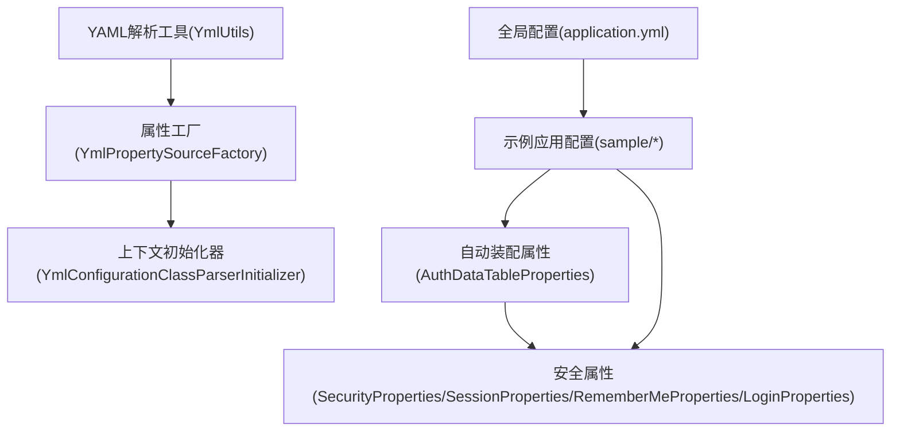
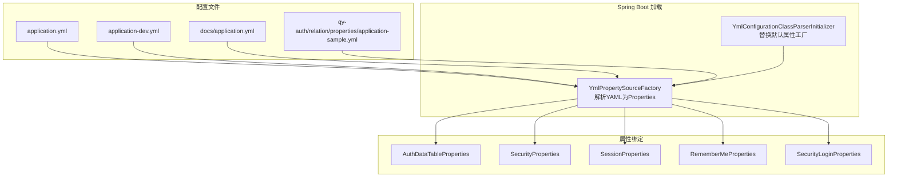
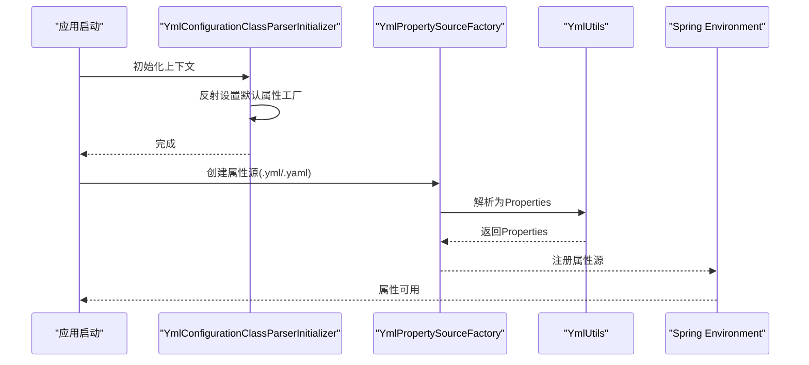
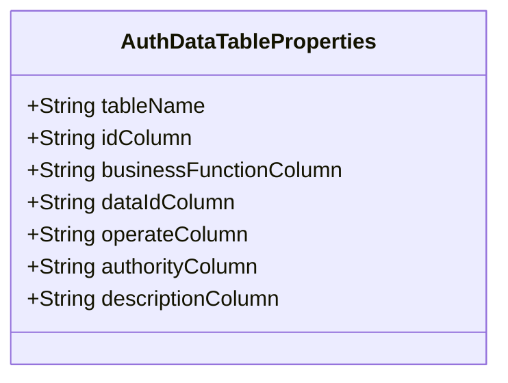
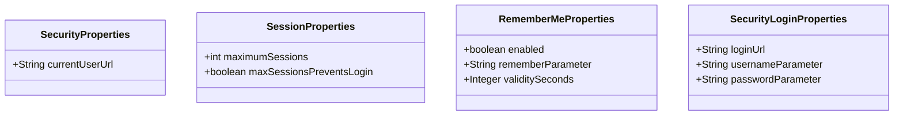
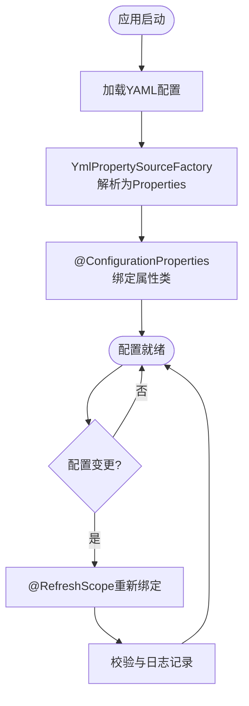
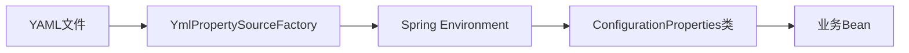

# 配置最佳实践

<cite>
**本文引用的文件**
- [application.yml](file://application.yml)
- [docs/application.yml](file://docs/application.yml)
- [qy-auth/relation/properties/application-sample.yml](file://qy-auth/relation/properties/application-sample.yml)
- [sample/auth-boot-sample/src/main/resources/application.yml](file://sample/auth-boot-sample/src/main/resources/application.yml)
- [sample/auth-boot-sample/src/main/resources/application-dev.yml](file://sample/auth-boot-sample/src/main/resources/application-dev.yml)
- [boot/basic-spring-boot-starter/src/main/java/com/kewen/framework/boot/basic/context/YmlConfigurationClassParserInitializer.java](file://boot/basic-spring-boot-starter/src/main/java/com/kewen/framework/boot/basic/context/YmlConfigurationClassParserInitializer.java)
- [boot/basic-spring-boot-starter/src/main/java/com/kewen/framework/boot/basic/context/YmlPropertySourceFactory.java](file://boot/basic-spring-boot-starter/src/main/java/com/kewen/framework/boot/basic/context/YmlPropertySourceFactory.java)
- [basic/src/main/java/com/kewen/framework/basic/utils/YmlUtils.java](file://basic/src/main/java/com/kewen/framework/basic/utils/YmlUtils.java)
- [qy-auth/auth-core-spring-boot-starter/src/main/java/com/kewen/framework/boot/auth/core/properties/AuthDataTableProperties.java](file://qy-auth/auth-core-spring-boot-starter/src/main/java/com/kewen/framework/boot/auth/core/properties/AuthDataTableProperties.java)
- [qy-auth/auth-spring-boot-starter/src/main/java/com/kewen/framework/auth/security/properties/SecurityProperties.java](file://qy-auth/auth-spring-boot-starter/src/main/java/com/kewen/framework/auth/security/properties/SecurityProperties.java)
- [qy-auth/auth-spring-boot-starter/src/main/java/com/kewen/framework/auth/security/properties/SessionProperties.java](file://qy-auth/auth-spring-boot-starter/src/main/java/com/kewen/framework/auth/security/properties/SessionProperties.java)
- [qy-auth/auth-spring-boot-starter/src/main/java/com/kewen/framework/auth/security/properties/RememberMeProperties.java](file://qy-auth/auth-spring-boot-starter/src/main/java/com/kewen/framework/auth/security/properties/RememberMeProperties.java)
- [qy-auth/auth-spring-boot-starter/src/main/java/com/kewen/framework/auth/security/password/properties/SecurityLoginProperties.java](file://qy-auth/auth-spring-boot-starter/src/main/java/com/kewen/framework/auth/security/password/properties/SecurityLoginProperties.java)
</cite>

## 目录
1. [引言](#引言)
2. [项目结构](#项目结构)
3. [核心组件](#核心组件)
4. [架构总览](#架构总览)
5. [详细组件分析](#详细组件分析)
6. [依赖分析](#依赖分析)
7. [性能考虑](#性能考虑)
8. [故障排查指南](#故障排查指南)
9. [结论](#结论)
10. [附录](#附录)

## 引言
本文件面向后端工程团队，系统化总结配置管理的最佳实践与经验，覆盖配置命名规范、分类组织、版本管理、安全性（敏感信息加密、访问控制、审计）、性能优化（加载优化、缓存策略、热更新）、监控与诊断、变更与回滚策略，并提供可复用的配置模板与检查清单，帮助团队建立标准化、可追溯、可演进的配置管理体系。

## 项目结构
本仓库采用多模块分层组织，配置相关能力主要分布在以下位置：
- 全局示例配置：根目录与 docs 目录下的 application.yml
- 示例应用配置：各 sample 模块中的 application.yml 及 profile 文件
- 自动装配与配置绑定：各 starter 模块中通过 @ConfigurationProperties 绑定的属性类
- YAML 解析与兼容：基础模块提供的 YmlUtils 与启动器中的 YmlPropertySourceFactory、YmlConfigurationClassParserInitializer

图表来源
- [application.yml:1-32](file://application.yml#L1-L32)
- [docs/application.yml:1-21](file://docs/application.yml#L1-L21)
- [sample/auth-boot-sample/src/main/resources/application.yml:1-55](file://sample/auth-boot-sample/src/main/resources/application.yml#L1-L55)
- [basic/src/main/java/com/kewen/framework/basic/utils/YmlUtils.java:1-138](file://basic/src/main/java/com/kewen/framework/basic/utils/YmlUtils.java#L1-L138)
- [boot/basic-spring-boot-starter/src/main/java/com/kewen/framework/boot/basic/context/YmlPropertySourceFactory.java:1-34](file://boot/basic-spring-boot-starter/src/main/java/com/kewen/framework/boot/basic/context/YmlPropertySourceFactory.java#L1-L34)
- [boot/basic-spring-boot-starter/src/main/java/com/kewen/framework/boot/basic/context/YmlConfigurationClassParserInitializer.java:1-46](file://boot/basic-spring-boot-starter/src/main/java/com/kewen/framework/boot/basic/context/YmlConfigurationClassParserInitializer.java#L1-L46)
- [qy-auth/auth-core-spring-boot-starter/src/main/java/com/kewen/framework/boot/auth/core/properties/AuthDataTableProperties.java:1-110](file://qy-auth/auth-core-spring-boot-starter/src/main/java/com/kewen/framework/boot/auth/core/properties/AuthDataTableProperties.java#L1-L110)
- [qy-auth/auth-spring-boot-starter/src/main/java/com/kewen/framework/auth/security/properties/SecurityProperties.java:1-23](file://qy-auth/auth-spring-boot-starter/src/main/java/com/kewen/framework/auth/security/properties/SecurityProperties.java#L1-L23)
- [qy-auth/auth-spring-boot-starter/src/main/java/com/kewen/framework/auth/security/properties/SessionProperties.java:1-23](file://qy-auth/auth-spring-boot-starter/src/main/java/com/kewen/framework/auth/security/properties/SessionProperties.java#L1-L23)
- [qy-auth/auth-spring-boot-starter/src/main/java/com/kewen/framework/auth/security/properties/RememberMeProperties.java:1-27](file://qy-auth/auth-spring-boot-starter/src/main/java/com/kewen/framework/auth/security/properties/RememberMeProperties.java#L1-L27)
- [qy-auth/auth-spring-boot-starter/src/main/java/com/kewen/framework/auth/security/password/properties/SecurityLoginProperties.java:1-30](file://qy-auth/auth-spring-boot-starter/src/main/java/com/kewen/framework/auth/security/password/properties/SecurityLoginProperties.java#L1-L30)

章节来源
- [application.yml:1-32](file://application.yml#L1-L32)
- [docs/application.yml:1-21](file://docs/application.yml#L1-L21)
- [sample/auth-boot-sample/src/main/resources/application.yml:1-55](file://sample/auth-boot-sample/src/main/resources/application.yml#L1-L55)
- [sample/auth-boot-sample/src/main/resources/application-dev.yml:1-6](file://sample/auth-boot-sample/src/main/resources/application-dev.yml#L1-L6)

## 核心组件
- 配置命名规范
  - 采用层级点分法，使用小写与短横线组合，避免驼峰或下划线混用，保证跨环境一致性。
  - 建议以“业务域.子域.属性”形式命名，例如 kewen.auth.cache-auth、kewen.security.session.maximum-sessions。
- 配置分类组织
  - 按功能域拆分：认证鉴权、会话与记住我、登录参数、消息与租户开关等。
  - 按环境拆分：开发(dev)、测试(test)、预发(uat)、生产(prod)，通过 spring.profiles.active 切换。
- 配置版本管理
  - 使用 Git 管理配置文件，按环境与业务域建立分支或标签；对重大变更打 Tag 并在变更日志中标注。
  - 对外暴露的配置项统一在 @ConfigurationProperties 类中声明，便于版本演进与约束。
- 安全性
  - 敏感信息加密：数据库连接串、密钥等放入受控密文存储，运行时解密注入；避免明文入仓。
  - 访问控制：限制配置文件读取权限，仅允许 CI/CD 与运维账号访问；对配置中心访问做细粒度授权。
  - 审计：记录配置变更人、时间、内容摘要；对敏感变更进行二次审批与回滚审计。
- 性能优化
  - 加载优化：优先使用 YAML，减少嵌套层级；合并重复配置，避免重复扫描。
  - 缓存策略：对只读配置进行本地缓存，结合 Spring 的 @RefreshScope 实现热更新。
  - 热更新：结合配置中心（如 Nacos）实现动态刷新，确保变更生效期间的平滑过渡。
- 监控与诊断
  - 指标：配置加载耗时、属性绑定失败次数、热更新成功率。
  - 日志：记录配置加载过程、绑定结果、异常堆栈；对敏感字段脱敏输出。
  - 诊断：提供配置快照导出、差异对比工具，定位不一致与冲突。
- 变更与回滚
  - 变更管理：变更前评审、灰度发布、回滚预案；对关键配置变更强制双人复核。
  - 回滚策略：支持一键回滚至上一个稳定版本；对不可逆变更保留备份与恢复脚本。
- 模板与检查清单
  - 提供标准 application.yml 模板与各环境 profile 模板，确保一致性。
  - 建立配置检查清单：必填项、默认值校验、敏感项检查、端到端验证。

章节来源
- [qy-auth/auth-core-spring-boot-starter/src/main/java/com/kewen/framework/boot/auth/core/properties/AuthDataTableProperties.java:14-110](file://qy-auth/auth-core-spring-boot-starter/src/main/java/com/kewen/framework/boot/auth/core/properties/AuthDataTableProperties.java#L14-L110)
- [qy-auth/auth-spring-boot-starter/src/main/java/com/kewen/framework/auth/security/properties/SecurityProperties.java:13-23](file://qy-auth/auth-spring-boot-starter/src/main/java/com/kewen/framework/auth/security/properties/SecurityProperties.java#L13-L23)
- [qy-auth/auth-spring-boot-starter/src/main/java/com/kewen/framework/auth/security/properties/SessionProperties.java:11-23](file://qy-auth/auth-spring-boot-starter/src/main/java/com/kewen/framework/auth/security/properties/SessionProperties.java#L11-L23)
- [qy-auth/auth-spring-boot-starter/src/main/java/com/kewen/framework/auth/security/properties/RememberMeProperties.java:11-27](file://qy-auth/auth-spring-boot-starter/src/main/java/com/kewen/framework/auth/security/properties/RememberMeProperties.java#L11-L27)
- [qy-auth/auth-spring-boot-starter/src/main/java/com/kewen/framework/auth/security/password/properties/SecurityLoginProperties.java:13-30](file://qy-auth/auth-spring-boot-starter/src/main/java/com/kewen/framework/auth/security/password/properties/SecurityLoginProperties.java#L13-L30)

## 架构总览
下图展示从 YAML 配置到属性绑定的整体链路，以及与自动装配属性类的关系。

图表来源
- [boot/basic-spring-boot-starter/src/main/java/com/kewen/framework/boot/basic/context/YmlPropertySourceFactory.java:17-34](file://boot/basic-spring-boot-starter/src/main/java/com/kewen/framework/boot/basic/context/YmlPropertySourceFactory.java#L17-L34)
- [boot/basic-spring-boot-starter/src/main/java/com/kewen/framework/boot/basic/context/YmlConfigurationClassParserInitializer.java:20-46](file://boot/basic-spring-boot-starter/src/main/java/com/kewen/framework/boot/basic/context/YmlConfigurationClassParserInitializer.java#L20-L46)
- [qy-auth/auth-core-spring-boot-starter/src/main/java/com/kewen/framework/boot/auth/core/properties/AuthDataTableProperties.java:14-110](file://qy-auth/auth-core-spring-boot-starter/src/main/java/com/kewen/framework/boot/auth/core/properties/AuthDataTableProperties.java#L14-L110)
- [qy-auth/auth-spring-boot-starter/src/main/java/com/kewen/framework/auth/security/properties/SecurityProperties.java:13-23](file://qy-auth/auth-spring-boot-starter/src/main/java/com/kewen/framework/auth/security/properties/SecurityProperties.java#L13-L23)
- [qy-auth/auth-spring-boot-starter/src/main/java/com/kewen/framework/auth/security/properties/SessionProperties.java:11-23](file://qy-auth/auth-spring-boot-starter/src/main/java/com/kewen/framework/auth/security/properties/SessionProperties.java#L11-L23)
- [qy-auth/auth-spring-boot-starter/src/main/java/com/kewen/framework/auth/security/properties/RememberMeProperties.java:11-27](file://qy-auth/auth-spring-boot-starter/src/main/java/com/kewen/framework/auth/security/properties/RememberMeProperties.java#L11-L27)
- [qy-auth/auth-spring-boot-starter/src/main/java/com/kewen/framework/auth/security/password/properties/SecurityLoginProperties.java:13-30](file://qy-auth/auth-spring-boot-starter/src/main/java/com/kewen/framework/auth/security/password/properties/SecurityLoginProperties.java#L13-L30)

## 详细组件分析

### YAML 解析与加载链路
- YmlPropertySourceFactory：当资源名为 .yml/.yaml 时，委托 YmlUtils 将其解析为 Properties，再包装为 PropertiesPropertySource，供 Spring 环境使用。
- YmlConfigurationClassParserInitializer：在应用上下文初始化阶段，反射修改 Spring 内部的 DEFAULT_PROPERTY_SOURCE_FACTORY 为自定义工厂，从而统一支持 YAML 解析。
- YmlUtils：提供多种 parse 接口，支持从 classpath 或文件路径解析 YAML，生成 Properties 与 Map，便于灵活使用。

图表来源
- [boot/basic-spring-boot-starter/src/main/java/com/kewen/framework/boot/basic/context/YmlConfigurationClassParserInitializer.java:20-46](file://boot/basic-spring-boot-starter/src/main/java/com/kewen/framework/boot/basic/context/YmlConfigurationClassParserInitializer.java#L20-L46)
- [boot/basic-spring-boot-starter/src/main/java/com/kewen/framework/boot/basic/context/YmlPropertySourceFactory.java:17-34](file://boot/basic-spring-boot-starter/src/main/java/com/kewen/framework/boot/basic/context/YmlPropertySourceFactory.java#L17-L34)
- [basic/src/main/java/com/kewen/framework/basic/utils/YmlUtils.java:60-70](file://basic/src/main/java/com/kewen/framework/basic/utils/YmlUtils.java#L60-L70)

章节来源
- [boot/basic-spring-boot-starter/src/main/java/com/kewen/framework/boot/basic/context/YmlConfigurationClassParserInitializer.java:1-46](file://boot/basic-spring-boot-starter/src/main/java/com/kewen/framework/boot/basic/context/YmlConfigurationClassParserInitializer.java#L1-L46)
- [boot/basic-spring-boot-starter/src/main/java/com/kewen/framework/boot/basic/context/YmlPropertySourceFactory.java:1-34](file://boot/basic-spring-boot-starter/src/main/java/com/kewen/framework/boot/basic/context/YmlPropertySourceFactory.java#L1-L34)
- [basic/src/main/java/com/kewen/framework/basic/utils/YmlUtils.java:1-138](file://basic/src/main/java/com/kewen/framework/basic/utils/YmlUtils.java#L1-L138)

### 认证与权限配置属性
- AuthDataTableProperties：集中定义权限表的表名与列名映射，便于在不同业务库或表结构变化时统一调整。
- 建议：将该类作为权限域的唯一事实来源，所有权限查询与落库均基于此配置，避免硬编码。

图表来源
- [qy-auth/auth-core-spring-boot-starter/src/main/java/com/kewen/framework/boot/auth/core/properties/AuthDataTableProperties.java:14-110](file://qy-auth/auth-core-spring-boot-starter/src/main/java/com/kewen/framework/boot/auth/core/properties/AuthDataTableProperties.java#L14-L110)

章节来源
- [qy-auth/auth-core-spring-boot-starter/src/main/java/com/kewen/framework/boot/auth/core/properties/AuthDataTableProperties.java:1-110](file://qy-auth/auth-core-spring-boot-starter/src/main/java/com/kewen/framework/boot/auth/core/properties/AuthDataTableProperties.java#L1-L110)

### 安全配置属性族
- SecurityProperties：当前用户接口地址等安全域顶层配置。
- SessionProperties：最大会话数、是否阻止新登录等会话策略。
- RememberMeProperties：记住我开关、参数名、有效期。
- SecurityLoginProperties：密码登录的 URL 与用户名/密码参数名。

图表来源
- [qy-auth/auth-spring-boot-starter/src/main/java/com/kewen/framework/auth/security/properties/SecurityProperties.java:13-23](file://qy-auth/auth-spring-boot-starter/src/main/java/com/kewen/framework/auth/security/properties/SecurityProperties.java#L13-L23)
- [qy-auth/auth-spring-boot-starter/src/main/java/com/kewen/framework/auth/security/properties/SessionProperties.java:11-23](file://qy-auth/auth-spring-boot-starter/src/main/java/com/kewen/framework/auth/security/properties/SessionProperties.java#L11-L23)
- [qy-auth/auth-spring-boot-starter/src/main/java/com/kewen/framework/auth/security/properties/RememberMeProperties.java:11-27](file://qy-auth/auth-spring-boot-starter/src/main/java/com/kewen/framework/auth/security/properties/RememberMeProperties.java#L11-L27)
- [qy-auth/auth-spring-boot-starter/src/main/java/com/kewen/framework/auth/security/password/properties/SecurityLoginProperties.java:13-30](file://qy-auth/auth-spring-boot-starter/src/main/java/com/kewen/framework/auth/security/password/properties/SecurityLoginProperties.java#L13-L30)

章节来源
- [qy-auth/auth-spring-boot-starter/src/main/java/com/kewen/framework/auth/security/properties/SecurityProperties.java:1-23](file://qy-auth/auth-spring-boot-starter/src/main/java/com/kewen/framework/auth/security/properties/SecurityProperties.java#L1-L23)
- [qy-auth/auth-spring-boot-starter/src/main/java/com/kewen/framework/auth/security/properties/SessionProperties.java:1-23](file://qy-auth/auth-spring-boot-starter/src/main/java/com/kewen/framework/auth/security/properties/SessionProperties.java#L1-L23)
- [qy-auth/auth-spring-boot-starter/src/main/java/com/kewen/framework/auth/security/properties/RememberMeProperties.java:1-27](file://qy-auth/auth-spring-boot-starter/src/main/java/com/kewen/framework/auth/security/properties/RememberMeProperties.java#L1-L27)
- [qy-auth/auth-spring-boot-starter/src/main/java/com/kewen/framework/auth/security/password/properties/SecurityLoginProperties.java:1-30](file://qy-auth/auth-spring-boot-starter/src/main/java/com/kewen/framework/auth/security/password/properties/SecurityLoginProperties.java#L1-L30)

### 配置加载流程与热更新建议
- 加载流程：YAML 文件经由 YmlPropertySourceFactory 解析为 Properties 注入 Spring 环境；随后 @ConfigurationProperties 绑定到对应属性类。
- 热更新：结合 @RefreshScope 与配置中心（如 Nacos），在属性变更时触发 Bean 重新绑定；建议对关键配置变更增加灰度与回滚策略。

图表来源
- [boot/basic-spring-boot-starter/src/main/java/com/kewen/framework/boot/basic/context/YmlPropertySourceFactory.java:17-34](file://boot/basic-spring-boot-starter/src/main/java/com/kewen/framework/boot/basic/context/YmlPropertySourceFactory.java#L17-L34)
- [qy-auth/auth-core-spring-boot-starter/src/main/java/com/kewen/framework/boot/auth/core/properties/AuthDataTableProperties.java:14-110](file://qy-auth/auth-core-spring-boot-starter/src/main/java/com/kewen/framework/boot/auth/core/properties/AuthDataTableProperties.java#L14-L110)
- [qy-auth/auth-spring-boot-starter/src/main/java/com/kewen/framework/auth/security/properties/SessionProperties.java:11-23](file://qy-auth/auth-spring-boot-starter/src/main/java/com/kewen/framework/auth/security/properties/SessionProperties.java#L11-L23)

## 依赖分析
- 组件耦合
  - YAML 解析链路与属性绑定解耦：YmlPropertySourceFactory 仅负责解析，不关心具体业务属性；属性类独立维护。
  - 自动装配属性类之间无直接依赖，通过命名空间隔离，降低耦合风险。
- 外部依赖
  - Spring Boot 环境与 @ConfigurationProperties 机制。
  - 可选的配置中心（如 Nacos）用于热更新与集中管理。
- 潜在循环依赖
  - 当前结构未见循环依赖；若引入外部配置中心，需确保刷新流程不反向依赖业务 Bean。

图表来源
- [boot/basic-spring-boot-starter/src/main/java/com/kewen/framework/boot/basic/context/YmlPropertySourceFactory.java:17-34](file://boot/basic-spring-boot-starter/src/main/java/com/kewen/framework/boot/basic/context/YmlPropertySourceFactory.java#L17-L34)
- [qy-auth/auth-core-spring-boot-starter/src/main/java/com/kewen/framework/boot/auth/core/properties/AuthDataTableProperties.java:14-110](file://qy-auth/auth-core-spring-boot-starter/src/main/java/com/kewen/framework/boot/auth/core/properties/AuthDataTableProperties.java#L14-L110)
- [qy-auth/auth-spring-boot-starter/src/main/java/com/kewen/framework/auth/security/properties/SessionProperties.java:11-23](file://qy-auth/auth-spring-boot-starter/src/main/java/com/kewen/framework/auth/security/properties/SessionProperties.java#L11-L23)

## 性能考虑
- 配置加载优化
  - 减少 YAML 嵌套层级，合并重复配置，避免深层级查找带来的解析成本。
  - 将只读配置放入本地缓存，避免频繁 IO。
- 缓存策略
  - 对热点配置（如权限表映射）进行本地缓存；对变更频率低的配置启用长 TTL。
- 热更新
  - 使用 @RefreshScope 与配置中心联动，确保变更生效期间的平滑过渡；对大体量配置采用分组更新与灰度发布。

## 故障排查指南
- YAML 解析失败
  - 检查文件编码与缩进；确认扩展名为 .yml/.yaml；查看 YmlPropertySourceFactory 的解析日志。
- 属性绑定失败
  - 核对命名空间前缀与属性类上的 @ConfigurationProperties；确认 application.yml 中存在对应键。
- 环境切换问题
  - 检查 spring.profiles.active 与对应 profile 文件是否存在；确认覆盖顺序与优先级。
- 安全配置异常
  - 校验会话与记住我参数是否合理；关注日志中关于会话并发与记住我有效期的提示。

章节来源
- [boot/basic-spring-boot-starter/src/main/java/com/kewen/framework/boot/basic/context/YmlPropertySourceFactory.java:17-34](file://boot/basic-spring-boot-starter/src/main/java/com/kewen/framework/boot/basic/context/YmlPropertySourceFactory.java#L17-L34)
- [qy-auth/auth-spring-boot-starter/src/main/java/com/kewen/framework/auth/security/properties/SessionProperties.java:11-23](file://qy-auth/auth-spring-boot-starter/src/main/java/com/kewen/framework/auth/security/properties/SessionProperties.java#L11-L23)
- [qy-auth/auth-spring-boot-starter/src/main/java/com/kewen/framework/auth/security/properties/RememberMeProperties.java:11-27](file://qy-auth/auth-spring-boot-starter/src/main/java/com/kewen/framework/auth/security/properties/RememberMeProperties.java#L11-L27)

## 结论
通过规范命名、清晰分类、版本化管理与安全加固，结合性能优化与可观测性建设，可以显著提升配置系统的稳定性与可维护性。建议团队在现有基础上完善配置中心对接、热更新与回滚机制，并持续沉淀配置模板与检查清单，形成可复用的最佳实践。

## 附录

### 配置模板与检查清单
- 标准 application.yml 模板要点
  - 必填项：服务端口、数据库连接、日志级别与输出路径、spring.profiles.active。
  - 安全配置：kewen.security.current-user-url、kewen.security.session.*、kewen.security.remember-me.*、kewen.security.login.password.*。
  - 权限配置：kewen.auth.auth-data-table.*、kewen.auth.cache-auth。
- 环境模板
  - 开发(dev)：本地数据库与调试日志；测试(test)/预发(uat)/生产(prod)：分离数据库与严格日志级别。
- 检查清单
  - 必填项校验：所有关键属性均有默认值或明确报错。
  - 敏感项检查：数据库密码、密钥等是否加密或占位。
  - 端到端验证：启动后拉取当前用户接口、校验会话与记住我行为符合预期。
  - 回滚准备：保留上一版本配置快照与回滚脚本。

章节来源
- [application.yml:1-32](file://application.yml#L1-L32)
- [docs/application.yml:1-21](file://docs/application.yml#L1-L21)
- [qy-auth/relation/properties/application-sample.yml:1-17](file://qy-auth/relation/properties/application-sample.yml#L1-L17)
- [sample/auth-boot-sample/src/main/resources/application.yml:1-55](file://sample/auth-boot-sample/src/main/resources/application.yml#L1-L55)
- [sample/auth-boot-sample/src/main/resources/application-dev.yml:1-6](file://sample/auth-boot-sample/src/main/resources/application-dev.yml#L1-L6)