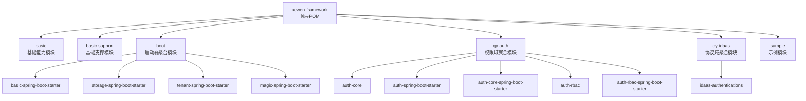
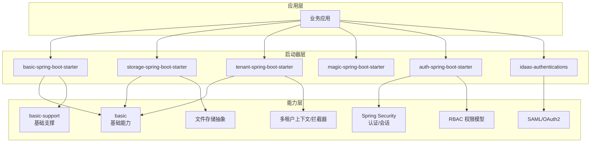
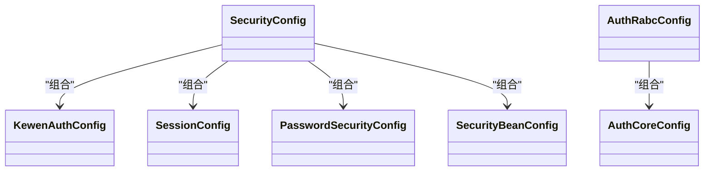
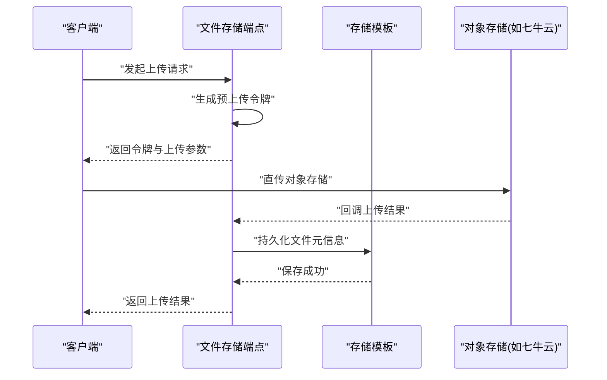
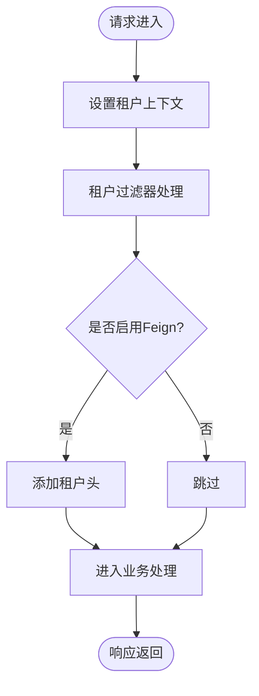
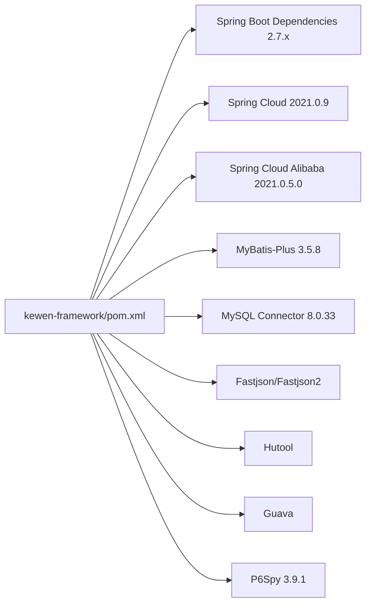

# 项目概述

<cite>
**本文引用的文件**
- [README.md](file://README.md)
- [pom.xml](file://pom.xml)
- [application.yml](file://application.yml)
- [basic/pom.xml](file://basic/pom.xml)
- [boot/pom.xml](file://boot/pom.xml)
- [boot/basic-spring-boot-starter/pom.xml](file://boot/basic-spring-boot-starter/pom.xml)
- [boot/storage-spring-boot-starter/pom.xml](file://boot/storage-spring-boot-starter/pom.xml)
- [boot/tenant-spring-boot-starter/pom.xml](file://boot/tenant-spring-boot-starter/pom.xml)
- [qy-auth/pom.xml](file://qy-auth/pom.xml)
- [qy-idaas/pom.xml](file://qy-idaas/pom.xml)
- [boot/basic-spring-boot-starter/src/main/resources/META-INF/spring.factories](file://boot/basic-spring-boot-starter/src/main/resources/META-INF/spring.factories)
- [boot/storage-spring-boot-starter/src/main/resources/META-INF/spring.factories](file://boot/storage-spring-boot-starter/src/main/resources/META-INF/spring.factories)
- [boot/tenant-spring-boot-starter/src/main/resources/META-INF/spring.factories](file://boot/tenant-spring-boot-starter/src/main/resources/META-INF/spring.factories)
- [qy-auth/auth-spring-boot-starter/src/main/resources/META-INF/spring.factories](file://qy-auth/auth-spring-boot-starter/src/main/resources/META-INF/spring.factories)
- [qy-idaas/idaas-authentications/src/main/resources/META-INF/spring.factories](file://qy-idaas/idaas-authentications/src/main/resources/META-INF/spring.factories)
</cite>

## 目录
1. [引言](#引言)
2. [项目结构](#项目结构)
3. [核心组件](#核心组件)
4. [架构总览](#架构总览)
5. [详细组件分析](#详细组件分析)
6. [依赖分析](#依赖分析)
7. [性能考虑](#性能考虑)
8. [故障排查指南](#故障排查指南)
9. [结论](#结论)
10. [附录：快速开始](#附录快速开始)

## 引言
kewen-framework 是一个面向企业级 Java 开发的现代化框架，基于 Spring Boot 构建，提供统一的基础能力、权限体系、文件存储与多租户支持。其设计理念是“模块即插拔”，通过启动器（starter）实现按需装配，降低重复配置成本，提升开发效率与系统一致性。

本项目的核心价值体现在：
- 统一的异常处理与日志链路追踪，保障可观测性与可维护性
- 基于 Spring Security 的认证与会话管理，结合 RBAC 权限模型，覆盖菜单、数据与操作级别的细粒度控制
- 文件上传与存储抽象，内置七牛云等实现，支持预上传令牌与回调校验
- 多租户上下文透传与过滤，结合 Feign 支持跨服务传递租户标识
- 与 IDaaS 协议对接（SAML/OAuth2），便于企业统一身份接入

## 项目结构
项目采用 Maven 多模块聚合结构，顶层 POM 管理版本与依赖，各功能域以模块划分，启动器模块负责自动装配与条件装配。

图表来源
- [pom.xml:20-28](file://pom.xml#L20-L28)
- [boot/pom.xml:16-21](file://boot/pom.xml#L16-L21)
- [qy-auth/pom.xml:22-28](file://qy-auth/pom.xml#L22-L28)
- [qy-idaas/pom.xml:14-16](file://qy-idaas/pom.xml#L14-L16)

章节来源
- [pom.xml:20-28](file://pom.xml#L20-L28)
- [boot/pom.xml:16-21](file://boot/pom.xml#L16-L21)
- [qy-auth/pom.xml:22-28](file://qy-auth/pom.xml#L22-L28)
- [qy-idaas/pom.xml:14-16](file://qy-idaas/pom.xml#L14-L16)

## 核心组件
- 基础模块 basic：提供通用模型、工具类、请求日志与链路追踪、异常体系等基础设施
- 启动器模块 boot：封装自动装配，按需启用基础能力、文件存储、多租户与魔法示例
- 权限模块 qy-auth：提供认证、RBAC 权限、菜单与数据范围控制、注解式鉴权等
- 协议模块 qy-idaas：提供 SAML/OAuth2 等 IDaaS 接入能力
- 示例模块 sample：演示各启动器与模块的使用方式

章节来源
- [basic/pom.xml:20-73](file://basic/pom.xml#L20-L73)
- [boot/basic-spring-boot-starter/pom.xml:20-61](file://boot/basic-spring-boot-starter/pom.xml#L20-L61)
- [qy-auth/pom.xml:22-28](file://qy-auth/pom.xml#L22-L28)
- [qy-idaas/pom.xml:14-16](file://qy-idaas/pom.xml#L14-L16)

## 架构总览
从应用视角看，框架通过启动器在运行时完成自动装配，形成“基础能力 + 安全认证 + 权限控制 + 文件存储 + 多租户 + 协议对接”的完整能力栈。

图表来源
- [boot/basic-spring-boot-starter/src/main/resources/META-INF/spring.factories:1-7](file://boot/basic-spring-boot-starter/src/main/resources/META-INF/spring.factories#L1-L7)
- [boot/storage-spring-boot-starter/src/main/resources/META-INF/spring.factories:1-2](file://boot/storage-spring-boot-starter/src/main/resources/META-INF/spring.factories#L1-L2)
- [boot/tenant-spring-boot-starter/src/main/resources/META-INF/spring.factories:1-3](file://boot/tenant-spring-boot-starter/src/main/resources/META-INF/spring.factories#L1-L3)
- [qy-auth/auth-spring-boot-starter/src/main/resources/META-INF/spring.factories:1-6](file://qy-auth/auth-spring-boot-starter/src/main/resources/META-INF/spring.factories#L1-L6)
- [qy-idaas/idaas-authentications/src/main/resources/META-INF/spring.factories:1-3](file://qy-idaas/idaas-authentications/src/main/resources/META-INF/spring.factories#L1-L3)

## 详细组件分析

### 基础模块 basic
- 职责：提供统一响应体、分页模型、异常体系、请求日志与链路追踪、常用工具类
- 特点：无框架绑定，仅依赖 Spring Web/WebMVC、Servlet API、JSON 工具与 Guava 等

章节来源
- [basic/pom.xml:20-73](file://basic/pom.xml#L20-L73)

### 启动器模块 boot
- basic-spring-boot-starter：自动装配异步、消息、MyBatis-Plus、请求响应格式化、早期过滤器等
- storage-spring-boot-starter：提供文件存储自动配置与七牛云实现
- tenant-spring-boot-starter：提供多租户上下文与请求过滤，以及可选的 Feign 租户头拦截器
- magic-spring-boot-starter：示例型启动器，用于演示

章节来源
- [boot/basic-spring-boot-starter/src/main/resources/META-INF/spring.factories:1-7](file://boot/basic-spring-boot-starter/src/main/resources/META-INF/spring.factories#L1-L7)
- [boot/storage-spring-boot-starter/src/main/resources/META-INF/spring.factories:1-2](file://boot/storage-spring-boot-starter/src/main/resources/META-INF/spring.factories#L1-L2)
- [boot/tenant-spring-boot-starter/src/main/resources/META-INF/spring.factories:1-3](file://boot/tenant-spring-boot-starter/src/main/resources/META-INF/spring.factories#L1-L3)

### 权限模块 qy-auth
- 认证与会话：基于 Spring Security，提供密码登录、记住我、会话并发控制、全局异常处理
- RBAC 权限：菜单、角色、用户、部门、数据范围与操作权限的实体与服务
- 注解式鉴权：支持方法级权限校验与数据范围注入
- 自动装配：通过启动器自动注册安全配置、WebMvc 扩展与菜单 API 初始化

图表来源
- [qy-auth/auth-spring-boot-starter/src/main/resources/META-INF/spring.factories:1-6](file://qy-auth/auth-spring-boot-starter/src/main/resources/META-INF/spring.factories#L1-L6)

章节来源
- [qy-auth/pom.xml:22-28](file://qy-auth/pom.xml#L22-L28)

### 协议模块 qy-idaas
- 提供 SAML 与 OAuth2 的自动配置，便于对接企业 IDaaS 平台
- 包含元数据解析、登出控制器与成功结果转换器等

章节来源
- [qy-idaas/pom.xml:14-16](file://qy-idaas/pom.xml#L14-L16)
- [qy-idaas/idaas-authentications/src/main/resources/META-INF/spring.factories:1-3](file://qy-idaas/idaas-authentications/src/main/resources/META-INF/spring.factories#L1-L3)

### 文件存储模块
- 抽象层：统一上传 BO、文件信息、预上传令牌等模型
- 实现层：内置七牛云存储模板
- 控制层：提供文件存储端点与回调端点，支持分片与断点续传场景

图表来源
- [boot/storage-spring-boot-starter/src/main/resources/META-INF/spring.factories:1-2](file://boot/storage-spring-boot-starter/src/main/resources/META-INF/spring.factories#L1-L2)

章节来源
- [boot/storage-spring-boot-starter/pom.xml:20-45](file://boot/storage-spring-boot-starter/pom.xml#L20-L45)

### 多租户模块
- 上下文：提供租户上下文与常量
- 过滤器：在请求链路中设置与读取租户标识
- 拦截器：可选的 Feign 拦截器，将租户头透传到下游服务

图表来源
- [boot/tenant-spring-boot-starter/src/main/resources/META-INF/spring.factories:1-3](file://boot/tenant-spring-boot-starter/src/main/resources/META-INF/spring.factories#L1-L3)

章节来源
- [boot/tenant-spring-boot-starter/pom.xml:20-41](file://boot/tenant-spring-boot-starter/pom.xml#L20-L41)

## 依赖分析
- 版本与依赖管理：顶层 POM 使用 Spring Boot 2.7.x 与 Spring Cloud/Alibaba 2021 版本坐标进行集中管理；MyBatis-Plus 3.5.8 作为 ORM 增强工具
- 核心依赖：Spring Web/WebMVC、Validation、MySQL 驱动、MyBatis-Plus、Fastjson、Hutool、Guava、P6Spy 等
- 启动器依赖：启动器模块按需引入基础模块与对应能力依赖，避免不必要的装配

图表来源
- [pom.xml:92-184](file://pom.xml#L92-L184)

章节来源
- [pom.xml:41-256](file://pom.xml#L41-L256)

## 性能考虑
- 数据访问：MyBatis-Plus 提供高效 CRUD 与分页；建议结合索引与查询条件优化 SQL
- 日志与追踪：请求日志与链路追踪有助于定位性能瓶颈，但应控制采样率与字段大小
- 文件存储：直传对象存储减少应用服务器压力；建议合理设置分片大小与并发数
- 多租户：过滤器与拦截器开销较低，注意避免在高频路径中做重逻辑
- 安全：会话并发控制与记住我策略需平衡安全性与性能

## 故障排查指南
- 启动失败或自动装配未生效
  - 检查 spring.factories 中的自动配置类是否正确暴露
  - 确认依赖坐标与版本是否匹配
- 权限不生效
  - 确认菜单 API 初始化是否执行
  - 检查注解式鉴权与数据范围注入是否正确配置
- 文件上传异常
  - 校验预上传令牌有效期与回调签名
  - 检查对象存储凭证与网络连通性
- 多租户上下文丢失
  - 确认租户过滤器顺序与 Feign 拦截器是否启用
  - 检查请求头是否正确传递

章节来源
- [boot/basic-spring-boot-starter/src/main/resources/META-INF/spring.factories:1-7](file://boot/basic-spring-boot-starter/src/main/resources/META-INF/spring.factories#L1-L7)
- [boot/storage-spring-boot-starter/src/main/resources/META-INF/spring.factories:1-2](file://boot/storage-spring-boot-starter/src/main/resources/META-INF/spring.factories#L1-L2)
- [boot/tenant-spring-boot-starter/src/main/resources/META-INF/spring.factories:1-3](file://boot/tenant-spring-boot-starter/src/main/resources/META-INF/spring.factories#L1-L3)
- [qy-auth/auth-spring-boot-starter/src/main/resources/META-INF/spring.factories:1-6](file://qy-auth/auth-spring-boot-starter/src/main/resources/META-INF/spring.factories#L1-L6)

## 结论
kewen-framework 以模块化与启动器为核心，将企业级常见能力沉淀为可复用组件，既满足初学者快速上手，也为资深开发者提供了清晰的扩展点。通过 Spring Boot 生态与 MyBatis-Plus、Spring Security 等关键依赖的组合，项目在易用性、可维护性与性能之间取得良好平衡。

## 附录：快速开始
- 在应用工程中引入所需启动器依赖，例如：
  - 基础能力与数据库：basic-spring-boot-starter
  - 文件存储：storage-spring-boot-starter
  - 多租户：tenant-spring-boot-starter
  - 权限与安全：auth-spring-boot-starter
  - IDaaS 协议：idaas-authentications
- 参考示例模块中的 application.yml 配置项，按需开启与调整功能开关
- 启动后访问对应端点，验证自动装配与功能可用性

章节来源
- [application.yml:1-32](file://application.yml#L1-L32)
- [README.md:25-38](file://README.md#L25-L38)