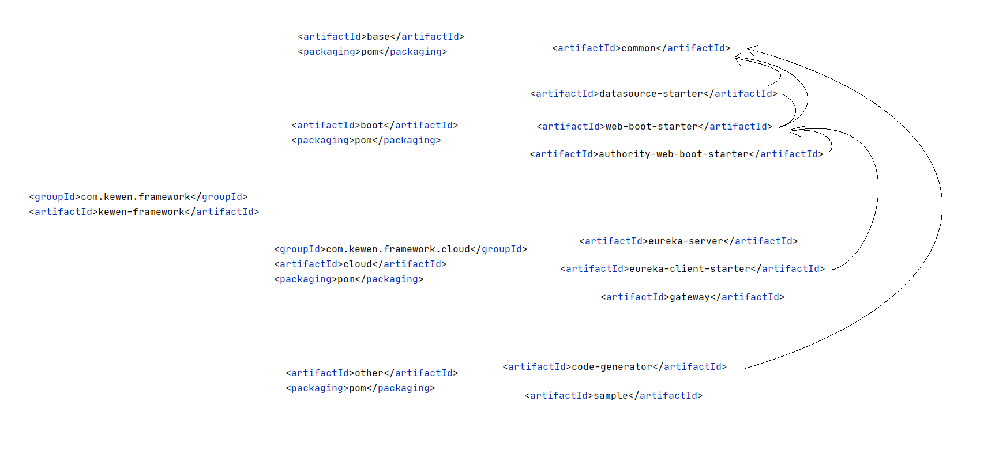

kewen框架

# 框架说明

# 依赖关系

## 关系图



### 关系说明

带  <packaging>pom</packaging>的均为管理结构，没有jar包，


##  配置


### 需要用户自己配置的自定义参数，示例未表明的为默认值
```yml
kewen:
  base:
    datasource:
      db-url: "liukewensc.mysql.rds.aliyuncs.com:3306/uucs"
      username: uucs
      password: UUCSuucs
    tenant:
      open: true
  auth:
    login-endpoint: /login
    type: security   # security/web
    web:
      store:
        type: token # session/token
```